# BLEペアリング手順

## 概要

[FIDO認証器管理ツール](README.md)を使用し、PCとFIDO認証器をBLEペアリングする手順について掲載しています。

#### 使用機材

本手順書では、FIDO認証器として、[MDBT50Q Dongle](../../FIDO2Device/MDBT50Q_Dongle/README.md)を使用するものといたします。

まずは、背面にあるボタン電池ケースに電池をセットし、BLEペリフェラル・モードで起動されていることをご確認ください。 
（MDBT50Q Dongleの青色LEDが点滅していることを確認します）

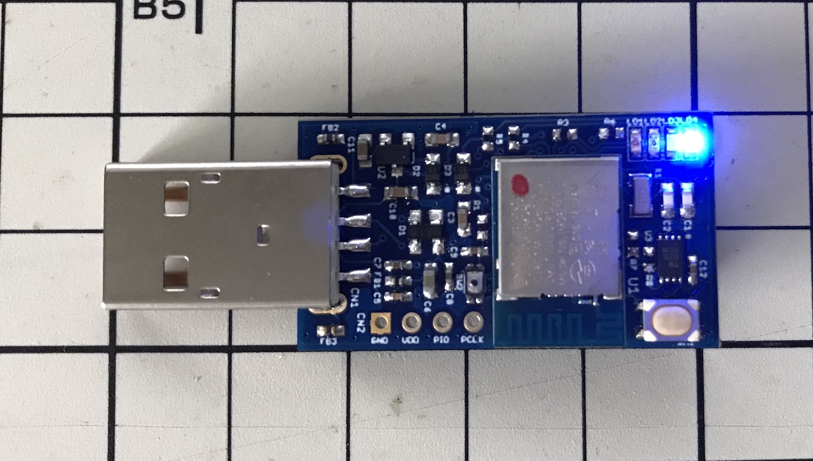

## ペアリングの実行

PCとFIDO認証器をBLEペアリングします。

#### ペアリング設定の事前削除

もし、PC側にペアリング相手のFIDO認証器のペアリング設定が存在する場合は、ペアリング実行前に必ず削除してください。

PCのBluetooth設定画面を開き、ペアリング設定を削除します。

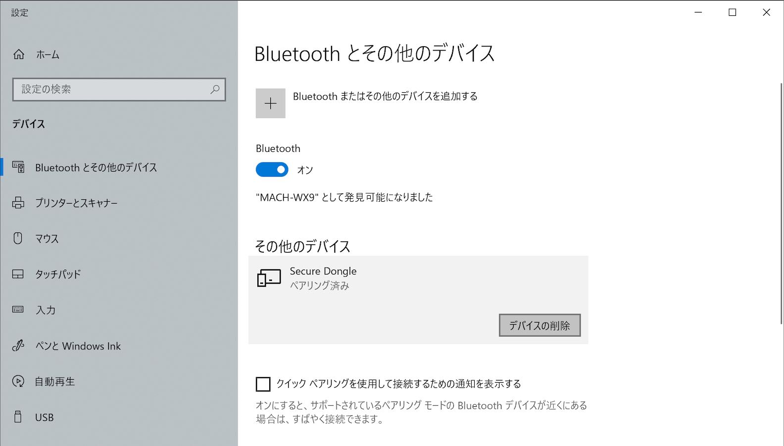

確認ダイアログが表示されますので、続行するには「はい」をクリックします。

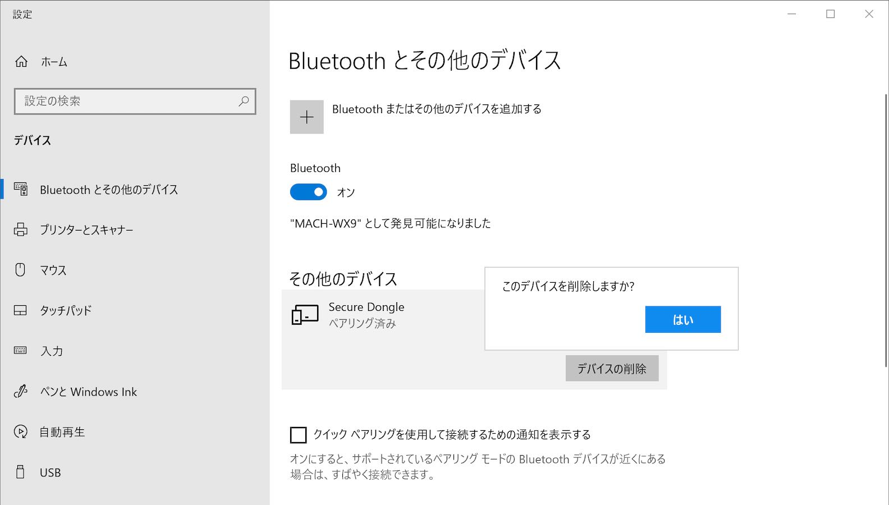

ペアリング相手のFIDO認証器のペアリング設定が削除されたことを確認します。

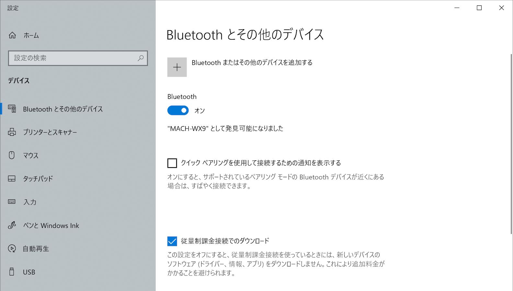

#### ペアリングモードに遷移

ペアリング相手のFIDO認証器を、ペアリングモードに遷移させます。 
MDBT50Q Dongleの場合は、基板上のボタンを３秒以上長押してから離すと、下図のように基板上の橙色LEDが点灯します。

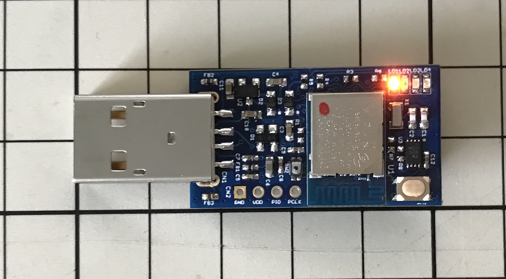

これで、FIDO認証器がペアリングモードに遷移しました。

#### ペアリングの実行

管理ツールを起動し、画面の「ペアリング実行」ボタンをクリックします。

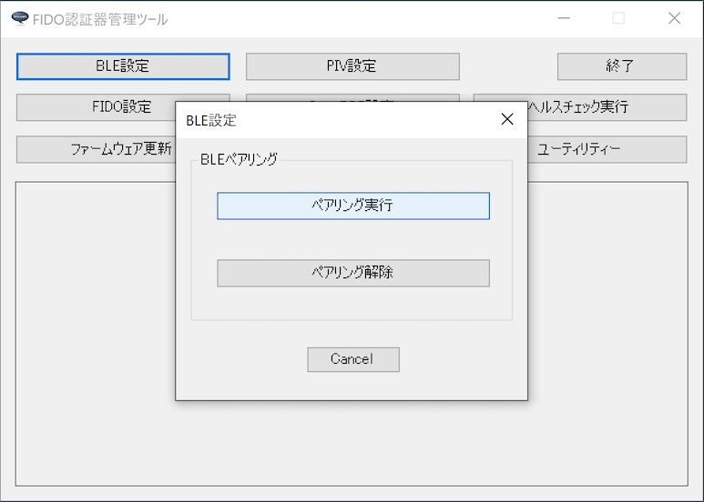

ペアリング実行画面がポップアップ表示されます。

[MDBT50Q Dongle](../../FIDO2Device/MDBT50Q_Dongle/README.md)（nRF52840基板）の場合、パスコード入力は不要です。 
パスコード入力欄は何も入力しないでください。 
nRF5340基板の場合のみ、半角数字６桁のパスコードを入力します。

ペアリング処理を開始するには「OK」ボタンをクリックします。

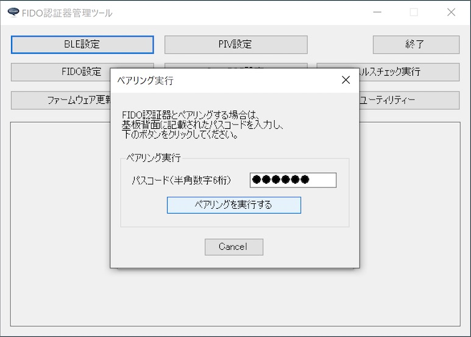

ペアリング処理が開始されますので、そのまま待ちます。

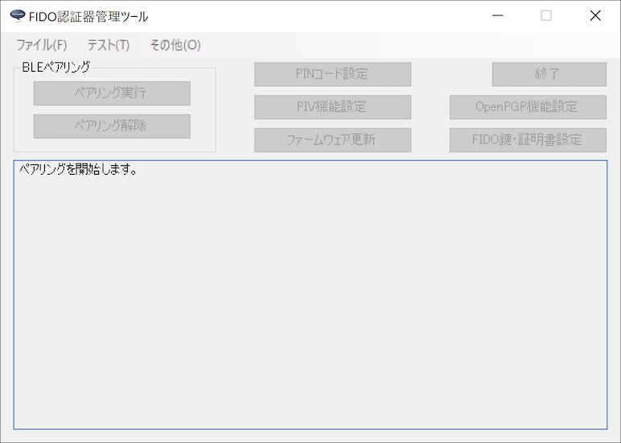

ペアリング処理が正常終了すると、下図のようなポップアップが表示され、処理が成功したことを知らせます。

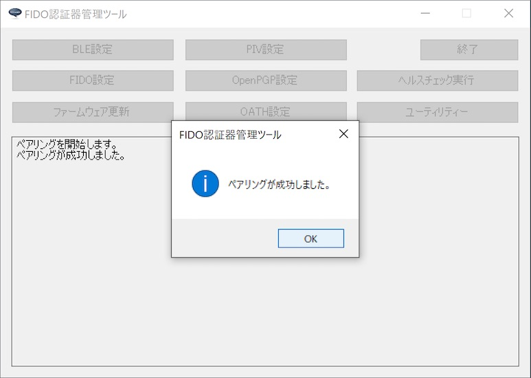

#### BLE接続を確認

BLE PINGを実行し、PCとFIDO認証器がBLE接続できることを確認します。 

管理ツールのメニューから「Test > BLE > PINGテスト実行」を選択すると、BLE PING（BLE接続テスト）処理が開始されます。

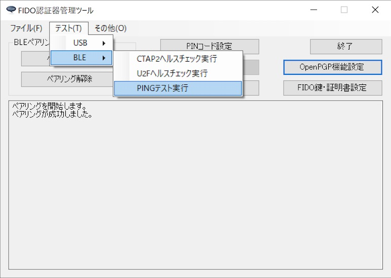

BLE PING処理が正常終了すると、下図のようなポップアップが表示され、処理が成功したことを知らせます。

以上で、BLEペアリングの実行は完了となります。

## BLEペアリングの解除

PCとFIDO認証器のペアリングを解除することができます。 
ペアリング解除を実行するためには、USB接続が必要となります。

#### ペアリング解除の実行

管理ツールを起動し、PCのUSBポートにFIDO認証器を装着します。

管理ツール画面下部のメッセージ欄に「USB HIDデバイスに接続されました。」と表示されることを確認したら、管理ツール画面の「ペアリング解除」ボタンをクリックします。

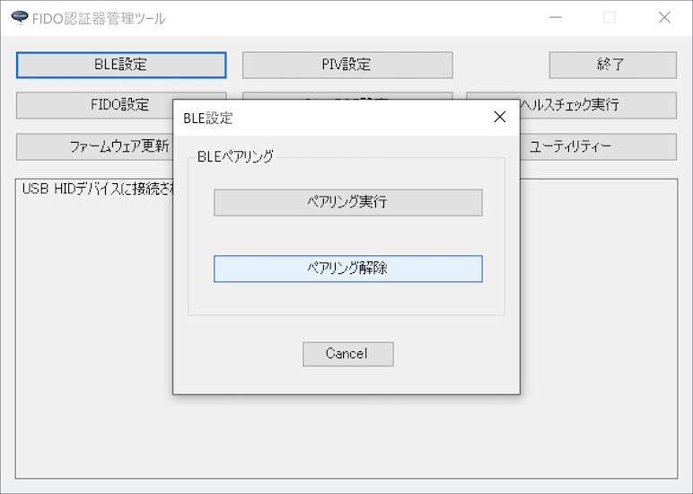

確認ダイアログが表示されます。 
処理を続行したい場合は「Yes」をクリックします。

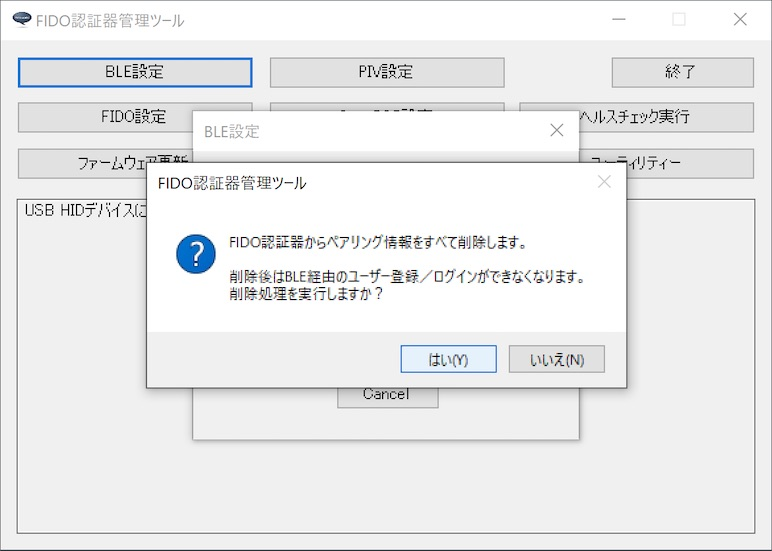

ペアリング解除処理が正常終了すると、下図のようなポップアップが表示され、処理が成功したことを知らせます。

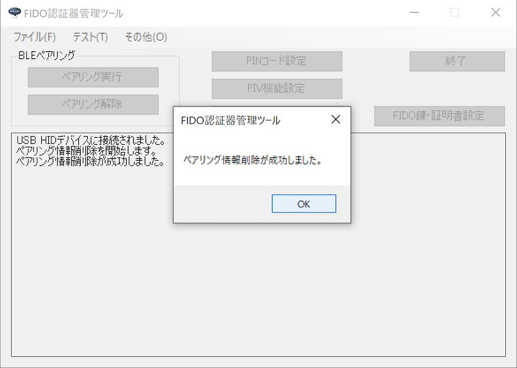

#### ペアリング設定の削除

ペアリング解除により、不要になったペアリング設定は、PCの環境設定から削除します。 
PCのBluetooth設定画面を開き、ペアリング設定を削除します。

確認ダイアログが表示されますので、続行するには「はい」をクリックします。

ペアリングを解除したFIDO認証器のペアリング設定が削除されたことを確認します。

以上で、BLEペアリングの解除は完了となります。
