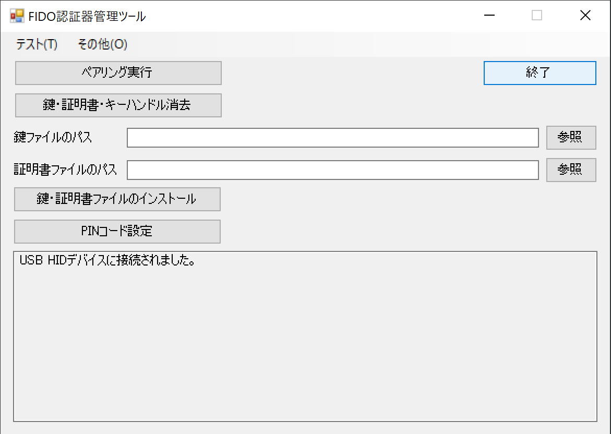
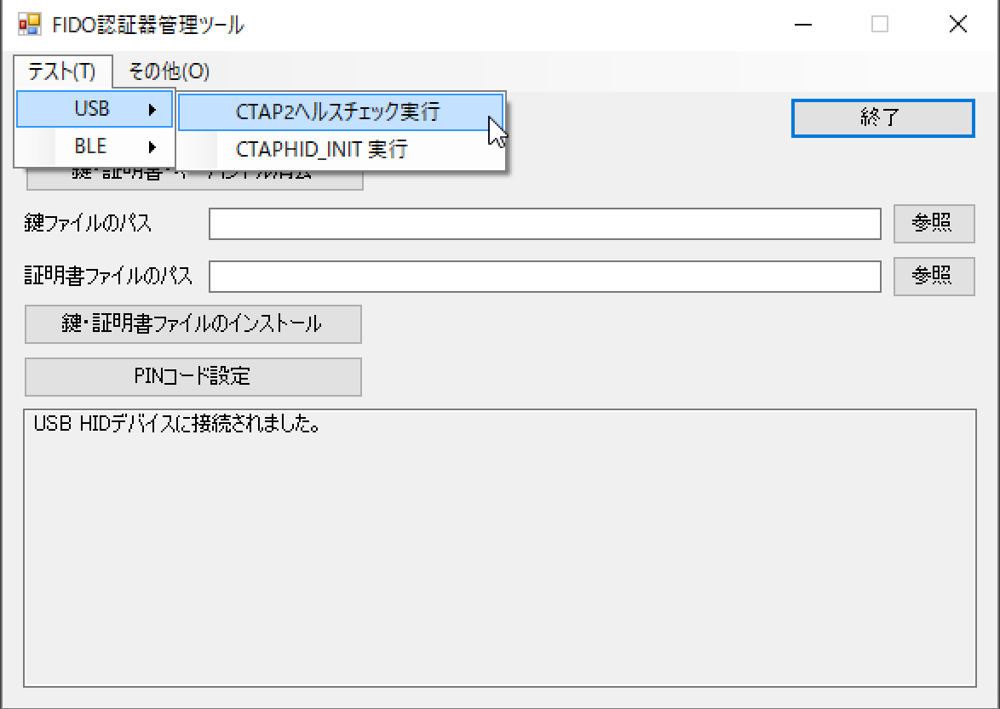
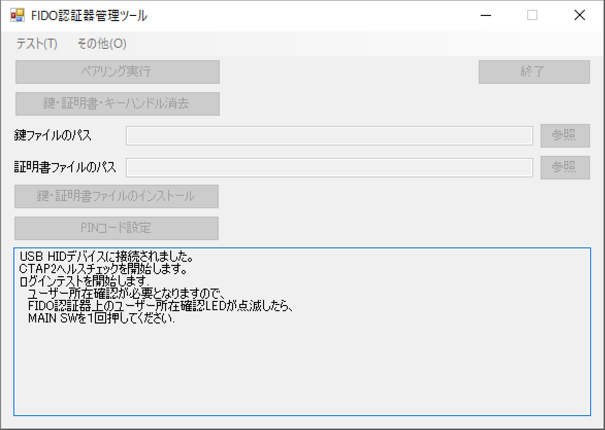
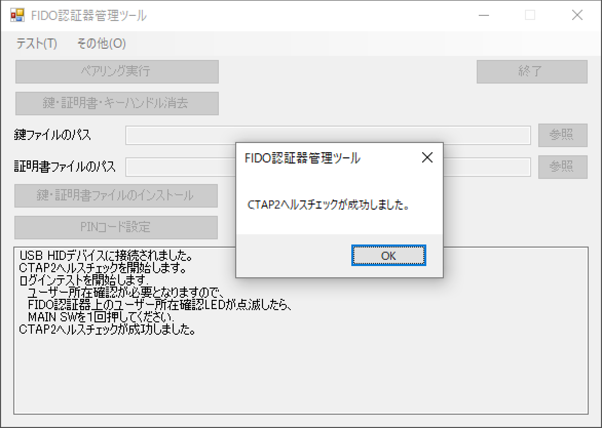

# CTAP2ヘルスチェック実行手順

## 概要

[FIDO認証器管理ツール](README.md)を使用して、FIDO2認証器のヘルスチェックを実行する手順を掲載します。

#### 処理内容

「CTAP2ヘルスチェック実行」は、管理ツールが擬似WebAuthnクライアント（Webブラウザーの代わり）となり、認証器に対して、FIDO 2.0の仕様に準拠したユーザー登録・ログインの各処理を実行する機能です。

CTAP2ヘルスチェックは、USB HID経由またはBLE経由で実行されます。

## 認証器の準備

#### 使用機材

本ドキュメントでは「[MDBT50Q Dongle](../../FIDO2Device/MDBT50Q_Dongle/README.md)」を、FIDO2認証器として使用します。

#### 管理ツールを導入

[FIDO認証器管理ツール](../../MaintenanceTool/README.md)を、PC環境（Windows 10）に導入します。 
以下の手順書をご参照願います。

* <b>[インストール手順（Windows版）](INSTALLPRG.md) </b>

#### ファームウェアを更新

最新ファームウェアを、MDBT50Q Dongleに書込み、ファームウェアを更新します。 
（最新ファームウェアは、FIDO認証器管理ツールに同梱されています）

ファームウェアの更新手順につきましては、<b>[ファームウェア更新手順書](UPDATEFIRMWARE.md)</b>をご参照ください。

#### 鍵・証明書導入／PIN設定

PC環境に導入した管理ツールを使用し、鍵・証明書のインストール、およびPINコード（暗証番号）の設定をします。 
以下の手順書をご参照願います。

* <b>[鍵・証明書の導入手順（Windows版）](INSTALLKEYCRT.md) </b>

* <b>[PINコードの設定手順（Windows版）](SETPIN.md) </b>

## CTAP2ヘルスチェックの実行

MDBT50Q DongleをPCのUSBポートに装着後、管理ツールを起動します。 
「USB HIDデバイスに接続されました。」というメッセージが表示されていることを確認します。

メニューから「テスト(T)」-->「USB」-->「CTAP2ヘルスチェック実行」を選択します。

PIN入力画面がポップアップ表示されますので、認証器に設定したPINコード（暗証番号）を入力し「OK」をクリックします。

ヘルスチェック処理が進み、ほどなく下図のようなメッセージが表示され、ユーザー所在確認が要求されます。

MDBT50Q Dongle上の緑色LEDが点滅し始めますので、基板上のボタンを１回プッシュします。

ヘルスチェック処理が成功すると「CTAP2ヘルスチェックが成功しました。」というメッセージが表示されます。

これで、CTAP2ヘルスチェックの実行は完了です。
