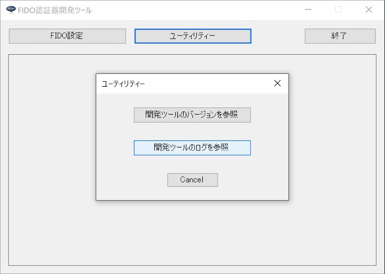
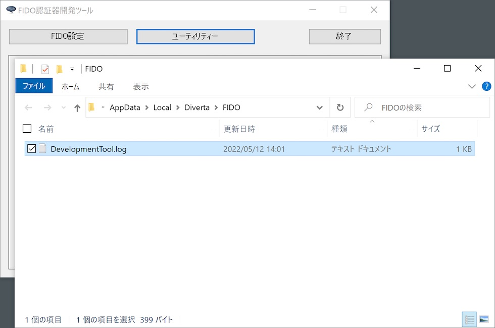

# 開発ツールのログファイル

## 概要
FIDO認証器開発ツールから出力されるログファイルについて説明します。

## ログファイルの場所

FIDO認証器開発ツールの実行中に出力されるログは、Windowsのユーザーディレクトリー配下のログファイル（下記の場所）に保存されます。

`%LOCALAPPDATA%\Diverta\FIDO\DevelopmentTool.log`

具体的には、例えば `C:\Users\user\AppData\Local\Diverta\FIDO\DevelopmentTool.log` といったパスになります。

### ログファイルの場所を開く

ログファイルの格納場所を、Windowsのエクスプローラで開くことができます。<br>
開発ツールの「ユーティリティー」画面で「開発ツールのログを参照」ボタンをクリックします。



ログファイル「`DevelopmentTool.log`」を格納するディレクトリーが、Windowsのエクスプローラで表示されます。



ログファイルは通常のテキストファイルですので、適宜、テキストエディターにより内容を参照することが可能です。

## ログファイルの内容

Windowsアプリの一般的な形式で出力されます。<br>
ログの出力イメージは以下のようになります。
```
2022/05/12 14:04:15 [info] FIDO認証器開発ツールを起動しました: Version 0.1.1
2022/05/12 14:04:15 [info] USBデバイス検知を開始しました。
2022/05/12 14:04:15 [info] USB HIDデバイスに接続されました。¥¥?¥hid#vid_f055&pid_0001&mi_00#7&20d02062&0&0000#{4d1e55b2-f16f-11cf-88cb-001111000030}
2022/05/12 14:04:30 [info] 鍵・証明書インストールを開始します。
2022/05/12 14:04:30 [debug] HID Sent INIT frame: data size=8 length=8
ff ff ff ff 86 00 08 db af b9 02 b3 fc 56 c8
2022/05/12 14:04:30 [debug] HID Recv INIT frame: data size=17 length=17
ff ff ff ff 86 00 11 db af b9 02 b3 fc 56 c8 01
00 33 01 02 05 00 02 07
2022/05/12 14:04:30 [debug] HID Sent INIT frame: data size=6 length=6
01 00 33 01 90 00 06 06 a2 01 01 02 02
2022/05/12 14:04:30 [debug] HID Recv INIT frame: data size=80 length=57
01 00 33 01 90 00 50 00 a1 01 a5 01 02 03 26 20
01 21 58 20 09 f3 85 98 4e 73 ed 14 48 d3 9c ba
50 8f bf a2 bc 64 f7 e7 7b 52 b9 00 9a a7 5d 95
70 16 43 59 22 58 20 7c 53 08 c7 79 dd 40 29 ff
2022/05/12 14:04:30 [debug] HID Recv CONT frame: seq=0 length=23
01 00 33 01 00 aa 60 3d 07 a9 ef 38 65 96 c8 de
a1 cd 2b 84 a3 36 4e 8d 3d 11 18 73
2022/05/12 14:04:30 [debug] DoRequestInstallSkeyCert
2022/05/12 14:04:31 [debug] DoRequestInstallSkeyCert hidProcess.SendHIDMessage
2022/05/12 14:04:31 [debug] HID Sent INIT frame: data size=712 length=57
01 00 33 01 c1 02 c8 00 a3 01 a5 01 02 03 26 20
01 21 58 20 6f 80 22 ce 34 2e 07 9b 06 53 e7 cc
74 8f 71 27 40 be 1c 5d 1c 15 14 c4 cc 3f 15 1e
30 af ae 29 22 58 20 92 dd 8d e0 75 bf 14 89 4c
2022/05/12 14:04:31 [debug] HID Sent CONT frame: data seq=0 length=59
01 00 33 01 00 a5 9d 7a f2 7e dd 36 20 63 d3 da
a2 91 52 9b f6 e4 02 36 62 ea 17 74 02 59 02 70
42 b4 7c 5c 83 a8 b2 db b1 4b f8 e8 14 14 ee a2
1c 30 e9 09 6a 05 a1 bc be be 44 de e8 85 11 2c
:
2022/05/12 14:04:31 [debug] HID Sent CONT frame: data seq=10 length=59
01 00 33 01 0a 77 91 7a d4 d3 65 f0 ea cb c6 e3
5e 3e e2 da 6f 84 29 73 a3 c1 8f ea 65 bd 22 50
0f 85 fb ed a4 5c 3d ee bb 20 13 53 0f 7e b3 76
51 f0 0d 61 85 9e 85 21 5f 5e 98 9d e1 33 97 8d
2022/05/12 14:04:31 [debug] HID Sent CONT frame: data seq=11 length=6
01 00 33 01 0b 07 9b 03 19 02 64
2022/05/12 14:04:31 [debug] HID Recv INIT frame: data size=1 length=1
01 00 33 01 c1 00 01 00
2022/05/12 14:04:31 [info] 鍵・証明書インストールが成功しました。
2022/05/12 14:04:36 [info] USBデバイス検知を終了しました。
2022/05/12 14:04:36 [info] FIDO認証器開発ツールを終了しました
```
