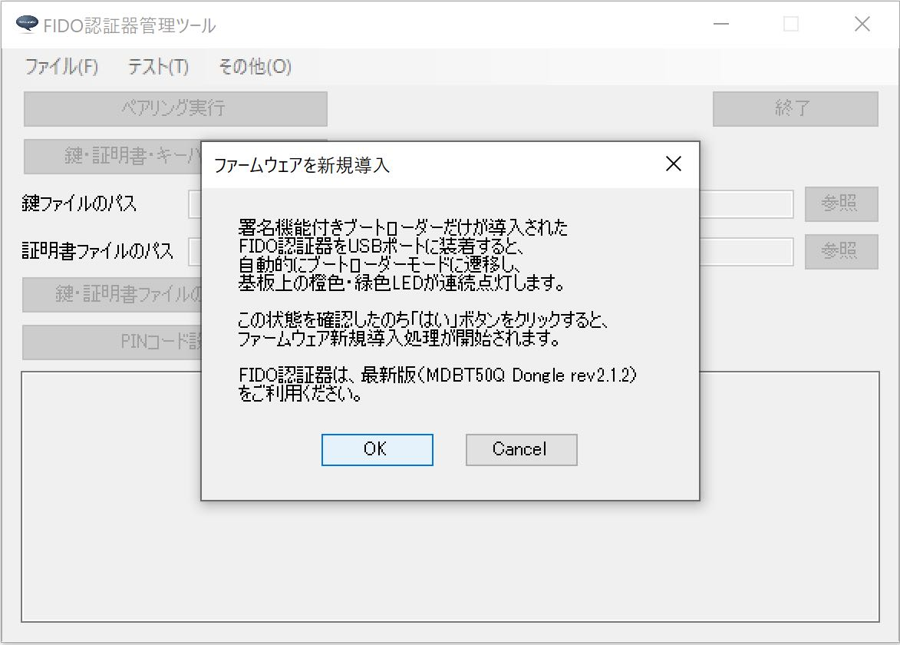
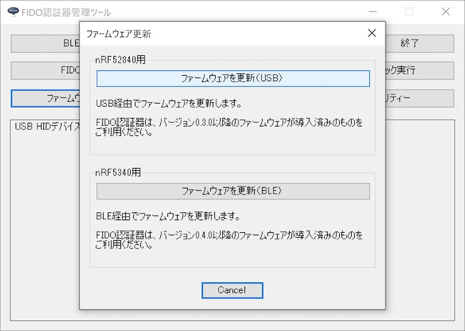
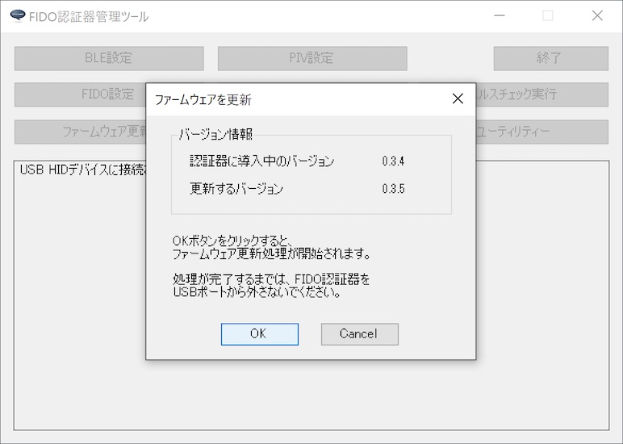
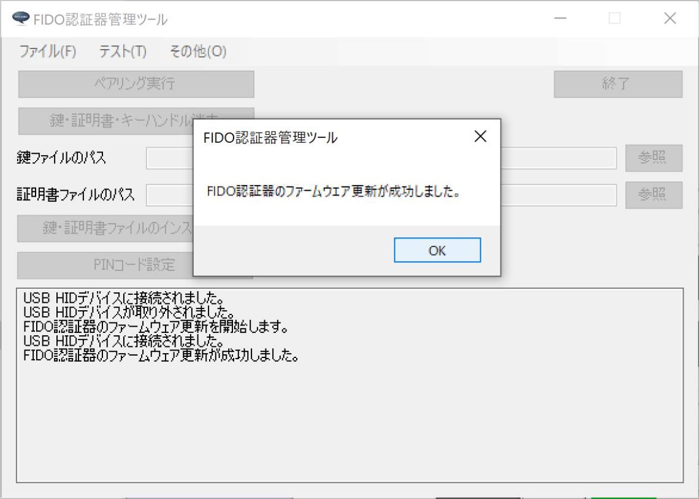

# ファームウェア更新機能

## 概要
USBブートローダーを導入した[MDBT50Q Dongle](../../FIDO2Device/MDBT50Q_Dongle/README.md)に対し、管理ツールから、ファームウェアを更新できる機能です。<br>
nRF52 SDKのDFU機能（[Secure DFU Bootloader over Serial Link (UART/USB)](https://infocenter.nordicsemi.com/topic/com.nordic.infocenter.sdk5.v15.3.0/sdk_app_serial_dfu_bootloader.html)）を使用して実装されています。

## 前提

[MDBT50Q Dongle](../../FIDO2Device/MDBT50Q_Dongle/README.md)に、<b>[署名機能付きUSBブートローダー](../../nRF52840_app/firmwares/secure_bootloader)</b>が導入されていることが前提となります。

## プログラムの実装

プログラム実装に関する情報を掲載いたします。

#### メニュー選択〜処理開始画面の表示

管理ツールの<b>ファームウェア更新（以下「DFU」）</b>機能は`ToolDFU`というクラス（以下「DFU処理クラス」）で実装されています。<br>
メイン画面からメニューを選択するとDFU処理が実行されます。

DFU処理は以下の２機能が用意されています。<br>
- ファームウェア新規導入 - ブートローダーのみが導入されているだけのMDBT50Q Dongleに対する処理
- ファームウェア更新 - ブートローダー、ファームウェアの両方が導入されているMDBT50Q Dongleに対する処理

```
private void DoCommandDFU(object sender, EventArgs e) {
    // ボタンを押下不可とする
    enableButtons(false);

    // 処理名称を設定し、処理を開始
    commandTitle = ToolGUICommon.PROCESS_NAME_USB_DFU;
    if (sender.Equals(DFUNewToolStripMenuItem)) {
        // ファームウェア新規導入
        toolDFU.DoCommandDFUNew();
    } else {
        // ファームウェア更新
        toolDFU.DoCommandDFU();
    }
}
```

DFU処理クラス内では、新規導入、更新の区分を、`ToolDFUCommand`という変数で判定します。<br>
ですので、処理の冒頭で、`ToolDFUCommand`を設定する必要があります。

処理区分設定後、`OpenForm`呼出により、新規導入、更新の各機能に対応する処理開始画面（下図ご参照）をモーダル表示します。

```
// 処理区分
private enum ToolDFUCommand {
    CommandDFU = 0,
    CommandDFUNew
};
private ToolDFUCommand Command;
:
public void DoCommandDFU()
{
    :
    // 処理区分を設定
    Command = ToolDFUCommand.CommandDFU;

    // 処理開始画面を表示
    if (dfuStartForm.OpenForm()) {
        // 処理開始画面でOKクリック-->DFU接続成功の場合、
        // DFU主処理開始
        DoProcessDFU();
        :
    }
}

public void DoCommandDFUNew()
{
    :
    // 処理区分を設定
    Command = ToolDFUCommand.CommandDFUNew;

    // 処理開始画面を表示
    if (dfuNewStartForm.OpenForm()) {
        // 処理開始画面でOKクリック-->DFU接続成功の場合、
        // DFU主処理開始
        DoProcessDFU();
        :
    }
}
```

注意点として、上記処理開始画面の`OpenForm`実行中は、画面が閉じられるまで待機しています（制御が戻りません）。<br>
したがって、処理開始画面表示中に行われる処理（ブートローダーモード遷移処理、仮想COMポート接続処理）は、すべて別のスレッドにより実行されることになります。

処理開始画面（`DFUStartWindow`）は下図のようなイメージになります。

<b>【新規導入機能用】</b><br>


<b>【更新機能用】</b><br>


処理開始画面上でOKボタンをクリックすると、DFUの前処理がスタートします。

#### 処理開始画面の表示〜前処理開始（新規導入時）

ファームウェア新規導入時は、処理開始画面を表示したまま、仮想COMポート接続処理が行われます。<br>
接続処理が完了すると、フォームが自動的に閉じられ、DFU主処理に移ります。

仮想COMポート接続処理は、処理開始画面のOKボタンクリックによる`EstablishDFUConnection`の呼出しで開始されます。

```
private void ButtonOK_Click(object sender, EventArgs e)
{
    // ボタンを押下不可にし、DFU対象デバイスに接続
    EnableButtons(false);
    ToolDFURef.EstablishDFUConnection();
}
```

接続処理が完了すると、`OnDFUConnectionEstablished`を経由し、処理開始画面に制御が戻ります。

```
private void DFUConnectionEstablished(bool success)
{
    if (Command == ToolDFUCommand.CommandDFUNew) {
        // 処理開始画面に制御を戻す
        dfuNewStartForm.OnDFUConnectionEstablished(success,
            MainForm.GetMaintenanceToolTitle(),
            ToolGUICommon.MSG_DFU_TARGET_NOT_CONNECTED);
        :
}
```

`OnDFUConnectionEstablished`では、`OpenForm`の戻り値に`DialogResult.OK`を設定した上で、フォームを閉じます。

```
public void OnDFUConnectionEstablished(bool success, string captionMessage, string errorMessage)
{
    if (success) {
        // 接続処理がOKの場合
        DialogResult = DialogResult.OK;
        :
    }
    // このウィンドウを終了
    TerminateWindow();
}

public bool OpenForm()
{
    // 処理開始画面を開く
    DialogResult = DialogResult.Cancel;
    return (ShowDialog() == DialogResult.OK); // TerminateWindow()実行で制御が戻る
}
```

この結果、処理開始画面が自動的に閉じられ、DFU主処理（`DoProcessDFU`）に移ります。

#### 処理開始画面の表示〜前処理実行（更新時）

ファームウェア更新時は、処理開始画面を表示したまま、ブートローダーモード遷移処理-->仮想COMポート接続処理が続けて行われます。<br>
接続処理が完了すると、フォームが自動的に閉じられ、DFU主処理に移ります。

ブートローダーモード遷移処理は、処理開始画面のOKボタンクリックによる`ChangeToBootloaderMode`の呼出しで開始されます。

```
private void ButtonOK_Click(object sender, EventArgs e)
{
    if (ToolDFURef.ChangeToBootloaderMode()) {
        // HID接続がある場合は、DFU対象デバイスをブートローダーモードに遷移させる
        EnableButtons(false);
    }
}
```

`ChangeToBootloaderMode`では、MDBT50Q Dongleに対し、ブートローダーモード遷移コマンドをHID経由で投入します。<br>
MDBT50Q Dongleからレスポンスが戻ると、`NotifyBootloaderModeResponse`が呼び出されます。

```
public bool ChangeToBootloaderMode()
{
    :
    // ブートローダーモード遷移コマンドを実行
    hidMain.DoCommandChangeToBootloaderMode();
    return true;
}

public void NotifyBootloaderModeResponse(byte receivedCmd, byte[] message)
{
    if (receivedCmd == Const.HID_CMD_BOOTLOADER_MODE) {
        // ブートローダーモード遷移コマンド成功時は、
        // ブートローダーモード遷移判定フラグをセット
        // HID接続切断 --> OnUSBDeviceRemoveComplete 呼出まで待機
        NeedCheckBootloaderMode = true;
        :
    }
}
```

他方、MDBT50Q Dongleがブートローダーモードに遷移すると、今まで接続状態だったUSB HID接続が無効化され、代わりに仮想COMポートがオープンされます。<br>
管理ツールでは、このイベントを関数`OnUSBDeviceRemoveComplete`で検知します。

```
public void OnUSBDeviceRemoveComplete()
{
    // ブートローダーモード遷移判定フラグがセットされている場合（モード遷移完了待ち）
    if (NeedCheckBootloaderMode) {
        // ブートローダーモード遷移判定フラグをリセット
        NeedCheckBootloaderMode = false;

        // DFU対象デバイスへの接続処理を実行
        EstablishDFUConnection();
    }
}
```

USB HID接続無効化を検知したら、関数`EstablishDFUConnection`で、ブートローダーモードに遷移したMDBT50Q Dongleに対し、仮想COMポート経由でUSB CDC ACM接続を実行します。<br>
完了すると、処理結果を処理開始画面に引き渡すため、`OnChangeToBootloaderMode`を呼び出します。

```
private void DFUConnectionEstablished(bool success)
{
    if (Command == ToolDFUCommand.CommandDFUNew) {
    :
    } else {  // Command == ToolDFUCommand.CommandDFU
        // 処理開始画面に制御を戻す
        dfuStartForm.OnChangeToBootloaderMode(success,
            MainForm.GetMaintenanceToolTitle(),
            ToolGUICommon.MSG_DFU_TARGET_NOT_CONNECTED);
    }
}
```

`OnChangeToBootloaderMode`では、`OpenForm`の戻り値に`DialogResult.OK`を設定した上で、フォームを閉じます。

```
public void OnChangeToBootloaderMode(bool success, string captionMessage, string errorMessage)
{
    if (success) {
        // ブートローダーモード遷移処理がOKの場合
        DialogResult = DialogResult.OK;
        :
    }
    // このウィンドウを終了
    TerminateWindow();
}

public bool OpenForm()
{
    :
    // 処理開始画面を開く
    DialogResult = DialogResult.Cancel;
    return (ShowDialog() == DialogResult.OK); // TerminateWindow()実行で制御が戻る
}
```

この結果、処理開始画面が自動的に閉じられ、DFU主処理（`DoProcessDFU`）に移ります。

#### 前処理完了〜処理進捗画面の表示

前処理が完了すると、前述`OpenForm`から制御が戻り、DFU処理クラスの`DoProcessDFU`呼出しにより、DFU主処理がスタートします。<br>
`InvokeDFUProcess`を振り逃げ方式で実行指示すると、DFU主処理が別スレッドで起動します。

その後、直ちに処理進捗画面を`OpenForm`呼出しにより表示します。<br>
こちらも処理開始画面の`OpenForm`と同様、画面が閉じられるまで制御が戻りません。

```
//
// DFU主処理
//
private void DoProcessDFU()
{
    // DFU主処理を起動
    Task task = Task.Run(() => {
        InvokeDFUProcess();
    });

    // 処理進捗画面を表示
    bool ret = dfuProcessingForm.OpenForm();

    // 処理結果（成功 or 失敗）をメイン画面に戻す
    mainForm.OnAppMainProcessExited(ret);
}
```

DFU主処理は、画面スレッド（前述の`DoProcessDFU`を実行したスレッド）とは別のスレッドにより、バックグラウンドで実行されます。<br>
その間は、処理進捗画面が表示されたままになります。

処理進捗画面（`DFUProcessingWindow`）は下図のようなイメージになります。



#### 処理進捗画面の表示〜更新イメージ転送完了

処理進捗画面が表示されると、まず最初に`NotifyStartDFUProcess`を経由し、DFU処理クラスから処理進捗画面に、DFU処理開始が通知されます。

```
private void InvokeDFUProcess()
{
    // 処理進捗画面にDFU処理開始を通知
    dfuProcessingForm.NotifyStartDFUProcess();
    dfuProcessingForm.NotifyDFUProcess(ToolGUICommon.MSG_DFU_PROCESS_TRANSFER_IMAGE);

    // メイン画面に主処理開始を通知
    mainForm.OnDFUStarted();

    // DFU主処理を開始
    toolDFUProcess.PerformDFU();
}
```

`NotifyStartDFUProcess`では、処理進捗画面上の緑色のプログレスバーを伸ばすための、進捗カウントアップが開始されます。

```
// 繰り返しタイマー
private System.Timers.Timer TimerRef;
:
public void NotifyStartDFUProcess()
{
    // プログレスバーの進捗カウントアップを開始
    TimerRef.Start();
}
```

プログレスバーは、１秒ごとに１ステップずつ右側に伸びます。<br>
実機計測の結果、DFU処理が約２０秒前後で完了するため、このような仕様としております。

```
public DFUProcessingForm()
{
    :
    // タイマーのセットアップ
    TimerRef = new System.Timers.Timer(1000);
    TimerRef.Elapsed += TimerElapsed;
}
:
private void TimerElapsed(object sender, ElapsedEventArgs e)
{
    // プログレスバーを右側に伸ばす
    LevelIndicator.Value++;
    if (LevelIndicator.Value == LevelIndicator.Maximum) {
        TimerRef.Stop();
    }
}
```

続いて、DFU処理クラスは、DFU処理中にその進捗をメッセージ文言により通知（`notifyProgress`）します。<br>
下記コードは、DFU主処理のファームウェア更新イメージ転送が完了した旨を通知しています。

```
private void DFUProcessTerminated(bool success)
{
    :
    if (success) { // DFU転送成功時
        // 処理進捗画面に通知
        dfuProcessingForm.NotifyDFUProcess(ToolGUICommon.MSG_DFU_PROCESS_WAITING_UPDATE);

        // DFU転送成功時は、バージョン更新判定フラグをセット
        NeedCompareUpdateVersion = true;
        :
}
```

処理進捗画面は、進捗通知（`NotifyDFUProcess`）により、画面上の進捗メッセージを切り替えます。<br>
下図は、ファームウェア更新イメージ転送が完了後、MDBT50Q Dongleでファームウェア更新が反映されるのを待機している様子です。


#### 更新イメージ転送完了〜反映確認（処理完了）

DFU処理クラスでは、管理ツールに同梱されたファームウェア更新イメージファイル（`app_dfu_package.<バージョン文字列>.zip`）を、MDBT50Q Dongleに転送したのち、USB HID経由でバージョン情報を照会し、ファームウェア更新の反映確認を行うようにしています。<br>
そのため、管理ツールで、USB HID接続が再開されたことを検知する必要があります。

メイン画面は、HID関連処理クラス（`HIDMain`）経由でUSB HID接続が検知されると、その旨をDFU処理クラスに通知するよう実装しています。

```
public HIDMain(MainForm f)
{
    :
    hidProcess.HIDConnectedEvent += new HIDProcess.HIDConnectedEventHandler(NotifyHIDConnected);
}
:
private void NotifyHIDConnected()
{
    // HID接続処理が完了したら、DFU処理に通知
    ToolDFURef.OnUSBDeviceArrival();
}
```

DFU処理クラスは、通知を受けるとMDBT50Q Dongleに対し、現在バージョン（MDBT50Q Dongle上に反映されているバージョン）を問い合わせます。

```
public void OnUSBDeviceArrival()
{
    // 認証器に導入中のバージョンをクリア
    CurrentVersion = "";

    // 認証器に導入中のバージョンを照会
    hidMain.DoGetVersionInfoForDFU();
}
:
public void DoGetVersionInfoForDFU()
{
    // コマンドバイトだけを送信する
    GetVersionInfoForDFU = true;
    hidProcess.SendHIDMessage(CIDBytes, Const.HID_CMD_GET_VERSION_INFO, RequestData, 0);
}
```

MDBT50Q Dongleからバージョン情報が応答されると、MDBT50Q Dongleに転送したファームウェアのバージョンと、現在バージョンを比較します。

```
public void NotifyFirmwareVersionResponse(string strFWRev)
{
    // 認証器に導入中のバージョンを保持
    CurrentVersion = strFWRev;

    // バージョン更新判定フラグがセットされている場合（ファームウェア反映待ち）
    if (NeedCompareUpdateVersion) {
        // バージョン更新判定フラグをリセット
        NeedCompareUpdateVersion = false;

        // バージョン情報を比較して終了判定
        // --> 判定結果を処理進捗画面に戻す
        dfuProcessingForm.NotifyTerminateDFUProcess(CompareUpdateVersion());
    }
}
```

前述の比較結果、バージョンが同じであれば反映確認OKと判定し、DFU処理が正常終了します。<br>
DFU処理結果を処理進捗画面に引き渡すため、`NotifyTerminateDFUProcess`を呼び出します。

`NotifyTerminateDFUProcess`では、`OpenForm`の戻り値に`DialogResult.OK`を設定した上で、フォームを閉じます。

```
public void NotifyTerminateDFUProcess(bool success)
{
    :
    // DFU処理が正常終了した場合はOK、異常終了した場合はAbortを戻す
    if (success) {
        DialogResult = DialogResult.OK;
        :
    }
    TerminateWindow();
}

public bool OpenForm()
{
  :
    // 処理進捗画面を開く
    DialogResult = DialogResult.Cancel;
    return (ShowDialog() == DialogResult.OK); // TerminateWindow()実行で制御が戻る
}
```

この結果、処理進捗画面が自動的に閉じられ、ファームウェア更新処理が完了します。



## プログラムの仕様

プログラムの仕様に関する情報を掲載いたします。

#### DFUの流れについて

DFU機能は、以下の流れで行われます。

| # |項目 |処理内容 |
|:-:|:-|:-|
|1|処理タイムアウト監視開始|３０秒経過でタイムアウトと判定します。<br>（DFUの所要時間は21秒前後です）|
|2|DFU処理開始指示|サブスレッド上で行われます。|
|3|DFUイメージ抽出|ファームウェア更新イメージファイルを読込み、DFUイメージを抽出します。<br>また、イメージファイル名から更新バージョン文字列を取得します。<br>ファイル名は`app_dfu_package.<バージョン文字列>.zip`になります。|
|4|DFU対象デバイスに接続|nRF52840に、仮想COMポート経由で接続します。|
|5|DFU処理実行|nRF52840に、前述のDFUイメージを転送します。|
|6|DFU対象デバイスから切断|　|
|7|反映待機|DFUイメージ転送完了後、nRF52840アプリケーションが自動起動し、<br>USB HID接続が検出されるまで待機します。|
|8|バージョン情報照会|USB HID接続が再開されたら、HID経由でバージョン情報照会を実行します。|
|9|バージョンチェック|バージョン情報照会で取得したバージョン文字列をチェックし、<br>イメージファイル名から取得した更新バージョン文字列と等しければ、<br>DFU処理は完了となります。|


前述の `5`「DFU実行」は、以下の流れで行われます。

| # |項目 |処理内容 |
|:-:|:-|:-|
|1|DFU対象デバイスの通知設定|nRF52840とのデータ受け渡し（セッション）を開始します。|
|2|DFU対象デバイスからMTUを取得|DFUイメージのバイナリーデータ送信１回あたりのフレームサイズ<br>（MTU）を取得します。|
|3|datイメージ転送|プログラムイメージのFlash ROM配置の処理前に必要となる情報<br>（`Init packet`）を転送します。|
|4|binイメージ転送|Flash ROMに配置されるプログラムイメージを転送します。|

#### DFUセッションの内容

DFUの処理において受け渡しされるデータは以下のようになります。

| # |項目 |リクエスト | レスポンス |
|:-:|:-|:-|:-|
|0|DFU対象デバイスのPING [注1]|`09 ac c0`|`60 09 01 ac c0`|
|1|DFU対象デバイスの通知設定|`02 00 00 c0`|`60 02 01 c0`|
|2|DFU対象デバイスからMTUを取得|`07 c0`|`60 07 01 03 08 c0`<br>[注2]|
|3|datイメージ転送 [注3]|||
|3-1| SELECT OBJECT|`06 01 c0`|`60 06 01 00 02 00 00 00`<br>`00 00 00 00 00 00 00 c0`|
|3-2| CREATE OBJECT|`01 01 8e 00 00 00 c0`|`60 01 01 c0`|
|3-3| WRITE OBJECT|`08 <datイメージ> c0`<br>[注4]|なし|
|3-4| CRC GET|`03 c0`|`60 03 01 8e 00 00 00 a1`<br>`09 db dd fb c0`|
|3-5| EXECUTE OBJECT|`04 c0`|`60 04 01 c0`|
|4|binイメージ転送 [注5]|||
|4-1| SELECT OBJECT|`06 02 c0`|`60 06 01 00 10 00 00 00`<br>`00 00 00 00 00 00 00 c0`<br>[注6]|
|4-2| CREATE OBJECT|`01 02 00 10 00 00 c0`|`60 01 01 c0`|
|4-3| WRITE OBJECT|`08 <binイメージ> c0`<br>[注4]|なし|
|4-4| CRC GET|`03 c0`|`60 03 01 00 10 00 00 70`<br>`2e 06 f9 c0`|
|4-5| EXECUTE OBJECT|`04 c0`|`60 04 01 c0`|

[注1] DFU対象デバイス接続処理（`ToolDFU.EstablishDFUConnection()`）内で実行されます。DFU対象デバイスが接続されているかどうかのチェックを行うために実行します。<br>
[注2] レスポンスの4〜5バイト目に、リトルエンディアン形式で、MTUの最大値が格納されています。上記例では`0x0803`（2,051バイト）になります。ただし、nRF52の仕様上、イメージデータは4の倍数のサイズごとに送信する必要があるため、このケースでは実際のMTUを、2,048としております。<br>
[注3] `3-1`〜`3-5`の処理が、順番に１度だけ行われます。<br>
[注4] `<datイメージ>`にはdatイメージのバイト配列が、`<binイメージ>`にはbinイメージのバイト配列が入ります。また、nRF52の仕様上、特定のバイトデータをエスケープする必要があります（`c0`->`0xdbdc`, `0xdb`->`0xdbdd` に変換）。<br>
[注5] `4-1`の処理が１度だけ行われ、あとは１回あたり最大転送サイズ（4,096バイト）ごとに、`4-2`〜`4-5`の処理が繰り返されます。<br>
[注6] 前述「１回あたり最大転送サイズ」が、レスポンスの4〜5バイト目に、リトルエンディアン形式で格納されています。上記例では`0x1000`（4,096バイト）になります。
