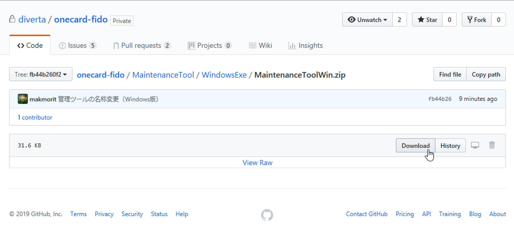
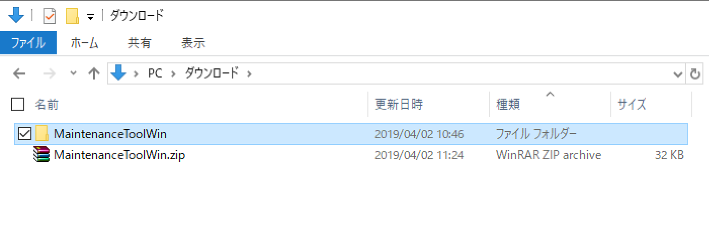

# インストール手順

## 概要
FIDO認証器管理ツールをWindows環境にインストールする手順を掲載しています。

## インストール媒体の取得

[Windows版 FIDO認証器管理ツール](U2FMaintenanceToolWin.zip)を、GitHubからダウンロード／解凍します。 
該当ページの「Download」ボタンをクリックすると、[MaintenanceToolWin.zip](MaintenanceToolWin.zip)がダウンロードできます。

MaintenanceToolWin.zipを展開すると、下図のように「MaintenanceToolWin」というフォルダーができるので、任意の場所に配置します。

フォルダー内にある「MaintenanceToolGUI.exe」が、実行ファイルになります。

## インストールの実行

前述の実行ファイル「MaintenanceToolGUI.exe」を右クリックし「開く」を実行してください。

2019/04/01現在、アプリに署名がされていないため、ダウンロードしたプログラムを実行できない旨のダイアログが表示されます。 
「詳細情報」をクリックします。

画面表示が変わり「実行ボタン」が表示されますので、その「実行ボタン」をクリックします。

FIDO認証器管理ツールの画面が起動すれば、インストールは完了です。

