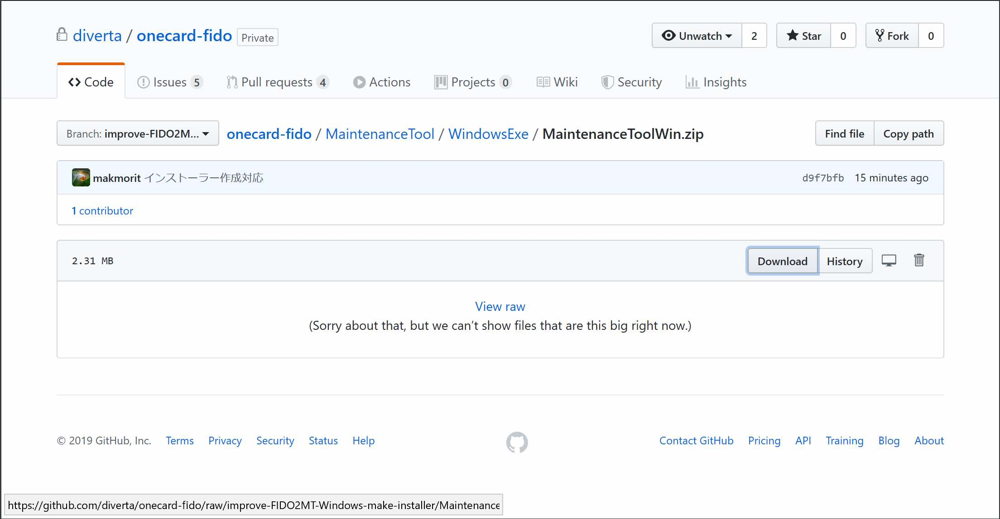
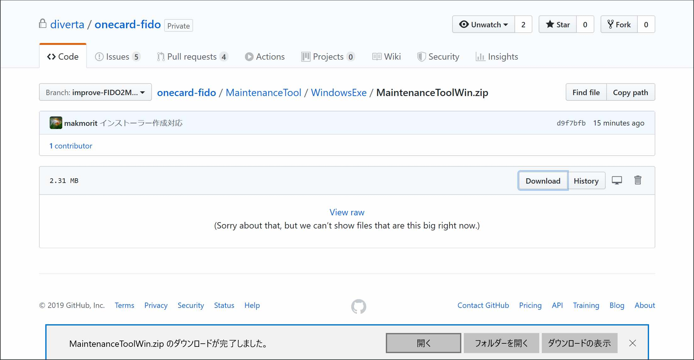
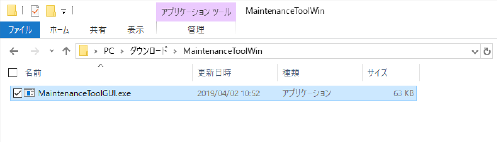
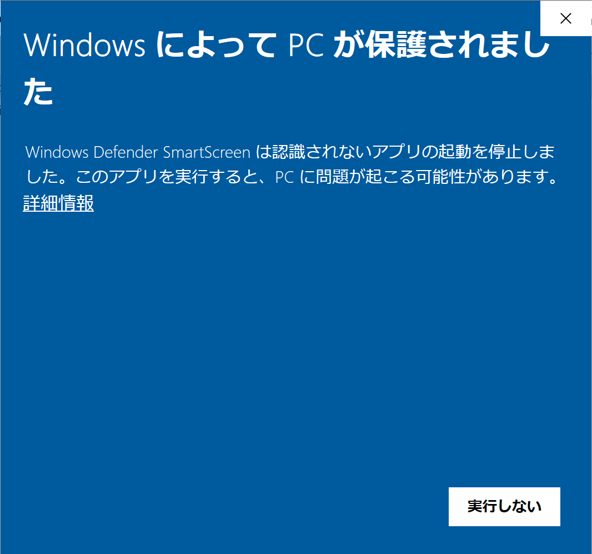
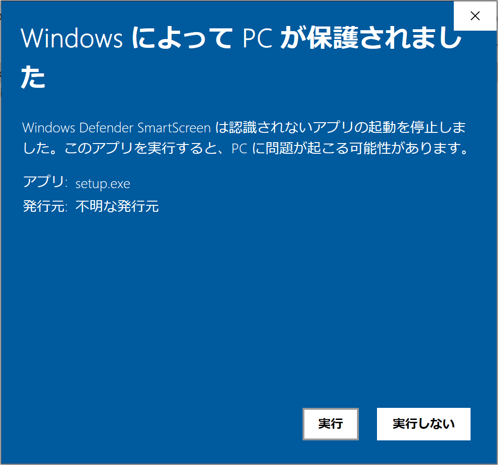
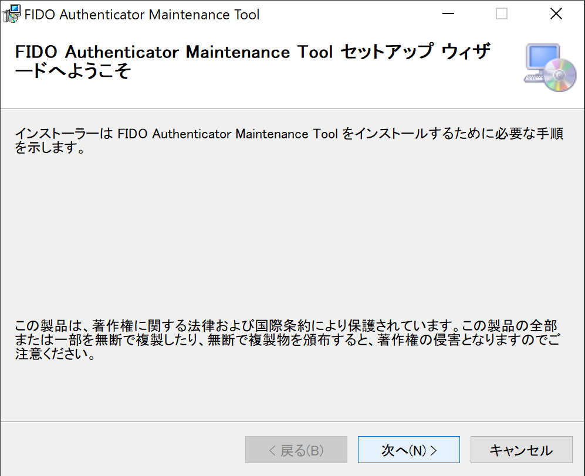
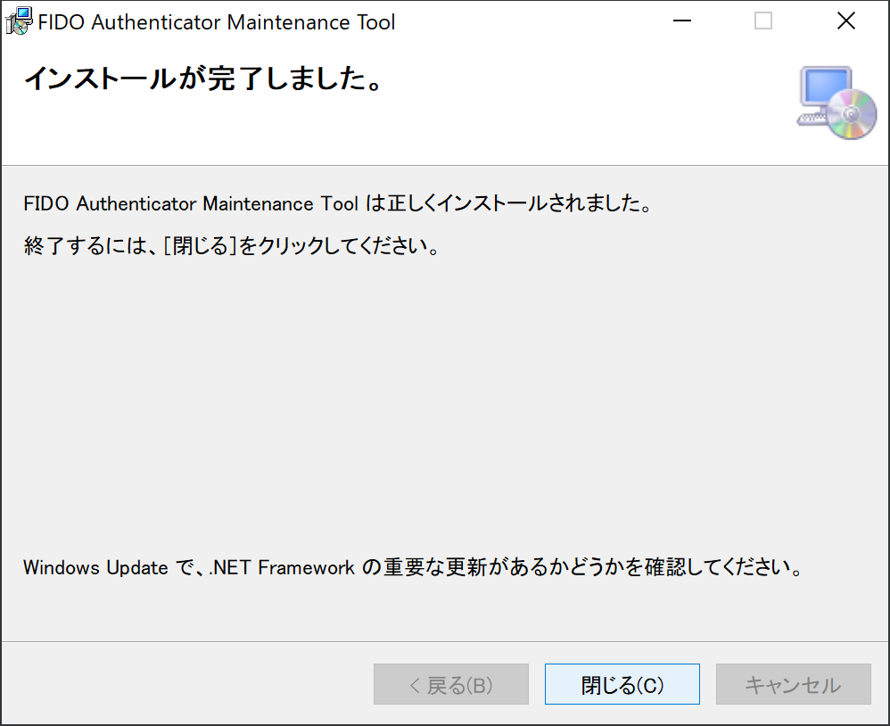
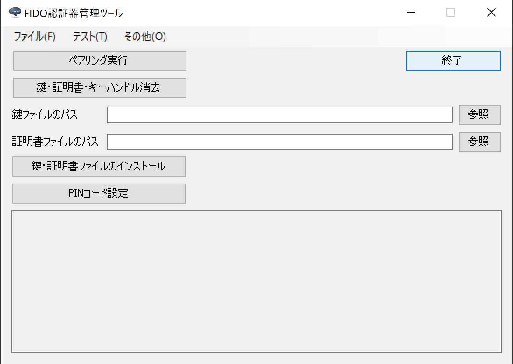

# インストール手順

## 概要
FIDO認証器管理ツールをWindows環境にインストールする手順を掲載しています。

## インストール媒体の取得

[Windows版 FIDO認証器管理ツール](U2FMaintenanceToolWin.zip)を、GitHubからダウンロード／解凍します。 
該当ページの「Download」ボタンをクリックすると、[MaintenanceToolWin.zip](MaintenanceToolWin.zip)がダウンロードできます。

ダウンロードが完了したら「開く」を実行します。

Windowsのエクスプローラが表示されますので、フォルダー「MaintenanceTool」をダブルクリックします。

「setup.exe」と「SetupWizard.msi」の２点のファイルが、インストール媒体になります。

## インストールの実行

前述の実行ファイル「setup.exe」をダブルクリックして実行してください。

2019/12/24現在、アプリに署名がされていないため、ダウンロードしたプログラムを実行できない旨のダイアログが表示されます。 
「詳細情報」をクリックします。

画面表示が変わり「実行ボタン」が表示されますので、その「実行ボタン」をクリックします。

インストーラーが起動しますので、指示に従いインストールを進めます。

インストールが正常に完了したら「閉じる」をクリックし、インストーラーを終了させます。

Windowsのスタートメニューに、フォルダー「FIDO Authenticator Tools」とアイコン「FIDO Authenticator Maintenance Tool」が作成されていることを確認します。 
アイコンを右クリックし、インストールされたFIDO認証器管理ツールを「管理者として実行」します。[注1]

FIDO認証器管理ツールの画面が起動すれば、インストールは完了です。

[注1] Windows 10の最新バージョン（Windows 10 November 2019 Update）においては、管理者として実行されていないプログラムの場合、FIDOデバイスとの直接的なUSB通信ができない仕様となったようです。Windows版管理ツールでは、鍵・証明書インストールなどの管理機能を実行時、FIDOデバイスとの直接的なUSB通信が必要なため、管理者として実行させる前提としております。 
Windows版管理ツールを「管理者として実行」しない場合は、下記のようなエラーメッセージがポップアップ表示されます。

