# PGP鍵インストール手順書

最終更新日：2022/2/21

## 概要

[FIDO認証器管理ツール](README.md)を使用して、[MDBT50Q Dongle](../../FIDO2Device/MDBT50Q_Dongle/README.md)にPGP鍵をインストールする手順について掲載します。

## ソフトウェアの準備

PGP鍵のインストールを実行するためには、管理ツール、ファームウェア共に、必要バージョン以降である必要があります。 
また、[Gpg4win](https://www.gnupg.org)というツールを、PCに別途インストールする必要があります。

#### 管理ツールのバージョン確認
まずは[インストール手順](INSTALLPRG.md)を参照し、管理ツールをWindowsにインストールします。 
次に、下記手順で管理ツールのバージョン確認を行い、<b>Version 0.1.39以降</b>であるかどうか確認します。

管理ツールのメニュー「その他-->ツール設定」を選択し、ツール設定画面を開きます。

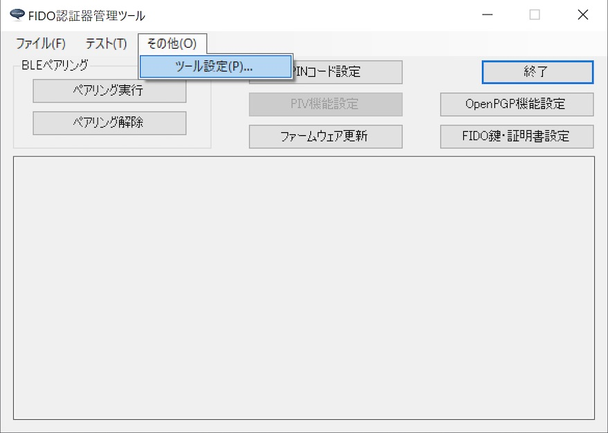

ツール設定画面のタブ「バージョン」を選択し、バージョンを確認してください。 
（下記例では「Version 0.1.39」となっております）

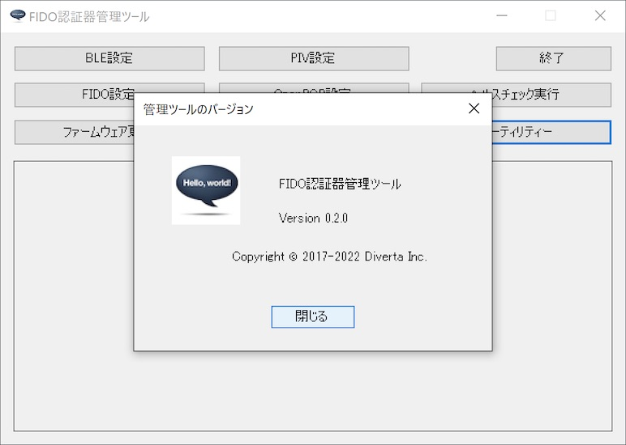

#### ファームウェアのバージョン確認
続いて、下記手順で[MDBT50Q Dongle](../../FIDO2Device/MDBT50Q_Dongle/README.md)ファームウェアのバージョン確認を行い、<b>0.3.4以降</b>であるかどうか確認します。 
MDBT50Q DongleをPCのUSBポートに装着した後、管理ツールのメニュー「Test-->USB-->バージョン情報取得」を選択します。

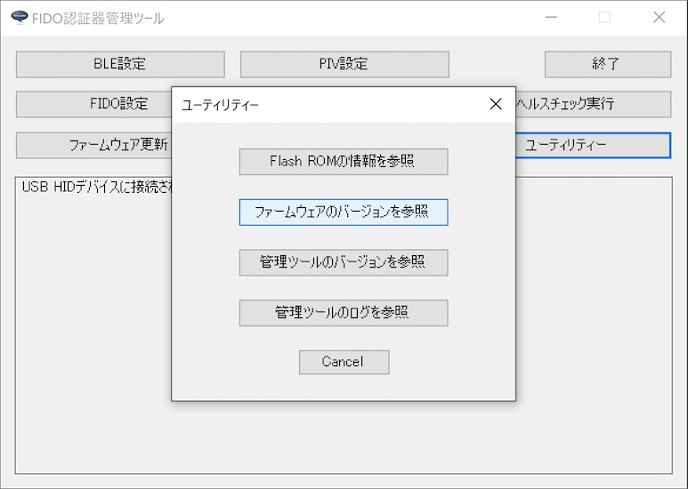

管理ツール下部のメッセージ欄に表示される、ファームウェアのバージョンを確認してください。 
（下記例では「0.3.4」となっております）

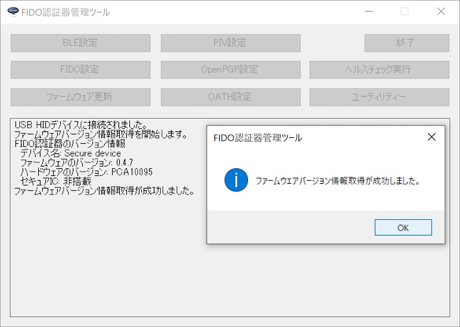

#### Gpg4winのインストール

管理ツールは、PGP鍵インストール処理時、[Gpg4win](https://www.gnupg.org)というツールに同梱の「GnuPG」を管理ツールで内部利用するため、あらかじめ<b>Gpg4winがPCにインストールされている</b>必要があります。

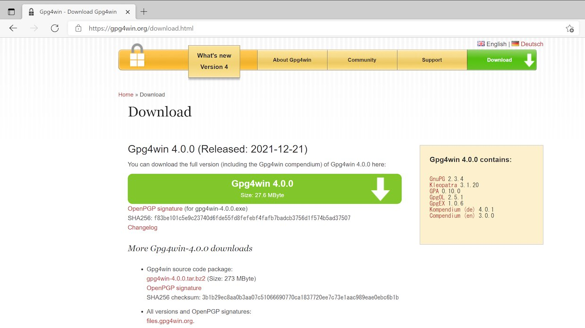

Gpg4winのインストール手順につきましては、別ドキュメント「<b>[Gpg4winインストール手順書](../../CCID/OpenPGP/GPGINSTWIN.md)</b>」をご参照願います。

## 管理ツールの起動

PGP秘密鍵のインストールは「OpenPGP機能設定画面」上から行います。

まずは管理ツールを起動し、USBポートに[MDBT50Q Dongle](../../FIDO2Device/MDBT50Q_Dongle/README.md)を装着します。 

管理ツール画面下部のメッセージ欄に「USB HIDデバイスに接続されました。」と表示されることを確認したら、管理ツール画面の「OpenPGP機能設定」ボタンをクリックします。

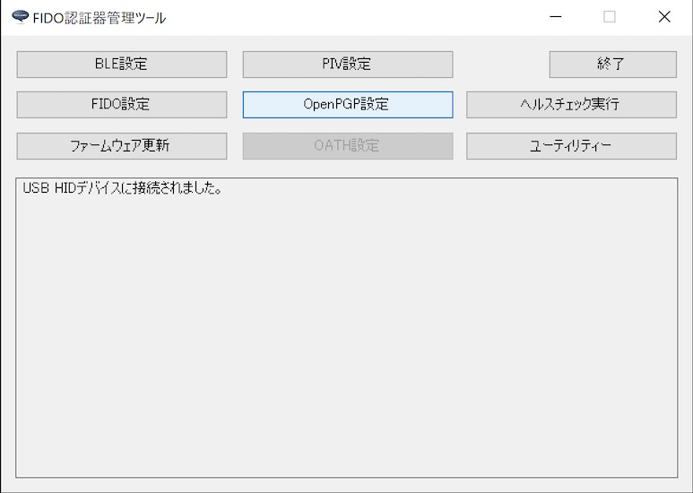

ホーム画面の上に、OpenPGP機能設定画面がポップアップ表示されます。

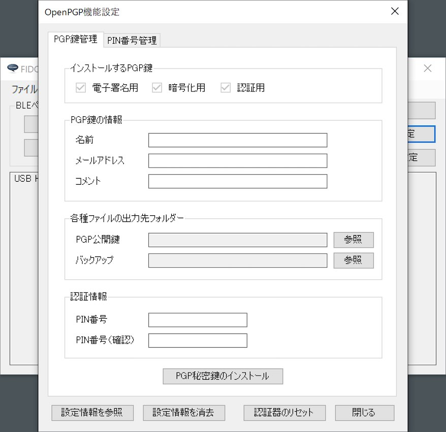

## PGP秘密鍵のインストール

OpenPGP機能で使用するPGP秘密鍵を、[MDBT50Q Dongle](../../FIDO2Device/MDBT50Q_Dongle/README.md)に導入します。

導入が必要な秘密鍵は、以下の３セットになります。 
いずれも、本機能で自動生成されます。

- 電子署名用（Signature key）
- 暗号／復号化用（Encryption key）
- PGP認証用（Authentication key）

以下の手順により、３セットの秘密鍵をすべてインストールします。

#### インストール手順

まずはインストールする鍵の個人情報を入力します。 
全項目入力必須になります。

- 名前（５文字以上で入力します）
- メールアドレス
- コメント

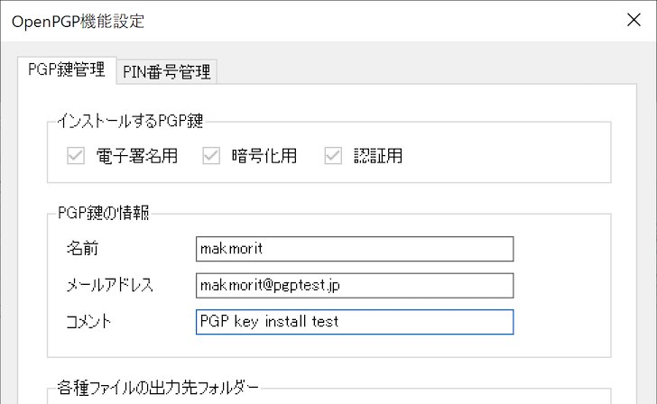

次に、各種ファイルの出力先フォルダーを選択します。 
「PGP公開鍵」欄右側の「参照」ボタンをクリックします。

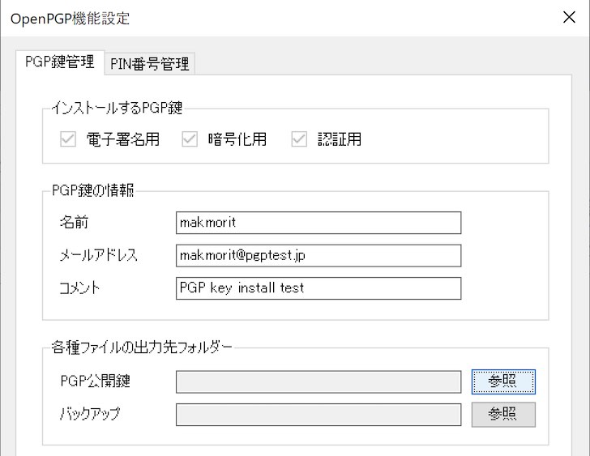

フォルダー参照ダイアログから、該当の出力先フォルダーを選択し「選択」ボタンをクリックします。

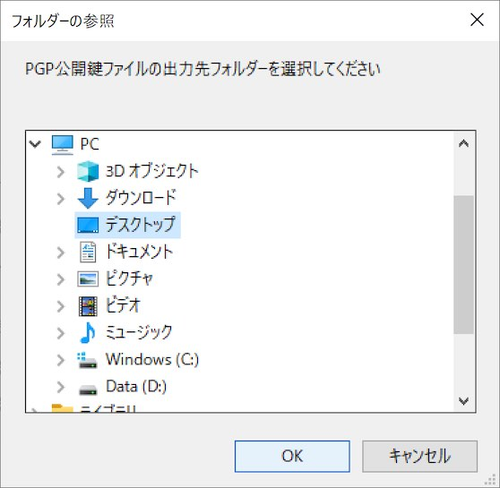

フォルダー欄に、選択された出力先フォルダーのパスが表示されます。

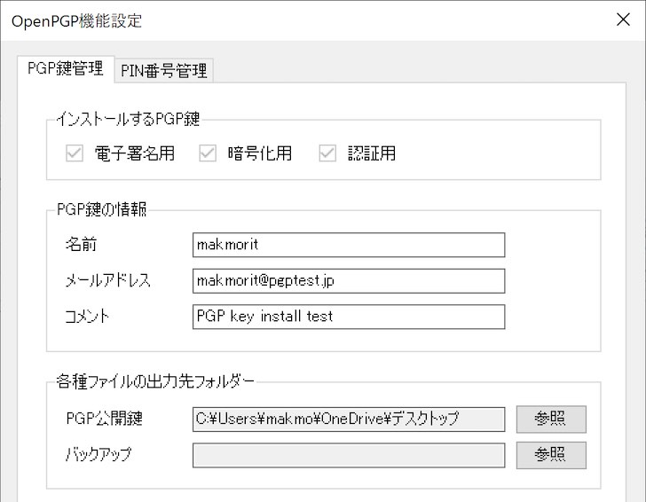

同様に、バックアップファイルの出力先フォルダーも選択します。

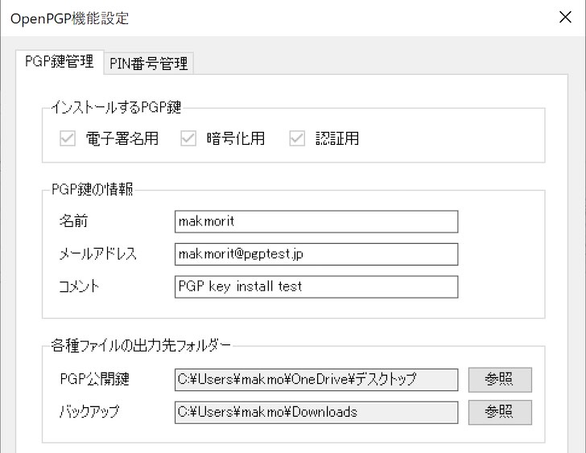

PGP公開鍵、バックアップ両方の出力先フォルダーを選択したら、下部の認証情報欄に、OpenPGP機能で使用する管理用PIN番号を入力します。[注1]

PIN番号を入力したら、下部の「PGP秘密鍵のインストール」ボタンをクリックします。

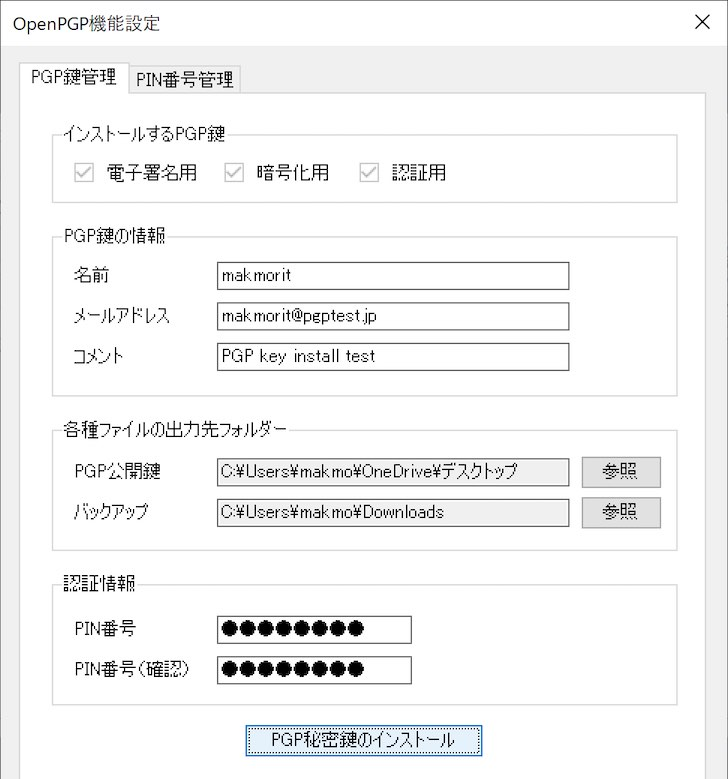

下記のような確認ダイアログが表示されますので、「はい」ボタンをクリックします。

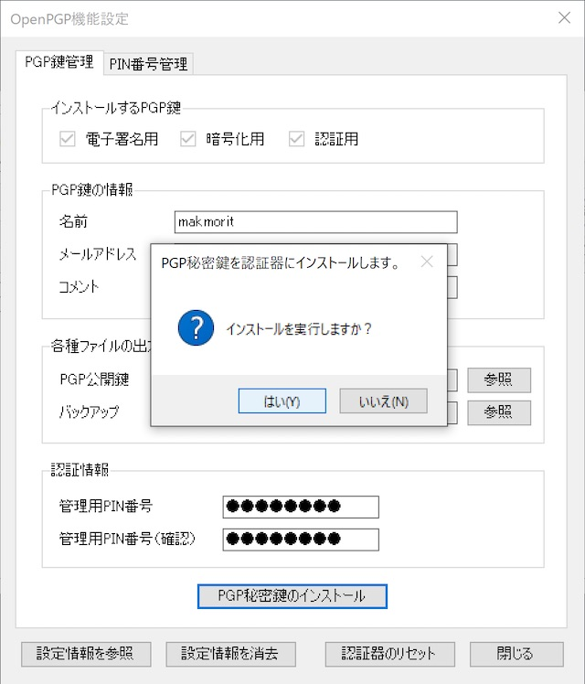

PGP秘密鍵のインストール処理が実行されます。

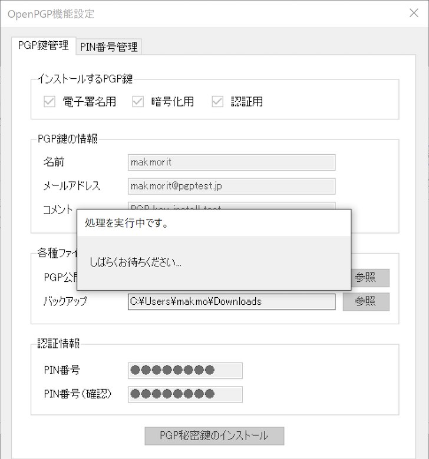

程なく、下図のようなメッセージがポップアップ表示され、処理が完了します。

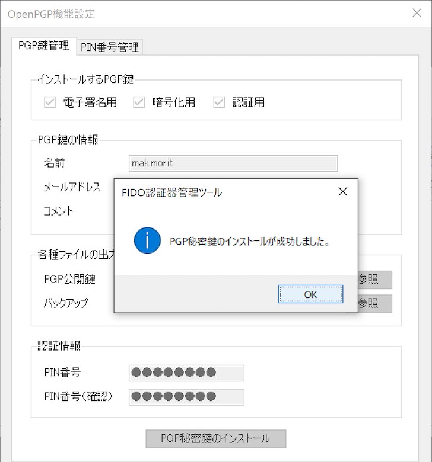

[注1] 管理用PIN番号は初期状態では「`12345678`」となっております。変更したい場合は、別ドキュメント「[OpenPGP機能の各種設定手順](../../MaintenanceTool/WindowsExe/PGPSETTING_OPT.md)」をご参照願います。

#### 確認手順

インストールされた証明書は「OpenPGP設定情報取得画面」で確認できます。 
OpenPGP機能設定画面の左下部のボタン「設定情報を参照」をクリックします。

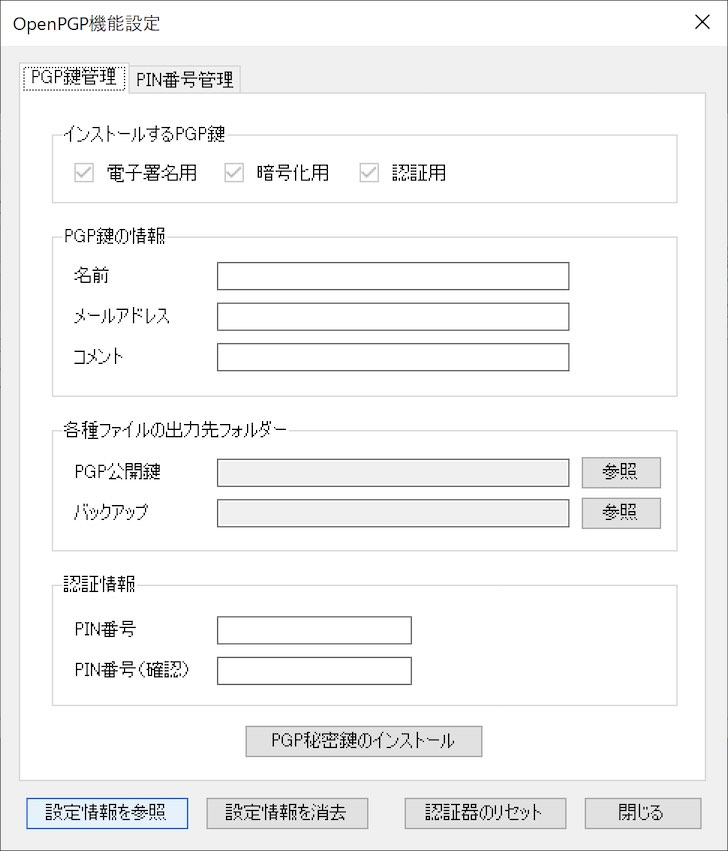

下図のようなOpenPGP設定情報取得画面がポップアップ表示されます。 
以下の３点が設定されていることが確認できます。

- 電子署名用（Signature key）の設定情報
- 暗号／復号化用（Encryption key）の設定情報
- PGP認証用（Authentication key）の設定情報

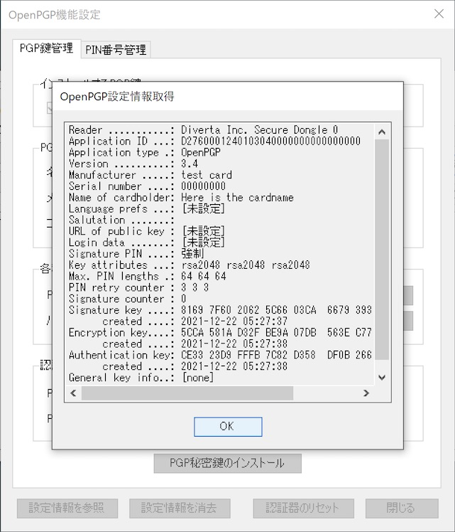

以上で、PGP秘密鍵のインストールは完了です。
