# OpenPGP機能の各種設定手順

最終更新日：2022/2/21

## 概要

[FIDO認証器管理ツール](../../MaintenanceTool/WindowsExe/MNTTOOL.md)を使用して、[BT40 Dongle](../../FIDO2Device/BT40Dongle/README.md)に対し、OpenPGP機能の各種設定を行う手順を掲載します。

- PIN番号管理
  - PIN番号を変更
  - 管理用PIN番号を変更
  - PIN番号をリセット
  - リセットコードを変更
  - リセットコードでPIN番号をリセット

## OpenPGP機能設定画面の表示

OpenPGP機能の設定は「OpenPGP機能設定画面」上で行います。

まずは管理ツールを起動し、USBポートに[BT40 Dongle](../../FIDO2Device/BT40Dongle/README.md)を装着します。 

管理ツール画面下部のメッセージ欄に「USB HIDデバイスに接続されました。」と表示されることを確認したら、管理ツール画面の「OpenPGP機能設定」ボタンをクリックします。

ホーム画面の上に、OpenPGP機能設定画面がポップアップ表示されます。

以後の設定作業は、すべてこの「OpenPGP機能設定画面」で実行します。

## PIN番号管理

OpenPGP機能で使用するPIN番号は、初期状態のままでも使用できますが、セキュリティー目的で適宜変更することが可能です。 
OpenPGP機能設定画面のタブ「PIN番号管理」で、PIN番号の変更ができます。

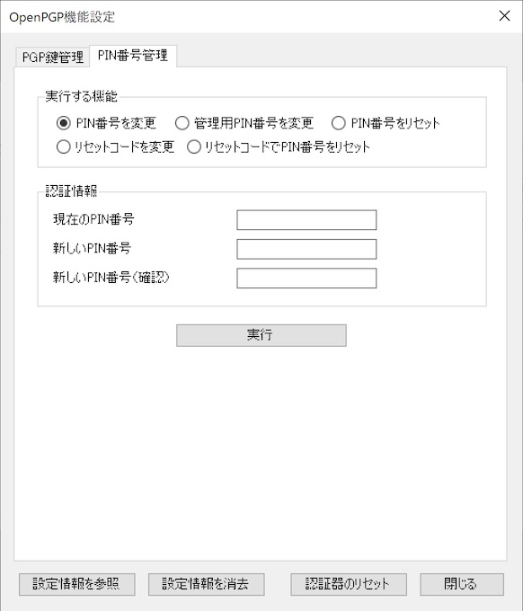

### PIN番号を変更

OpenPGP機能で使用するPIN番号は、初期状態では「123456」ですが、こちらを任意のPIN番号に変更することができます。

「PIN番号管理」タブのラジオボタン「PIN番号を変更」を選択します。 
すぐ下にある入力欄「現在のPIN番号」「新しいPIN番号」「新しいPIN番号（確認）」に、それぞれ値を入力したら「実行」ボタンをクリックします。

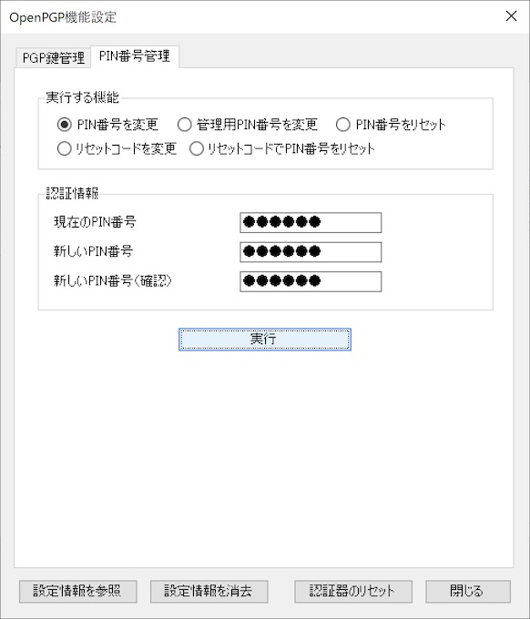

下記のような確認ダイアログが表示されますので、Yesボタンをクリックします。

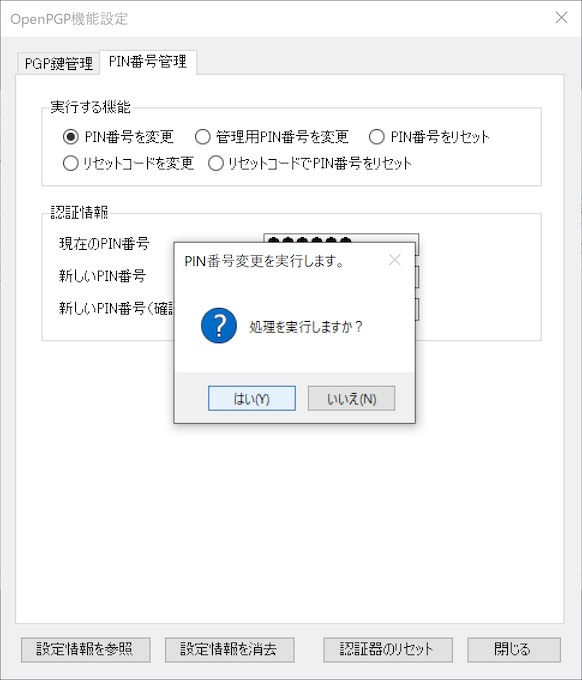

PIN番号変更処理が実行されます。 
程なく、下図のようなメッセージがポップアップ表示され、処理が完了します。

これでPIN番号の変更は完了です。

### 管理用PIN番号を変更

OpenPGP機能で使用する管理用PIN番号は、初期状態では「12345678」ですが、こちらを任意の管理用PIN番号に変更することができます。

「PIN番号管理」タブのラジオボタン「管理用PIN番号を変更」を選択します。 
すぐ下にある入力欄「現在の管理用PIN番号」「新しい管理用PIN番号」「新しい管理用PIN番号（確認）」に、それぞれ値を入力したら「実行」ボタンをクリックします。

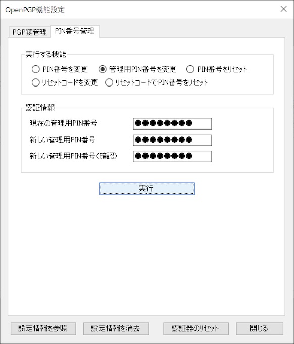

下記のような確認ダイアログが表示されますので、Yesボタンをクリックします。

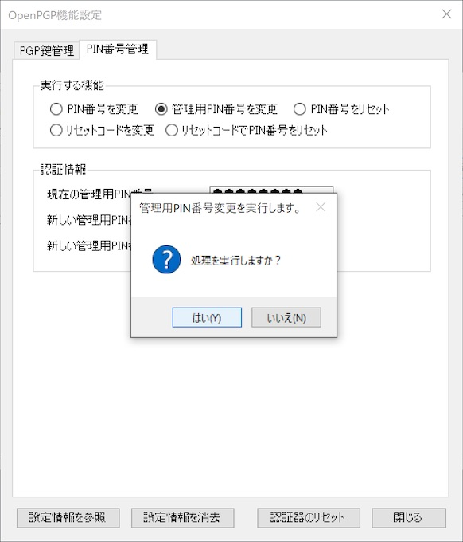

管理用PIN番号変更処理が実行されます。 
程なく、下図のようなメッセージがポップアップ表示され、処理が完了します。

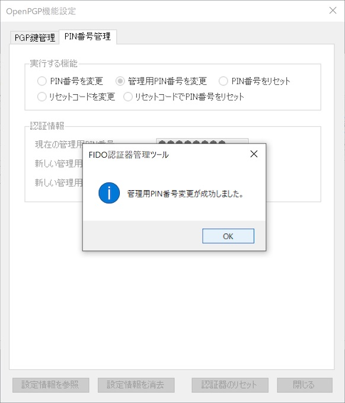

これで管理用PIN番号の変更は完了です。

### PIN番号をリセット

OpenPGP機能において、PIN番号を３回連続で間違えて指定した場合、認証がブロックされ、PIN番号が使えなくなってしまいます。 
「PIN番号のリセット」を実行すると、新しいPIN番号でOpenPGP機能が再び利用できるようになります。

「PIN番号管理」タブのラジオボタン「PIN番号をリセット」を選択します。 
すぐ下にある入力欄「現在の管理用PIN番号」「新しいPIN番号」「新しいPIN番号（確認）」に、それぞれ値を入力したら「実行」ボタンをクリックします。

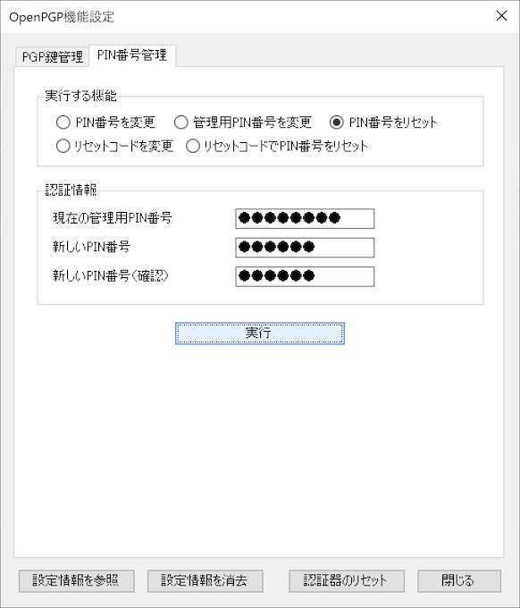

下記のような確認ダイアログが表示されますので、Yesボタンをクリックします。

PIN番号リセット処理が実行されます。 
程なく、下図のようなメッセージがポップアップ表示され、処理が完了します。

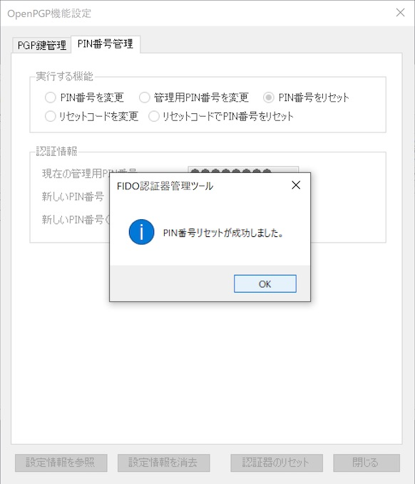

これでPIN番号のリセットは完了です。

### リセットコードを変更

OpenPGP機能において、PIN番号を３回連続で間違えて指定した場合、認証がブロックされ、PIN番号が使えなくなってしまいます。 
「リセットコード」は、再び新しいPIN番号でOpenPGP機能が利用できるようにする（＝PIN番号をリセットする）時に使う認証用の番号です。

OpenPGP機能で使用するリセットコードは、初期状態では「12345678」ですが、こちらを任意のリセットコードに変更することができます。

「PIN番号管理」タブのラジオボタン「リセットコードを変更」を選択します。 
すぐ下にある入力欄「現在の管理用PIN番号」「新しいリセットコード」「新しいリセットコード（確認）」に、それぞれ値を入力したら「実行」ボタンをクリックします。

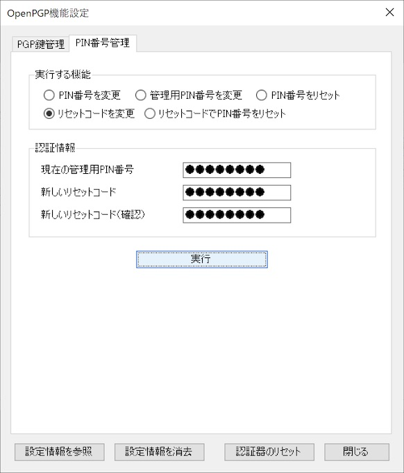

下記のような確認ダイアログが表示されますので、Yesボタンをクリックします。

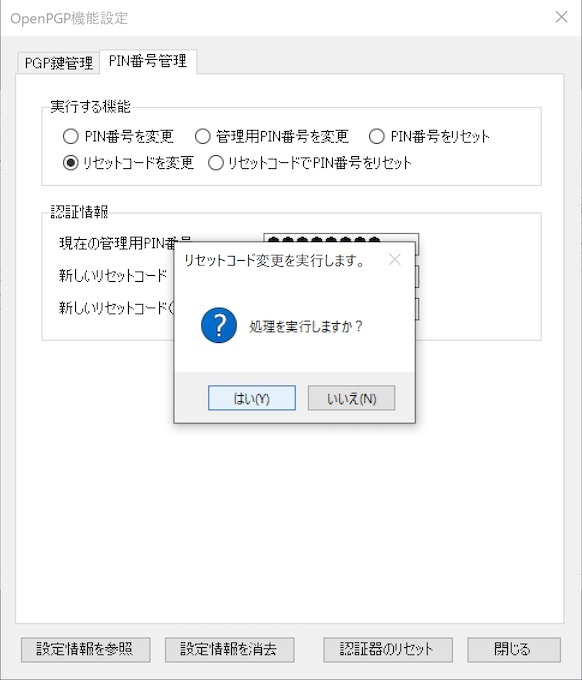

リセットコード変更処理が実行されます。 
程なく、下図のようなメッセージがポップアップ表示され、処理が完了します。

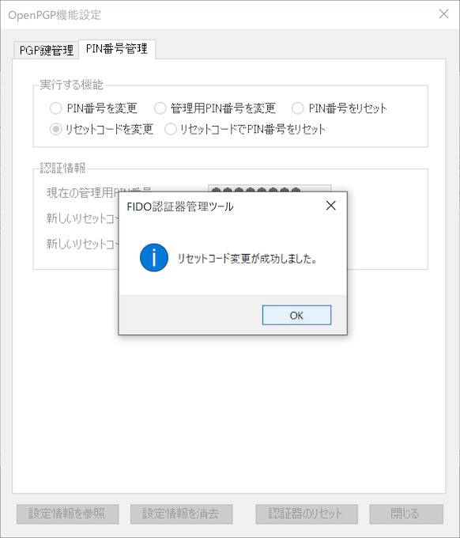

これでリセットコードの変更は完了です。

### リセットコードでPIN番号をリセット

OpenPGP機能において、PIN番号を３回連続で間違えて指定した場合、認証がブロックされ、PIN番号が使えなくなってしまいます。 
「PIN番号のリセット」を実行すると、新しいPIN番号でOpenPGP機能が再び利用できるようになります。

「PIN番号管理」タブのラジオボタン「リセットコードでPIN番号をリセット」を選択します。 
すぐ下にある入力欄「現在のリセットコード」「新しいPIN番号」「新しいPIN番号（確認）」に、それぞれ値を入力したら「実行」ボタンをクリックします。

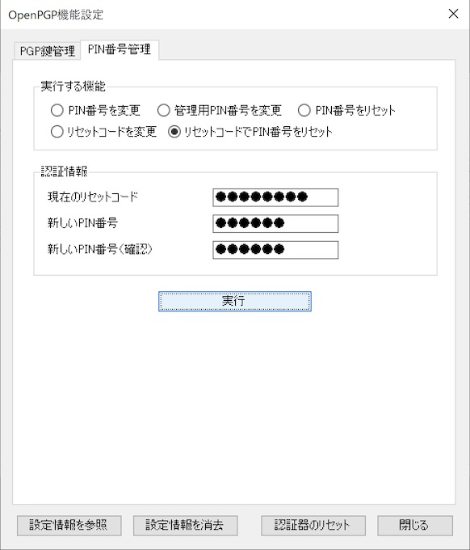

下記のような確認ダイアログが表示されますので、Yesボタンをクリックします。

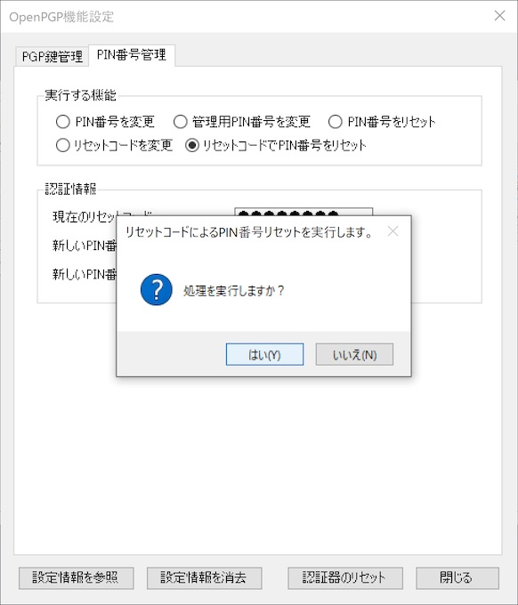

PIN番号リセット処理が実行されます。 
程なく、下図のようなメッセージがポップアップ表示され、処理が完了します。

これで、リセットコードによるPIN番号のリセットは完了です。
