# PIV機能の基本設定手順

最終更新日：2022/8/8

## 概要

[FIDO認証器管理ツール](../../MaintenanceTool/WindowsExe/MNTTOOL.md)を使用して、[BT40 Dongle](../../FIDO2Device/BT40Dongle/README.md)に対し、PIV機能に最低限必要な基本設定を行う手順を掲載します。

## ソフトウェアのバージョン確認

PIV機能は、[CCIDインターフェース](../../CCID/README.md)という仕組みを使用しております。 
この仕組みを使用するためには、管理ツール、ファームウェア共に、必要バージョン以降である必要があります。

#### 管理ツールのバージョン確認
まずは[インストール手順](../../MaintenanceTool/WindowsExe/INSTALLPRG.md)を参照し、管理ツールをWindowsにインストールします。 
次に、下記手順で管理ツールのバージョン確認を行い、<b>Version 0.1.39以降</b>であるかどうか確認します。

管理ツールのユーティリティー画面で「管理ツールのバージョンを参照」をクリックします。

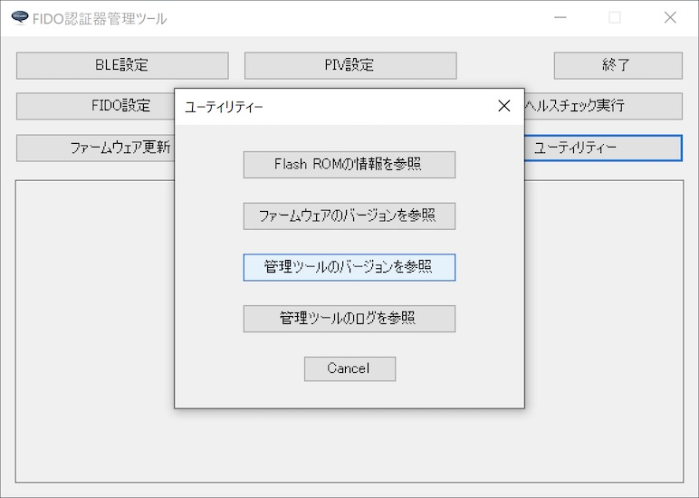

表示される画面で、管理ツールのバージョンを確認してください。 
（下記例では「Version 0.2.0」となっております）

#### ファームウェアのバージョン確認
続いて、下記手順でBT40 Dongleファームウェアのバージョン確認を行い、<b>0.3.4以降</b>であるかどうか確認します。 
BT40 DongleをPCのUSBポートに装着した後、管理ツールのユーティリティー画面で「ファームウェアのバージョンを参照」をクリックします。

管理ツール下部のメッセージ欄に表示される、ファームウェアのバージョンを確認してください。 
（下記例では「0.4.7」となっております）

## PIV機能設定画面の表示

PIV機能の設定は「PIV機能設定画面」上で行います。

まずは管理ツールを起動し、USBポートにBT40 Dongleを装着します。

管理ツール画面下部のメッセージ欄に「USB HIDデバイスに接続されました。」と表示されることを確認したら、管理ツール画面の「PIV設定」ボタンをクリックします。

ホーム画面の上に、PIV機能設定画面がポップアップ表示されます。

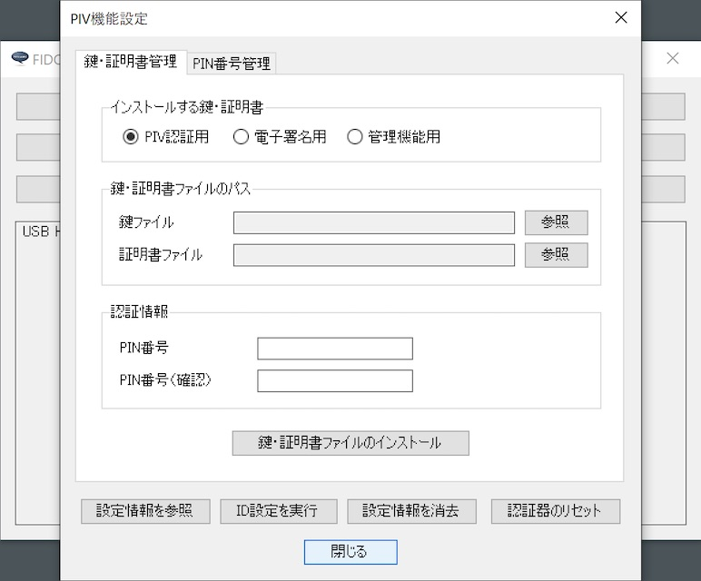

以後の設定作業は、すべてこの「PIV機能設定画面」で実行します。

## 基本設定の実行

PIV機能に最低限必要な基本設定、すなわちID設定、および鍵・証明書ファイルのインストールを実行します。

### ID設定の実行

PIV機能設定画面の「ID設定を実行」ボタンをクリックします。

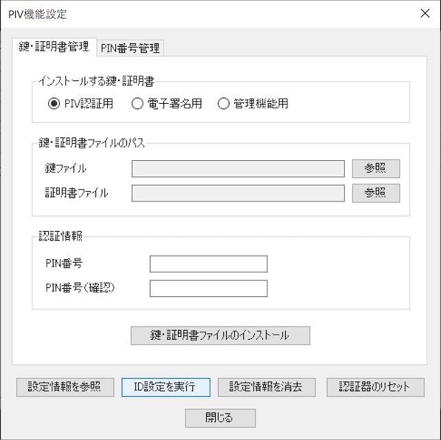

下記のような確認ダイアログが表示されますので、「はい」ボタンをクリックします。

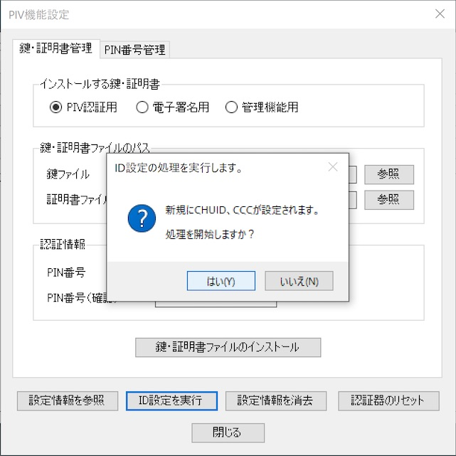

ID設定処理が実行されます。 
程なく、下図のようなメッセージがポップアップ表示され、処理が完了します。

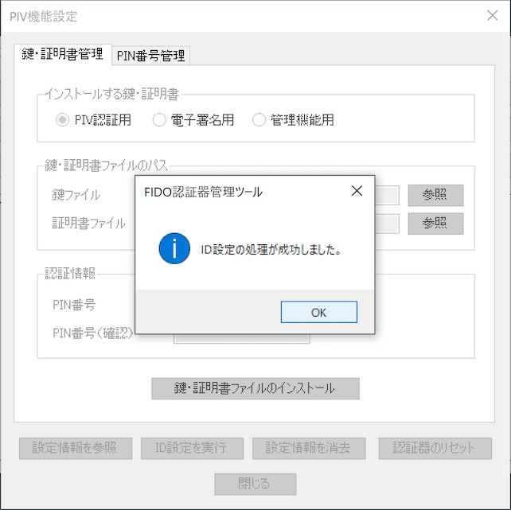

設定されたIDは「PIV設定情報取得画面」で確認できます。 
PIV機能設定画面の「設定情報を参照」ボタンをクリックします。

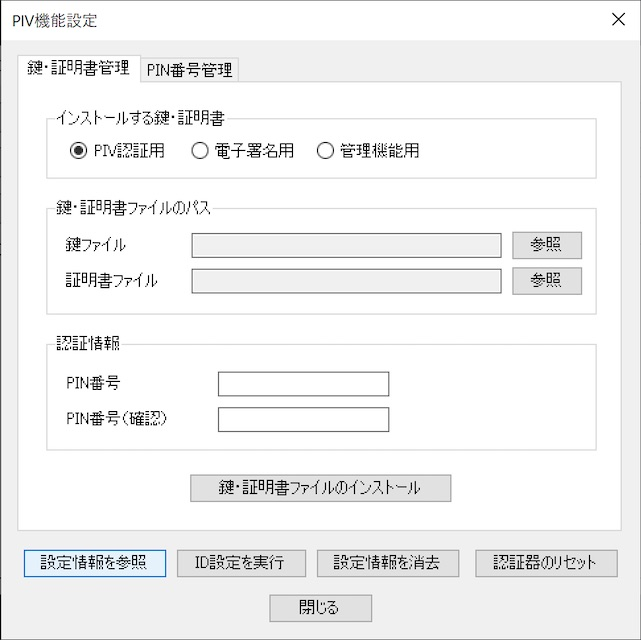

PIV設定情報取得画面に、下図の「CHUID」「CCC」が設定されていることが確認できます。

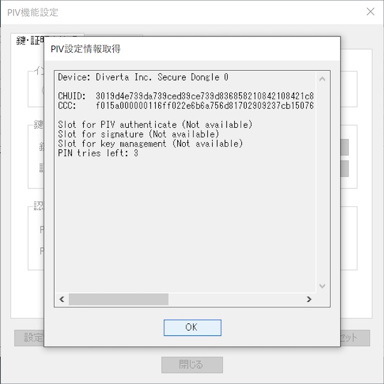

以上で、ID設定の実行は完了です。

### 鍵・証明書ファイルのインストール

PIV機能では、FIDO機能と同様、鍵・証明書ファイルをBT40 Dongleに導入する必要があります。

導入が必要な鍵・証明書は、以下の３セットになります。 
いずれも「PEM形式」の鍵・証明書ファイル（テキストファイル）をご用意ください。

- PIV認証用
- 電子署名用
- 管理機能用

以下の手順により、３セットの鍵・証明書をすべてインストールします。

#### インストール手順

まずはラジオボタンから、インストールする鍵・証明書の種別を選択します。 
その後、鍵ファイルのパスを選択します。

鍵ファイル欄右側の「参照」ボタンをクリックします。

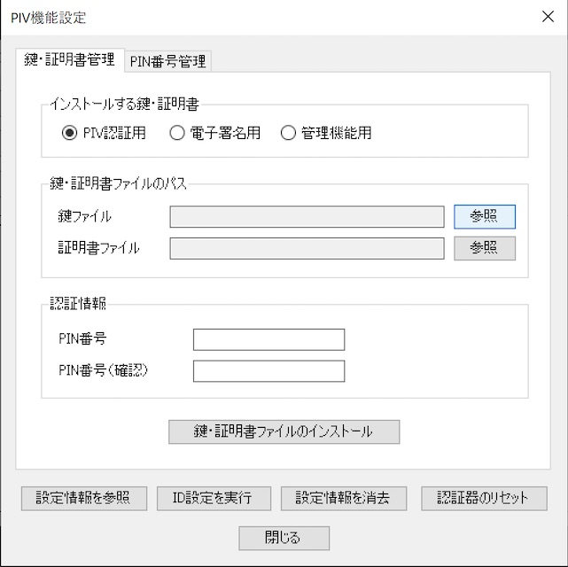

ファイル参照ダイアログから、該当の鍵ファイル（PEM形式）を選択し「選択」ボタンをクリックします。

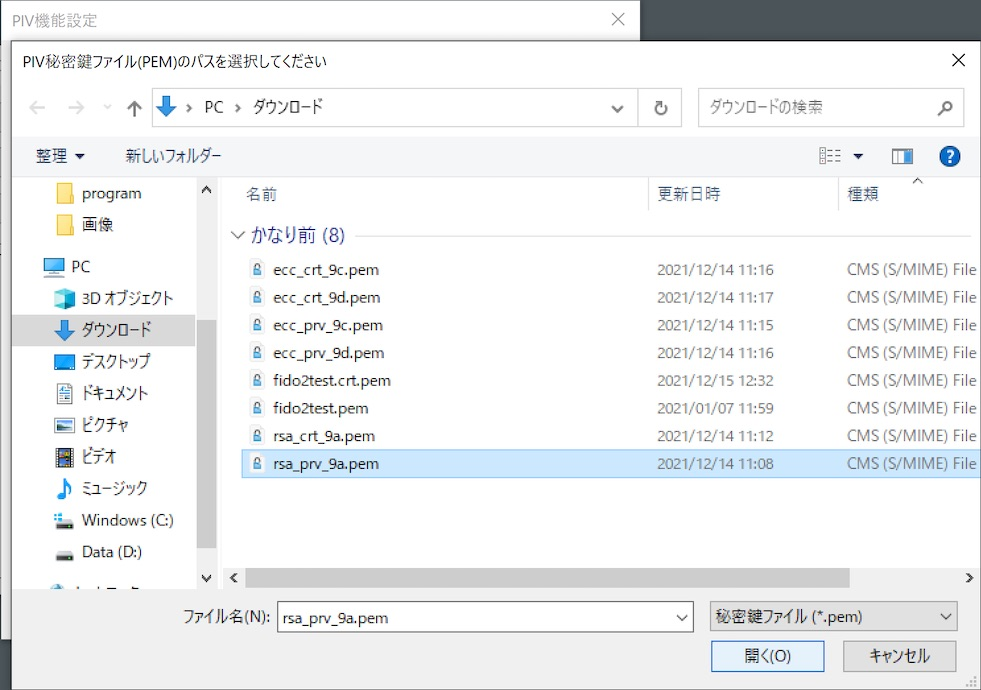

鍵ファイル欄に、選択された鍵ファイルのパスが表示されます。 
（マウスカーソルを上から当てると、下図のようにフルパス名称が小さくToolTip表示されます）

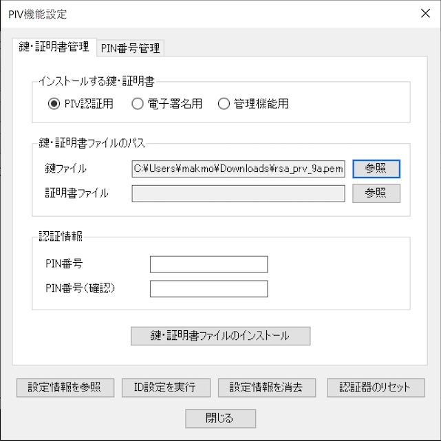

同様に、証明書ファイルのパスも選択します。

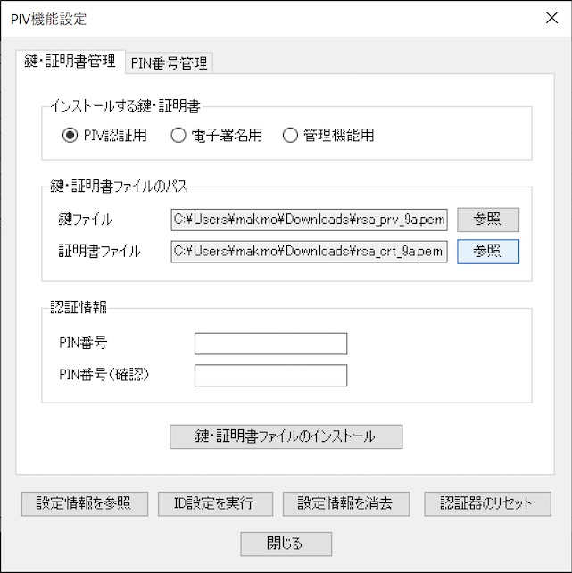

鍵ファイル、証明書ファイルの両方を選択したら、下部の認証情報欄に、PIV機能で使用するPIN番号を入力します。 
PIN番号は初期状態では「123456」となっております（必要に応じ変更可能です）。

PIN番号を入力したら、下部の「鍵・証明書ファイルのインストール」ボタンをクリックします。

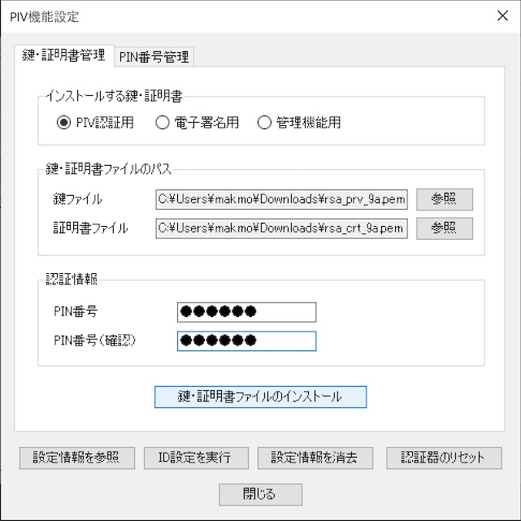

下記のような確認ダイアログが表示されますので、「はい」ボタンをクリックします。

鍵・証明書ファイルのインストール処理が実行されます。 
程なく、下図のようなメッセージがポップアップ表示され、処理が完了します。

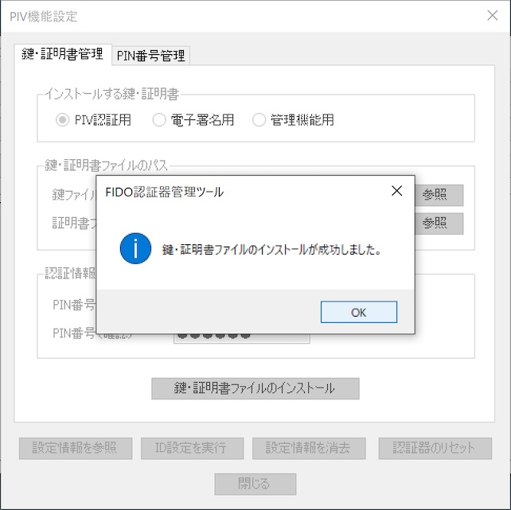

#### 確認手順

インストールされた証明書は「PIV設定情報取得画面」で確認できます。 
PIV設定情報取得画面に、下図の「Slot for PIV authenticate(PIV認証用)」「Slot for signature(電子署名用)」「Slot for key management(管理機能用)」の証明書３点が設定されていることが確認できます。

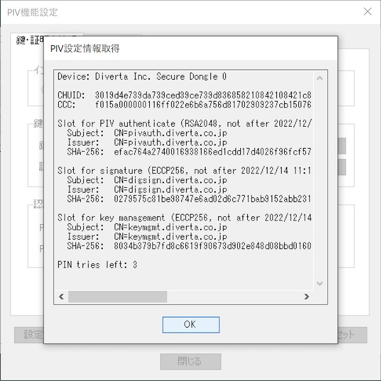

以上で、鍵・証明書ファイルのインストールは完了です。

## その他の各種設定

前項までの手順により、PIV機能に最低限必要な基本設定が完了しますが、その他にもPIN番号変更等のオプション機能を用意しております。 
詳細につきましては、別ドキュメント「[PIV機能の各種設定手順](../../MaintenanceTool/WindowsExe/PIVSETTING_OPT.md)」をご参照願います。
