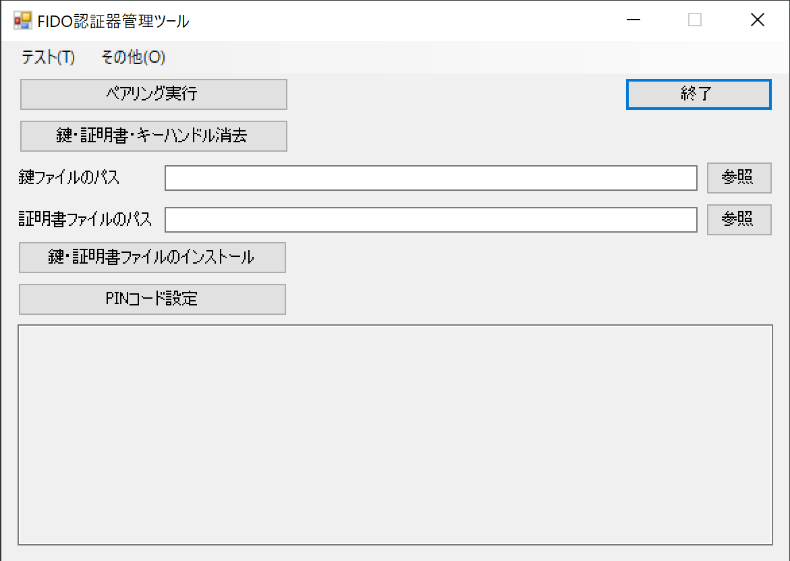
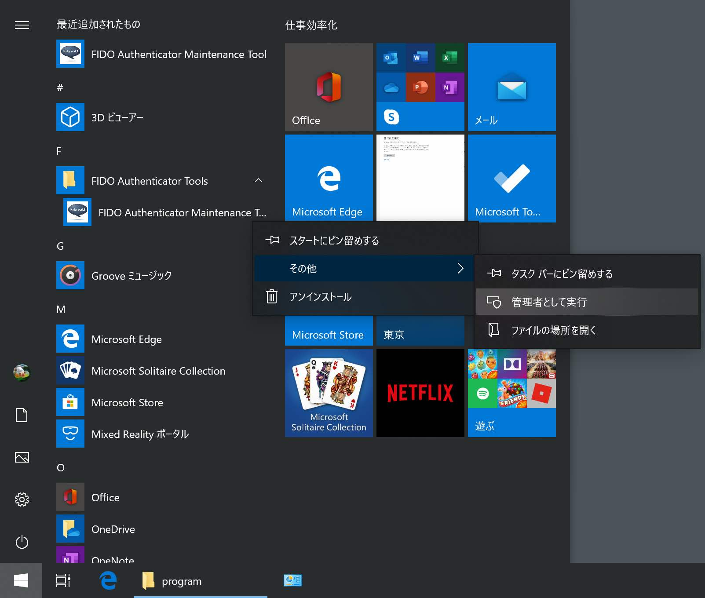

# Windows版 FIDO認証器管理ツール

## 概要
PC環境から、[FIDO認証器](../../nRF5_SDK_v15.3.0)の動作に必要な鍵・証明書の導入などを行うツールです。

### 機能
* ペアリング実行
* 鍵・証明書削除
* 鍵・証明書インストール
* PINコード設定
* CTAP2ヘルスチェック実行
* U2Fヘルスチェック実行
* コマンドテスト機能
* Flash ROM情報取得機能
* バージョン情報取得機能
* 自動認証パラメーター設定機能
* ファームウェア更新機能
* ログファイル格納ディレクトリー参照機能
* 開発時運用機能

### 画面イメージ

### 動作環境
Windows 10（64bit）

### 実行にあたってのご注意

Windows 10の最新バージョン（Windows 10 November 2019 Update）においては、管理者として実行されていないプログラムの場合、FIDOデバイスとの直接的なUSB通信ができない仕様となったようです。 
このため、Windows版管理ツールでは、管理者として実行させる前提としております。

FIDO認証器管理ツールを「管理者として実行」するためには、プログラム「FIDO Authenticator Maintenance Tool」のアイコンを右クリックし、メニューから「管理者として実行」を選択します。

Windows版管理ツールを「管理者として実行」しなかった場合、下記のようなエラーメッセージがポップアップ表示されます。

## 手順書

- <b>[インストール手順](INSTALLPRG.md)</b> 
FIDO認証器管理ツールをWindows環境にインストールする手順を掲載しています。

- <b>[鍵・証明書の導入手順](INSTALLKEYCRT.md)</b> 
FIDO認証器に、鍵・証明書をインストールする手順を掲載しています。

- <b>[PINコードの設定手順](SETPIN.md)</b> 
FIDO認証器に、PINコード（暗証番号）を設定する手順を掲載しています。

- <b>[CTAP2ヘルスチェック実行手順](CTAP2HCHECK.md)</b> 
FIDO認証器のヘルスチェックを実行する手順を掲載しています。

- <b>[自動認証パラメーター設定手順](BLEAUTHPARAM.md)</b> 
[BLE近接認証機能](../../FIDO2Device/MDBT50Q_Dongle/BLEDAUTH.md)の各種パラメーターを設定する手順を掲載しています。

- <b>[ファームウェア更新手順](UPDATEFIRMWARE.md)</b> 
[MDBT50Q Dongle](../../FIDO2Device/MDBT50Q_Dongle/README.md)に対し、管理ツールから、ファームウェアを更新する手順を掲載しています。

- <b>[管理ツールのログファイル](VIEWLOG.md)</b> 
FIDO認証器管理ツールから出力されるログファイルについて説明しています。

## 開発情報（ご参考）

- <b>[VS2017プロジェクトについて](VS2017PROJ.md)</b> 
管理ツール画面プログラム作成用のVisual Studio 2017プロジェクトに設定されている各種情報について掲載します。
