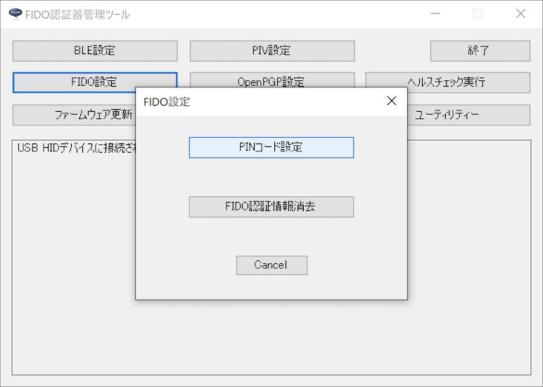
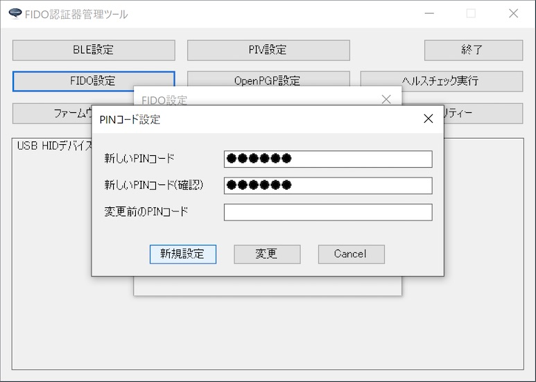
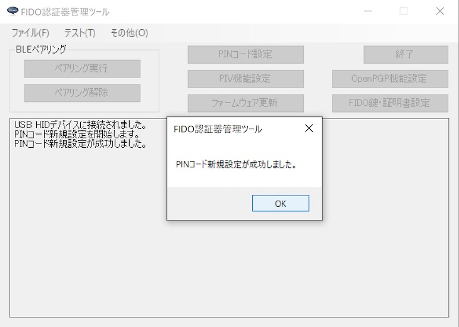
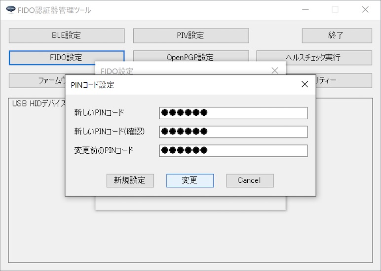
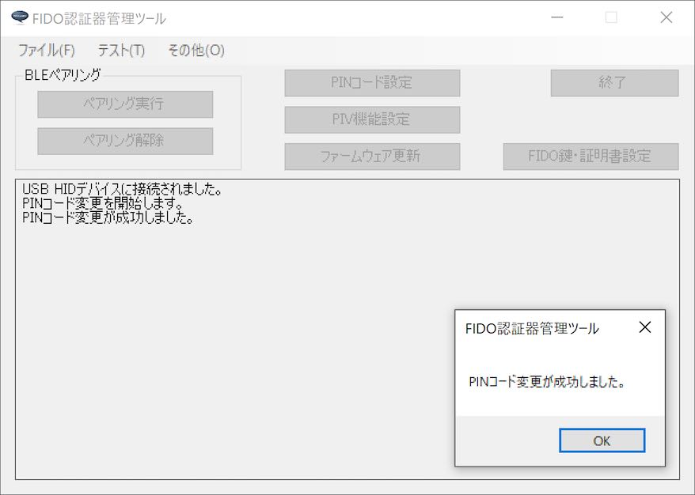

# PINコードの設定手順

## 概要

[FIDO認証器管理ツール](../../MaintenanceTool/WindowsExe/MNTTOOL.md)を使用して、FIDO認証器にPINコード（暗証番号）を設定する手順を掲載します。

## 認証器の準備

#### 使用機材

本ドキュメントでは「[BT40 Dongle](../../FIDO2Device/BT40Dongle/README.md)」を、FIDO2認証器として使用します。

#### 管理ツールを導入

[FIDO認証器管理ツール](../../MaintenanceTool/README.md)を、PC環境（Windows）に導入します。 
以下の手順書をご参照願います。

* <b>[インストール手順（Windows版）](INSTALLPRG.md) </b>

## PINコードの設定

管理ツールにより、PINコード（暗証番号）の新規設定と変更ができます。

### PINコードの新規設定

管理ツールを起動し、USBポートにFIDO2認証器を装着します。

管理ツール画面下部のメッセージ欄に「USB HIDデバイスに接続されました。」と表示されることを確認したら、管理ツールのFIDO設定画面で「PINコード設定」ボタンをクリックします。

「PINコード設定」画面がポップアップ表示されます。

「新しいPINコード」欄に、今回使用するPINコード（暗証番号）を半角数字で入力します。 
その下の「新しいPINコード(確認)」欄にも、同じ値を半角数字で入力します。 
その後「新規設定」ボタンをクリックします。

画面上に入力されたPINコードが、認証器に登録されます。 
程なく、下図のようなポップアップ画面が表示され、処理が完了します。

これで、PINコードの新規設定は完了です。

### PINコードの変更

いったん設定されたPINコードを変更したい場合は、新規設定時と同様「PINコード設定」ボタンをクリックます。

「PINコード設定」画面がポップアップ表示されます。

「新しいPINコード」欄に、変更後のPINコード（暗証番号）を半角数字で入力します。 
その下の「新しいPINコード(確認)」欄にも、同じく変更後のPINコードを半角数字で入力します。 
最後に「変更前のPINコード」欄に、変更前のPINコードを半角数字で入力します。 
その後「変更」ボタンをクリックします。

画面上に入力された変更後のPINコードが、認証器に登録されます。 
程なく、下図のようなポップアップ画面が表示され、処理が完了します。

これで、PINコードの変更は完了です。
