# ファームウェア更新手順（BLE）

## 概要

[FIDO認証器管理ツール](README.md)を使用し、[MDBT50Q Dongle](../../FIDO2Device/MDBT50Q_Dongle/README.md)のファームウェアを更新する手順を掲載します。

#### ご注意

バージョン`0.4.0`以降のファームウェアは、全てBLE経由でのファームウェア更新となります。[注1]

MDBT50Q Dongleをご使用の場合は、背面にあるボタン電池ケースに電池をセットし、BLEペリフェラル・モードで起動されていることをご確認ください。 
（MDBT50Q Dongleの青色LEDが点滅していることを確認します）

[注1] バージョン`0.4.0`以降のファームウェアは、[Zephyr](https://docs.zephyrproject.org/latest/index.html)という共通プラットフォームを使用して開発されています。[Zephyrでのファームウェア更新](https://docs.zephyrproject.org/latest/guides/device_mgmt/mcumgr.html)は、BLE経由、またはLinuxのコマンドライン（Serial／UDP）経由しか存在しないため、一般的と考えられるBLE経由のファームウェア更新を、本プロジェクトでは採用することとしました。

## 操作方法

[管理ツール（Windows版）](../../MaintenanceTool/WindowsExe/README.md)を起動し、画面の「ファームウェア更新」ボタンをクリックします。

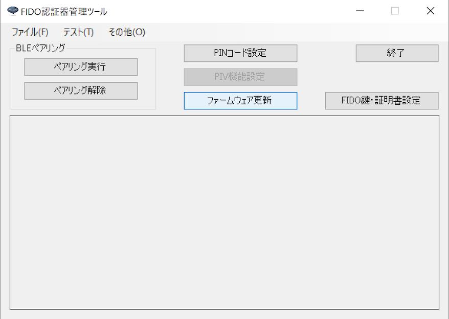

ファームウェア更新画面が表示されます。 
画面下部のボックス「nRF5340用」の中にあるボタン「ファームウェアを更新（BLE）」をクリックします。

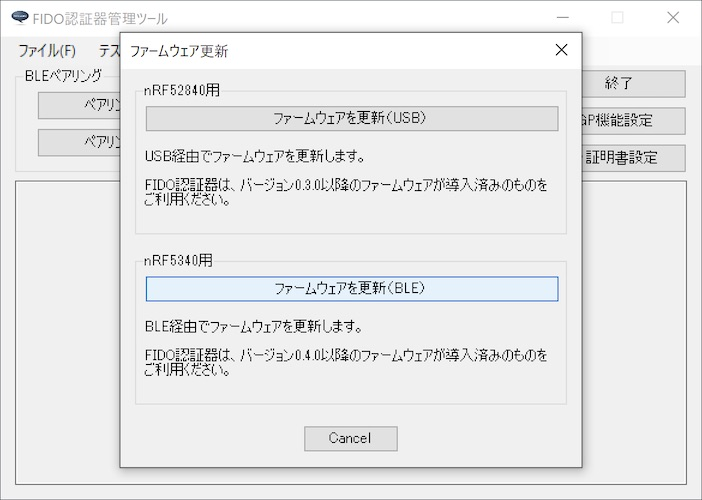

確認ダイアログが表示されます。 
処理を続行したい場合は「はい」をクリックします。

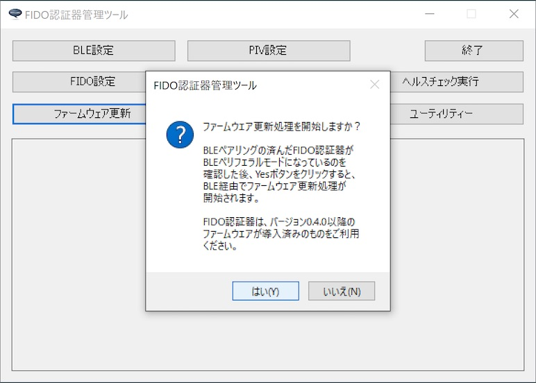

処理開始画面が表示されます。 
MDBT50Q Dongleに導入されているファームウェアのバージョンと、更新するバージョンが表示されます。

ほどなく、現在の進捗を示すダイアログが表示されます。 
まずはファームウェア更新イメージが転送中であることを知らせています。

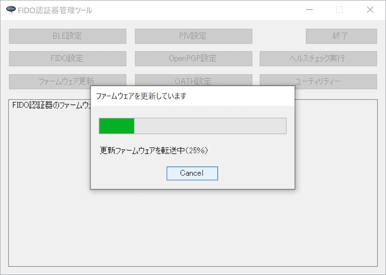

次に、MDBT50Q Dongle内で、転送されたファームウェア更新イメージが反映中であることを知らせています。

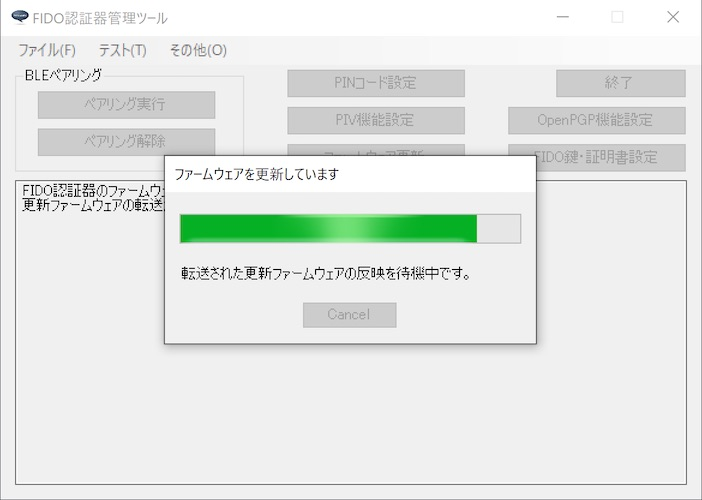

ファームウェア更新処理が正常終了すると、下図のようなポップアップが表示され、処理が成功したことを知らせます。

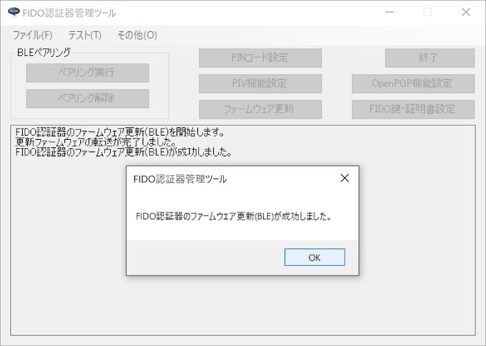

以上で、ファームウェア更新処理は完了となります。

## 転送処理の中断

ファームウェア更新イメージの転送処理中に、Cancelボタンクリックにより転送処理を中断させることができます。 
下図のように、Cancelボタンがクリック可能（グレーアウトされていない状態）になっている時に、Cancelボタンをクリックします。

ファームウェア更新イメージの転送処理が中止され、下図のようなメッセージが表示されます。

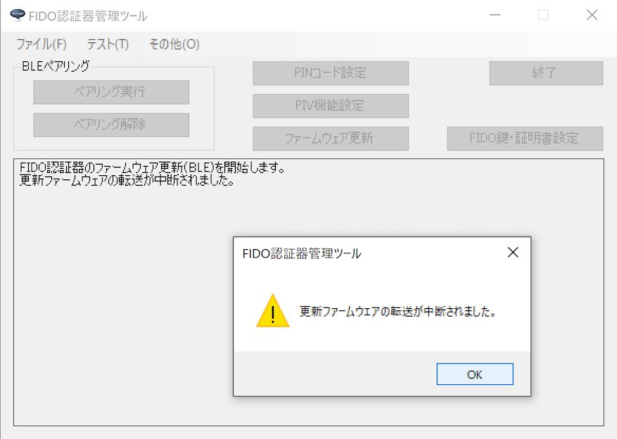

#### ご参考

転送処理の中止後、再度ファームウェア更新を実行した際、転送されたデータに途中欠落がないとファームウェア側が判断した場合は、転送中止されるまでに転送された部分は再転送不要となります。 
例えば前述のように、ファームウェア更新イメージ全体の20%まで転送が済んでいる場合は、20%までの部分については転送が行われず、それ以降の部分について転送されることになります。

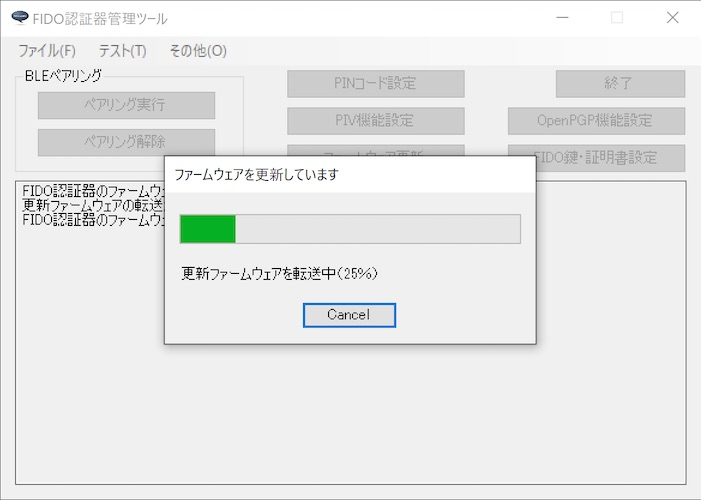

## エラーとなるケース

#### 同じバージョンのファームウェアが導入済みの場合

下図のように、既にファームウェア更新イメージが導入済みの場合は、ファームウェア更新処理が失敗します。

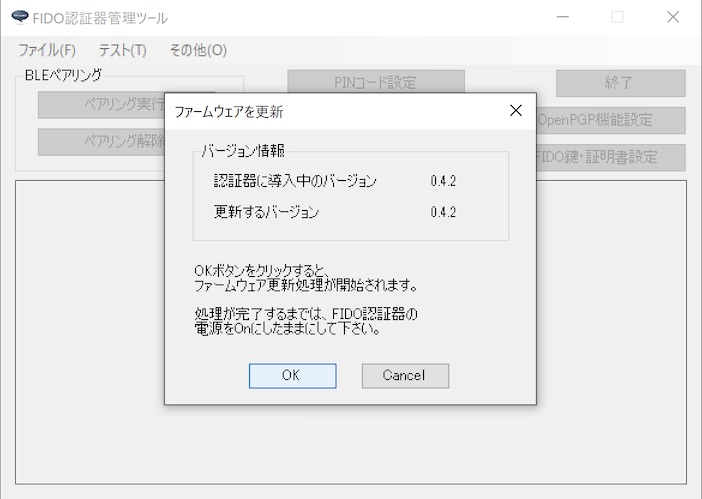

処理失敗時は下図のようなメッセージが表示されます。

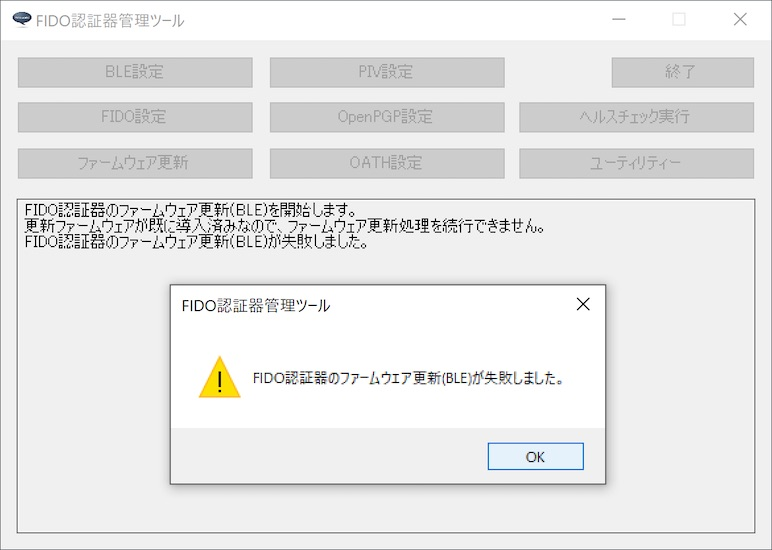

#### 古いバージョンのファームウェアを導入しようとした場合

現在導入されているバージョンより古いファームウェアを導入しようとした場合は、ファームウェア更新処理が失敗します。 
処理失敗時は下図のようなメッセージが表示されます。

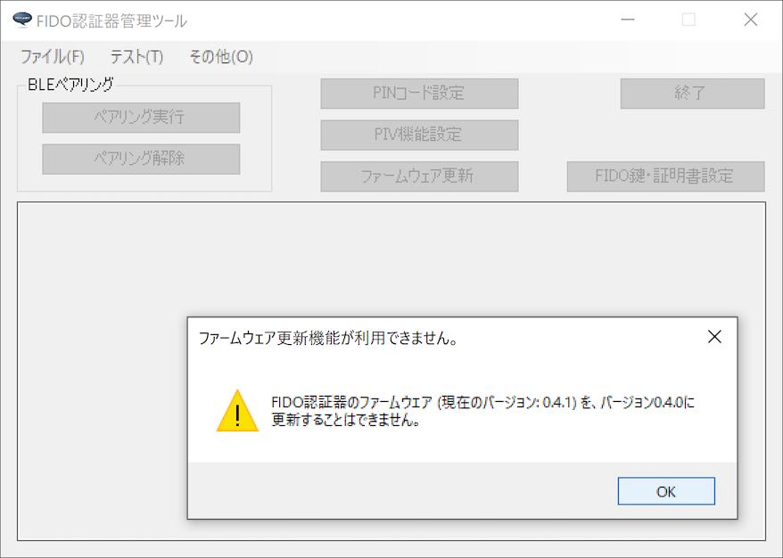
