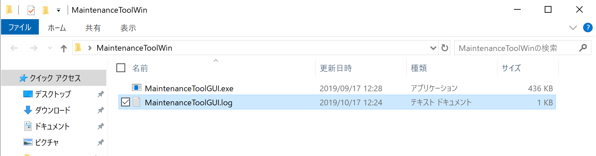

# ログ参照手順

## 概要
FIDO認証器管理ツールから出力されるログを参照する手順を掲載します。

## ログファイルの生成場所

Windows版 FIDO認証器管理ツールの実行中に出力されるログは、ファイル「`MaintenanceToolGUI.log`」に書き出されます。

ログファイル「`MaintenanceToolGUI.log`」は、Windows版 FIDO認証器管理ツールの実行可能ファイル「`MaintenanceToolGUI.exe`」と同じディレクトリーに生成されます。

## ログファイルの参照

ログファイル「`MaintenanceToolGUI.log`」をダブルクリックして開きます。 
（または適宜Windowsにインストールされたテキストエディターを使って開きます）

下図のようなログが出力されていることを確認します。

