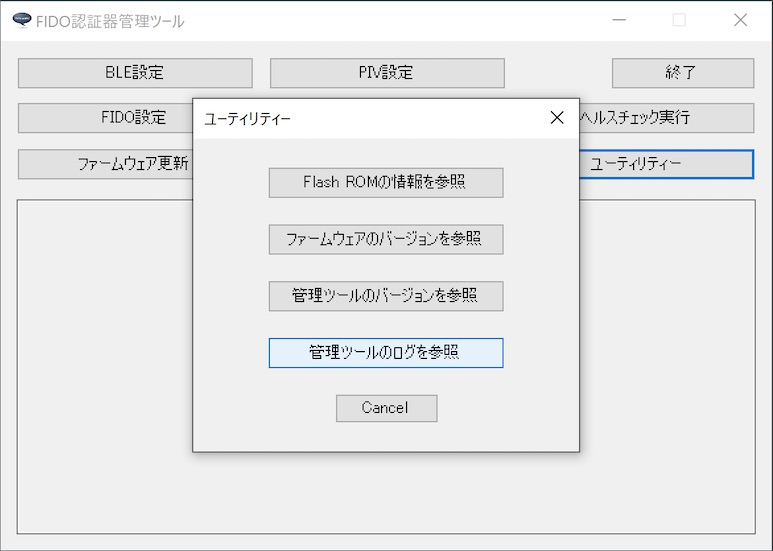
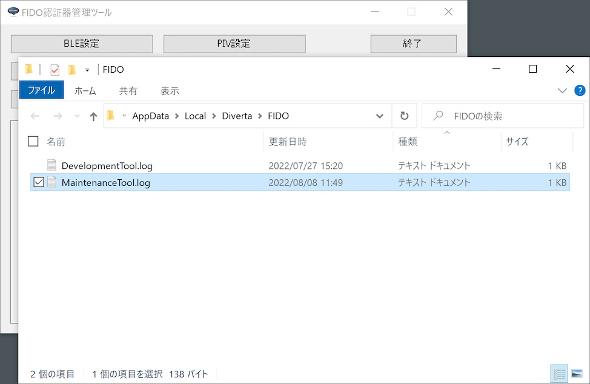

# 管理ツールのログファイル

## 概要
FIDO認証器管理ツールから出力されるログファイルについて説明します。

## ログファイルの場所

FIDO認証器管理ツールの実行中に出力されるログは、Windowsのユーザーディレクトリー配下のログファイル（下記の場所）に保存されます。

`%LOCALAPPDATA%\Diverta\FIDO\MaintenanceTool.log`

具体的には、例えば `C:\Users\user\AppData\Local\Diverta\FIDO\MaintenanceTool.log` といったパスになります。

### ログファイルの場所を開く

ログファイルの格納場所を、Windowsのエクスプローラで開くことができます。<br>
下図のメニュー「管理ツールのログを参照」を選択します。



ログファイル「MaintenanceTool.log」を格納するディレクトリーが、Windowsのエクスプローラで表示されます。



ログファイルは通常のテキストファイルですので、適宜、テキストエディターにより内容を参照することが可能です。

## ログファイルの内容

Windowsアプリの一般的な形式で出力されます。<br>
ログの出力イメージは以下のようになります。
```
2019/11/19 13:05:26 [info] FIDO認証器管理ツールを起動しました: Version 0.1.21
2019/11/19 13:05:26 [info] USBデバイス検知を開始しました。
2019/11/19 13:05:26 [info] USB HIDデバイスに接続されました。\\?\hid#vid_f055&pid_0001&mi_00#7&1436d563&0&0000#{4d1e55b2-f16f-11cf-88cb-001111000030}
2019/11/19 13:05:32 [info] HID PINGテストを開始します。
2019/11/19 13:05:32 [debug] HID Sent INIT frame: data size=8 length=8
ff ff ff ff 86 00 08 73 be e8 55 00 0f 62 06
2019/11/19 13:05:32 [debug] HID Recv INIT frame: data size=17 length=17
ff ff ff ff 86 00 11 73 be e8 55 00 0f 62 06 01
00 33 1c 02 05 00 02 07
2019/11/19 13:05:32 [debug] HID Sent INIT frame: data size=100 length=57
01 00 33 1c 81 00 64 70 98 9a dc c2 47 48 62 87
44 63 ef 81 e6 f4 6a d0 2a d9 fa 3b 10 0d 08 cf
14 37 88 07 c4 57 88 6e e4 93 e0 e3 db 74 76 b5
91 4f 4b 35 26 7b 77 a2 3a d8 eb f0 d8 80 60 8b
2019/11/19 13:05:32 [debug] HID Sent CONT frame: data seq=0 length=43
01 00 33 1c 00 92 0c ae 10 bf 5b c2 ed db 80 9d
52 14 86 f5 b6 63 45 a9 c0 c2 d2 a9 98 c0 e6 cc
ec 6b 98 96 63 33 55 50 cf c5 65 f5 36 8c 5e 59
2019/11/19 13:05:32 [debug] HID Recv INIT frame: data size=100 length=57
01 00 33 1c 81 00 64 70 98 9a dc c2 47 48 62 87
44 63 ef 81 e6 f4 6a d0 2a d9 fa 3b 10 0d 08 cf
14 37 88 07 c4 57 88 6e e4 93 e0 e3 db 74 76 b5
91 4f 4b 35 26 7b 77 a2 3a d8 eb f0 d8 80 60 8b
2019/11/19 13:05:32 [debug] HID Recv CONT frame: seq=0 length=43
01 00 33 1c 00 92 0c ae 10 bf 5b c2 ed db 80 9d
52 14 86 f5 b6 63 45 a9 c0 c2 d2 a9 98 c0 e6 cc
ec 6b 98 96 63 33 55 50 cf c5 65 f5 36 8c 5e 59
2019/11/19 13:05:32 [info] HID PINGテストが成功しました。
2019/11/19 13:05:35 [info] USBデバイス検知を終了しました。
2019/11/19 13:05:35 [info] FIDO認証器管理ツールを終了しました
```
