# VS2017プロジェクトについて

## 概要

管理ツール画面（`MaintenanceToolGUI.exe`）は、Visual Studio 2017を使用してビルドしています。

ここでは、Visual Studio 2017プロジェクトに設定されている各種情報について掲載します。

- プロジェクト・プロパティ
- リソースファイル
- インストーラー作成用プロジェクト

### プロジェクト・プロパティ

プロジェクト「`MaintenanceToolGUI`」は、管理ツール画面プログラム（`MaintenanceToolGUI.exe`）を生成するためのプロジェクトです。<br>
こちらに設定されているプロジェクト・プロパティは下記の通りになります。

<b>アプリケーション</b><br>
現状、仮のアイコンファイル`favicon.ico`を設定しています。<br>
変更時は適宜差し替えます。

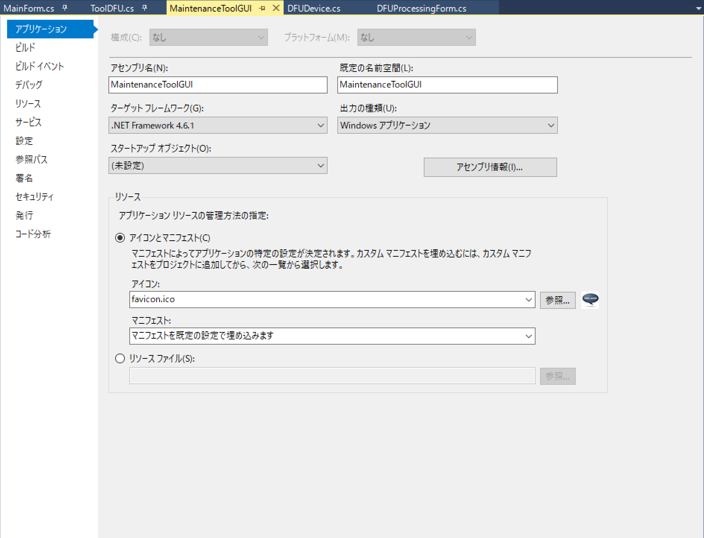

アイコンファイルは、128 x 128ピクセルのビットマップです。

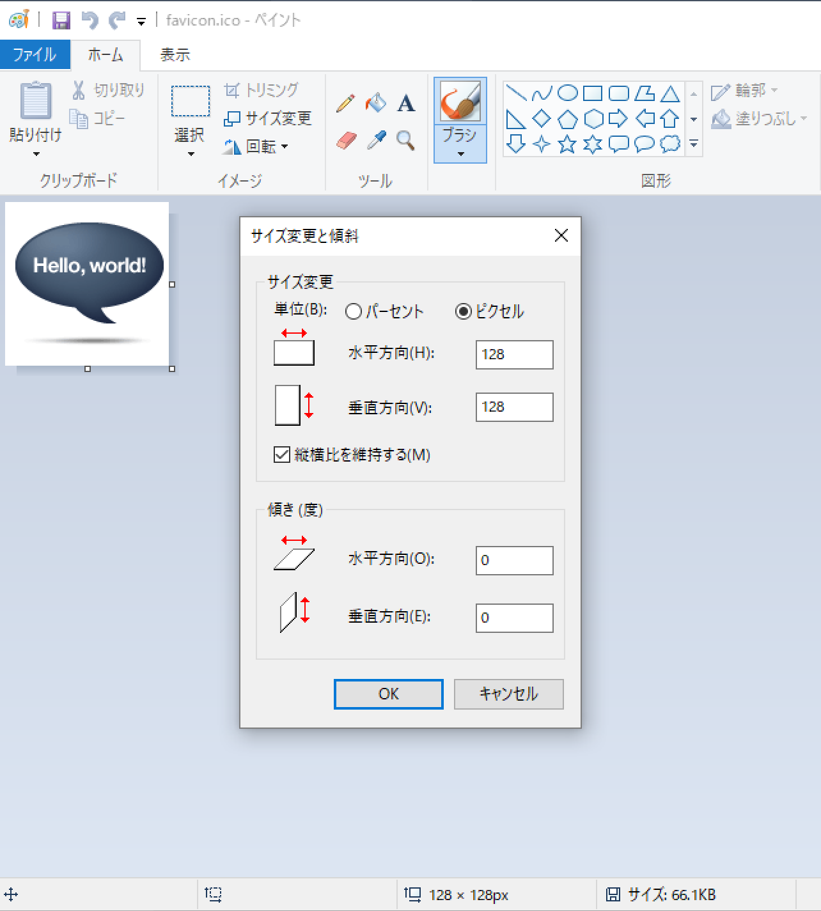


<b>アセンブリ情報</b><br>
ツール設定画面のバージョンタブに表示される情報は、こちらで管理しております。<br>
バージョン更改時に変更します。

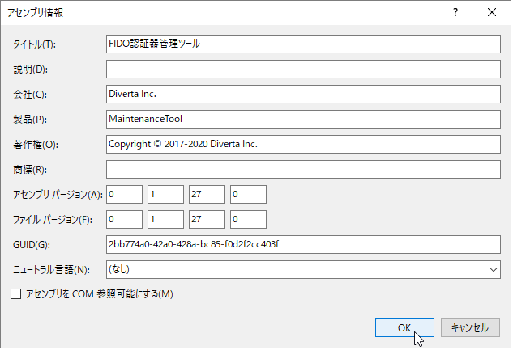

<b>ビルド</b><br>
プラットフォームターゲットを64ビット（x64）としております。

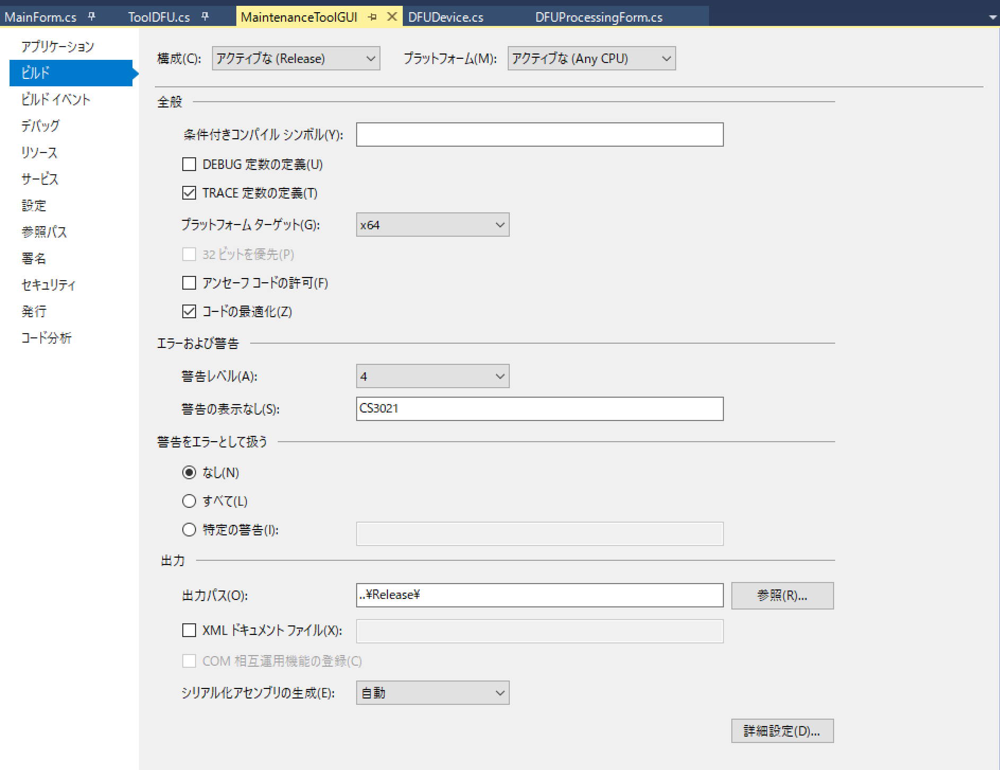

上記以外のプロパティはデフォルトのままとしております。

### リソースファイル

管理ツールには、FIDO認証器のファームウェア更新イメージファイル（app_dfu_package.<バージョン番号>.zip）が同梱されています。<br>
このファイルは、ソリューションエクスプローラーの「Resources」フォルダー配下に格納しています。

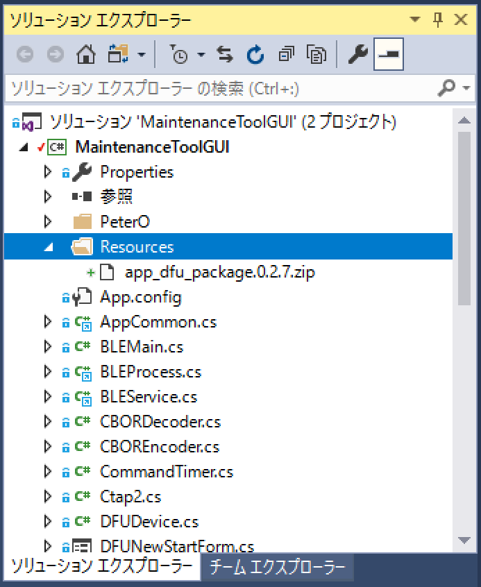

以下、格納方法について記載します。<br>
まずはファームウェア更新イメージファイルを、Windowsエクスプローラーを使い、所定の位置（下記の物理パス）に格納します。

```
<GitHubリポジトリールート>\MaintenanceTool\WindowsExe\MaintenanceToolGUI\MaintenanceToolGUI\Resources
```

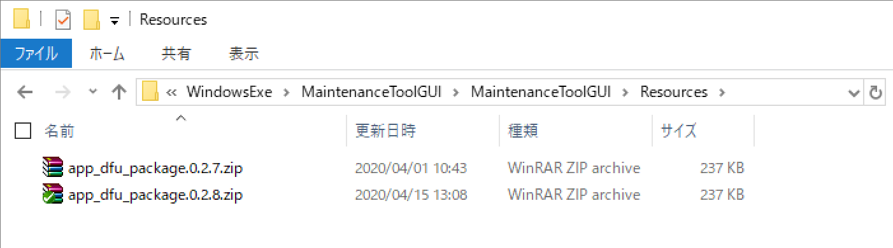

ソリューションエクスプローラーの「Resources」フォルダーを右クリックし、メニュー「追加-->既存の項目」を選択します。

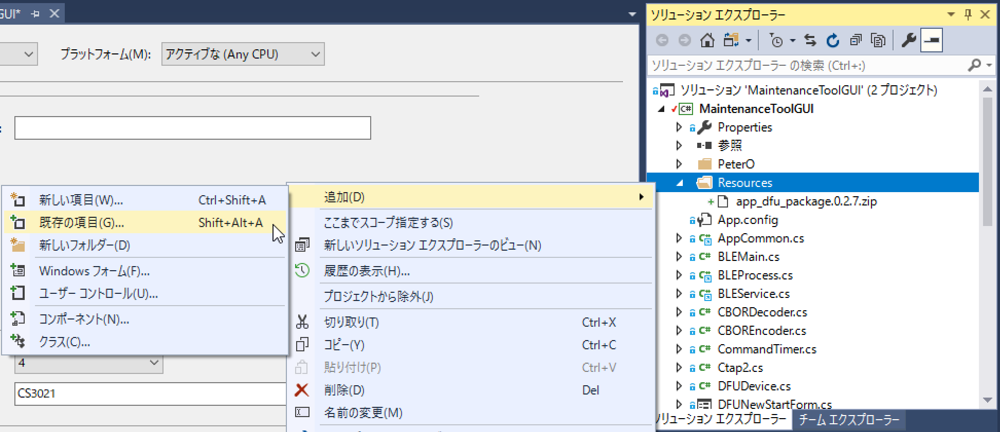

格納したいファームウェア更新イメージファイルを選択し、画面下部の「追加」をクリックします。

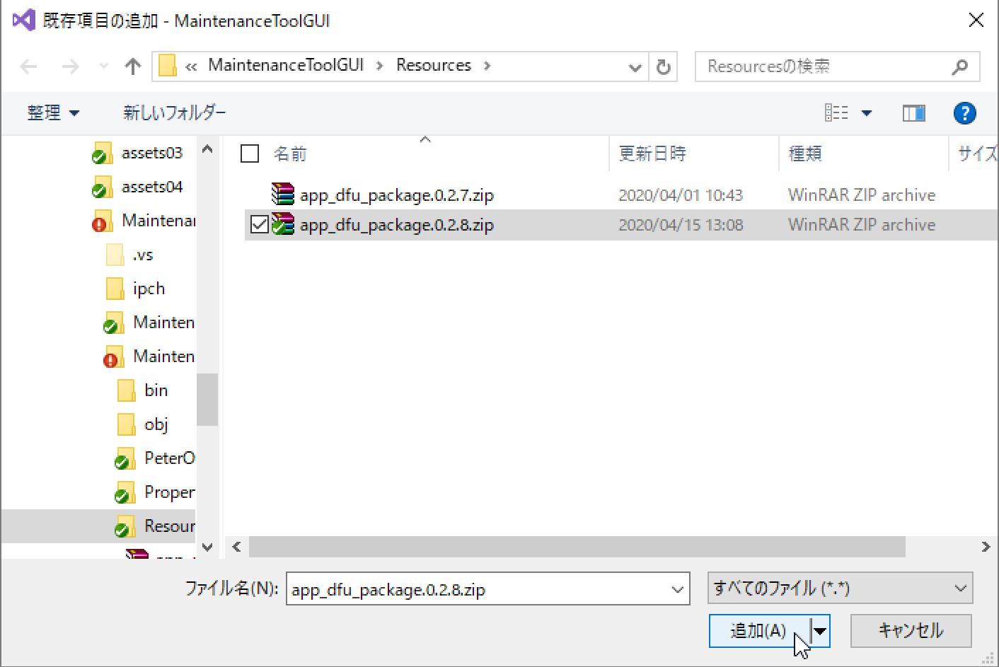

ソリューションエクスプローラーにファイルが追加されたのを確認したら、下部プロパティで<b>「ビルドアクション」を「埋め込みリソース」に変更</b>します。

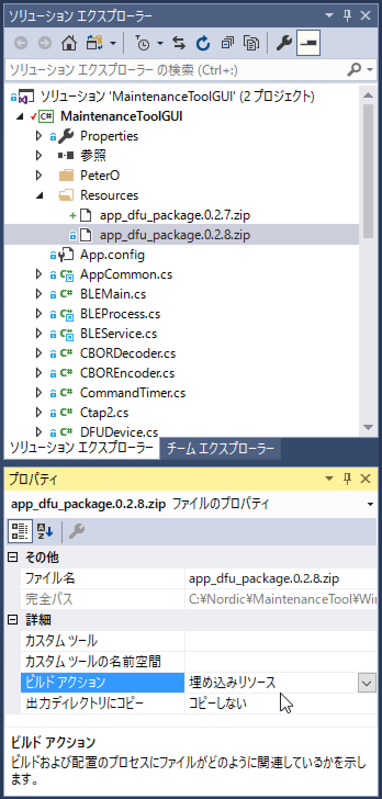

不要となったファイルは、適宜ソリューションエクスプローラーから削除します。<br>
ファイルを選択し、メニュー「削除」を実行します。

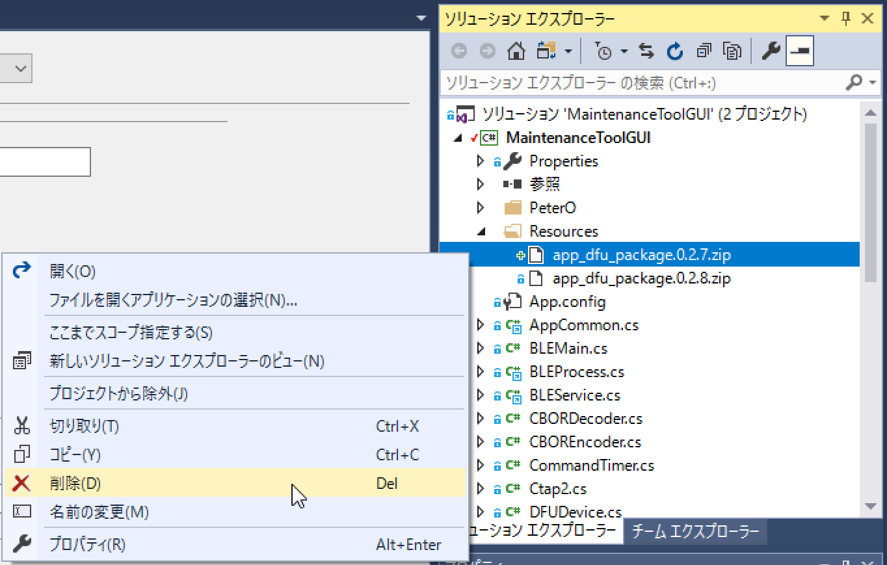

削除が完了したら、プロジェクトプロパティを保存します。<br>
（タブ「MaintenanceToolGUI」の右上の * 文字が消えていることを確認します）

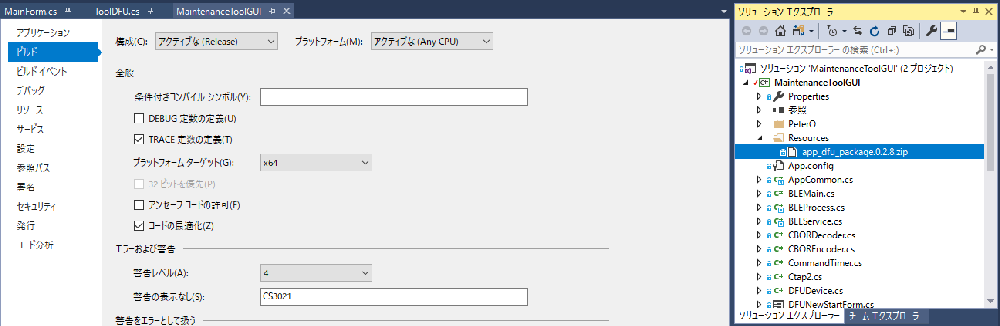

これで、リソースファイルの格納は完了です。

### インストーラー作成用プロジェクト

プロジェクト「`SetupWizard`」は、管理ツールのインストール用プログラム（`SetupWizard.msi`）を自動生成するためのプロジェクトです。

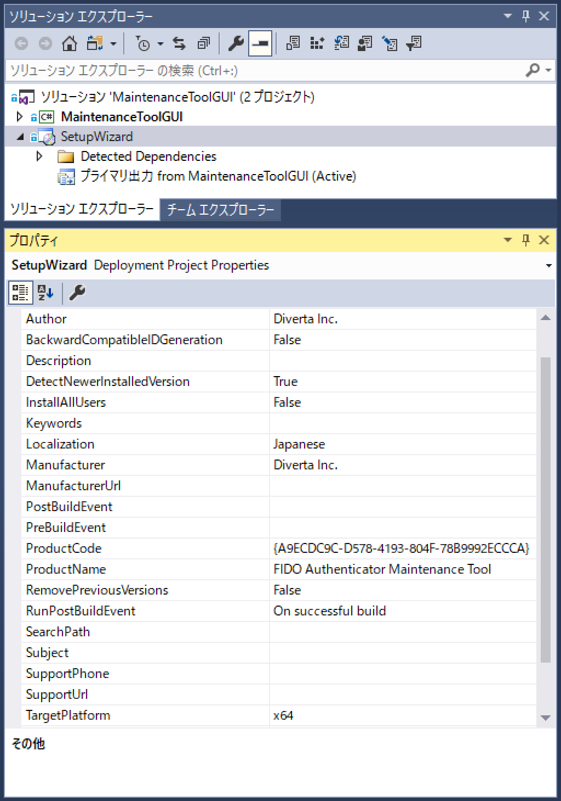

出力先は、あらかじめ下図のようなプロジェクト・プロパティ画面で、下記の物理パスになるよう設定しています。

```
<GitHubリポジトリールート>\MaintenanceTool\WindowsExe\MaintenanceToolWin\SetupWizard.msi
```

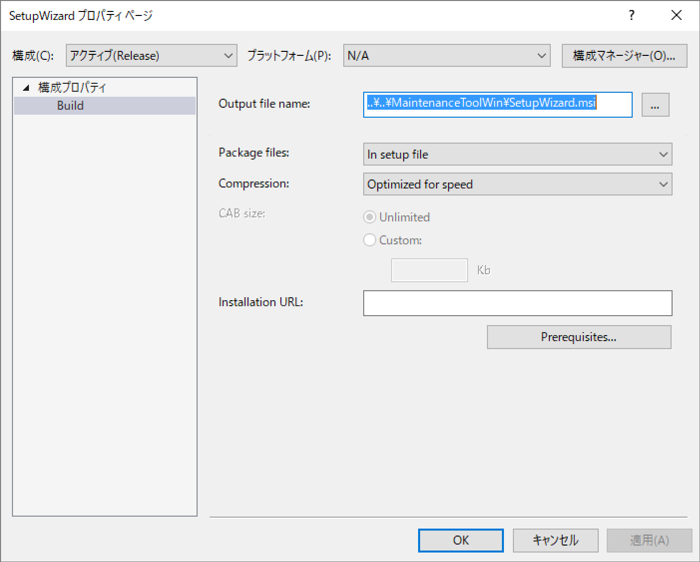

プロジェクト「`SetupWizard`」をビルドすると、下図のように、管理ツールのインストール用ファイルが２本作成されます。<br>
GitHubリポジトリーには、この２本を圧縮したファイルを、下記の物理パスに配置しております。

```
<GitHubリポジトリールート>\MaintenanceTool\WindowsExe\MaintenanceToolWin.zip
```
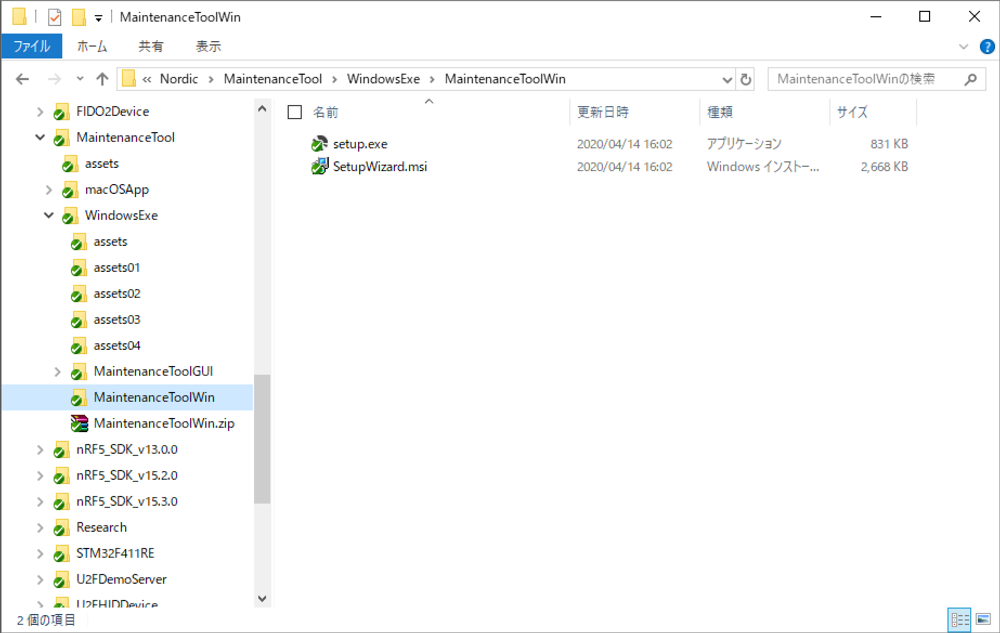
