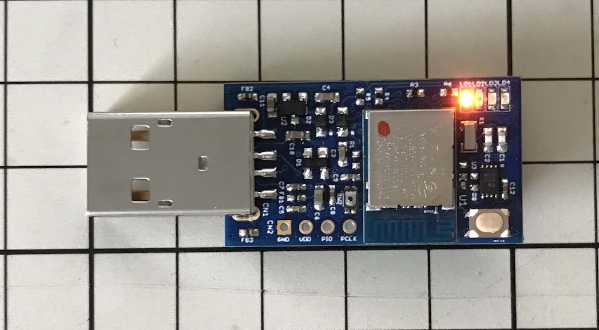
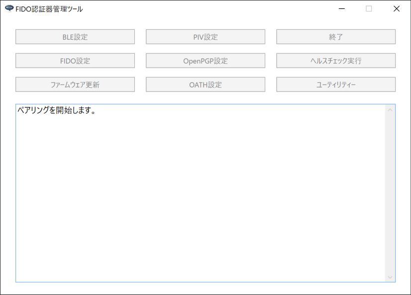
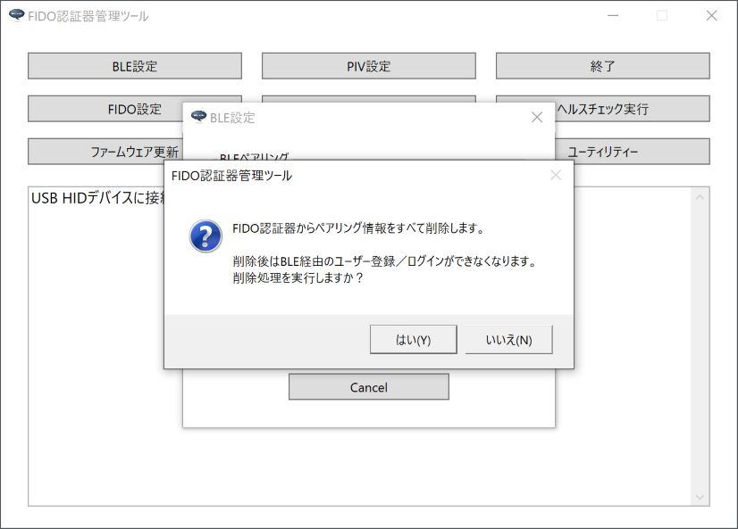

# BLEペアリング手順

## 概要

[FIDO認証器管理ツール](../../MaintenanceTool/dotNET/MNTTOOL.md)を使用し、PCとFIDO認証器をBLEペアリングする手順について掲載しています。

#### 使用機材

本ドキュメントでは「[MDBT50Q Dongle](../../FIDO2Device/MDBT50Q_Dongle/README.md)」を、FIDO2認証器として使用します。

まずは、背面にあるボタン電池ケースに電池をセットし、BLEペリフェラル・モードで起動されていることをご確認ください。 
（MDBT50Q Dongleの青色LEDが点滅していることを確認します）

## ペアリングの実行

PCとFIDO認証器をBLEペアリングします。

#### ペアリング設定の事前削除

もし、PC側にペアリング相手のFIDO認証器のペアリング設定が存在する場合は、ペアリング実行前に必ず削除してください。

PCのBluetooth設定画面を開き、ペアリング設定を削除します。

確認ダイアログが表示されますので、続行するには「はい」をクリックします。

ペアリング相手のFIDO認証器のペアリング設定が削除されたことを確認します。

#### ペアリングモードに遷移

ペアリング相手のFIDO認証器を、ペアリングモードに遷移させます。 
基板上のボタンを３秒以上長押してから離すと、下図のように基板上の橙色LEDが点灯します。

これで、FIDO認証器がペアリングモードに遷移しました。

#### ペアリングの実行

管理ツールを起動し、BLE設定画面の「ペアリング実行」ボタンをクリックします。

ペアリング実行画面がポップアップ表示されます。

MDBT50Q Dongleとペアリングを行うためには、パスコードは不要です。 
画面上部のグループ内にある「ペアリングを実行する」ボタンをクリックします。

ペアリング処理が開始されますので、そのまま待ちます。

ペアリング処理が正常終了すると、下図のようなポップアップが表示され、処理が成功したことを知らせます。

#### BLE接続を確認

BLE PINGを実行し、PCとFIDO認証器がBLE接続できることを確認します。 

管理ツールのヘルスチェック実行画面で「BLE > PINGテスト実行」をクリックすると、BLE PING（BLE接続テスト）処理が開始されます。

BLE PING処理が正常終了すると、下図のようなポップアップが表示され、処理が成功したことを知らせます。

以上で、BLEペアリングの実行は完了となります。

## BLEペアリング情報の削除

PCとFIDO認証器のペアリングが不要となった場合は、USBに接続し、認証器上のペアリング情報を削除する必要があります。

#### 認証器上のペアリング情報を削除

管理ツールを起動し、USBポートにMDBT50Q Dongleを装着します。 
管理ツール画面下部のメッセージ欄に「USB HIDデバイスに接続されました。」と表示されることを確認したら、BLE設定画面の「ペアリング情報削除」ボタンをクリックします。

確認ダイアログが表示されます。 
処理を続行したい場合は「はい」をクリックします。

ペアリング情報削除処理が正常終了すると、下図のようなポップアップが表示され、処理が成功したことを知らせます。

#### PC上のペアリング設定を削除

認証器上のペアリング情報削除により、不要になったPC上のペアリング設定は、PCの環境設定から削除します。 
PCのBluetooth設定画面を開き、ペアリング設定を削除します。

確認ダイアログが表示されますので、続行するには「はい」をクリックします。

ペアリング情報を削除したFIDO認証器とのペアリング設定が、環境設定から削除されたことを確認します。

以上で、BLEペアリング情報の削除は完了となります。
