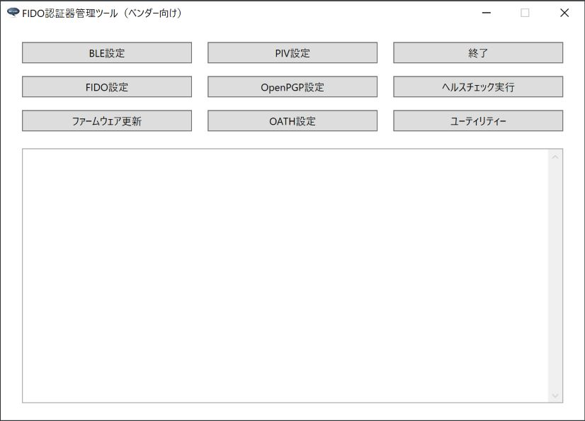

# Windows版 FIDO認証器管理ツール（ベンダー向け）

最終更新日：2023/1/17

## 概要
PC環境から、FIDO認証器の動作に必要な各種設定／動作テスト等を行うためのツールです。

#### 動作環境
Windows 10（64bit、November 2019 Update以降のバージョン） 
Windows 11

## 機能
[エンドユーザー向けの機能](README.md)に加え、下記機能を追加しています。

* FIDO鍵・証明書インストール／削除
* ブートローダーモード遷移機能
* ファームウェア再起動機能

#### 画面イメージ

#### 手順書

- <b>[インストール手順](../../MaintenanceTool/dotNET/DEVTOOLINST.md)</b> 
ベンダー向けのFIDO認証器管理ツールをWindows環境にインストールする手順について掲載しています。

- <b>[鍵・証明書の導入手順](../../MaintenanceTool/dotNET/ATTESTATION.md)</b> 
FIDO認証器に、鍵・証明書をインストールする手順について掲載しています。

- <b>[ブートローダーモード遷移手順](../../MaintenanceTool/dotNET/BOOTLOADERMODE.md)</b> 
FIDO認証器のファームウェアを手動インストールする際、ブートローダーモードに遷移させる手順について掲載しています。

- <b>[認証器のファームウェア再起動手順](../../MaintenanceTool/dotNET/RESETFIRMWARE.md)</b> 
FIDO認証器のファームウェアを再起動する手順について掲載しています。

- <b>[管理ツールのログファイル](../../MaintenanceTool/dotNET/DEVTOOLLOG.md)</b> 
ベンダー向けのFIDO認証器管理ツールから出力されるログファイルについて説明しています。
