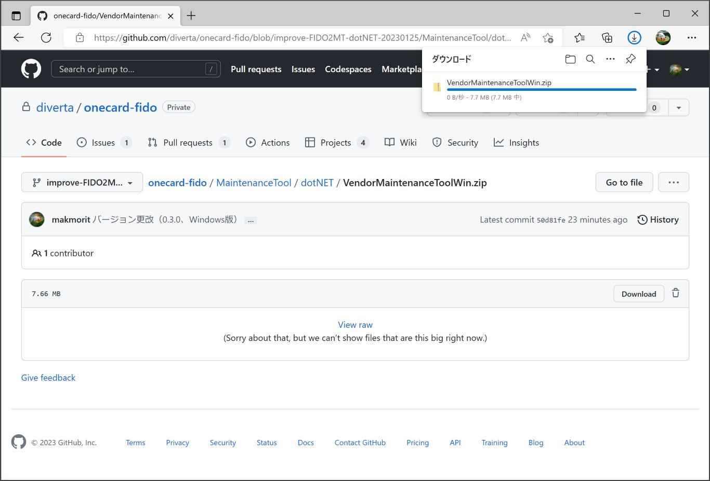
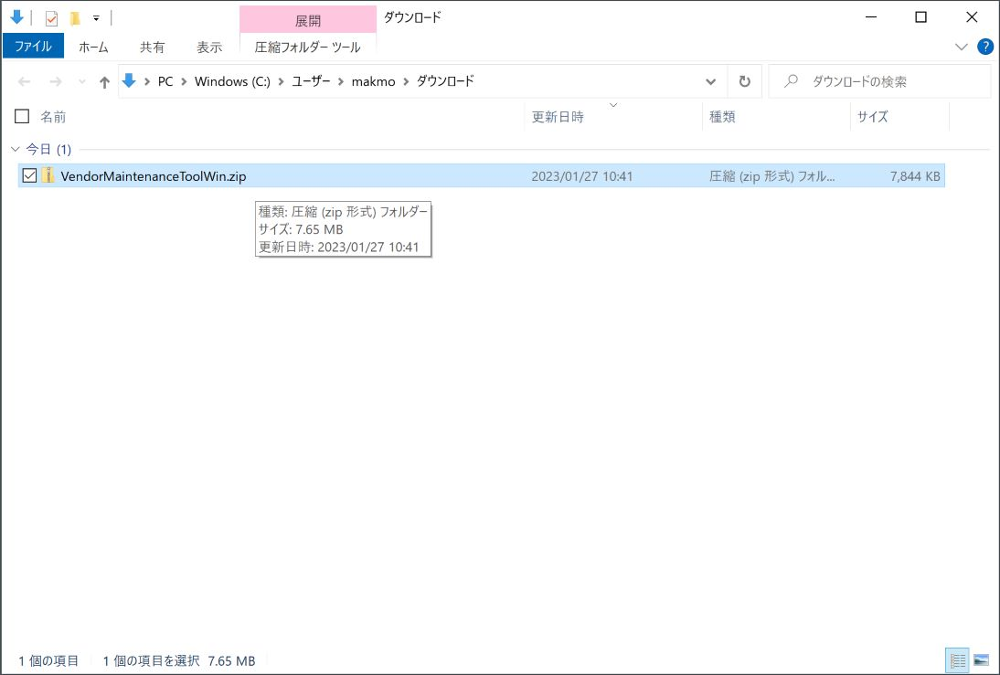
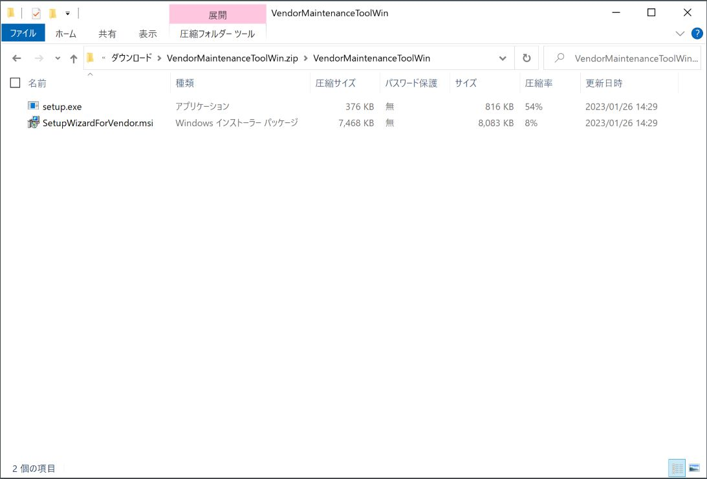
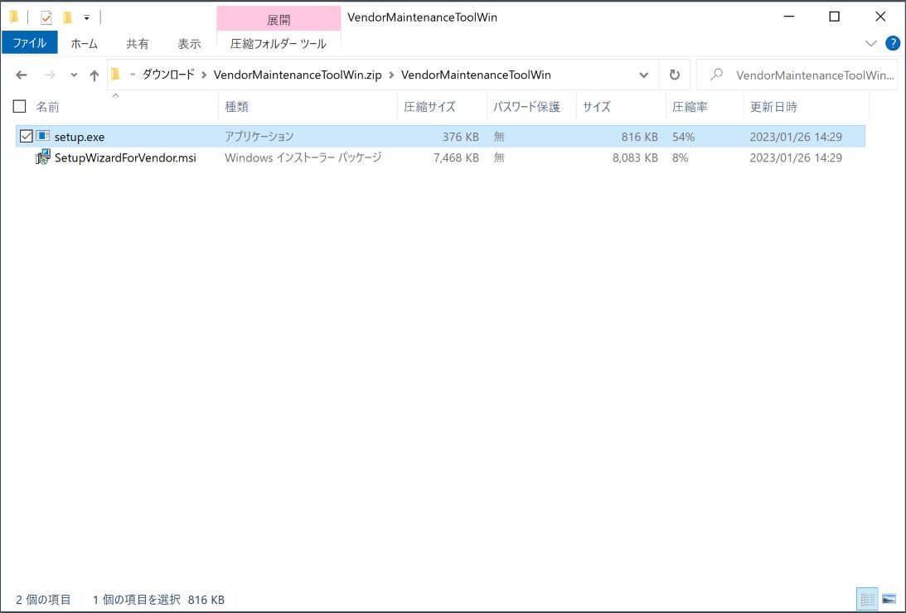
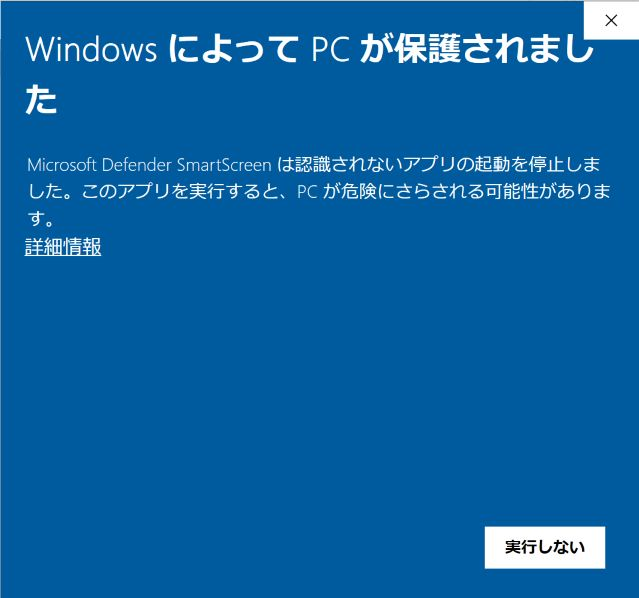
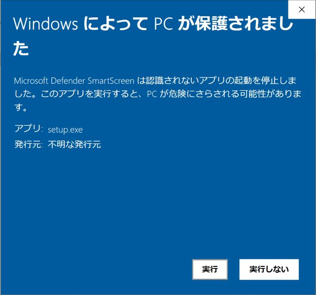
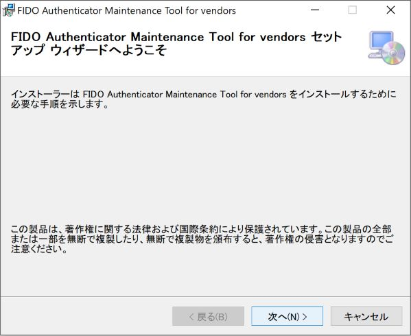
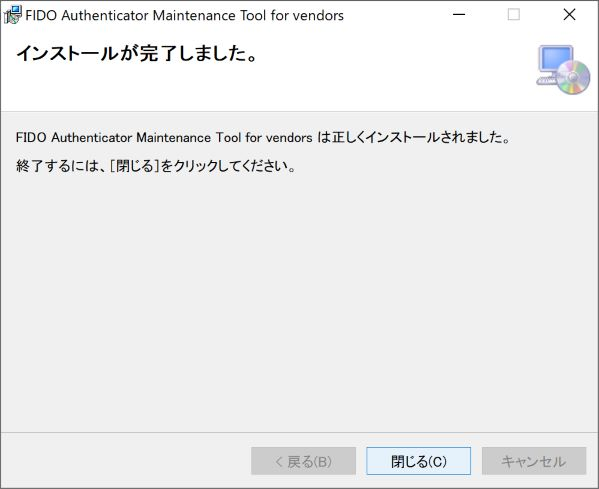
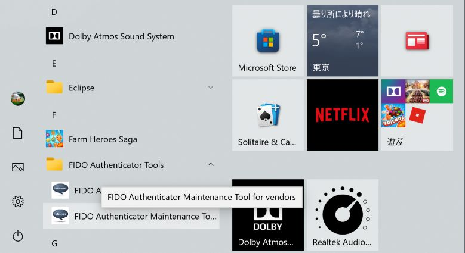
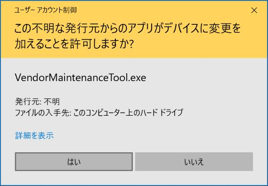

# インストール手順

最終更新日：2023/1/27

## 概要
Windows版 FIDO認証器管理ツール（ベンダー向け）をWindows環境にインストールする手順について掲載しています。

## インストール媒体の取得

[Windows版 FIDO認証器管理ツール](../../MaintenanceTool/dotNET/VendorMaintenanceToolWin.zip)を、GitHubからダウンロード／解凍します。 
該当ページの「Download」ボタンをクリックすると、[VendorMaintenanceToolWin.zip](../../MaintenanceTool/dotNET/VendorMaintenanceToolWin.zip)がダウンロードできます。

ダウンロードが完了したら、ダウンロードフォルダーを開きます。

Windowsのエクスプローラが表示されますので、ファイルをダブルクリックして開きます。

「`setup.exe`」と「`SetupWizardForVendor.msi`」の２点のファイルが、インストール媒体になります。

## インストールの実行

前述の実行ファイル「`setup.exe`」をダブルクリックして実行してください。

最終更新日現在、アプリに署名がされていないため、ダウンロードしたプログラムを実行できない旨のダイアログが表示されます。 
「詳細情報」をクリックします。

画面表示が変わり「実行ボタン」が表示されますので、その「実行ボタン」をクリックします。

インストーラーが起動しますので、指示に従いインストールを進めます。

インストールが正常に完了したら「閉じる」をクリックし、インストーラーを終了させます。

Windowsのスタートメニューに、フォルダー「FIDO Authenticator Tools」とアイコン「FIDO Authenticator Maintenance Tool for vendors」が作成されていることを確認します。 
アイコンを右クリックし、インストールされたFIDO認証器管理ツールを実行します。

「アプリがデバイスに変更を加えることを許可しますか？」というメッセージが表示されます。[注1] 
「はい」ボタンをクリックすると、ツールが起動します。

FIDO認証器管理ツールの画面が起動すれば、インストールは完了です。

[注1] Windows 10のバージョン「Windows 10 November 2019 Update」以降においては、管理者として実行されていないプログラムの場合、FIDOデバイスとの直接的なUSB通信ができない仕様となったようです。Windows版管理ツールでは、鍵・証明書インストールなどの管理機能を実行時、FIDOデバイスとの直接的なUSB通信が必要なため、管理者として実行させるようにしております。その影響で、ツール起動のたびに「アプリがデバイスに変更を加えることを許可しますか？」というメッセージが表示されてしまいますが、不具合ではありません。
