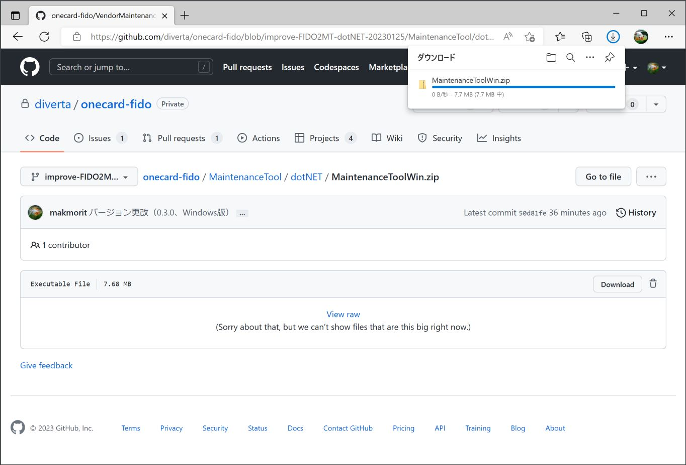

# Windows版 FIDO認証器管理ツール

最終更新日：2022/12/7

## 概要
PC環境から、FIDO認証器の動作に必要な各種設定／動作テスト等を行う、エンドユーザー向けのツールです。

#### 動作環境
Windows 10（64bit、November 2019 Update以降のバージョン） 
Windows 11

#### 実行にあたってのご注意

Windows 10のバージョン「Windows 10 November 2019 Update」以降においては、管理者として実行されていないプログラムの場合、FIDOデバイスとの直接的なUSB通信ができない仕様となったようです。 
このため、FIDO認証器管理ツールでは、管理者として実行させるようにしております。

その影響で、ツール起動のたびに「アプリがデバイスに変更を加えることを許可しますか？」というメッセージが表示されてしまいますが、不具合ではありません。 
「はい」ボタンをクリックし、ツールを起動させるようにしてください。

## 機能
* ペアリング実行／ペアリング情報削除
* PINコード設定
* FIDO認証情報消去
* CTAP2ヘルスチェック実行
* U2Fヘルスチェック実行
* PINGテスト機能
* Flash ROM情報取得機能
* バージョン情報取得機能
* PIV機能設定
* OpenPGP機能設定
* OATH機能設定（最終更新日現在、開発中）
* ファームウェア更新機能
* ログファイル格納ディレクトリー参照機能
* 認証器の時刻設定機能

#### 画面イメージ

#### 手順書

- <b>[インストール手順](../../MaintenanceTool/dotNET/INSTALLPRG.md)</b> 
FIDO認証器管理ツールをWindows環境にインストールする手順を掲載しています。

- <b>[BLEペアリング手順](../../MaintenanceTool/dotNET/BLEPAIRING.md)</b> 
FIDO認証器管理ツールを使用し、PCとFIDO認証器をBLEペアリングする手順について掲載しています。

- <b>[PINコードの設定手順](../../MaintenanceTool/dotNET/SETPIN.md)</b> 
FIDO認証器に、PINコード（暗証番号）を設定する手順を掲載しています。

- <b>[FIDO認証情報の消去手順](../../MaintenanceTool/dotNET/AUTHRESET.md)</b> 
FIDO認証器から、FIDO認証情報を消去する手順について掲載しています。

- <b>[CTAP2ヘルスチェック実行手順](../../MaintenanceTool/dotNET/CTAP2HCHECK.md)</b> 
FIDO認証器のヘルスチェックを実行する手順を掲載しています。

- <b>[PIV機能設定手順](../../MaintenanceTool/dotNET/PIVSETTING.md)</b> 
[PIV機能](../../FIDO2Device/MDBT50Q_Dongle/PIVPINLOGIN.md)に必要な各種設定の手順を掲載しています。

- <b>[OpenPGP機能設定手順](../../MaintenanceTool/dotNET/PGPSETTING.md)</b> 
[OpenPGP機能](../../CCID/OpenPGP/README.md)に必要な各種設定の手順を掲載しています。

- <b>[ファームウェア更新手順（USB）](../../MaintenanceTool/dotNET/UPDATEFW_USB.md)</b> 
管理ツールから、[MDBT50Q Dongle](../../FIDO2Device/MDBT50Q_Dongle/README.md)のファームウェアを更新する手順を掲載しています。

- <b>[管理ツールのログファイル](../../MaintenanceTool/dotNET/VIEWLOG.md)</b> 
FIDO認証器管理ツールから出力されるログファイルについて説明しています。

- <b>[認証器の時刻設定手順](../../MaintenanceTool/dotNET/RTCC_SETTINGS.md)</b> 
管理ツールから、MDBT50Q Dongleの現在時刻を設定する手順について掲載しています。
