# OATH機能設定手順書

最終更新日：2023/3/7

## 概要

[FIDO認証器管理ツール](../../MaintenanceTool/dotNET/README.md)、[MDBT50Q Dongle](../../FIDO2Device/MDBT50Q_Dongle/README.md)を使用した、ワンタイムパスワードの参照手順を中心に、OATH設定の諸手順について掲載します。

## ソフトウェアのバージョン確認

OATH機能は、[CCIDインターフェース](../../CCID/README.md)という仕組みを使用しております。 
この仕組みを使用するためには、管理ツール、ファームウェア共に、必要バージョン以降である必要があります。

#### 管理ツールのバージョン確認
まずは[インストール手順](../../MaintenanceTool/dotNET/INSTALLPRG.md)を参照し、管理ツールをWindowsにインストールします。 
次に、下記手順で管理ツールのバージョン確認を行い、<b>Version 0.3.2以降</b>であるかどうか確認します。

管理ツールのユーティリティー画面で「管理ツールのバージョンを参照」をクリックします。

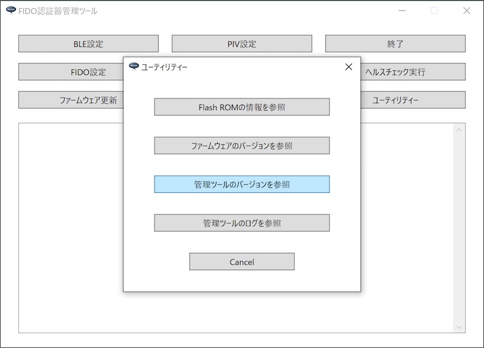

表示される画面で、管理ツールのバージョンを確認してください。 
（下記例では「Version 0.3.0」となっております）

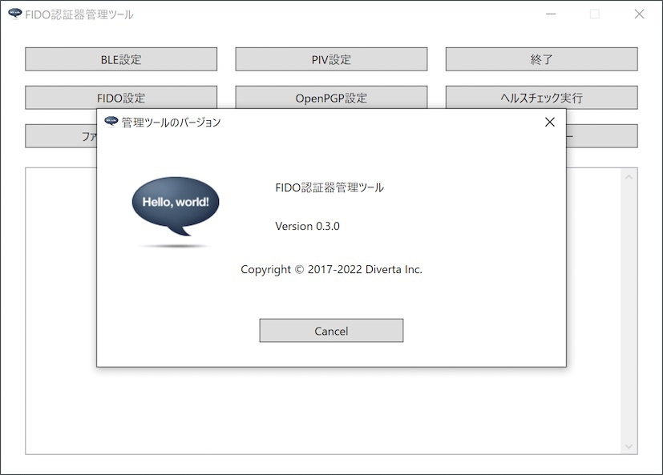

#### ファームウェアのバージョン確認
続いて、下記手順でMDBT50Q Dongleファームウェアのバージョン確認を行い、<b>0.3.8以降</b>であるかどうか確認します。 
MDBT50Q DongleをPCのUSBポートに装着した後、管理ツールのユーティリティー画面で「ファームウェアのバージョンを参照」をクリックします。

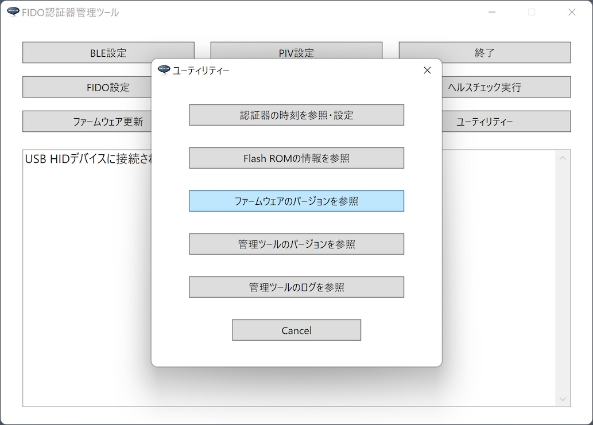

管理ツール下部のメッセージ欄に表示される、ファームウェアのバージョンを確認してください。 
（下記例では「0.3.6」となっております）

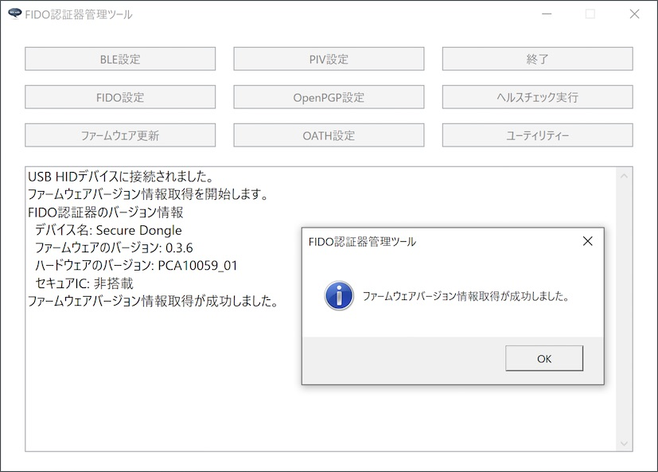

## OATH設定画面の表示

OATH機能の設定・実行は「OATH設定画面」上で行います。

管理ツールを起動し、USBポートにMDBT50Q Dongleを装着します。 
管理ツール画面下部のメッセージ欄に「USB HIDデバイスに接続されました。」と表示されることを確認したら、管理ツール画面の「OATH設定」ボタンをクリックします。

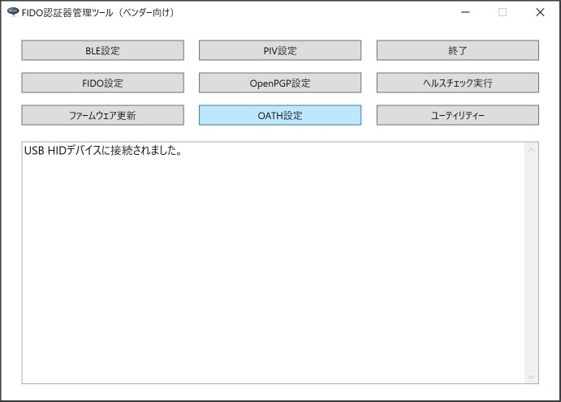

ホーム画面の上に、OATH設定画面がポップアップ表示されます。

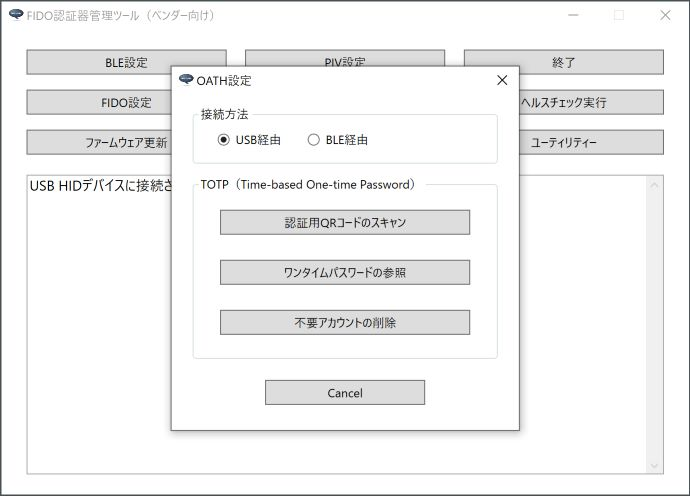

以後の設定作業は、すべてこの「OATH設定画面」で実行します。

## ワンタイムパスワードの参照

OATH機能を使用した、ワンタイムパスワードの参照手順について記載いたします。 
なお、本ツールで利用できるワンタイムパスワードは、TOTP（Time-based One-time Password）になります。

### QRコードスキャン＋ワンタイムパスワード参照

ワンタイムパスワードの認証用QRコードをスキャンし、アカウントの登録～ワンタイムパスワード参照までを一息に実行することができます。 
（下図は、GitHubサイトのワンタイムパスワード認証用QRコードです）

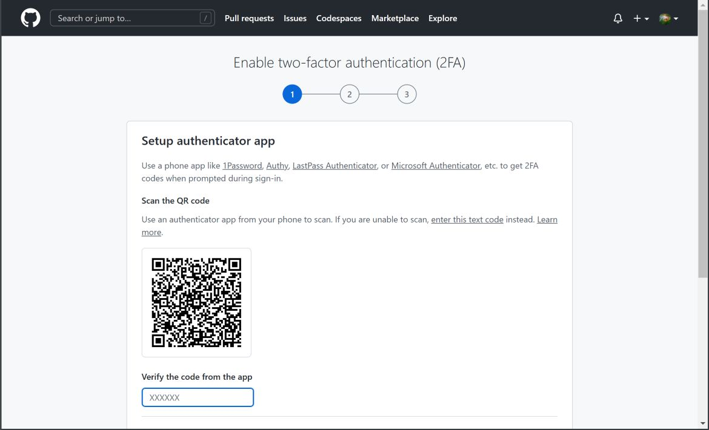

まず最初に、QRコードをスキャンするための画面を表示させます。 
OATH設定画面の「認証用QRコードのスキャン」ボタンをクリックします。

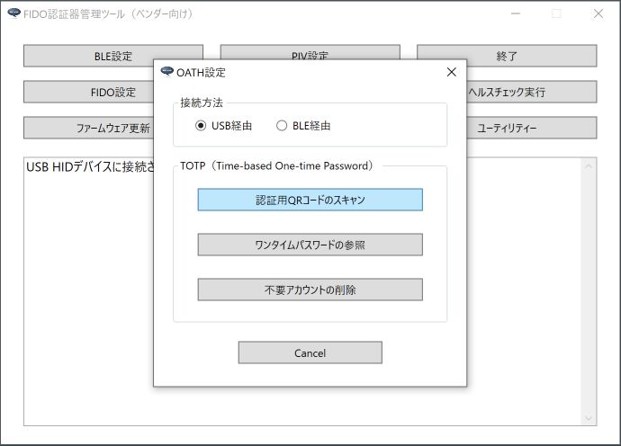

管理ツールのホーム画面と、OATH設定画面の両方が非表示となり、代わりに「認証用QRコードのスキャン」というタイトルの画面がポップアップ表示されます。 
画面上の「実行」ボタンをクリックし、QRコードをスキャンします。

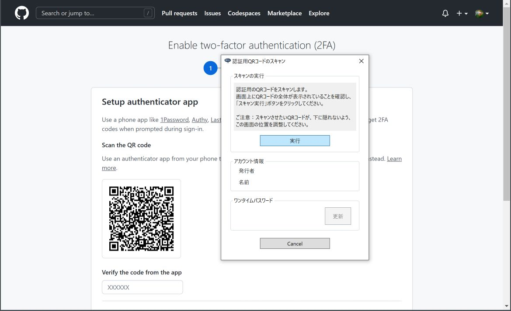

アカウントが認証器に登録されるとともに、認証器内で生成されたワンタイムパスワードが画面表示されます。

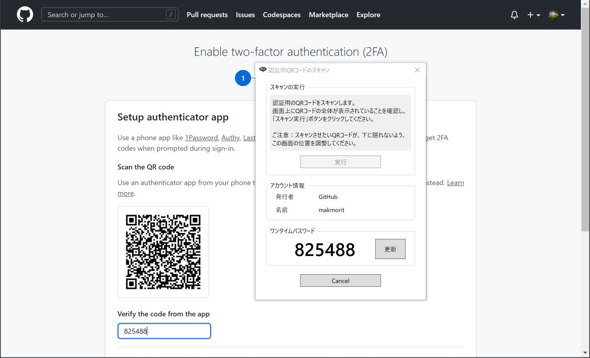

適宜、ブラウザー等の入力項目に、画面表示されたワンタイムパスワードを入力してください。

### 登録済みアカウントによるワンタイムパスワード参照

既に認証器に登録済みのアカウントを使用し、ワンタイムパスワードを参照することができます。

この場合は、OATH設定画面の「ワンタイムパスワードの参照」ボタンをクリックします。

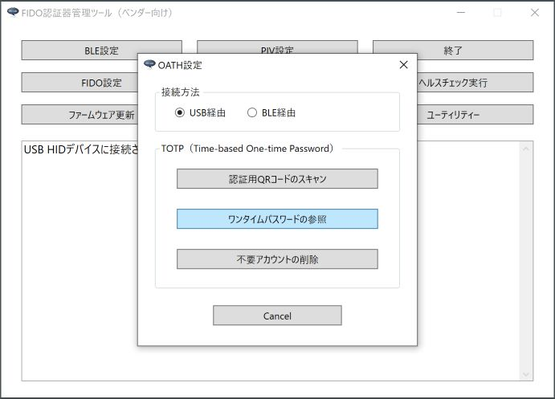

認証器に登録済みのアカウントが一覧表示されます。 
一覧から、ワンタイムパスワードを参照したいアカウントを選択し「選択」ボタンをクリックします。

選択されたアカウントの情報により、認証器内で生成されたワンタイムパスワードが画面表示されます。

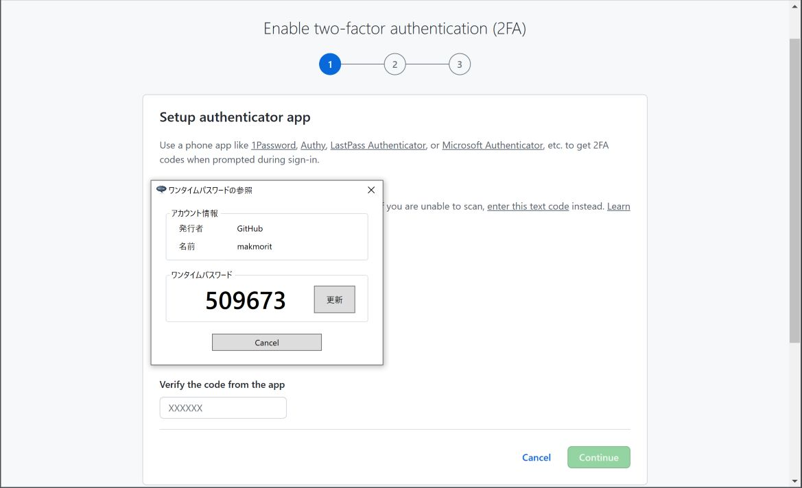

適宜、ブラウザー等の入力項目に、画面表示されたワンタイムパスワードを入力してください。
