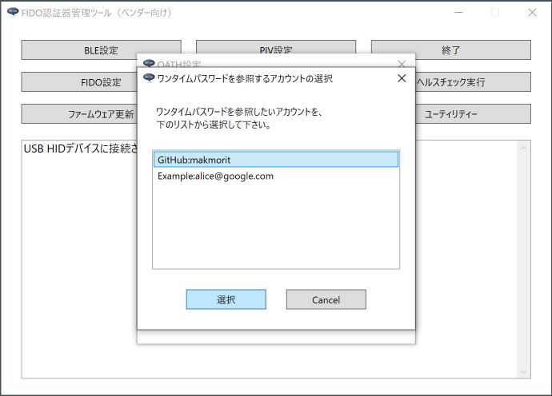
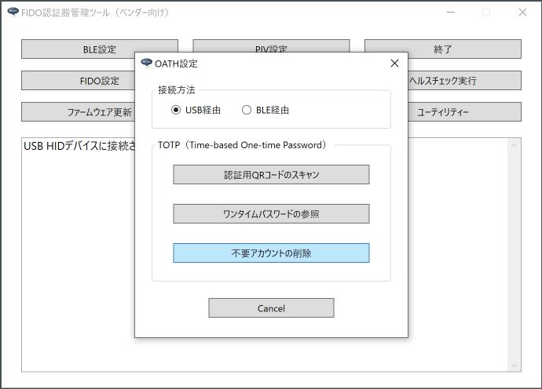
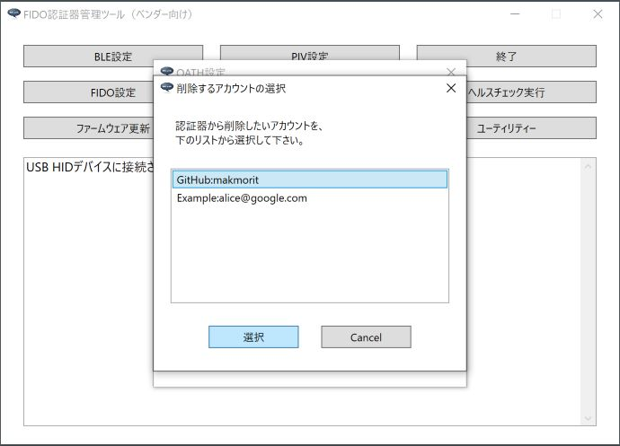
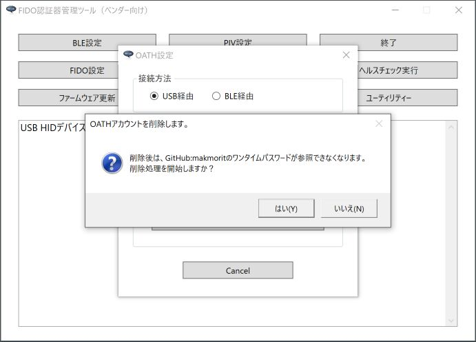
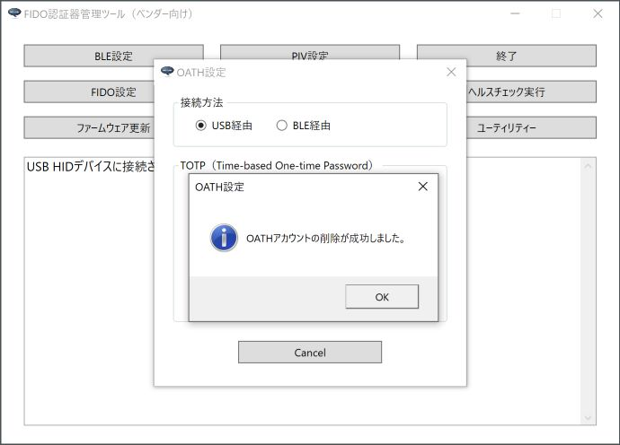

# OATH機能設定手順書

最終更新日：2023/4/13

## 概要

[FIDO認証器管理ツール](../../MaintenanceTool/dotNET/README.md)、[MDBT50Q Dongle](../../FIDO2Device/MDBT50Q_Dongle/README.md)を使用した、ワンタイムパスワードの参照手順を中心に、OATH設定の諸手順について掲載します。

## OATH設定画面の表示

OATH機能の設定・実行は「OATH設定画面」上で行います。

管理ツールを起動し、USBポートにMDBT50Q Dongleを装着します。 
管理ツール画面下部のメッセージ欄に「USB HIDデバイスに接続されました。」と表示されることを確認したら、管理ツール画面の「OATH設定」ボタンをクリックします。

ホーム画面の上に、OATH設定画面がポップアップ表示されます。

以後の設定作業は、すべてこの「OATH設定画面」で実行します。

## ワンタイムパスワードの参照

OATH機能を使用した、ワンタイムパスワードの参照手順について記載いたします。 
なお、本ツールで利用できるワンタイムパスワードは、TOTP（Time-based One-time Password）になります。

### QRコードスキャン＋ワンタイムパスワード参照

ワンタイムパスワードの認証用QRコードをスキャンし、アカウントの登録～ワンタイムパスワード参照までを一息に実行することができます。 
（下図は、GitHubサイトのワンタイムパスワード認証用QRコードです）

まず最初に、QRコードをスキャンするための画面を表示させます。 
OATH設定画面の「認証用QRコードのスキャン」ボタンをクリックします。

管理ツールのホーム画面と、OATH設定画面の両方が非表示となり、代わりに「認証用QRコードのスキャン」というタイトルの画面がポップアップ表示されます。 
画面上の「実行」ボタンをクリックし、QRコードをスキャンします。

アカウントが認証器に登録されるとともに、認証器内で生成されたワンタイムパスワードが画面表示されます。

適宜、ブラウザー等の入力項目に、画面表示されたワンタイムパスワードを入力してください。

### 登録済みアカウントによるワンタイムパスワード参照

既に認証器に登録済みのアカウントを使用し、ワンタイムパスワードを参照することができます。

この場合は、OATH設定画面の「ワンタイムパスワードの参照」ボタンをクリックします。

認証器に登録済みのアカウントが一覧表示されます。 
一覧から、ワンタイムパスワードを参照したいアカウントを選択し「選択」ボタンをクリックします。

選択されたアカウントの情報により、認証器内で生成されたワンタイムパスワードが画面表示されます。

適宜、ブラウザー等の入力項目に、画面表示されたワンタイムパスワードを入力してください。

## 不要アカウントの削除

管理ツールを使用し、認証器に登録済みのアカウントのうち、不要となったものを削除できます。

### 削除手順

OATH設定画面の「不要アカウントの削除」ボタンをクリックします。

認証器に登録済みのアカウントが一覧表示されます。 
一覧から、削除したいアカウントを選択し「選択」ボタンをクリックします。

下記のような確認ダイアログが表示されますので、「はい」ボタンをクリックします。

程なく、下図のようなメッセージがポップアップ表示され、処理が完了します。

以上で、不要アカウントの削除は完了です。
