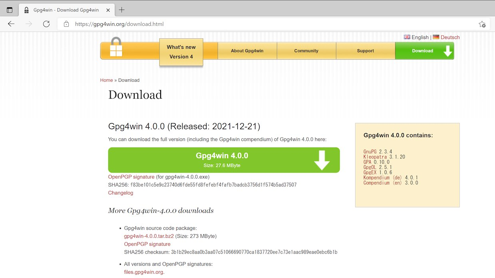
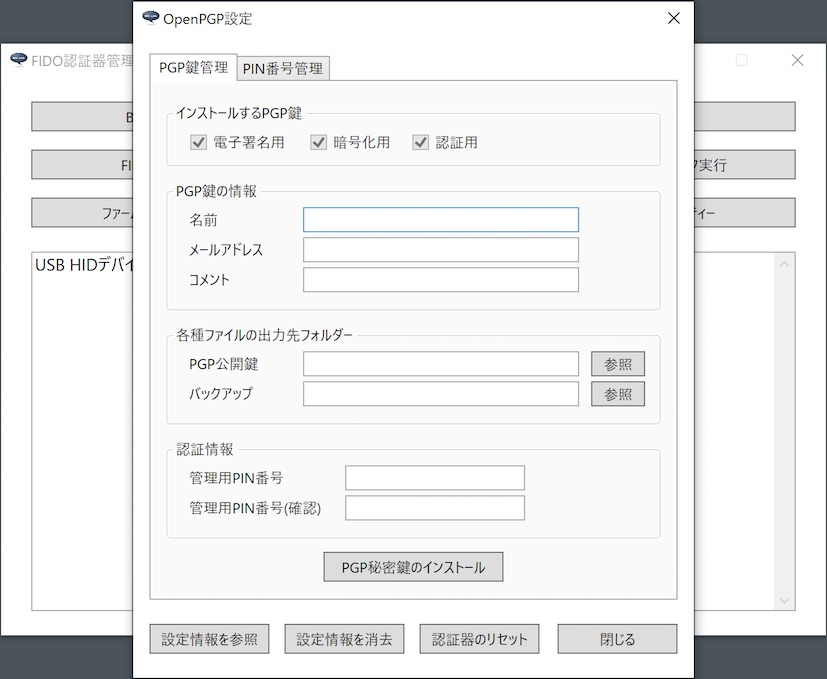
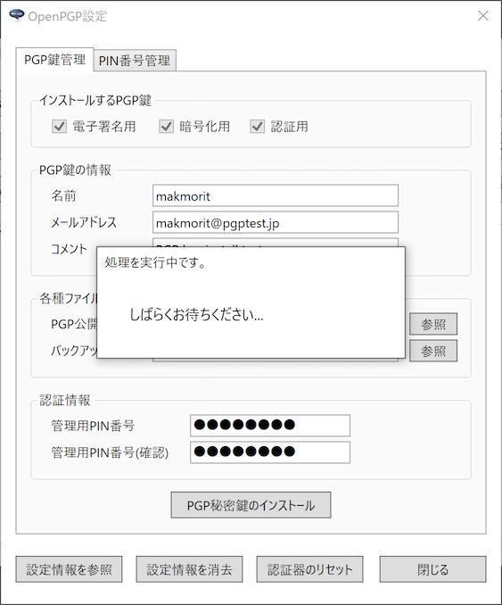
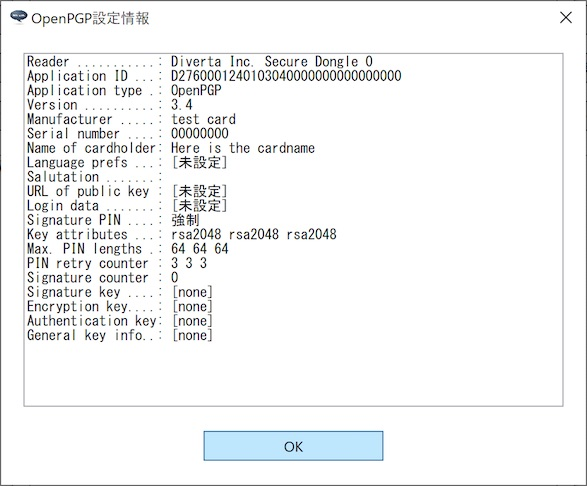

# OpenPGP機能の基本設定手順

最終更新日：2023/4/13

## 概要

[FIDO認証器管理ツール](../../MaintenanceTool/dotNET/README.md)を使用して、[MDBT50Q Dongle](../../FIDO2Device/MDBT50Q_Dongle/README.md)に対し、OpenPGP機能に最低限必要な基本設定を行う手順を掲載します。

## 前提ソフトウェア

OpenPGP機能をご利用いただくには、[Gpg4win](https://www.gnupg.org)というツールを、PCに別途インストールする必要があります。

#### Gpg4winのインストール

管理ツールは、PGP鍵インストール処理時、[Gpg4win](https://www.gnupg.org)というツールに同梱の「GnuPG」を管理ツールで内部利用するため、あらかじめ<b>Gpg4winがPCにインストールされている</b>必要があります。

Gpg4winのインストール手順につきましては、別ドキュメント「<b>[Gpg4winインストール手順書](../../CCID/OpenPGP/GPGINSTWIN.md)</b>」をご参照願います。

## OpenPGP設定画面の表示

OpenPGP機能の設定は「OpenPGP設定画面」上で行います。

管理ツールを起動し、USBポートにMDBT50Q Dongleを装着します。 
管理ツール画面下部のメッセージ欄に「USB HIDデバイスに接続されました。」と表示されることを確認したら、管理ツール画面の「OpenPGP設定」ボタンをクリックします。

ホーム画面の上に、OpenPGP設定画面がポップアップ表示されます。

以後の設定作業は、すべてこの「OpenPGP設定画面」で実行します。

## 基本設定の実行

OpenPGP機能に最低限必要な基本設定、すなわちPGP鍵のインストールを実行します。

### PGP秘密鍵のインストール

OpenPGP機能では、PGP秘密鍵をMDBT50Q Dongleに導入する必要があります。

導入が必要な秘密鍵は、以下の３セットになります。 
いずれも、本機能で自動生成されます。

- 電子署名用（Signature key）
- 暗号／復号化用（Encryption key）
- PGP認証用（Authentication key）

以下の手順により、３セットの秘密鍵をすべてインストールします。

#### インストール手順

まずはインストールする鍵の個人情報を入力します。 
全項目入力必須になります。

- 名前（５文字以上で入力します）
- メールアドレス
- コメント

次に、各種ファイルの出力先フォルダーを選択します。 
「PGP公開鍵」欄右側の「参照」ボタンをクリックします。

フォルダー参照ダイアログから、該当の出力先フォルダーを選択し「選択」ボタンをクリックします。

フォルダー欄に、選択された出力先フォルダーのパスが表示されます。

同様に、バックアップファイルの出力先フォルダーも選択します。

PGP公開鍵、バックアップ両方の出力先フォルダーを選択したら、下部の認証情報欄に、OpenPGP機能で使用する管理用PIN番号を入力します。[注1]

PIN番号を入力したら、下部の「PGP秘密鍵のインストール」ボタンをクリックします。

下記のような確認ダイアログが表示されますので、「はい」ボタンをクリックします。

PGP秘密鍵のインストール処理が実行されます。

程なく、下図のようなメッセージがポップアップ表示され、処理が完了します。

[注1] 管理用PIN番号は初期状態では「`12345678`」となっております。変更したい場合は、別ドキュメント「[OpenPGP機能の各種設定手順](../../MaintenanceTool/dotNET/PGPSETTING_OPT.md)」をご参照願います。

### 確認手順

インストールされた証明書は「OpenPGP設定情報画面」で確認できます。 
OpenPGP設定画面の左下部のボタン「設定情報を参照」をクリックします。

下図のようなOpenPGP設定情報画面がポップアップ表示されます。 
以下の３点が設定されていることが確認できます。

- 電子署名用（Signature key）の設定情報
- 暗号／復号化用（Encryption key）の設定情報
- PGP認証用（Authentication key）の設定情報

以上で、PGP秘密鍵のインストールは完了です。

## OpenPGP機能設定情報の消去

万が一、管理用PIN番号を３回連続で間違えて指定した場合は、認証がブロックされます。 
他方、管理用PIN番号のリセット機能は存在しません。

したがって、MDBT50Q Dongleにおいて、再び管理用PIN番号が利用できるようにするためには、いったんOpenPGP機能設定情報を全て消去する必要があります。 
この場合、OpenPGP機能に関連する以下の設定情報が全て消去されてしまいますので、ご注意ください。

- 電子署名用（Signature key）の設定情報
- 暗号／復号化用（Encryption key）の設定情報
- PGP認証用（Authentication key）の設定情報

OpenPGP機能設定情報の消去を実行するためには、OpenPGP設定画面の右下部「設定情報を消去」ボタンをクリックします。

下記のような確認ダイアログが表示されますので、Yesボタンをクリックします。

設定情報消去処理が実行されます。

程なく、下図のようなメッセージがポップアップ表示され、処理が完了します。

OpenPGP設定情報画面で確認すると、下記３点の設定情報が消去されたことを示しています。

- 電子署名用（Signature key）
- 暗号／復号化用（Encryption key）
- PGP認証用（Authentication key）

これでOpenPGP機能設定の消去は完了です。

## その他の各種設定

前項までの手順により、OpenPGP機能に最低限必要な基本設定が完了しますが、その他にもPIN番号変更等のオプション機能を用意しております。 
詳細につきましては、別ドキュメント「[OpenPGP機能の各種設定手順](../../MaintenanceTool/dotNET/PGPSETTING_OPT.md)」をご参照願います。
