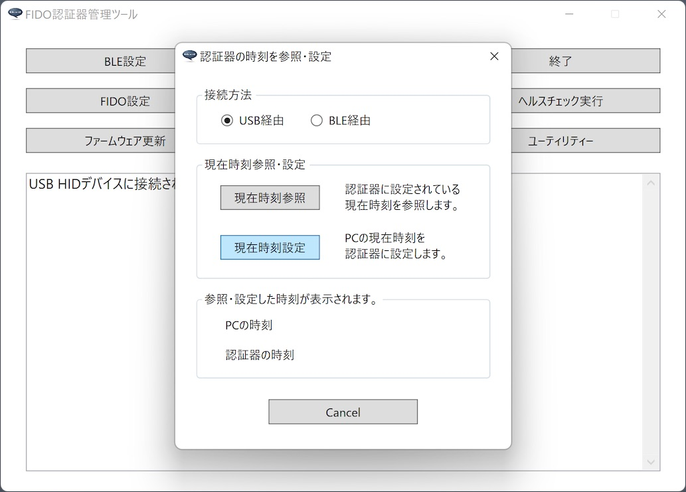
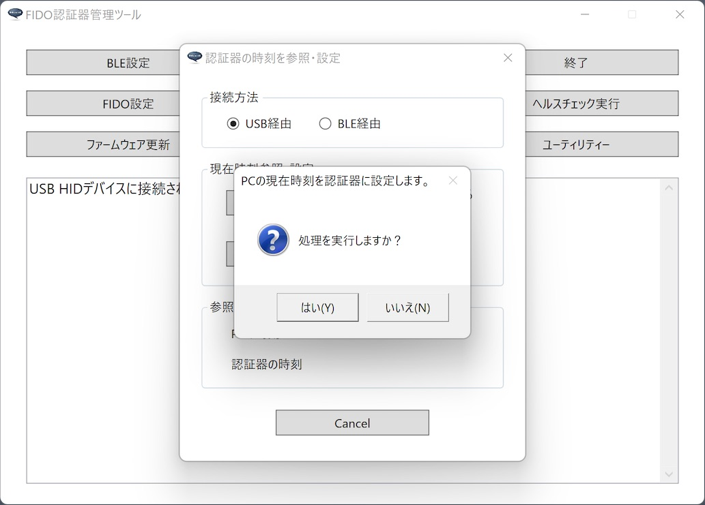

# 認証器の時刻設定手順

最終更新日：2022/12/7

## 概要

[FIDO認証器管理ツール](../../MaintenanceTool/dotNET/README.md)を使用して、FIDO認証器の現在時刻を設定する手順について掲載しています。

## 認証器の準備

#### 使用機材

本文では「[MDBT50Q Dongle（rev2.2）](../../FIDO2Device/MDBT50Q_Dongle/README.md)」[注1]を、FIDO2認証器として使用します。

MDBT50Q Dongleの背面にあるボタン電池ケースに、電池が入っていることを必ず確認します。[注2]

[注1] MDBT50Q Dongle（rev2.2）以降の認証器をご使用願います。rev2.2より前の認証器では、時刻設定ができません。 
[注2] MDBT50Q Dongleに装着した電池から、電源が供給され続けることにより、設定した時刻が保持される機構となっているため、ひとたび時刻設定したMDBT50Q Dongleからは、電池を外さないようお願いします。

#### 管理ツールを導入

最新バージョンの[管理ツール（Windows版）](../../MaintenanceTool/dotNET/README.md)を、PC環境（Windows）に導入します。 
以下の手順書をご参照願います。

* <b>[インストール手順（Windows版）](../../MaintenanceTool/dotNET/INSTALLPRG.md) </b>

## 時刻設定手順

管理ツールにより、認証器の現在時刻参照または設定ができます。 
USB経由、BLE経由の両方が選択可能ですが、本文では、USB経由の手順を記載いたします。

### 時刻設定画面の表示

認証器の現在時刻参照／設定は「時刻設定画面」から行います。

管理ツールを起動し、USB経由で参照／設定を実行したい場合は、USBポートにMDBT50Q Dongleを装着します。 
管理ツール画面下部のメッセージ欄に「USB HIDデバイスに接続されました。」と表示されることを確認してください。

管理ツール画面の「ユーティリティー」ボタンをクリックします。

ユーティリティー画面がポップアップ表示されたら、画面上部の「認証器の時刻を参照・設定」ボタンをクリックします。

時刻設定画面がポップアップ表示されます。 
（タイトルは「認証器の時刻を参照・設定」となっています）

以降の作業は、すべてこの「時刻設定画面」で実行します。

### 現在時刻の参照

時刻設定画面の「現在時刻参照」ボタンをクリックします。

管理ツールがUSB経由で認証器から取得した現在時刻が、時刻設定画面の下部に表示されます。 
程なく、下図のようなポップアップ画面が表示され、処理が完了します。

ポップアップ画面を閉じると、認証器から取得した現在時刻と、取得時点におけるPC（管理ツール）の現在時刻を確認できます。

これで、現在時刻の参照は完了です。

### 現在時刻の設定

時刻設定画面の「現在時刻設定」ボタンをクリックします。

下図のような確認ポップアップ表示されますので「はい」をクリックします。

管理ツールがPCから取得した現在時刻が、認証器に登録され、同時にその現在時刻が、画面下部に表示されます。 
程なく、下図のようなポップアップ画面が表示され、処理が完了します。

ポップアップ画面を閉じると、認証器に登録された現在時刻と、登録時点におけるPC（管理ツール）の現在時刻を確認できます。

これで、現在時刻の設定は完了です。
