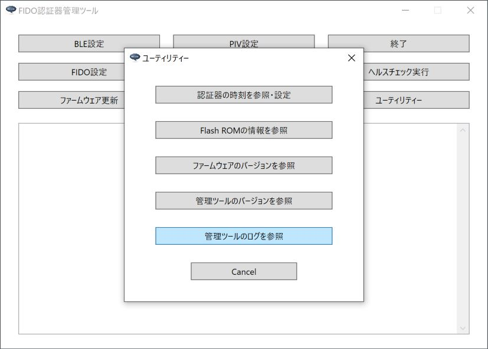
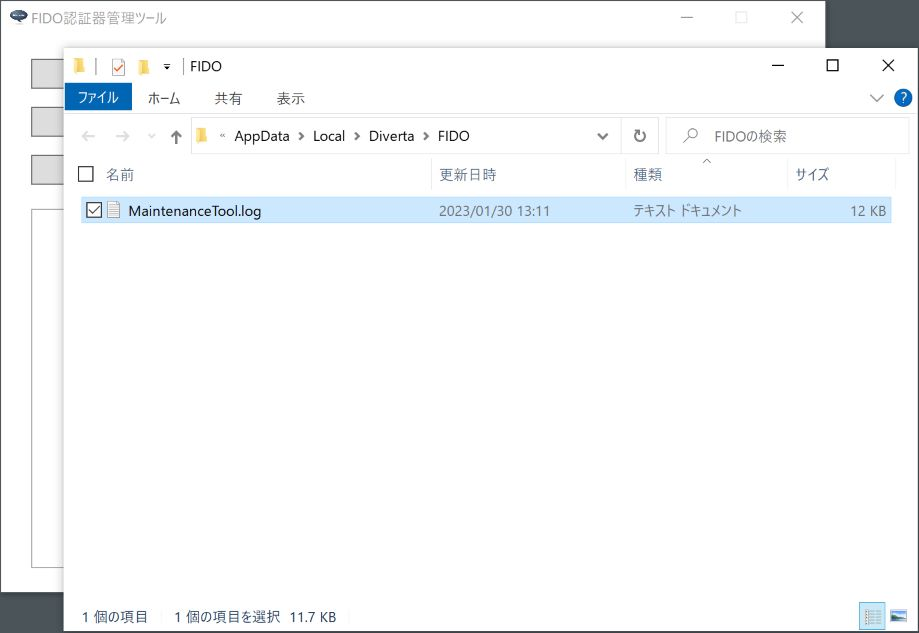

# 管理ツールのログファイル

## 概要
[FIDO認証器管理ツール](../../MaintenanceTool/dotNET/README.md)から出力されるログファイルについて説明します。

## ログファイルの場所

FIDO認証器管理ツールの実行中に出力されるログは、Windowsのユーザーディレクトリー配下のログファイル（下記の場所）に保存されます。

`%LOCALAPPDATA%\Diverta\FIDO\MaintenanceToolApp.log`

具体的には、例えば `C:\Users\user\AppData\Local\Diverta\FIDO\MaintenanceToolApp.log` といったパスになります。

### ログファイルの場所を開く

ログファイルの格納場所を、Windowsのエクスプローラで開くことができます。<br>
管理ツールを起動し「ユーティリティー」ボタンをクリックします。


「ユーティリティー」画面が表示されますので「管理ツールのログを参照」ボタンをクリックします。



ログファイル「MaintenanceToolApp.log」を格納するディレクトリーが、Windowsのエクスプローラで表示されます。



ログファイルは通常のテキストファイルですので、適宜、テキストエディターにより内容を参照することが可能です。

## ログファイルの内容

Windowsアプリの一般的な形式で出力されます。<br>
ログの出力イメージは以下のようになります。
```
2022/11/08 16:40:24 [info] FIDO認証器管理ツールを起動しました: Version 0.3.0
2022/11/08 16:40:24 [info] USBデバイス検知を開始しました。
2022/11/08 16:40:25 [info] USB HIDデバイスに接続されました。\\?\hid#vid_f055&pid_0001&mi_00#7&1436d563&0&0000#{4d1e55b2-f16f-11cf-88cb-001111000030}
2022/11/08 16:40:31 [info] HID PINGテストを開始します。
2022/11/08 16:40:31 [debug] HID Sent INIT frame: data size=8 length=8
ff ff ff ff 86 00 08 a3 3d e9 4f 43 a6 5f 78
2022/11/08 16:40:31 [debug] HID Recv INIT frame: data size=17 length=17
ff ff ff ff 86 00 11 a3 3d e9 4f 43 a6 5f 78 01
00 33 01 02 05 00 02 07
2022/11/08 16:40:31 [debug] HID Sent INIT frame: data size=100 length=57
01 00 33 01 81 00 64 67 b6 dc 93 10 13 b0 ca af
5a 31 5d 74 04 84 01 a5 f6 03 62 eb 7f 7d ae 2f
bc a3 c6 7b 7f f1 59 00 0e 51 ac 42 50 96 e3 2f
ac a4 62 a1 69 57 ae d7 81 9f 06 f5 33 c9 a5 e8
2022/11/08 16:40:31 [debug] HID Sent CONT frame: data seq=0 length=43
01 00 33 01 00 e2 10 b9 b4 da 24 a9 c5 c0 e4 34
da f1 cf 2d 4c 9e de 57 c9 9e 36 c3 7c 8e 55 59
b1 49 18 ba e3 b9 ab 13 fd a6 8d ea 10 4f 1b 3e
2022/11/08 16:40:31 [debug] HID Recv INIT frame: data size=100 length=57
01 00 33 01 81 00 64 67 b6 dc 93 10 13 b0 ca af
5a 31 5d 74 04 84 01 a5 f6 03 62 eb 7f 7d ae 2f
bc a3 c6 7b 7f f1 59 00 0e 51 ac 42 50 96 e3 2f
ac a4 62 a1 69 57 ae d7 81 9f 06 f5 33 c9 a5 e8
2022/11/08 16:40:31 [debug] HID Recv CONT frame: seq=0 length=43
01 00 33 01 00 e2 10 b9 b4 da 24 a9 c5 c0 e4 34
da f1 cf 2d 4c 9e de 57 c9 9e 36 c3 7c 8e 55 59
b1 49 18 ba e3 b9 ab 13 fd a6 8d ea 10 4f 1b 3e
2022/11/08 16:40:31 [info] HID PINGテストが成功しました。
2022/11/08 16:40:35 [info] USB HIDデバイスが取り外されました。
2022/11/08 16:40:35 [info] USBデバイス検知を終了しました。
2022/11/08 16:40:35 [info] FIDO認証器管理ツールを終了しました
```
