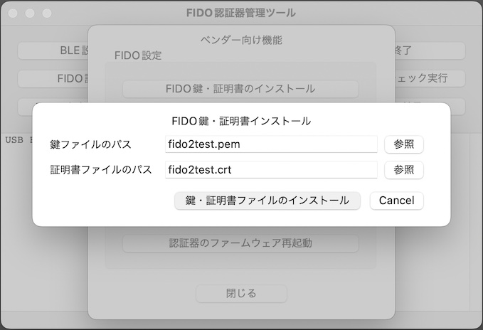
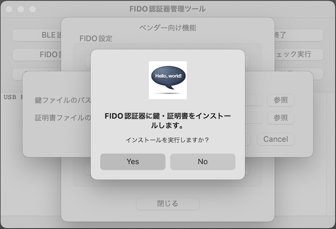
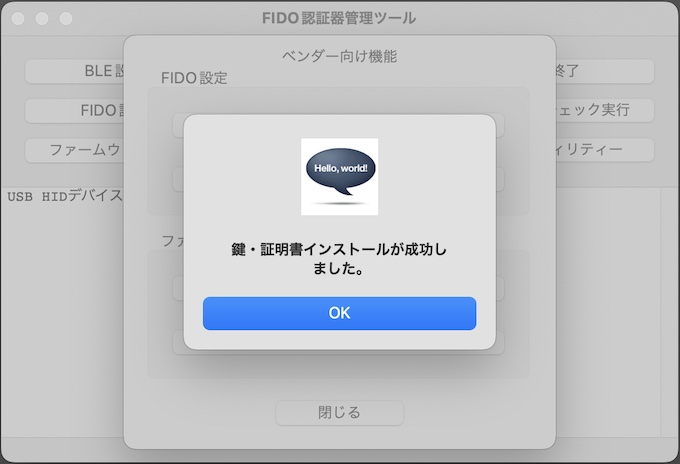
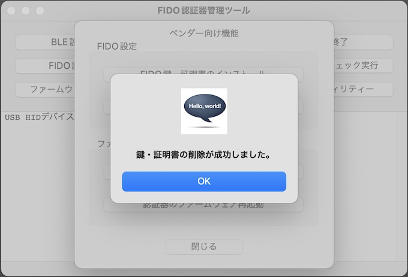

# 鍵・証明書の導入手順

## 概要

[FIDO認証器開発ツール](../../MaintenanceTool/macOSApp/DEVTOOL.md)を使用して、FIDO2認証器に鍵・証明書を導入する手順を掲載します。

## 認証器の準備

#### 使用機材

本ドキュメントでは「[MDBT50Q Dongle](../../FIDO2Device/MDBT50Q_Dongle/README.md)」を、FIDO2認証器として使用します。

#### 開発ツールを導入

[FIDO認証器開発ツール](../../MaintenanceTool/macOSApp/DEVTOOL.md)を、PC環境（macOS）に導入します。 
以下の手順書をご参照願います。

* <b>[FIDO認証器開発ツール インストール手順](../../MaintenanceTool/macOSApp/DEVTOOLINST.md) </b>

## 鍵・証明書ファイルのインストール

開発ツールを起動し、USBポートにFIDO2認証器を装着します。

開発ツール画面下部のメッセージ欄に「USB HIDデバイスに接続されました。」と表示されることを確認したら、開発ツールの「FIDO設定」画面で「FIDO鍵・証明書設定」ボタンをクリックし、FIDO鍵・証明書設定画面を表示させます。

秘密鍵ファイル（PEM形式）、証明書ファイル（DER形式）を、それぞれ「参照」ボタンをクリックして選択します。 
ファイル選択後、開発ツール画面の「鍵・証明書ファイルのインストール」ボタンをクリックします。

確認ダイアログが表示されますので「Yes」をクリックします。

FIDO認証器側の処理が成功すると「鍵・証明書インストールが成功しました。」と表示されます。

以上で、鍵・証明書ファイルのインストールは完了です。

## 鍵・証明書の消去

いったん導入した鍵・証明書をFIDO2認証器から消去するには「鍵・証明書の消去」機能を使用します。 
開発ツールを起動し、USBポートにFIDO2認証器を装着します。

開発ツール画面下部のメッセージ欄に「USB HIDデバイスに接続されました。」と表示されることを確認したら、開発ツールの「FIDO設定」画面で「FIDO鍵・証明書消去」ボタンをクリックします。

確認ダイアログが表示されますので「Yes」をクリックします。

FIDO認証器側の処理が成功すると「鍵・証明書の削除が成功しました。」と表示されます。

以上で、鍵・証明書の消去は完了です。
