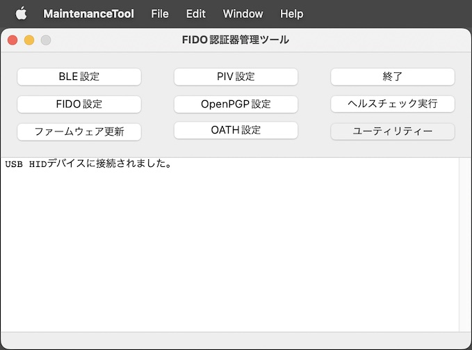
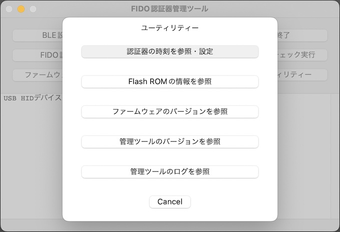
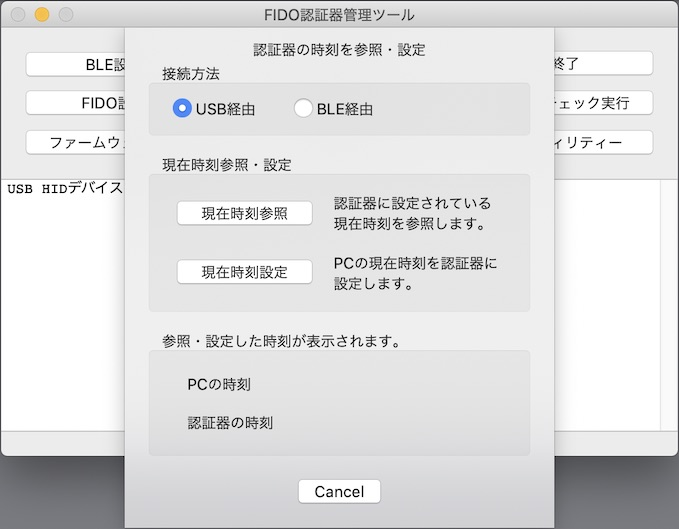
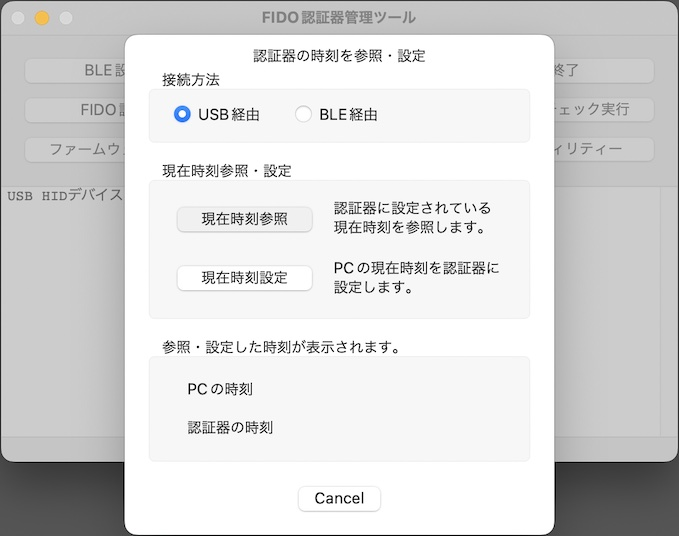
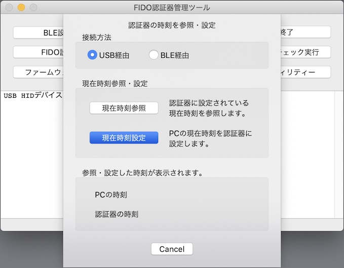
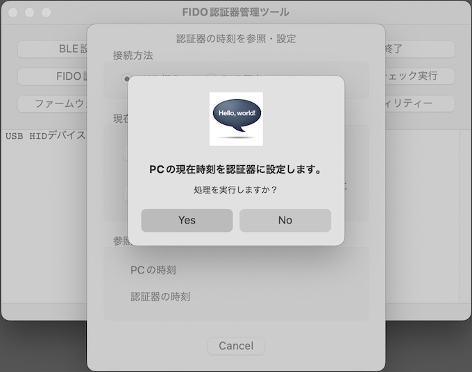
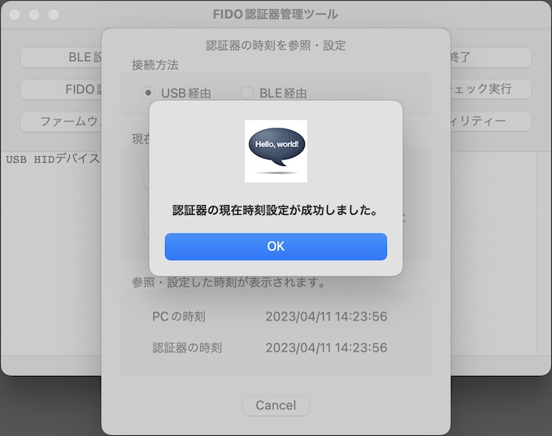
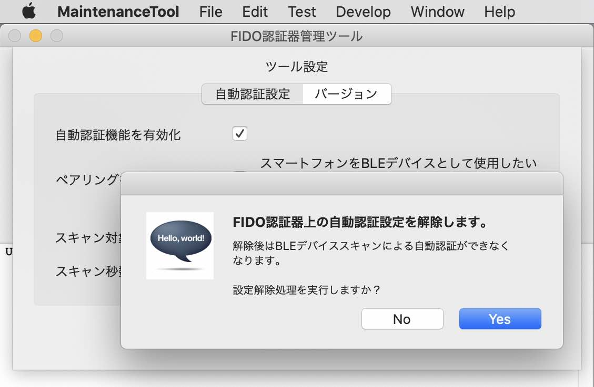
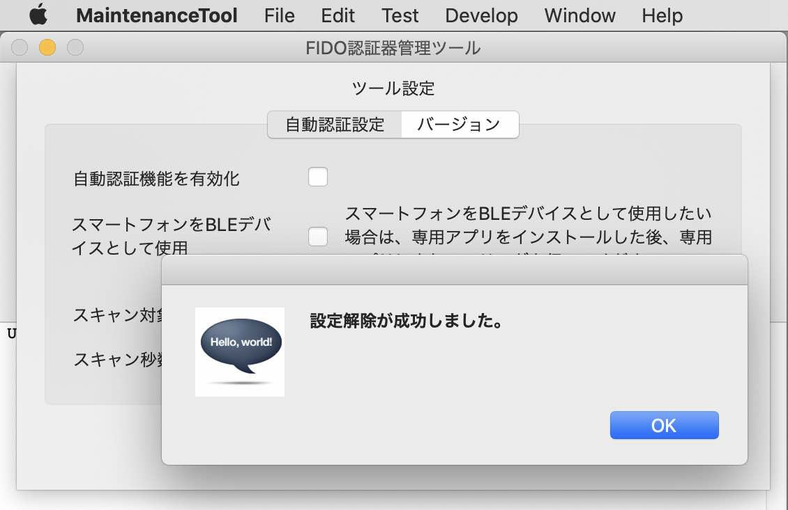

# 自動認証パラメーター設定手順

## 概要

[BLEデバイスを使用した自動認証機能](../../FIDO2Device/MDBT50Q_Dongle/BLEDAUTH.md)の各種パラメーターを設定する手順を掲載します。

#### 自動認証機能

FIDO認証（WebAuthn／U2F）実行時、MDBT50Q Dongle上のボタンを押す代わりに、One CardなどのBLEデバイスを近づけることにより、認証処理を自動的に続行させる機能です。

## 設定内容

自動認証機能で必要となるパラメーターは、下記の４点になります。

- <b>自動認証機能を有効化</b> 
画面上のチェックボックスにチェックをつけると、BLEデバイスを使用した自動認証機能が有効化されます。

- <b>スマートフォンをBLEデバイスとして使用</b> 
画面上のチェックボックスにチェックをつけると、BLEデバイスとしてスマートフォンを利用できます。

- <b>スキャン対象サービスUUID</b> 
自動認証させたいBLEデバイスが持つサービスUUID（スキャン対象サービスUUID）を設定します。

- <b>スキャン秒数</b> 
スキャン対象サービスUUIDをもつBLEデバイスをスキャンする秒数を設定します。

## 設定方法

以下、macOS環境での手順を記載いたします。

### 管理ツールのインストール

[インストール手順](INSTALLPRG.md)を参照し、管理ツールをmacOSにインストールします。

### ツール設定画面の表示

管理ツールを起動し、USBポートに[MDBT50Q Dongle](../../FIDO2Device/MDBT50Q_Dongle/README.md)を装着します。 
その後、メニューから「Preferences...」をクリックします。

ツール設定画面（ポップアップ画面）が表示されます。

ツール設定画面表示時は、画面項目が入力不可になっている状態ですので、画面上の「設定読込」ボタンをチェックし、画面にパラメーターを入力できるようにします。

認証器に自動認証パラメーターが未設定の状態ですと、下図のように画面項目が入力可能となり、デフォルト値が表示されます。

### 自動認証パラメーターの登録

画面上に、自動認証パラメーター（自動認証機能で必要となるパラメーター）の各項目を入力／指定します。

|# |項目名 |値 |備考|
|:-:|:-|:-|:-|
|1|自動認証機能を有効化 |自動認証機能を有効化したい場合はチェックをOnにします。Offにすると無効化されます。||
|2|スマートフォンをBLEデバイスとして使用 |スマートフォンをBLEデバイスとして使用したい場合[注1]はチェックをOnにします。 Offにすると無効化されます。[注2]||
|3|スキャン対象サービスUUID |「422E0000-E141-11E5-A837-0800200C9A66」[注3]といった形式で入力します。|自動認証機能を有効化しない場合は入力不要|
|4|スキャン秒数 |１〜９（秒）の値で入力します。|入力必須|

[注1] スマートフォンをBLEデバイスとして使用する場合は、事前に、スマートフォンに、専用アプリ「[BLE近接認証アプリ](../../FIDO2Device/SecureDongleApp)」をインストールした上で、専用アプリのペアリング実行機能により、スマートフォン〜MDBT50Q Dongle間でペアリングを済ませてください。 
[注2] Offにした場合、スマートフォンをBLEデバイスとして使用できません。 
[注3] 専用アプリ「[BLE近接認証アプリ](../../FIDO2Device/SecureDongleApp)」のサービスUUIDは「422E0000-E141-11E5-A837-0800200C9A66」となっております。変更はできません。

各項目の入力が終わったら、画面上の「設定書込」ボタンをクリックします。

処理続行を確認するポップアップが表示されるので「Yes」ボタンをクリックします。

処理完了のメッセージボックスが表示され、自動認証パラメーターが認証器に登録されます。 
「OK」ボタンをクリックして、メッセージボックスを閉じます。

ツール設定画面には、登録した自動認証パラメーターの値が表示されます。 
「閉じる」ボタンをクリックし、ツール設定画面を閉じます。

これで、自動認証パラメーター登録は完了です。

## 設定解除方法

認証器に登録した自動認証パラメーターを認証器から削除し、初期状態（すなわち、自動認証機能を無効化）にしたい場合の手順を記載します。

### 自動認証パラメーターの設定解除

まず、ツール設定画面上の「設定書込」ボタンをクリックします。

「設定解除」ボタンが使用可能になりますので「設定解除」ボタンをクリックします。

処理続行を確認するポップアップが表示されるので「Yes」ボタンをクリックします。

処理完了のメッセージボックスが表示され、自動認証パラメーターが認証器から削除されます。 
「OK」ボタンをクリックして、メッセージボックスを閉じます。

ツール設定画面には、自動認証パラメーターの初期値が表示されます。 
「閉じる」ボタンをクリックし、ツール設定画面を閉じます。

これで、自動認証パラメーターの設定解除は完了です。
