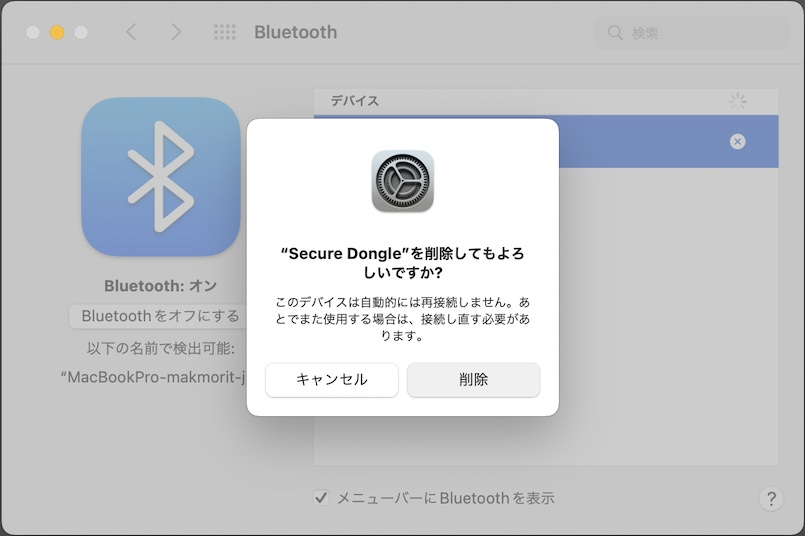
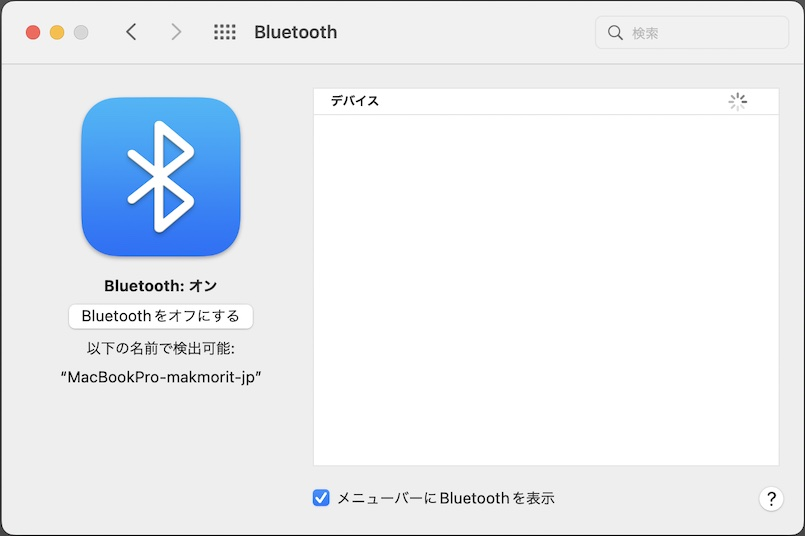
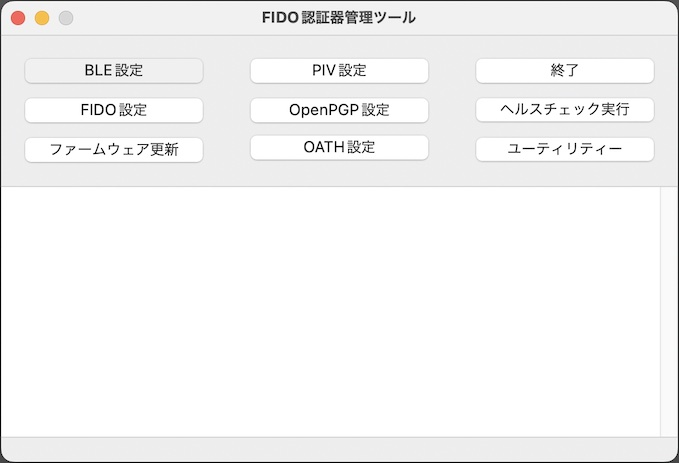
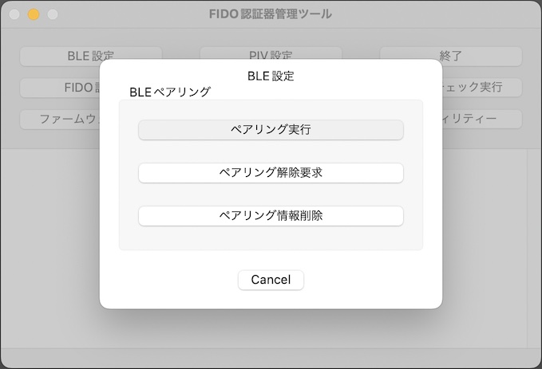
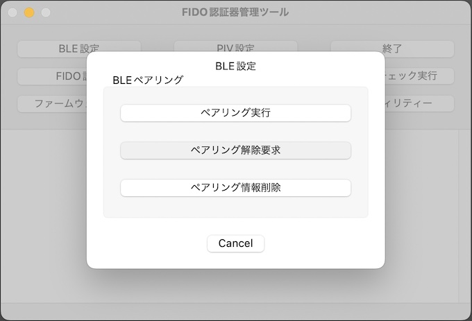
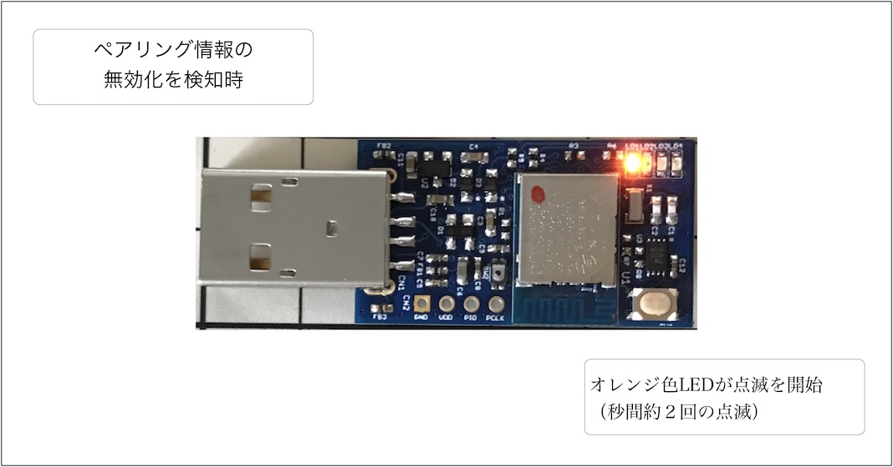
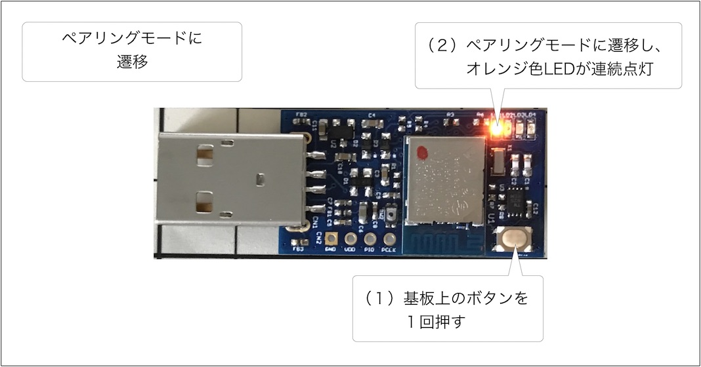
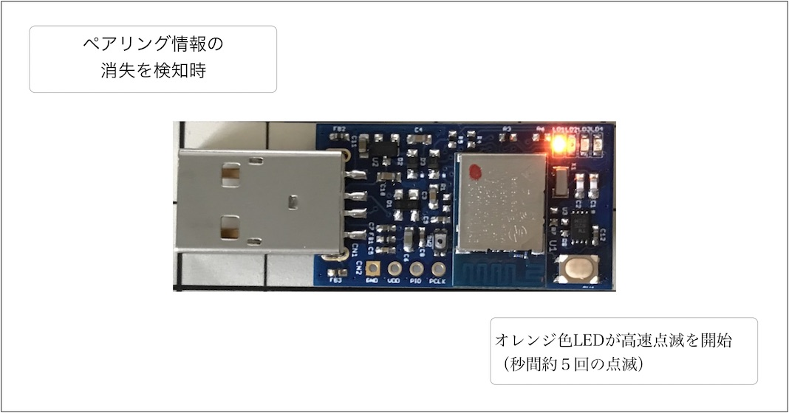

# BLEペアリング手順

## 概要

[FIDO認証器管理ツール](../../MaintenanceTool/macOSApp/README.md)を使用し、PCとFIDO認証器をBLEペアリングする手順について掲載しています。

#### 使用機材

本ドキュメントでは「[MDBT50Q Dongle](../../FIDO2Device/MDBT50Q_Dongle/README.md)」を、FIDO2認証器として使用します。

まずは、背面にあるボタン電池ケースに電池をセットし、BLEペリフェラル・モードで起動されていることをご確認ください。 
（MDBT50Q Dongleの青色LEDが点滅していることを確認します）

## ペアリングの実行

PCとFIDO認証器をBLEペアリングします。

#### ペアリング設定の事前削除

もし、PC側にペアリング相手のFIDO認証器のペアリング設定が存在する場合は、ペアリング実行前に必ず削除してください。

PCのBluetooth設定画面を開き、ペアリング設定を削除します。

確認ダイアログが表示されますので、続行するには「削除」をクリックします。

ペアリング相手のFIDO認証器のペアリング設定が削除されたことを確認します。

#### ペアリングモードに遷移

ペアリング相手のFIDO認証器を、ペアリングモードに遷移させます。 
基板上のボタンを３秒以上長押してから離すと、下図のように基板上の橙色LEDが点灯します。

これで、FIDO認証器がペアリングモードに遷移しました。

#### ペアリングの実行

管理ツール画面の「BLE設定」ボタンをクリックします。

BLE設定画面がポップアップ表示されたら「ペアリング実行」ボタンをクリックします。

ペアリング処理が開始されますので、そのまま待ちます。

下図のような接続画面がポップアップ表示された場合は「接続」ボタンをクリックします。

ペアリング処理が正常終了すると、下図のようなポップアップが表示され、処理が成功したことを知らせます。

#### BLE接続を確認

BLE PINGを実行し、PCとFIDO認証器がBLE接続できることを確認します。 

管理ツールのヘルスチェック実行画面で「BLE > PINGテスト実行」をクリックすると、BLE PING（BLE接続テスト）処理が開始されます。

BLE PING処理が正常終了すると、下図のようなポップアップが表示され、処理が成功したことを知らせます。

以上で、BLEペアリングの実行は完了となります。

## ペアリングの解除

PCとFIDO認証器のペアリングが不要となった場合は、macOSと認証器におけるペアリング情報を両方削除する必要があります。

他方、macOSのペアリング情報（Bluetooth環境設定画面の一覧に登録されたデバイス）は、管理ツールを含むmacOS上のユーザー・アプリケーションから直接削除できません。 
そこでmacOS版管理ツールでは「<b>ペアリング解除要求</b>」機能を用意しています。

ペアリング解除要求は、ペアリング解除（Bluetooth環境設定画面の一覧からデバイスを削除）を行うため、一時的に管理ツールと認証器を、BLE接続されたままの状態にする機能です。 
このBLE接続状態は、約３０秒キープされますので、この間にペアリング解除を行っていただくことにより、安全かつ確実に、macOS／認証器のペアリング情報を両方削除できます。

#### 操作手順

管理ツール画面の「BLE設定」ボタンをクリックします。

BLE設定画面がポップアップ表示されたら「ペアリング解除要求」ボタンをクリックします。

下図のようなメッセージが表示され、管理ツールと認証器が、BLE接続されたままの状態に遷移します。 
このBLE接続状態は、約３０秒キープされます。

macOSのシステム環境設定から「Bluetooth環境設定」画面を表示します。 
下図のように、MDBT50Q Dongleのデバイス名「Secure Dongle」が「接続済み」状態である事を確認します。

「Secure Dongle」を選択し、×ボタンをクリックします。

下図のような画面がポップアップ表示されますので「削除」ボタンをクリックします。

認証器からBLE接続が切断され、ペアリング解除要求処理が正常終了すると、下図のようなポップアップが表示され、処理が成功したことを知らせます。

以上で、ペアリング解除は完了となります。

## BLEペアリング情報の削除

FIDO認証器のBLEペアリングが不要となった場合は、USBに接続することにより、認証器上のペアリング情報を強制的に削除することができます。

#### 認証器上のペアリング情報を削除

管理ツールを起動し、USBポートにMDBT50Q Dongleを装着します。 
管理ツール画面下部のメッセージ欄に「USB HIDデバイスに接続されました。」と表示されることを確認したら、管理ツール画面の「BLE設定」ボタンをクリックします。

BLE設定画面がポップアップ表示されたら「ペアリング情報削除」ボタンをクリックします。

確認ダイアログが表示されます。 
処理を続行したい場合は「Yes」をクリックします。

ペアリング情報削除処理が正常終了すると、下図のようなポップアップが表示され、処理が成功したことを知らせます。

以上で、BLEペアリング情報の削除は完了となります。

## ペアリングエラー発生時の対応

何らかの事由により、MDBT50Q DongleとPCのペアリング情報に不整合が生じた場合、以下のようなペアリングエラーが発生する可能性があります。

- <b>MDBT50Q Dongleのペアリング情報が無効化</b> 
PC側のペアリング情報を環境設定画面から削除してしまった後、PCからMDBT50Q DongleのBLE機能を実行すると発生します。 
再度ペアリングを実行する事で、復旧させることができます。

- <b>MDBT50Q Dongleのペアリング情報が消失</b> 
管理ツールの「ペアリング情報削除」機能により、MDBT50Q Dongleからすべてのペアリング情報を消去した後、PC側に残存しているペアリング情報を使用して、再度ペアリングを試行すると、発生します。 
PC側のペアリング情報を削除後、再度ペアリングを実行する事で、復旧させることができます。

以下に、エラー発生時の対応を掲載いたします。

### ペアリング情報が無効化時の対応

ペアリング情報無効化を検知した場合、MDBT50Q Dongleの基板上のオレンジ色LEDが点滅します。 
（秒間約２回の点滅）

この場合は、ペアリングを再度実行することにより、復旧させることができます。 
基板上のボタンを１回押すと、ペアリングモードに遷移し、オレンジ色LEDが連続点灯します。

以降は、前述<b>「ペアリングの実行」</b>に記載した手順で、ペアリングを再度実行願います。

### ペアリング情報が消失時の対応

ペアリング情報消失を検知した場合、MDBT50Q Dongleの基板上のオレンジ色LEDが高速点滅します。 
（秒間約５回の点滅）

この場合は、まず、PC側に残存しているペアリング情報を削除してください。

その後、基板上のボタンを１回押すと、ペアリングモードに遷移し、オレンジ色LEDが連続点灯します。 

以降は、前述<b>「ペアリングの実行」</b>に記載した手順で、ペアリングを再度実行願います。

