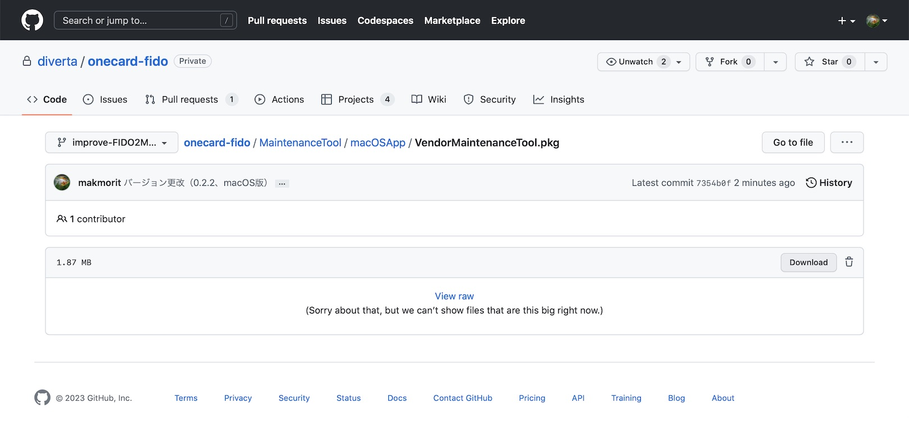
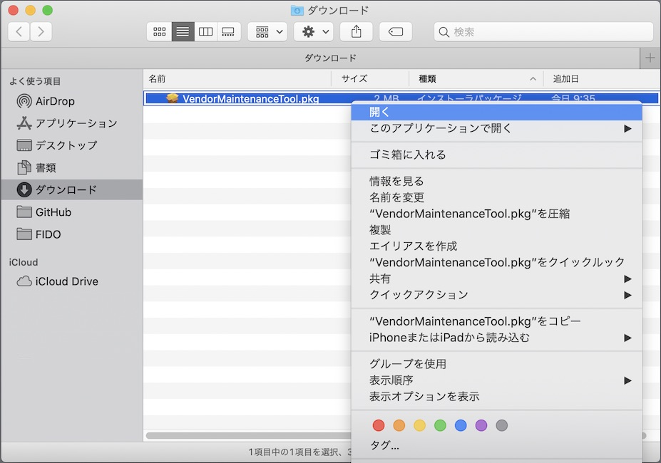
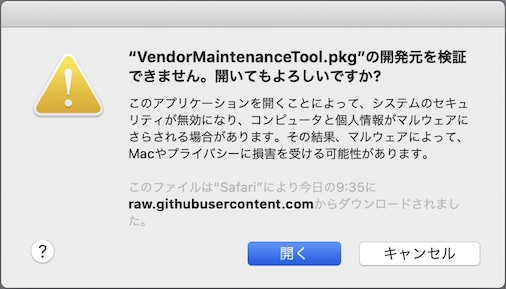
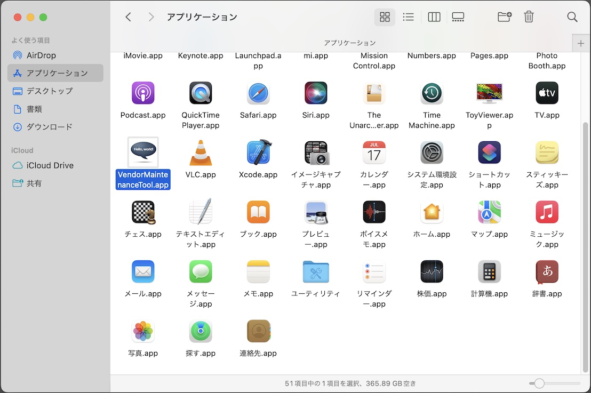
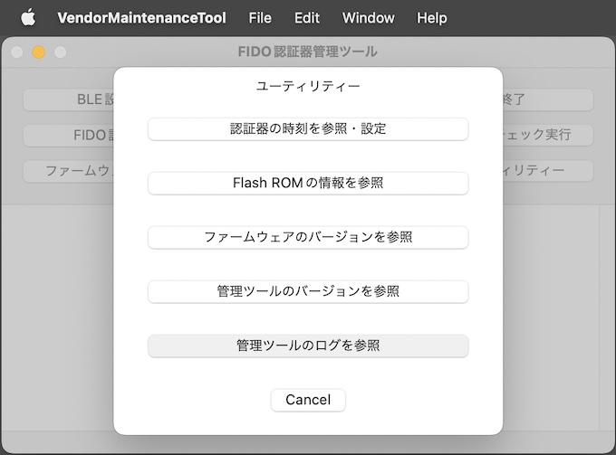

# macOS版開発ツール インストール手順

最終更新日：2022/6/28

## 概要
FIDO認証器開発ツールをmacOS環境にインストールする手順を掲載しています。

## インストール媒体の取得

[macOS版 FIDO認証器開発ツール](DevelopmentTool.pkg)を、GitHubからダウンロード／解凍します。 
該当ページの「Download」ボタンをクリックすると、[DevelopmentTool.pkg](DevelopmentTool.pkg)がダウンロードできます。

## インストールの実行

ダウンロードされたファイルを右クリックし「開く」を実行してください。 
（最終更新日現在、アプリに署名がされていないので、アイコンをダブルクリックしても実行することができないための措置になります）

警告画面が表示されますが、続いて「開く」を実行します。

インストーラーが起動しますので、指示に従いインストールを進めます。

インストールが完了すると、アプリケーションフォルダーに、FIDO認証器開発ツールのアイコンができます。 
アイコンをダブルクリックして実行します。

FIDO認証器開発ツールの画面が起動すれば、インストールは完了です。

