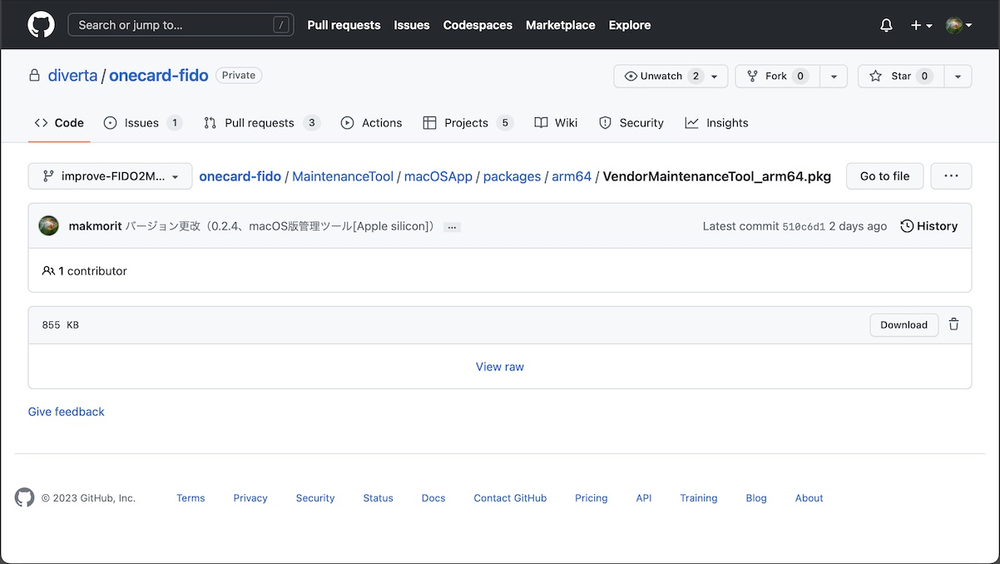
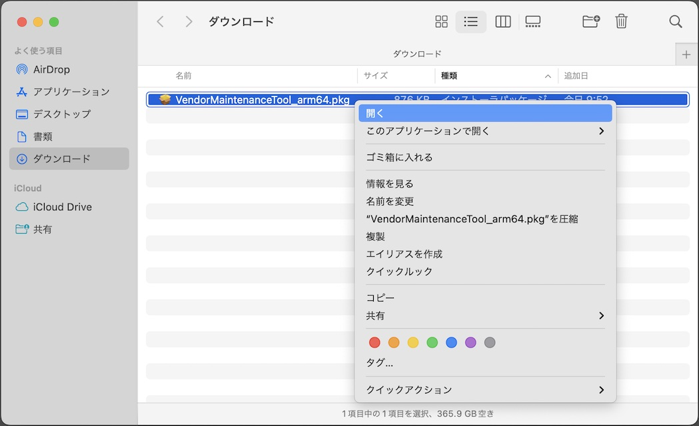

# 開発ツールのログファイル

## 概要
FIDO認証器開発ツールから出力されるログファイルについて説明します。

## ログファイルの場所

FIDO認証器開発ツールの実行中に出力されるログは、macOSのユーザーディレクトリー配下のログファイル（下記の場所）に保存されます。

`$HOME/Library/Logs/Diverta/FIDO/DevelopmentTool.log`

具体的には、例えば `/Users/user/Library/Logs/Diverta/FIDO/DevelopmentTool.log` といったパスになります。

### ログファイルの場所を開く

ログファイルの格納場所を、macOSのFinderで開くことができます。<br>
開発ツールの「ユーティリティー」画面で「開発ツールのログを参照」ボタンをクリックします。



ログファイル「`DevelopmentTool.log`」を格納するディレクトリーが、Finderで表示されます。



ログファイルは通常のテキストファイルですので、適宜、テキストエディターにより内容を参照することが可能です。

また、コマンド`tail -f $HOME/Library/Logs/Diverta/FIDO/DevelopmentTool.log`を実行することにより、実行中に出力されるログをリアルタイム参照することも可能です。<br>
（macOSのターミナルアプリによるログ参照と等価の動きになります）

## ログファイルの内容

macOSアプリの一般的な形式で出力されます。<br>
ログの出力イメージは以下のようになります。
```
2022-06-27 17:18:12.640 [info] FIDO認証器開発ツールを起動しました: Version 0.1.1
2022-06-27 17:18:12.643 [info] USBデバイス検知を開始しました。
2022-06-27 17:18:12.671 [info] USB HIDデバイスに接続されました。
2022-06-27 17:18:48.497 [info] 鍵・証明書インストールを開始します。
2022-06-27 17:18:48.497 [debug] HID Sent INIT frame: data size=8 length=8
ff ff ff ff 86 00 08 71 cb 1c 3b 10 8e c9 24
2022-06-27 17:18:48.515 [debug] HID Recv INIT frame: data size=17 length=17
ff ff ff ff 86 00 11 71 cb 1c 3b 10 8e c9 24 01
00 33 01 02 05 00 02 07
2022-06-27 17:18:48.517 [debug] HID Sent INIT frame: data size=612 length=57
01 00 33 01 c8 02 64 cf 91 6d 82 30 03 cb 4b 4d
c8 6a ff 05 14 49 c1 f4 11 fc 67 37 b7 3a 71 53
a3 4e 65 0d 03 95 d0 30 82 02 40 30 82 01 e6 a0
03 02 01 02 02 01 00 30 09 06 07 2a 86 48 ce 3d
2022-06-27 17:18:48.517 [debug] HID Sent CONT frame: seq=0 length=59
01 00 33 01 00 04 01 30 7e 31 0b 30 09 06 03 55
04 06 13 02 4a 50 31 0e 30 0c 06 03 55 04 08 13
05 54 6f 6b 79 6f 31 14 30 12 06 03 55 04 07 13
0b 53 68 69 6e 6a 75 6b 75 2d 6b 75 31 15 30 13
:
2022-06-27 17:18:48.520 [debug] HID Sent CONT frame: seq=8 length=59
01 00 33 01 08 07 2a 86 48 ce 3d 04 01 03 49 00
30 46 02 21 00 aa 70 2e 05 68 d5 4a 82 9d 25 cf
89 f7 43 c4 86 60 ec 74 65 61 e0 93 6f 84 56 c1
8d 04 ba 82 3d 02 21 00 b5 cc dd 5e 20 38 ea 5b
2022-06-27 17:18:48.520 [debug] HID Sent CONT frame: seq=9 length=24
01 00 33 01 09 a9 26 13 94 5c 91 39 ac 6e 71 4c
29 73 4b 68 d2 06 55 ef b6 4a ab 49 af
2022-06-27 17:18:48.707 [debug] HID Recv INIT frame: data size=1 length=1
01 00 33 01 c8 00 01 00
2022-06-27 17:18:48.714 [info] 鍵・証明書インストールが成功しました。
2022-06-27 17:18:51.157 [info] FIDO認証器開発ツールを終了しました。
```
