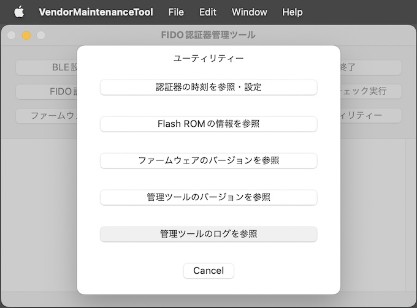
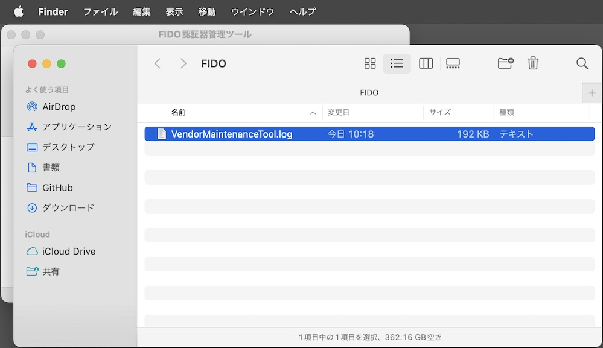

# 管理ツールのログファイル

## 概要
[FIDO認証器管理ツール（ベンダー向け）](../../MaintenanceTool/macOSApp/DEVTOOL.md)から出力されるログファイルについて説明します。

## ログファイルの場所

FIDO認証器管理ツールの実行中に出力されるログは、macOSのユーザーディレクトリー配下のログファイル（下記の場所）に保存されます。

`$HOME/Library/Logs/Diverta/FIDO/VendorMaintenanceTool.log`

具体的には、例えば `/Users/user/Library/Logs/Diverta/FIDO/VendorMaintenanceTool.log` といったパスになります。

### ログファイルの場所を開く

ログファイルの格納場所を、macOSのFinderで開くことができます。<br>
管理ツールの「ユーティリティー」画面で「管理ツールのログを参照」ボタンをクリックします。



ログファイル「`VendorMaintenanceTool.log`」を格納するディレクトリーが、Finderで表示されます。



ログファイルは通常のテキストファイルですので、適宜、テキストエディターにより内容を参照することが可能です。

また、コマンド`tail -f $HOME/Library/Logs/Diverta/FIDO/VendorMaintenanceTool.log`を実行することにより、実行中に出力されるログをリアルタイム参照することも可能です。<br>
（macOSのターミナルアプリによるログ参照と等価の動きになります）

## ログファイルの内容

macOSアプリの一般的な形式で出力されます。<br>
ログの出力イメージは以下のようになります。
```
2023-03-13 10:06:44.038 [info] FIDO認証器管理ツールを起動しました: Version 0.2.4
2023-03-13 10:06:44.062 [info] USB HIDデバイスに接続されました。
2023-03-13 10:07:01.446 [info] HID PINGテストを開始します。
2023-03-13 10:07:01.447 [debug] HID Sent INIT frame: data size=8 length=8
ff ff ff ff 86 00 08 71 cb 1c 3b 10 8e c9 24
2023-03-13 10:07:01.462 [debug] HID Recv INIT frame: data size=17 length=17
ff ff ff ff 86 00 11 71 cb 1c 3b 10 8e c9 24 01
00 33 01 02 05 00 02 07
2023-03-13 10:07:01.463 [debug] HID Sent INIT frame: data size=100 length=57
01 00 33 01 81 00 64 67 98 74 a9 20 8c f0 63 83
37 7f 1c 82 0d 3b 46 90 6b 8d 95 e0 16 ca ed e4
5d 0f 05 d3 ea 95 39 4d fd 10 5e c2 5f c7 25 ba
cd 6f be a8 9b 80 09 d8 f1 47 50 f5 40 75 c7 2b
:
2023-03-13 10:07:01.492 [debug] HID Recv CONT frame: seq=0 length=43
01 00 33 01 00 cb cb bf e2 db 31 59 76 ff b0 c8
98 1d 2b bc 17 36 9f 82 15 f5 de 16 7c ee 38 f4
79 6d b5 64 7e 9e 5a dc be 23 91 a4 f9 08 b2 98
2023-03-13 10:07:01.493 [info] HID PINGテストが成功しました。
2023-03-13 10:07:09.026 [info] FIDO認証器管理ツールを終了しました。
```
