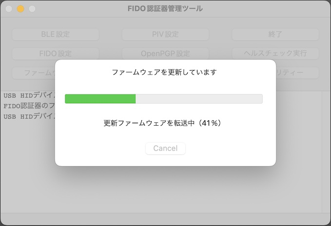

# ファームウェア更新機能

## 概要
USBブートローダーを導入した[MDBT50Q Dongle](../../FIDO2Device/MDBT50Q_Dongle/README.md)に対し、管理ツールから、ファームウェアを更新できる機能です。<br>
nRF52 SDKのDFU機能（[Secure DFU Bootloader over Serial Link (UART/USB)](https://infocenter.nordicsemi.com/topic/com.nordic.infocenter.sdk5.v15.3.0/sdk_app_serial_dfu_bootloader.html)）を使用して実装されています。

## 前提

[MDBT50Q Dongle](../../FIDO2Device/MDBT50Q_Dongle/README.md)に、<b>[署名機能付きUSBブートローダー](../../nRF5_SDK_v15.3.0/firmwares/secure_bootloader)</b>が導入されていることが前提となります。<br>
署名機能付きUSBブートローダーの導入方法につきましては、「<b>[署名機能付きUSBブートローダー移行手順書](../../nRF5_SDK_v15.3.0/firmwares/secure_bootloader/MIGRATION.md)</b>」をご参照願います。

## 操作方法
「<b>[ファームウェア更新手順](UPDATEFIRMWARE.md)</b>」をご参照願います。

## プログラムの実装

プログラム実装に関する情報を掲載いたします。

#### メニュー選択〜処理開始画面の表示

管理ツールの<b>ファームウェア更新（以下「DFU」）</b>機能は`ToolDFUCommand`というクラス（以下「DFU処理クラス」）で実装されています。<br>
メイン画面クラスに、以下のようなプロパティーを定義し、DFU処理クラスをインスタンス化します。

```
@property (nonatomic) ToolDFUCommand    *toolDFUCommand;
:
- (void)applicationDidFinishLaunching:(NSNotification *)aNotification {
  :
  // DFU機能の初期設定
  [self setToolDFUCommand:[[ToolDFUCommand alloc] initWithDelegate:self]];
  :
}
```


IBAction（メニュー選択）により、メソッド`dfuProcessWillStart`を呼び出すと、DFU処理実行が開始されます。<br>
事前に、`checkUSBHIDConnection`により、MDBT50Q DongleがPCのUSBポートに装着されているかチェックします。

```
- (IBAction)menuItemDFUTestDidSelect:(id)sender {
    if ([self checkUSBHIDConnection]) {
        [self enableButtons:false];
        [[self toolDFUCommand] dfuProcessWillStart:self parentWindow:[self window]];
    }
}
```

`dfuProcessWillStart`が呼び出されると、処理開始画面（下図ご参照）がモーダル表示されます。

```
- (void)dfuProcessWillStart:(id)sender parentWindow:(NSWindow *)parentWindow {
    :
    // 処理開始画面（ダイアログ）をモーダルで表示
    [self dfuStartWindowWillOpen];
}
```

処理開始画面（`DFUStartWindow`）は下図のようなイメージになります。


#### 処理開始画面〜処理進捗画面の表示

処理開始画面上でOKボタンをクリックすると、DFU処理クラスのメソッド`commandWillChangeToBootloaderMode`が呼び出されます。

```
- (IBAction)buttonOKDidPress:(id)sender {
    if ([[self toolDFUCommand] checkUSBHIDConnection]) {
        // HID接続がある場合は、DFU対象デバイスをブートローダーモードに遷移させる
        [[self toolDFUCommand] commandWillChangeToBootloaderMode];
    }
}
```

`commandWillChangeToBootloaderMode`では、MDBT50Q Dongleに対し、ブートローダーモード遷移コマンドをHID経由で投入します。<br>
MDBT50Q Dongleからレスポンスが戻ると、`notifyBootloaderModeResponse`が呼び出されます。

```
- (void)commandWillChangeToBootloaderMode {
    dispatch_async([self subQueue], ^{
        // ブートローダー遷移コマンドを実行 --> notifyBootloaderModeResponseが呼び出される
        [[self toolHIDCommand] hidHelperWillProcess:COMMAND_HID_BOOTLOADER_MODE
                                           withData:nil forCommand:self];
    });
}

- (void)notifyBootloaderModeResponse:(NSData *)message CMD:(uint8_t)cmd {
    // ブートローダーモード遷移コマンド成功時
    if (cmd == HID_CMD_BOOTLOADER_MODE) {
        // ブートローダーモード遷移判定フラグをセット --> hidCommandDidDetectRemovalが呼び出される
        [self setNeedCheckBootloaderMode:true];
        ：
    }
}
```
他方、MDBT50Q Dongleがブートローダーモードに遷移すると、今まで接続状態だったUSB HID接続が無効化され、代わりに仮想COMポートがオープンされます。<br>
管理ツールでは、このイベントを関数`hidCommandDidDetectRemoval`で検知します。

```
- (void)hidCommandDidDetectRemoval:(id)toolHIDCommandRef {
    // ブートローダーモード遷移判定フラグがセットされている場合（モード遷移完了待ち）
    if ([self needCheckBootloaderMode]) {
        // ブートローダーモード遷移判定フラグをリセット
        [self setNeedCheckBootloaderMode:false];
        // サブスレッドでDFU対象デバイスへの接続処理を実行
        [self EstablishDFUConnection];
    }
}
```

USB HID接続無効化を検知したら、関数`EstablishDFUConnection`で、ブートローダーモードに遷移したMDBT50Q Dongleに対し、仮想COMポート経由でUSB CDC ACM接続を実行します。<br>
完了すると、処理結果を処理開始画面に引き渡すため、`commandDidVerifyDFUConnection`を呼び出します。

```
- (void)EstablishDFUConnection {
    dispatch_async([self subQueue], ^{
        // サブスレッドで、DFU対象デバイスに対し、USB CDC ACM接続を実行
        bool result = [self searchACMDevicePath];
        dispatch_async([self mainQueue], ^{
            // 処理結果を処理開始画面に引き渡す
            [[self dfuStartWindow] commandDidChangeToBootloaderMode:result];
        });
    });
}
```

この後、処理開始画面が自動的に閉じられます。

```
- (void)commandDidChangeToBootloaderMode:(bool)available {
    ：
    // このウィンドウを終了
    [self terminateWindow:NSModalResponseOK];
}
```

DFU処理クラスは、処理開始画面クローズ時に、処理進捗画面（下図ご参照）をモーダル表示し、DFU処理を別スレッドで開始させます。

```
- (void)dfuStartWindowDidClose:(id)sender modalResponse:(NSInteger)modalResponse {
    // 画面を閉じる
    [[self dfuStartWindow] close];
    :
    // 処理進捗画面（ダイアログ）をモーダルで表示
    [self dfuProcessingWindowWillOpen];
    // 処理進捗画面にDFU処理開始を通知
    [[self dfuProcessingWindow] commandDidStartDFUProcess];
    // サブスレッドでDFU処理を実行開始
    [self startDFUProcess];
}
```

処理進捗画面（`DFUProcessingWindow`）は下図のようなイメージになります。



#### 処理進捗更新〜更新イメージ転送完了

処理進捗画面が表示されると、まず最初に、DFU処理クラスからDFU処理開始が通知されます。<br>
処理進捗画面上の緑色のプログレスバーを伸ばすための、進捗カウントアップが開始されます。
```
- (void)commandDidStartDFUProcess {
    // 画面項目を初期化
    [self initFieldValue];
    // プログレスバーの進捗カウントアップを開始
    [NSTimer scheduledTimerWithTimeInterval:1.0 target:self
                                   selector:@selector(countupProgressValue:)
                                   userInfo:nil repeats:YES];
}
```
プログレスバーは、１秒ごとに１ステップずつ右側に伸びます。<br>
実機計測の結果、DFU処理が約２０秒前後で完了するため、このような仕様としております。

```
- (void)countupProgressValue:(NSTimer *)timer {
    // プログレスバーの進捗を１秒ごとにカウントアップ
    NSInteger progress = [[self levelIndicator] integerValue] + 1;
    [[self levelIndicator] setIntegerValue:progress];
    :
}
```

続いて、DFU処理クラスは、DFU処理中にその進捗をメッセージ文言により通知（`notifyProgress`）します。
```
- (bool)performDFUProcess {
    // DFUを実行
    [self notifyProgress:MSG_DFU_PROCESS_TRANSFER_IMAGE];
    bool ret = [self performDFU]; // <-- DFU処理の本体。この中で転送処理が実行される
    :
    if (ret == false) {
        // DFU転送失敗時
        [self notifyErrorMessage:MSG_DFU_IMAGE_TRANSFER_FAILED];
    } else {
        // DFU転送成功時は、バージョン更新判定フラグをセット
        [self notifyMessage:MSG_DFU_IMAGE_TRANSFER_SUCCESS];
        :
    }
    return ret;
}

```

処理進捗画面は、進捗通知（`notifyProgress`）により、画面上の進捗メッセージを切り替えます。<br>
下図は、ファームウェア更新イメージ転送が完了後、MDBT50Q Dongleでファームウェア更新が反映されるのを待機している様子です。


#### 更新イメージ転送完了〜反映確認（処理完了）

DFU処理クラスでは、管理ツールに同梱されたファームウェア更新イメージファイル（`app_dfu_package.<バージョン文字列>.zip`）を、MDBT50Q Dongleに転送したのち、USB HID経由でバージョン情報を照会し、ファームウェア更新の反映確認を行うようにしています。<br>
そのため、管理ツールで、USB HID接続が再開されたことを検知する必要があります。

メイン画面は、HID関連処理クラス（`ToolHIDCommand`）経由でUSB HID接続が検知されると、その旨をDFU処理クラスに通知するよう実装しています。

```
- (void)hidCommandDidDetectConnect {
    [[ToolLogFile defaultLogger] info:MSG_HID_CONNECTED];
    // DFU処理にHID接続開始を通知
    [[self toolDFUCommand] hidCommandDidDetectConnect:[self toolHIDCommand]];
}
```

DFU処理クラスは、通知を受けるとMDBT50Q Dongleに対し、現在バージョン（MDBT50Q Dongle上に反映されているバージョン）を問い合わせます。

```
- (void)hidCommandDidDetectConnect:(id)toolHIDCommandRef {
    :
    // USB HID経由でバージョン照会コマンドを実行
    [self setToolHIDCommand:(ToolHIDCommand *)toolHIDCommandRef];
    dispatch_async([self subQueue], ^{
        // サブスレッドでバージョン情報照会を実行 --> notifyFirmwareVersionが呼び出される
        [[self toolHIDCommand] hidHelperWillProcess:COMMAND_HID_GET_VERSION_FOR_DFU
                                           withData:nil forCommand:self];
    });
}
```

MDBT50Q Dongleからバージョン情報が応答されると、MDBT50Q Dongleに転送したファームウェアのバージョンと、現在バージョンを比較します。

```
- (void)notifyFirmwareVersion:(NSString *)strFWRev {
    :
    // バージョン更新判定フラグがセットされている場合（ファームウェア反映待ち）
    if ([self needCompareUpdateVersion]) {
        // バージョン情報を比較して終了判定
        bool result = [self compareUpdateVersion:strFWRev];
        [[self dfuProcessingWindow] commandDidTerminateDFUProcess:result];
    }
}
```

前述の比較結果、バージョンが同じであれば反映確認OKと判定し、DFU処理が正常終了します。


## プログラムの仕様

プログラムの仕様に関する情報を掲載いたします。

#### DFUの流れについて

DFU機能は、以下の流れで行われます。

| # |項目 |処理内容 |
|:-:|:-|:-|
|1|処理タイムアウト監視開始|３０秒経過でタイムアウトと判定します。<br>（DFUの所要時間は21秒前後です）|
|2|DFU処理開始指示|サブスレッド上で行われます。|
|3|DFUイメージ抽出|ファームウェア更新イメージファイルを読込み、DFUイメージを抽出します。<br>また、イメージファイル名から更新バージョン文字列を取得します。<br>ファイル名は`app_dfu_package.<バージョン文字列>.zip`になります。|
|4|DFU対象デバイスに接続|nRF52840に、仮想COMポート経由で接続します。|
|5|DFU処理実行|nRF52840に、前述のDFUイメージを転送します。|
|6|DFU対象デバイスから切断|　|
|7|反映待機|DFUイメージ転送完了後、nRF52840アプリケーションが自動起動し、<br>USB HID接続が検出されるまで待機します。|
|8|バージョン情報照会|USB HID接続が再開されたら、HID経由でバージョン情報照会を実行します。|
|9|バージョンチェック|バージョン情報照会で取得したバージョン文字列をチェックし、<br>イメージファイル名から取得した更新バージョン文字列と等しければ、<br>DFU処理は完了となります。|


前述の `5`「DFU実行」は、以下の流れで行われます。

| # |項目 |処理内容 |
|:-:|:-|:-|
|1|DFU対象デバイスの通知設定|nRF52840とのデータ受け渡し（セッション）を開始します。|
|2|DFU対象デバイスからMTUを取得|DFUイメージのバイナリーデータ送信１回あたりのフレームサイズ<br>（MTU）を取得します。|
|3|datイメージ転送|プログラムイメージのFlash ROM配置の処理前に必要となる情報<br>（`Init packet`）を転送します。|
|4|binイメージ転送|Flash ROMに配置されるプログラムイメージを転送します。|

#### DFUセッションの内容

DFUの処理において受け渡しされるデータは以下のようになります。

| # |項目 |リクエスト | レスポンス |
|:-:|:-|:-|:-|
|0|DFU対象デバイスのPING [注1]|`09 ac c0`|`60 09 01 ac c0`|
|1|DFU対象デバイスの通知設定|`02 00 00 c0`|`60 02 01 c0`|
|2|DFU対象デバイスからMTUを取得|`07 c0`|`60 07 01 03 08 c0`<br>[注2]|
|3|datイメージ転送 [注3]|||
|3-1| SELECT OBJECT|`06 01 c0`|`60 06 01 00 02 00 00 00`<br>`00 00 00 00 00 00 00 c0`|
|3-2| CREATE OBJECT|`01 01 8e 00 00 00 c0`|`60 01 01 c0`|
|3-3| WRITE OBJECT|`08 <datイメージ> c0`<br>[注4]|なし|
|3-4| CRC GET|`03 c0`|`60 03 01 8e 00 00 00 a1`<br>`09 db dd fb c0`|
|3-5| EXECUTE OBJECT|`04 c0`|`60 04 01 c0`|
|4|binイメージ転送 [注5]|||
|4-1| SELECT OBJECT|`06 02 c0`|`60 06 01 00 10 00 00 00`<br>`00 00 00 00 00 00 00 c0`<br>[注6]|
|4-2| CREATE OBJECT|`01 02 00 10 00 00 c0`|`60 01 01 c0`|
|4-3| WRITE OBJECT|`08 <binイメージ> c0`<br>[注4]|なし|
|4-4| CRC GET|`03 c0`|`60 03 01 00 10 00 00 70`<br>`2e 06 f9 c0`|
|4-5| EXECUTE OBJECT|`04 c0`|`60 04 01 c0`|

[注1] 前述「DFU対象デバイスに接続」（メソッド`getConnectedDevicePath`）内で実行されます。DFU対象デバイスが接続されているかどうかのチェックを行うために実行します。<br>
[注2] レスポンスの4〜5バイト目に、リトルエンディアン形式で、MTUの最大値が格納されています。上記例では`0x0803`（2,051バイト）になります。ただし、nRF52の仕様上、イメージデータは4の倍数のサイズごとに送信する必要があるため、このケースでは実際のMTUを、2,048としております。<br>
[注3] `3-1`〜`3-5`の処理が、順番に１度だけ行われます。<br>
[注4] `<datイメージ>`にはdatイメージのバイト配列が、`<binイメージ>`にはbinイメージのバイト配列が入ります。また、nRF52の仕様上、特定のバイトデータをエスケープする必要があります（`c0`->`0xdbdc`, `0xdb`->`0xdbdd` に変換）。<br>
[注5] `4-1`の処理が１度だけ行われ、あとは１回あたり最大転送サイズ（4,096バイト）ごとに、`4-2`〜`4-5`の処理が繰り返されます。<br>
[注6] 前述「１回あたり最大転送サイズ」が、レスポンスの4〜5バイト目に、リトルエンディアン形式で格納されています。上記例では`0x1000`（4,096バイト）になります。
