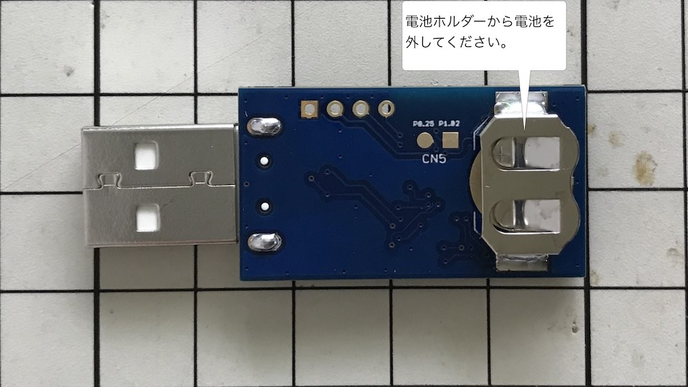
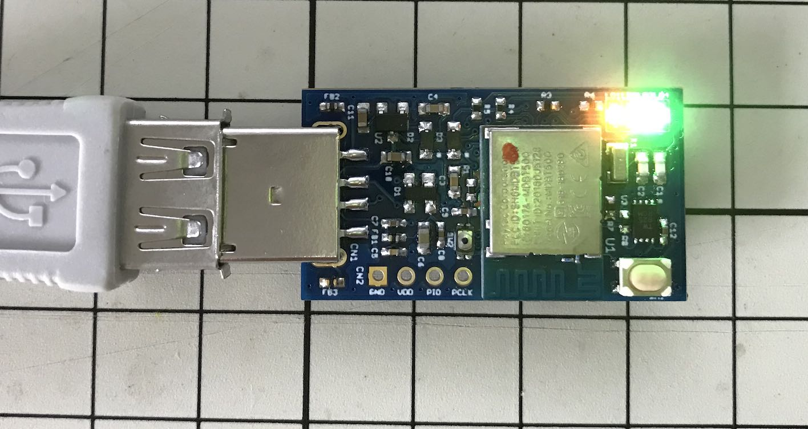
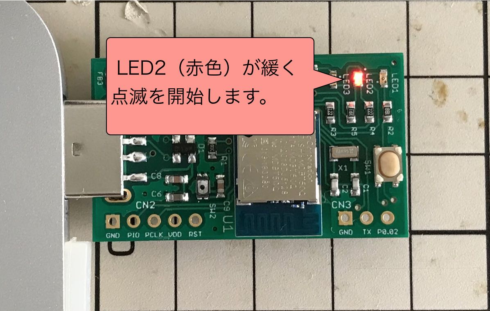
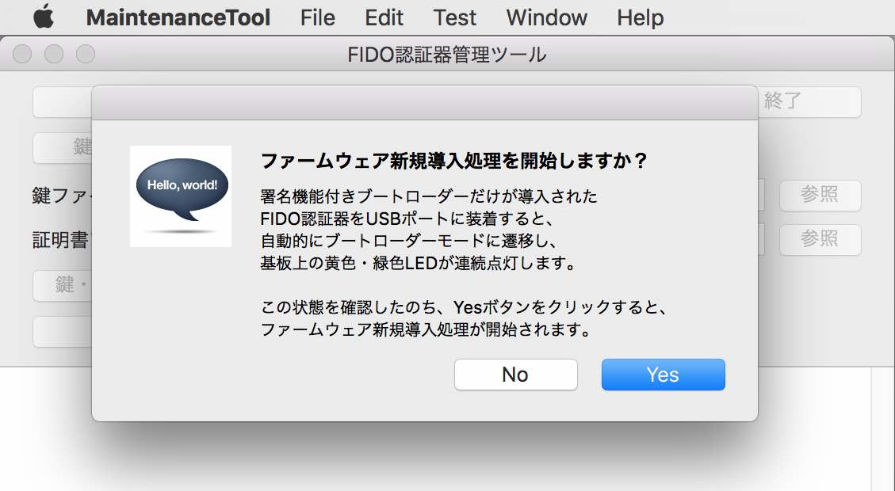
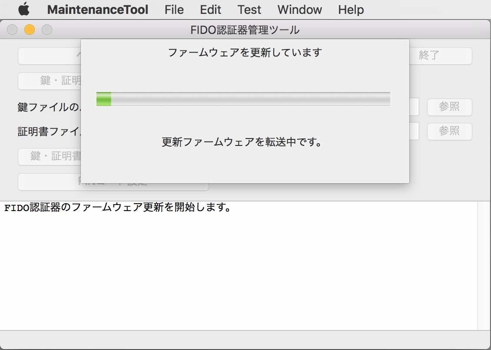
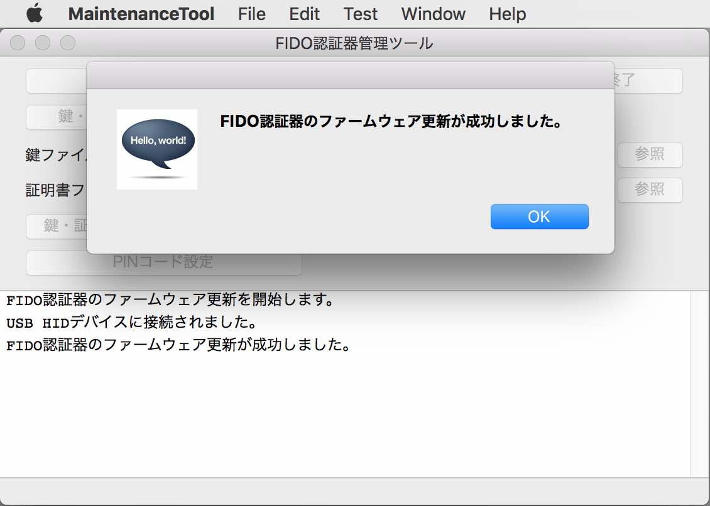
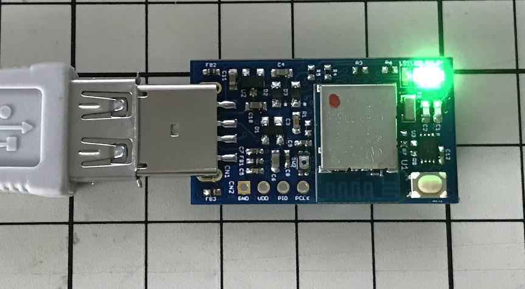

# ファームウェア新規導入手順

## 概要

[FIDO認証器管理ツール](README.md)を使用し、[MDBT50Q Dongle](../../FIDO2Device/MDBT50Q_Dongle/README.md)に、アプリケーション・ファームウェアを新規導入する手順を掲載します。

### ご注意

アプリケーション・ファームウェアが導入されていない状態の、最新版MDBT50Q Dongle（rev2.1.2）をご使用ください。

既にアプリケーション・ファームウェアが導入されているMDBT50Q Dongleに対しては、本機能は使用できません。

## 操作方法

まず最初に、MDBT50Q Dongleの背面にあるボタン電池ケースに、電池が入っていないことを必ず確認します。

次に、署名機能付きUSBブートローダーだけが導入されている状態のMDBT50Q Dongleを、PCのUSBポートに装着します。 
MDBT50Q Dongleは、自動的にブートローダーモードに遷移します。

MDBT50Q Dongleの緑色・黄色のLEDが同時点灯していることを確認します。

管理ツールを起動し、ファイルメニューから「ファームウェアを新規導入」を選択します。

確認ダイアログが表示されますので「Yes」ボタンをクリックすると、ファームウェア更新処理がスタートします。

ほどなく、現在の進捗を示すダイアログが表示されます。 
まずはファームウェア更新イメージが転送中であることを知らせています。

次に、MDBT50Q Dongle内で、転送されたファームウェア更新イメージが反映中であることを知らせています。

ファームウェア更新処理が正常終了すると、下図のようなポップアップが表示され、処理が成功したことを知らせます。

MDBT50Q Dongleの緑色のLEDが点滅していることを確認します。

以上で、ファームウェア新規導入処理は完了となります。
