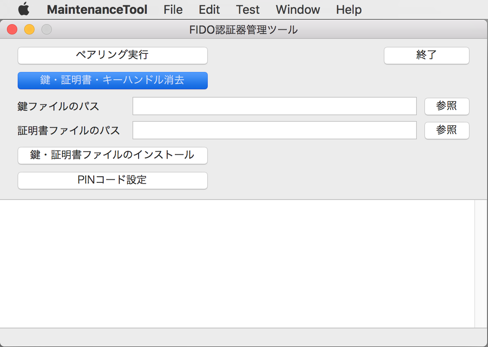
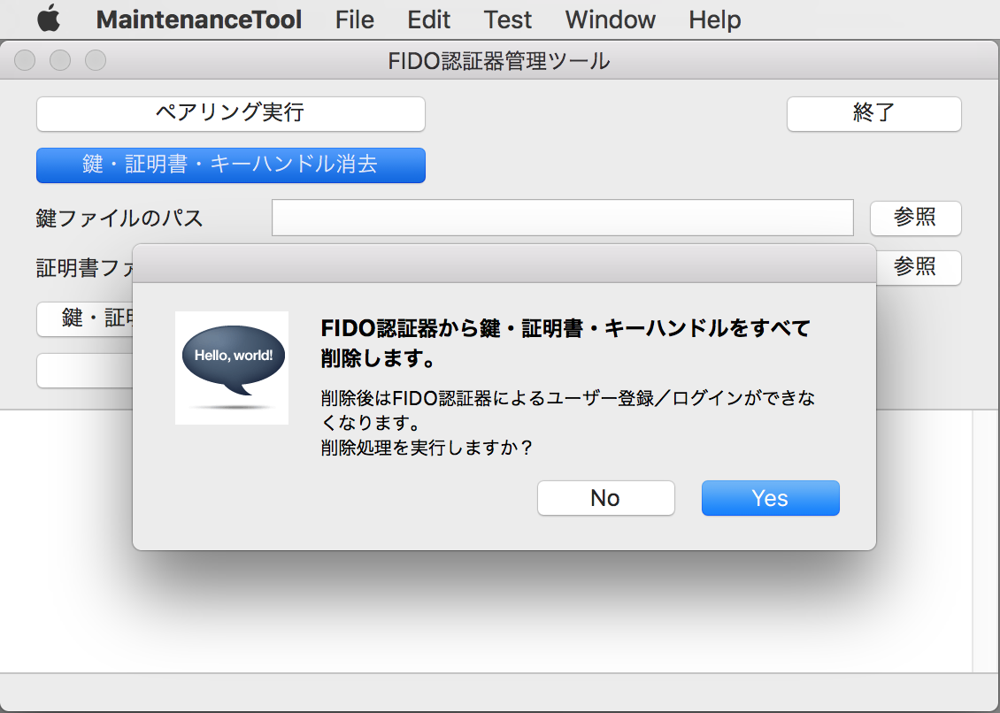
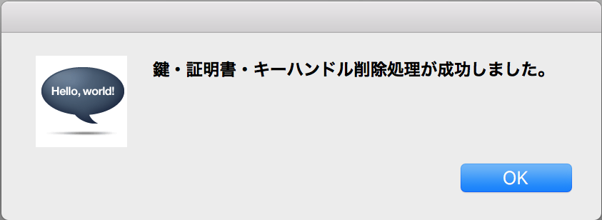
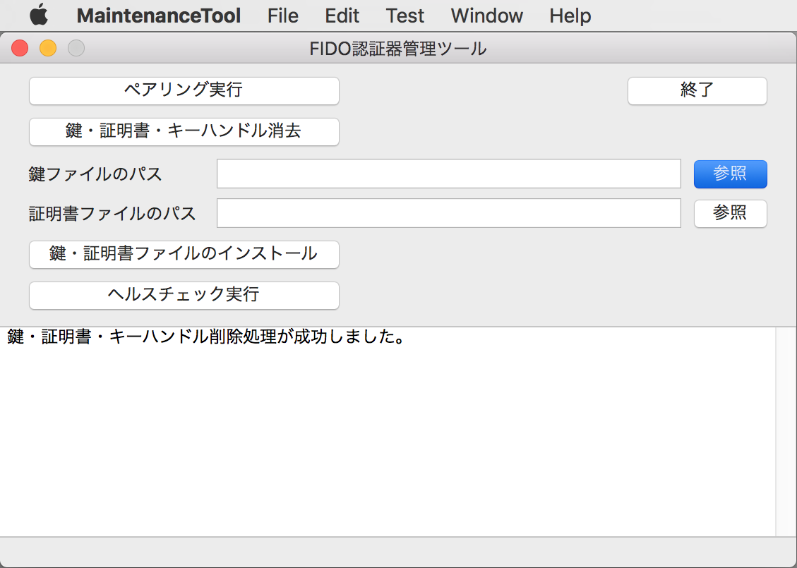
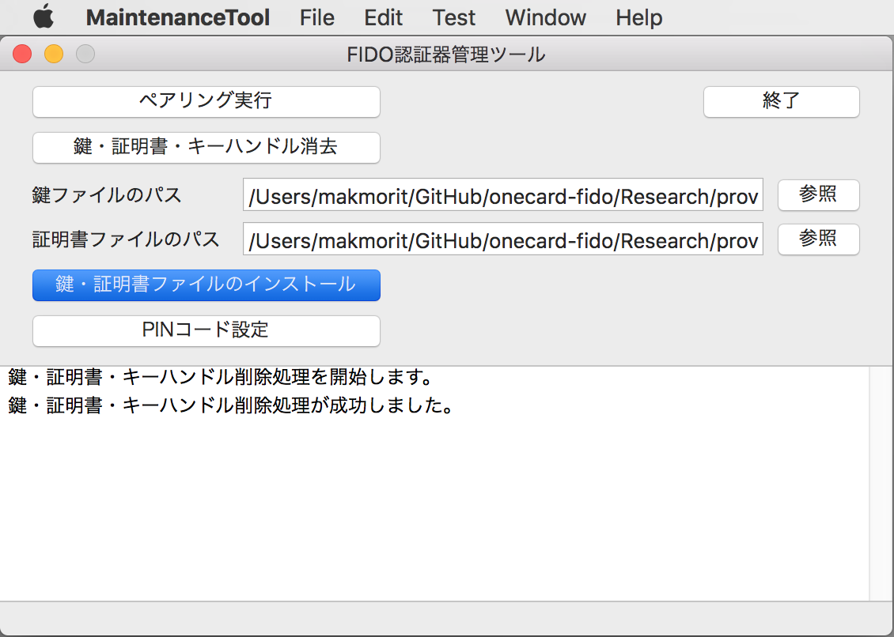
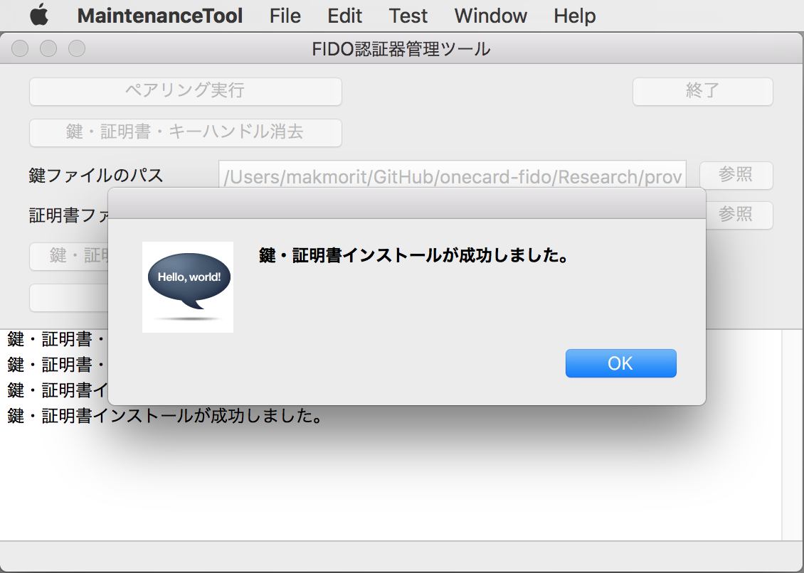

# 鍵・証明書の導入手順

## 概要

[FIDO認証器管理ツール](README.md)を使用して、FIDO認証器に鍵・証明書を導入する手順を掲載します。

## 管理ツールのインストール

[インストール手順](INSTALLPRG.md)を参照し、管理ツールをmacOSにインストールします。

## 鍵・証明書の削除

管理ツールを起動し、表示された画面の「鍵・証明書・キーハンドル消去」ボタンをクリックします。

確認ダイアログが表示されますので「Yes」をクリックします。

FIDO認証器側の処理が成功すると「鍵・証明書・キーハンドル削除処理が成功しました。」と表示されます。

## 鍵・証明書のインストール

秘密鍵ファイル（fido2test.pem）、証明書ファイル（fido2test.crt）を、それぞれ「参照」ボタンをクリックして選択します。 
ファイルのGitHubリポジトリー上の場所は以下の通りです。
- ディレクトリー：[onecard-fido/Research/provisionalCA/](https://github.com/diverta/onecard-fido/blob/master/Research/provisionalCA/)
- 秘密鍵ファイル：[fido2test.pem](https://github.com/diverta/onecard-fido/blob/master/Research/provisionalCA/fido2test.pem)
- 証明書ファイル：[fido2test.crt](https://github.com/diverta/onecard-fido/blob/master/Research/provisionalCA/fido2test.crt)

管理ツール画面の「鍵・証明書ファイルのインストール」ボタンをクリックします。

FIDO認証器側の処理が成功すると「鍵・証明書インストールが成功しました。」と表示されます。

以上で、鍵・証明書の導入は完了です。
