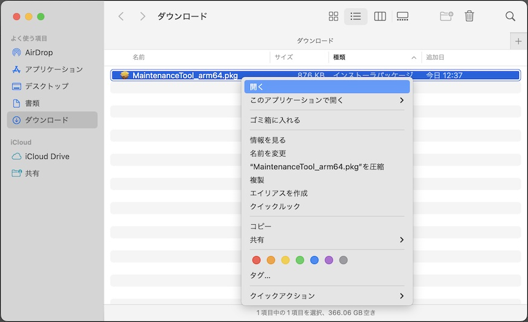
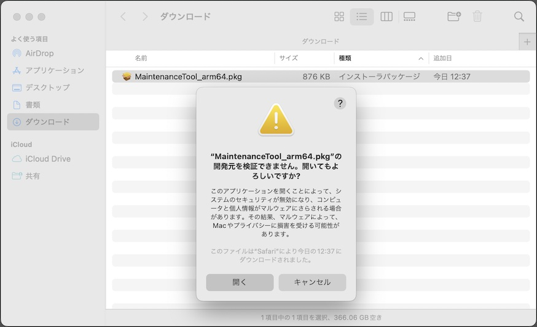
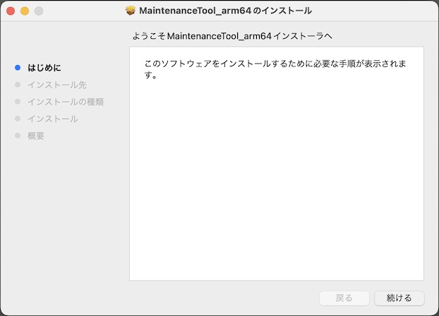

# インストール手順

最終更新日：2023/1/16

## 概要
FIDO認証器管理ツールをmacOS環境にインストールする手順について掲載しています。

## インストール媒体の取得

[macOS版 FIDO認証器管理ツール](MaintenanceTool.pkg)を、GitHubからダウンロード／解凍します。 
該当ページの「Download」ボタンをクリックすると、[MaintenanceTool.pkg](MaintenanceTool.pkg)がダウンロードできます。

## インストールの実行

ダウンロードされたファイルを右クリックし「開く」を実行してください。 
（最終更新日現在、アプリに署名がされていないので、アイコンをダブルクリックしても実行することができないための措置になります）

警告画面が表示されますが、続いて「開く」を実行します。

インストーラーが起動しますので、指示に従いインストールを進めます。

インストールが完了します。

インストールが完了すると、アプリケーションフォルダーに、FIDO認証器管理ツールのアイコンができます。 
アイコンをダブルクリックして実行します。

FIDO認証器管理ツールの画面が起動すれば、インストールは完了です。

