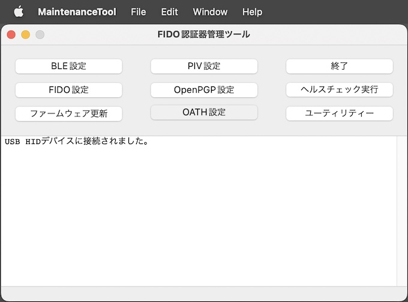
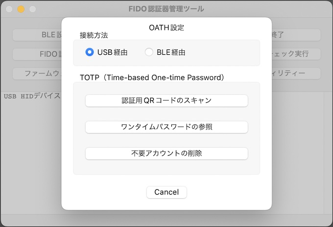

# OATH機能設定手順書

最終更新日：2023/4/12

## 概要

[FIDO認証器管理ツール](../../MaintenanceTool/macOSApp/README.md)、[MDBT50Q Dongle](../../FIDO2Device/MDBT50Q_Dongle/README.md)を使用した、ワンタイムパスワードの参照手順を中心に、OATH設定の諸手順について掲載します。

## OATH設定画面の表示

OATH機能の設定・実行は「OATH設定画面」上で行います。

管理ツールを起動し、USBポートにMDBT50Q Dongleを装着します。 
管理ツール画面下部のメッセージ欄に「USB HIDデバイスに接続されました。」と表示されることを確認したら、管理ツール画面の「OATH設定」ボタンをクリックします。

ホーム画面の上に、OATH設定画面がポップアップ表示されます。

以後の設定作業は、すべてこの「OATH設定画面」で実行します。

## ワンタイムパスワードの参照

OATH機能を使用した、ワンタイムパスワードの参照手順について記載いたします。 
なお、本ツールで利用できるワンタイムパスワードは、TOTP（Time-based One-time Password）になります。

### 事前設定

後述する「QRコードスキャン」機能を利用するにあたり、macOSの環境設定で「画面収録」の許可設定が必要となります。 
手順につきましては、別ドキュメント「<b>[画面収録許可の設定手順書](../../MaintenanceTool/macOSApp/SCREENSHOT.md)</b>」をご参照願います。
