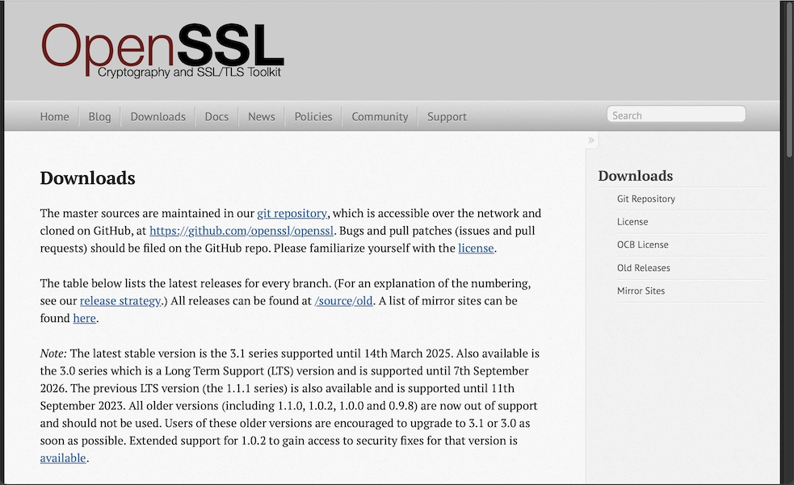
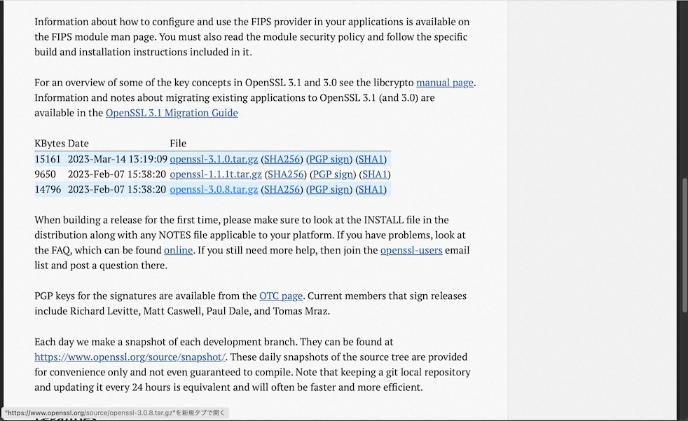
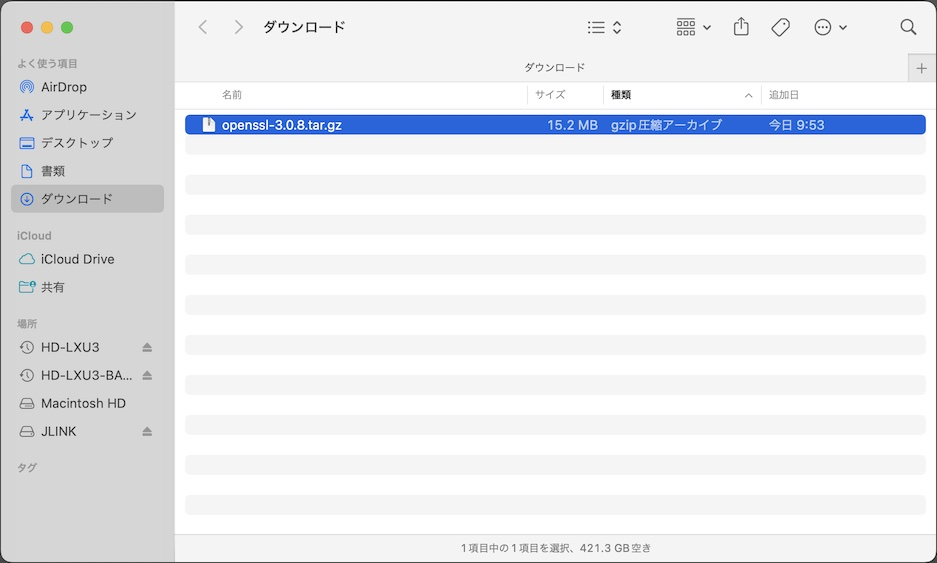
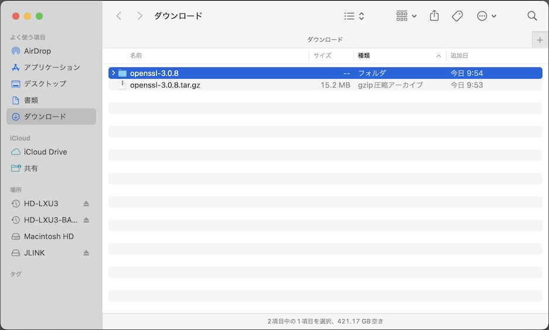

# OpenSSL C言語ライブラリー導入手順

最終更新日：2023/4/3

## 概要

macOS版管理ツール内で暗号化処理を行うために必要な、OpenSSL C言語ライブラリーの導入手順について、下記に掲載いたします。

## インストール媒体の取得

ブラウザーで[OpenSSLのサイト](https://www.openssl.org/source/)を開きます。



インストール媒体（`openssl-3.0.8.tar.gz`というファイル）を、リンクをクリックしてダウンロードします。



`openssl-3.0.8.tar.gz`のダウンロードが完了したことを確認します。



ダウンロードしたファイルを解凍します。



## macOSへの導入

macOSにOpenSSLを導入し、Xcodeプロジェクトに組み込むまでの手順は以下になります。

### ビルドの実行

`INSTALL.md`の内容を参考に、インストールの準備を下記の通り実行します。<br>
（今回は、インストール先をユーザーディレクトリー配下に指定しております）

```
cd ${HOME}/Downloads/openssl-3.0.8
./Configure --prefix=${HOME}/opt/openssl-3.0.8
```

メイクファイルが生成された事を確認したら、修正を行います。<br>
（修正に先立ち、メイクファイルをバックアップしておきます）

```
cp -pv Makefile Makefile.original
vi Makefile
diff Makefile.original Makefile
```

修正箇所は下記になります。

<b>【修正前】</b>
```
CPPFLAGS=
CFLAGS=-O3 -Wall
CXXFLAGS=
```

<b>【修正後】</b>
```
CPPFLAGS=-mmacosx-version-min=11.0
CFLAGS=-O3 -Wall -mmacosx-version-min=11.0
CXXFLAGS=-mmacosx-version-min=11.0
```

メイクファイルの修正を確認したら、ビルドを実行します。

```
make
```

ご参考：[上記コマンド実行時のログ](assets09/OpenSSL3.0.8_Build.log)

### インストールの実行

ビルドが成功したら、インストールを実行します。

```
make test
make install
```

ご参考：[上記コマンド実行時のログ](assets09/OpenSSL3.0.8_Install.log)
