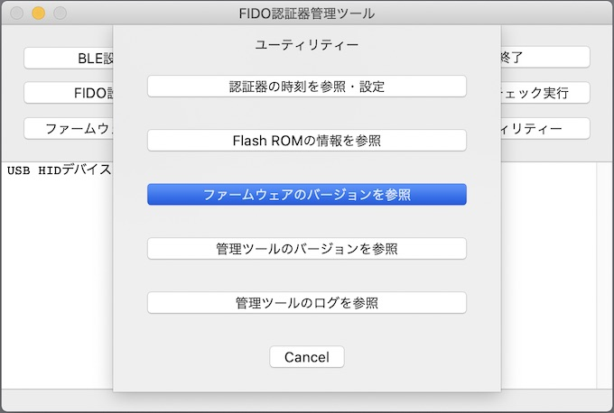
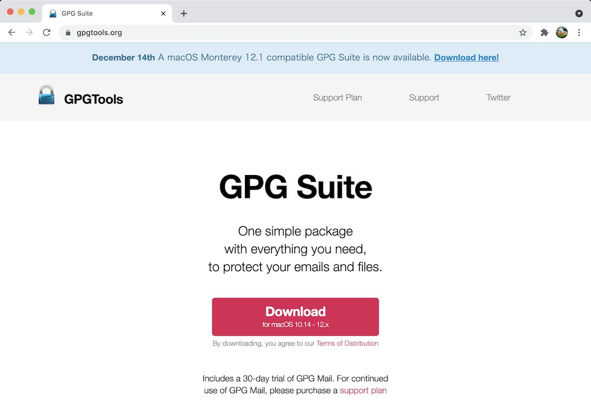
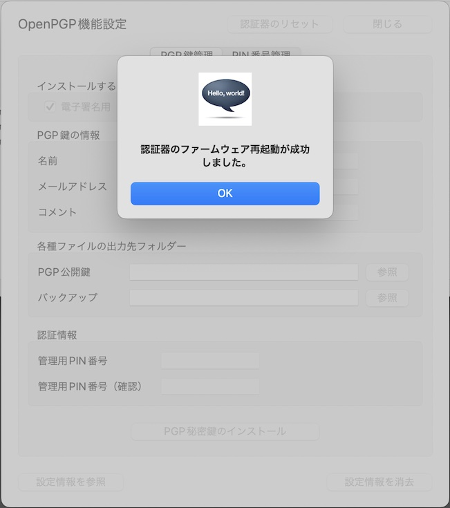

# OpenPGP機能の基本設定手順

最終更新日：2022/2/24

## 概要

[FIDO認証器管理ツール](README.md)を使用して、[MDBT50Q Dongle](../../FIDO2Device/MDBT50Q_Dongle/README.md)に対し、OpenPGP機能に最低限必要な基本設定を行う手順を掲載します。

## ソフトウェアのバージョン確認／インストール

OpenPGP機能は、[CCIDインターフェース](../../CCID/README.md)という仕組みを使用しております。 
この仕組みを使用するためには、管理ツール、ファームウェア共に、必要バージョン以降である必要があります。 
また、[GPG Suite](https://gpgtools.org)というツールを、PCに別途インストールする必要があります。

#### 管理ツールのバージョン確認
まずは[インストール手順](INSTALLPRG.md)を参照し、管理ツールをmacOSにインストールします。 
次に、下記手順で管理ツールのバージョン確認を行い、<b>Version 0.1.39以降</b>であるかどうか確認します。

管理ツールのメニュー「Preferences」を選択し、ツール設定画面を開きます。

ツール設定画面のタブ「バージョン」を選択し、バージョンを確認してください。 
（下記例では「Version 0.1.39」となっております）

#### ファームウェアのバージョン確認
続いて、下記手順でファームウェアのバージョン確認を行い、<b>0.3.4以降</b>であるかどうか確認します。

[MDBT50Q Dongle](../../FIDO2Device/MDBT50Q_Dongle/README.md)をPCのUSBポートに装着した後、管理ツールのメニュー「Test-->USB-->バージョン情報取得」を選択します。

管理ツール下部のメッセージ欄に表示される、ファームウェアのバージョンを確認してください。 
（下記例では「0.3.5」となっております）

#### GPG Suiteのインストール

管理ツールのOpenPGP機能設定においては、[GPG Suite](https://gpgtools.org)というツールに同梱の「MacGPG2」を管理ツールで内部利用しているため、あらかじめ<b>GPG SuiteがPCにインストールされている</b>必要があります。

GPG Suiteのインストール手順につきましては、別ドキュメント「<b>[GPG Suiteインストール手順書](../../CCID/OpenPGP/GPGINSTMAC.md)</b>」をご参照願います。

## OpenPGP機能設定画面の表示

OpenPGP機能の設定は「OpenPGP機能設定画面」上で行います。

まずは管理ツールを起動し、USBポートに[MDBT50Q Dongle](../../FIDO2Device/MDBT50Q_Dongle/README.md)を装着します。 

管理ツール画面下部のメッセージ欄に「USB HIDデバイスに接続されました。」と表示されることを確認したら、管理ツール画面の「OpenPGP機能設定」ボタンをクリックします。

ホーム画面の上に、OpenPGP機能設定画面がポップアップ表示されます。

以後の設定作業は、すべてこの「OpenPGP機能設定画面」で実行します。

## 基本設定の実行

OpenPGP機能に最低限必要な基本設定、すなわちPGP鍵のインストールを実行します。

### PGP秘密鍵のインストール

OpenPGP機能では、PGP秘密鍵を[MDBT50Q Dongle](../../FIDO2Device/MDBT50Q_Dongle/README.md)に導入する必要があります。

導入が必要な秘密鍵は、以下の３セットになります。 
いずれも、本機能で自動生成されます。

- 電子署名用（Signature key）
- 暗号／復号化用（Encryption key）
- PGP認証用（Authentication key）

以下の手順により、３セットの秘密鍵をすべてインストールします。

#### インストール手順

まずはインストールする鍵の個人情報を入力します。 
全項目入力必須になります。

- 名前（５文字以上で入力します）
- メールアドレス
- コメント

次に、各種ファイルの出力先フォルダーを選択します。 
「PGP公開鍵」欄右側の「参照」ボタンをクリックします。

フォルダー参照ダイアログから、該当の出力先フォルダーを選択し「選択」ボタンをクリックします。

フォルダー欄に、選択された出力先フォルダーのパスが表示されます。 
（長いフォルダー名の場合は、マウスカーソルを上から当てると、フルパス名称が小さくToolTip表示されます）

同様に、バックアップファイルの出力先フォルダーも選択します。

PGP公開鍵、バックアップ両方の出力先フォルダーを選択したら、下部の認証情報欄に、OpenPGP機能で使用する管理用PIN番号を入力します。[注1]

PIN番号を入力したら、下部の「PGP秘密鍵のインストール」ボタンをクリックします。

下記のような確認ダイアログが表示されますので、Yesボタンをクリックします。

PGP秘密鍵のインストール処理が実行されます。

程なく、下図のようなメッセージがポップアップ表示され、処理が完了します。

[注1] 管理用PIN番号は初期状態では「`12345678`」となっております。変更したい場合は、別ドキュメント「[OpenPGP機能の各種設定手順](../../MaintenanceTool/macOSApp/PGPSETTING_OPT.md)」をご参照願います。

### 確認手順

インストールされた証明書は「OpenPGP設定情報取得画面」で確認できます。 
OpenPGP機能設定画面の左下部のボタン「設定情報を参照」をクリックします。

下図のようなOpenPGP設定情報取得画面がポップアップ表示されます。 
以下の３点が設定されていることが確認できます。

- 電子署名用（Signature key）の設定情報
- 暗号／復号化用（Encryption key）の設定情報
- PGP認証用（Authentication key）の設定情報

以上で、PGP秘密鍵のインストールは完了です。

## OpenPGP機能設定情報の消去

万が一、管理用PIN番号を３回連続で間違えて指定した場合は、認証がブロックされます。 
他方、管理用PIN番号のリセット機能は存在しません。

したがって、[MDBT50Q Dongle](../../FIDO2Device/MDBT50Q_Dongle/README.md)において、再び管理用PIN番号が利用できるようにするためには、いったんOpenPGP機能設定情報を全て消去する必要があります。 
この場合、OpenPGP機能に関連する以下の設定情報が全て消去されてしまいますので、ご注意ください。

- 電子署名用（Signature key）の設定情報
- 暗号／復号化用（Encryption key）の設定情報
- PGP認証用（Authentication key）の設定情報

OpenPGP機能設定情報の消去を実行するためには、OpenPGP機能設定画面の右下部「設定情報を消去」ボタンをクリックします。

下記のような確認ダイアログが表示されますので、Yesボタンをクリックします。

設定情報消去処理が実行されます。

程なく、下図のようなメッセージがポップアップ表示され、処理が完了します。

OpenPGP設定情報取得画面で確認すると、下記３点の設定情報が消去されたことを示しています。

- 電子署名用（Signature key）
- 暗号／復号化用（Encryption key）
- PGP認証用（Authentication key）

これでOpenPGP機能設定の消去は完了です。

## 認証器のリセット

前述の各機能を実行時、下図のようなエラーメッセージが表示されることがあります。

この場合は、認証器のリセットをお試しいただくことにより、認証器の再装着が不要となる場合があります。 
画面下部のボタン「認証器のリセット」をクリックします。

認証器がUSBに装着されたまま、ファームウェアが再始動されます。

程なく、下図のようなメッセージがポップアップ表示され、処理が完了します。

万が一、上記手順でも解消しない場合は、一旦MDBT50Q DongleをPCのUSBポートから取り出し、再度装着した後、処理を再試行していただけますようお願いします。

## その他の各種設定

前項までの手順により、OpenPGP機能に最低限必要な基本設定が完了しますが、その他にもPIN番号変更等のオプション機能を用意しております。 
詳細につきましては、別ドキュメント「[OpenPGP機能の各種設定手順](../../MaintenanceTool/macOSApp/PGPSETTING_OPT.md)」をご参照願います。
