# PIV機能の設定手順

## 概要

[FIDO認証器管理ツール](README.md)を使用して、[nRF52840版FIDO認証器](../../nRF5_SDK_v15.3.0)に対し、PIV機能に必要な各種設定を行う手順を掲載します。

## 管理ツールのインストール

[インストール手順](INSTALLPRG.md)を参照し、管理ツールをmacOSにインストールします。

## PIV機能設定画面の表示

PIV機能の設定は「PIV機能設定画面」上で行います。

まずは管理ツールを起動し、USBポートに[nRF52840版FIDO認証器](../../nRF5_SDK_v15.3.0)を装着します。 
その後、メニュー「Option --> PIV機能設定」を実行します。

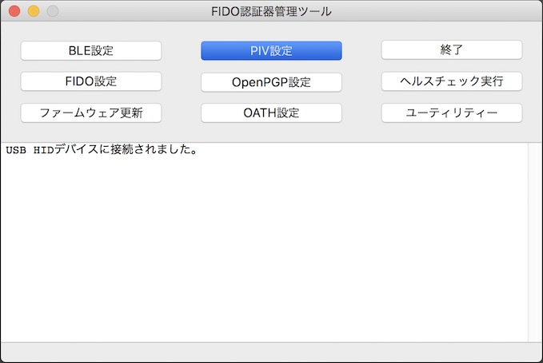

ホーム画面の上に、PIV機能設定画面がポップアップ表示されます。

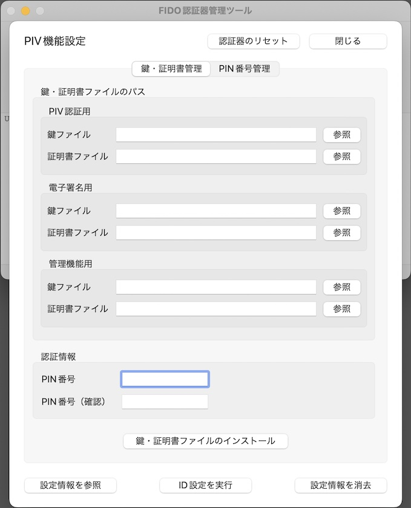

以後の設定作業は、すべてこの「PIV機能設定画面」で実行します。

## 初期設定の実行

PIV機能に最低限必要な設定、すなわちID設定、および鍵・証明書ファイルのインストールを実行します。

### ID設定の実行

PIV機能設定画面の「ID設定を実行」ボタンをクリックします。

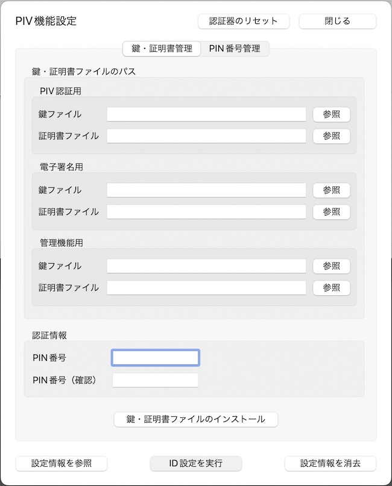

下記のような確認ダイアログが表示されますので、Yesボタンをクリックします。

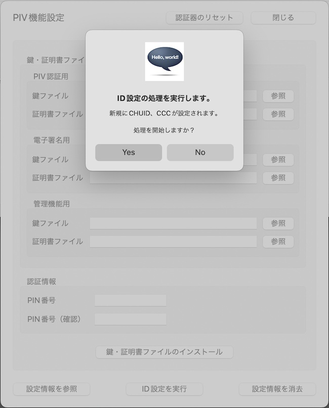

ID設定処理が実行されます。 
程なく、下図のようなメッセージがポップアップ表示され、処理が完了します。

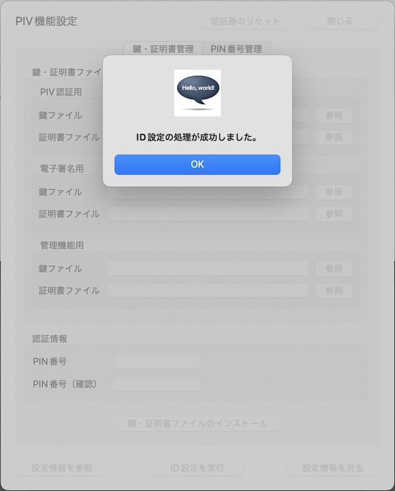

設定されたIDは「PIV設定情報取得画面」で確認できます。 
PIV機能設定画面の「設定情報を参照」ボタンをクリックします。

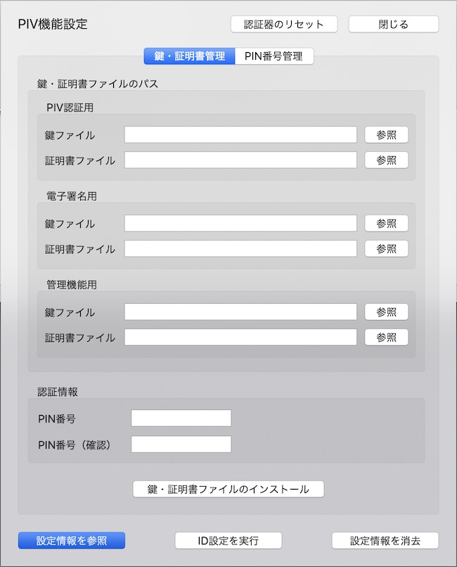

PIV設定情報取得画面に、下図の「CHUID」「CCC」が設定されていることが確認できます。

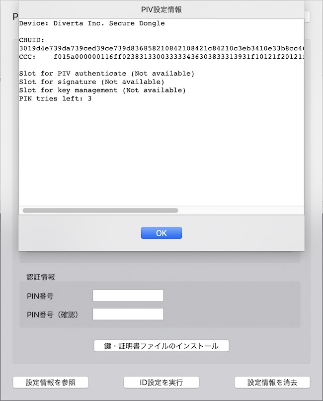

以上で、ID設定の実行は完了です。

### 鍵・証明書ファイルのインストール

PIV機能では、FIDO機能と同様、鍵・証明書ファイルを認証器に導入する必要があります。

導入が必要な鍵・証明書は、以下の３セットになります。 
いずれも「PEM形式」の鍵・証明書ファイル（テキストファイル）をご用意ください。

- PIV認証用
- 電子署名用
- 管理機能用

以下の手順により、３セットの鍵・証明書をすべてインストールします。

#### インストール手順

まずはラジオボタンから、インストールする鍵・証明書の種別を選択します。 
その後、鍵ファイルのパスを選択します。

鍵ファイル欄右側の「参照」ボタンをクリックします。

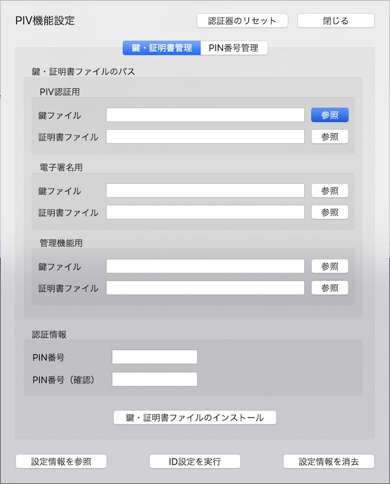

ファイル参照ダイアログから、該当の鍵ファイル（PEM形式）を選択し「選択」ボタンをクリックします。

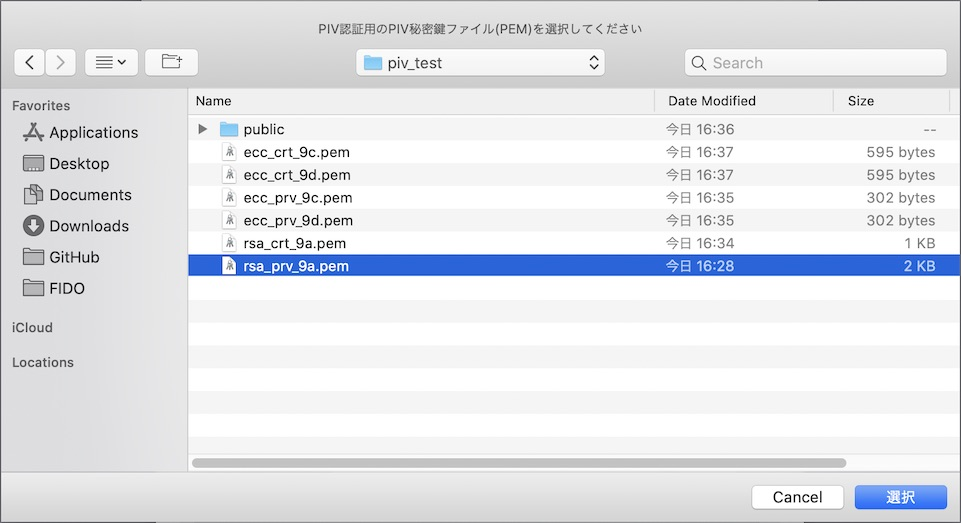

鍵ファイル欄に、選択された鍵ファイルのパスが表示されます。 
（マウスカーソルを上から当てると、下図のようにフルパス名称が小さくToolTip表示されます）

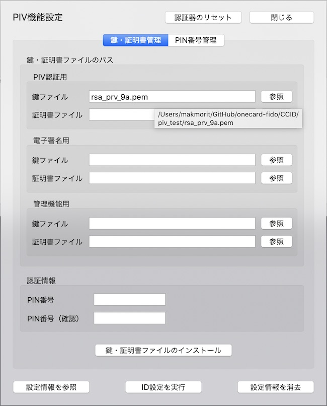

同様に、証明書ファイルのパスも選択します。

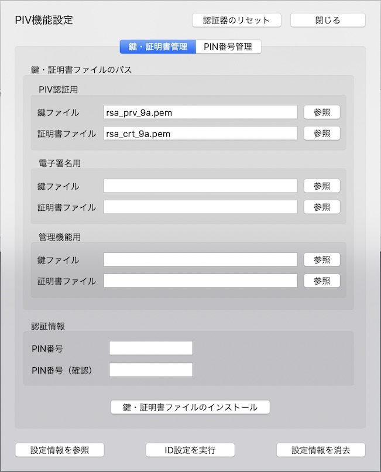

鍵ファイル、証明書ファイルの両方を選択したら、下部の認証情報欄に、PIV機能で使用するPIN番号を入力します。 
PIN番号は初期状態では「123456」となっております（必要に応じ変更可能です）。

PIN番号を入力したら、下部の「鍵・証明書ファイルのインストール」ボタンをクリックします。

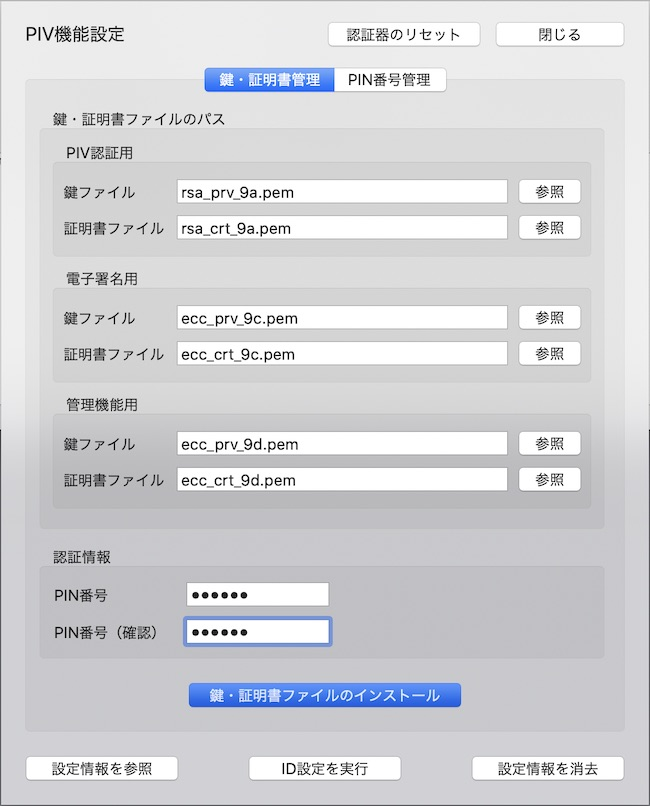

下記のような確認ダイアログが表示されますので、Yesボタンをクリックします。

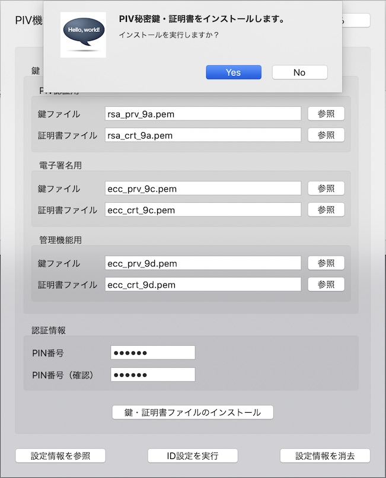

鍵・証明書ファイルのインストール処理が実行されます。 
程なく、下図のようなメッセージがポップアップ表示され、処理が完了します。

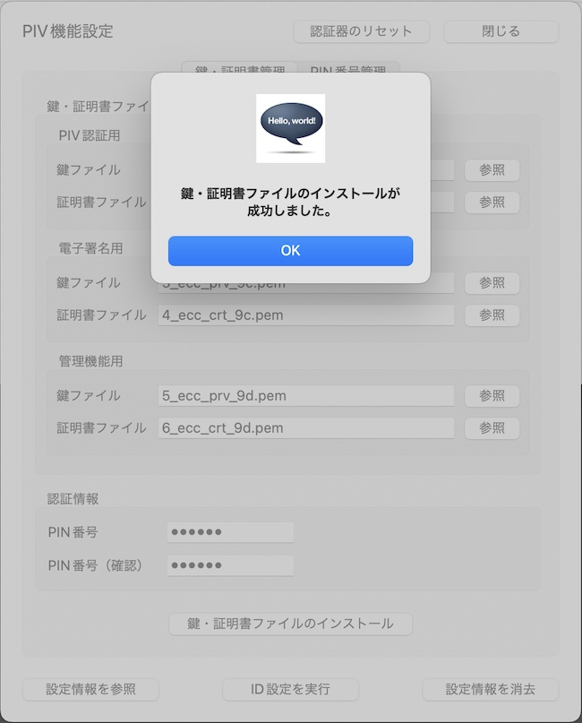

#### 確認手順

インストールされた証明書は「PIV設定情報取得画面」で確認できます。 
PIV設定情報取得画面に、下図の「Slot for PIV authenticate(PIV認証用)」「Slot for signature(電子署名用)」「Slot for key management(管理機能用)」の証明書３点が設定されていることが確認できます。

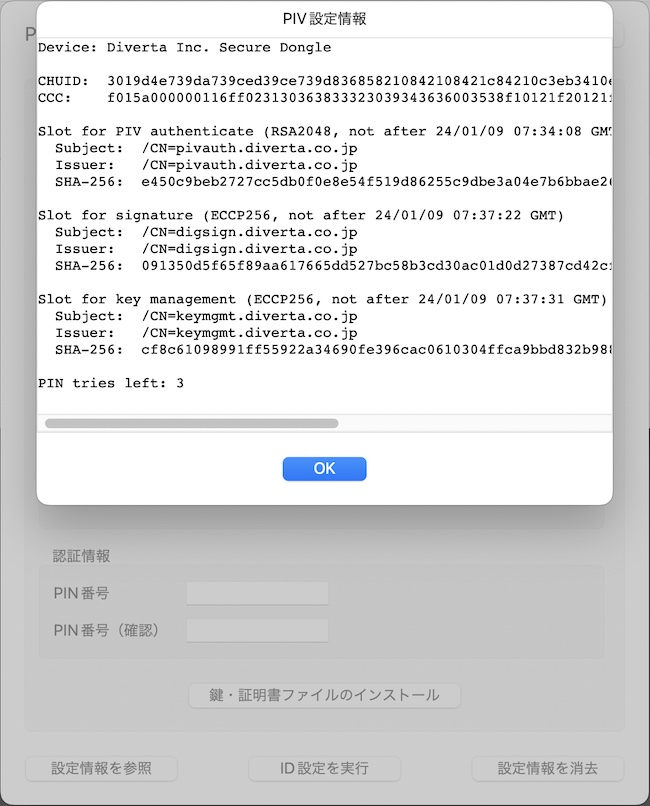

以上で、鍵・証明書ファイルのインストールは完了です。
