# PIV機能の設定手順

## 概要

[FIDO認証器管理ツール](README.md)を使用して、[MDBT50Q Dongle](../../FIDO2Device/MDBT50Q_Dongle/README.md)に対し、PIV機能に必要な各種設定を行う手順を掲載します。

## ソフトウェアのバージョン確認

PIV機能は、[CCIDインターフェース](../../CCID/README.md)という仕組みを使用しております。 
この仕組みを使用するためには、管理ツール、ファームウェア共に、必要バージョン以降である必要があります。

#### 管理ツールのバージョン確認
まずは[インストール手順](INSTALLPRG.md)を参照し、管理ツールをmacOSにインストールします。 
次に、下記手順で管理ツールのバージョン確認を行い、<b>Version 0.1.34以降</b>であるかどうか確認します。

管理ツールのメニュー「Preferences」を選択し、ツール設定画面を開きます。

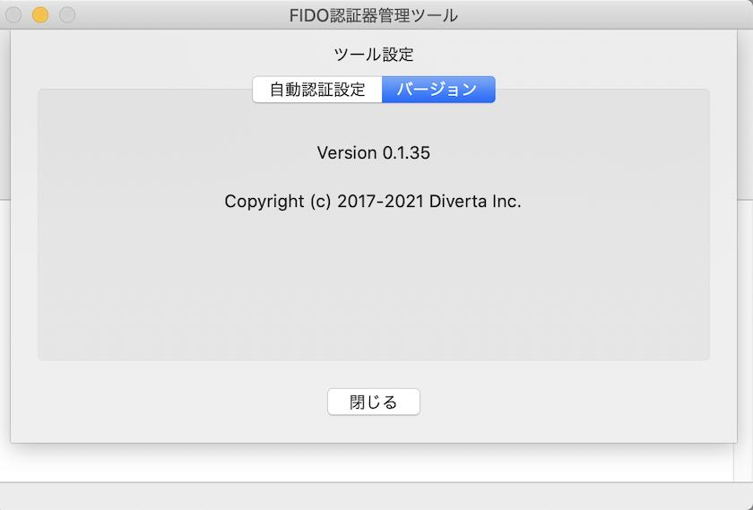

ツール設定画面のタブ「バージョン」を選択し、バージョンを確認してください。 
（下記例では「Version 0.1.34」となっております）

#### ファームウェアのバージョン確認
続いて、下記手順でファームウェア（[nRF52840アプリケーション](../../nRF5_SDK_v15.3.0)）のバージョン確認を行い、<b>0.2.13以降</b>であるかどうか確認します。

[MDBT50Q Dongle](../../FIDO2Device/MDBT50Q_Dongle/README.md)をPCのUSBポートに装着した後、管理ツールのメニュー「Test-->USB-->バージョン情報取得」を選択します。

管理ツール下部のメッセージ欄に表示される、ファームウェアのバージョンを確認してください。 
（下記例では「0.2.13」となっております）

## PIV機能設定画面の表示

PIV機能の設定は「PIV機能設定画面」上で行います。

まずは管理ツールを起動し、USBポートに[nRF52840版FIDO認証器](../../nRF5_SDK_v15.3.0)を装着します。 
その後、メニュー「Option --> PIV機能設定」を実行します。

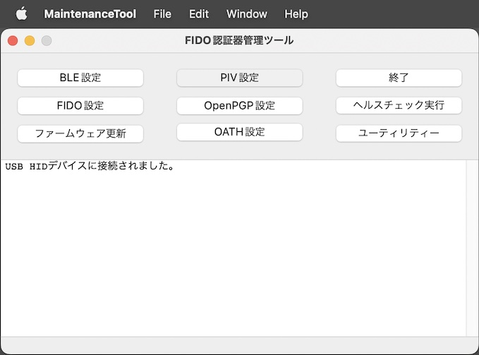

ホーム画面の上に、PIV機能設定画面がポップアップ表示されます。

以後の設定作業は、すべてこの「PIV機能設定画面」で実行します。

## 初期設定の実行

PIV機能に最低限必要な設定、すなわちID設定、および鍵・証明書ファイルのインストールを実行します。

### ID設定の実行

PIV機能設定画面の「ID設定を実行」ボタンをクリックします。

下記のような確認ダイアログが表示されますので、Yesボタンをクリックします。

ID設定処理が実行されます。 
程なく、下図のようなメッセージがポップアップ表示され、処理が完了します。

設定されたIDは「PIV設定情報取得画面」で確認できます。 
PIV機能設定画面の「設定情報を参照」ボタンをクリックします。

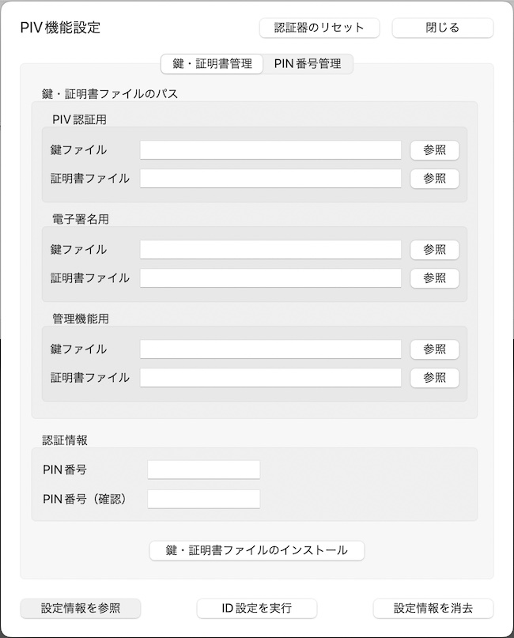

PIV設定情報取得画面に、下図の「CHUID」「CCC」が設定されていることが確認できます。

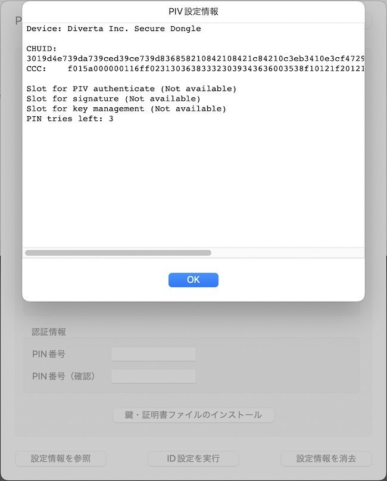

以上で、ID設定の実行は完了です。

### 鍵・証明書ファイルのインストール

PIV機能では、FIDO機能と同様、鍵・証明書ファイルを認証器に導入する必要があります。

導入が必要な鍵・証明書は、以下の３セットになります。 
いずれも「PEM形式」の鍵・証明書ファイル（テキストファイル）をご用意ください。

- PIV認証用
- 電子署名用
- 管理機能用

以下の手順により、３セットの鍵・証明書をすべてインストールします。

#### インストール手順

まずはラジオボタンから、インストールする鍵・証明書の種別を選択します。 
その後、鍵ファイルのパスを選択します。

鍵ファイル欄右側の「参照」ボタンをクリックします。

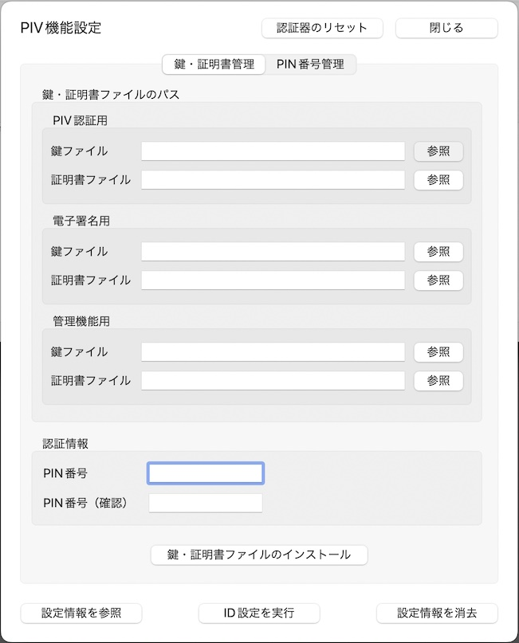

ファイル参照ダイアログから、該当の鍵ファイル（PEM形式）を選択し「選択」ボタンをクリックします。

鍵ファイル欄に、選択された鍵ファイルのパスが表示されます。 
（マウスカーソルを上から当てると、下図のようにフルパス名称が小さくToolTip表示されます）

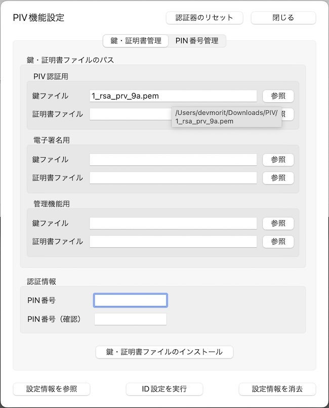

同様に、証明書ファイルのパスも選択します。

鍵ファイル、証明書ファイルの両方を選択したら、下部の認証情報欄に、PIV機能で使用するPIN番号を入力します。 
PIN番号は初期状態では「123456」となっております（必要に応じ変更可能です）。

PIN番号を入力したら、下部の「鍵・証明書ファイルのインストール」ボタンをクリックします。

下記のような確認ダイアログが表示されますので、Yesボタンをクリックします。

鍵・証明書ファイルのインストール処理が実行されます。 
程なく、下図のようなメッセージがポップアップ表示され、処理が完了します。

#### 確認手順

インストールされた証明書は「PIV設定情報取得画面」で確認できます。 
PIV設定情報取得画面に、下図の「Slot for PIV authenticate(PIV認証用)」「Slot for signature(電子署名用)」「Slot for key management(管理機能用)」の証明書３点が設定されていることが確認できます。

以上で、鍵・証明書ファイルのインストールは完了です。

## PIN番号管理

PIV機能で使用するPIN番号は、初期状態のままでも使用できますが、セキュリティー目的で適宜変更することが可能です。 
PIV機能設定画面のタブ「PIN番号管理」で、PIN番号の変更ができます。

### PIN番号の変更

PIV機能で使用するPIN番号は、初期状態では「123456」ですが、こちらを任意のPIN番号に変更することができます。

「PIN番号管理」タブのラジオボタン「PIN番号を変更」を選択します。 
すぐ下にある入力欄「現在のPIN番号」「新しいPIN番号」「新しいPIN番号（確認用）」に、それぞれ値を入力したら「実行」ボタンをクリックします。

下記のような確認ダイアログが表示されますので、Yesボタンをクリックします。

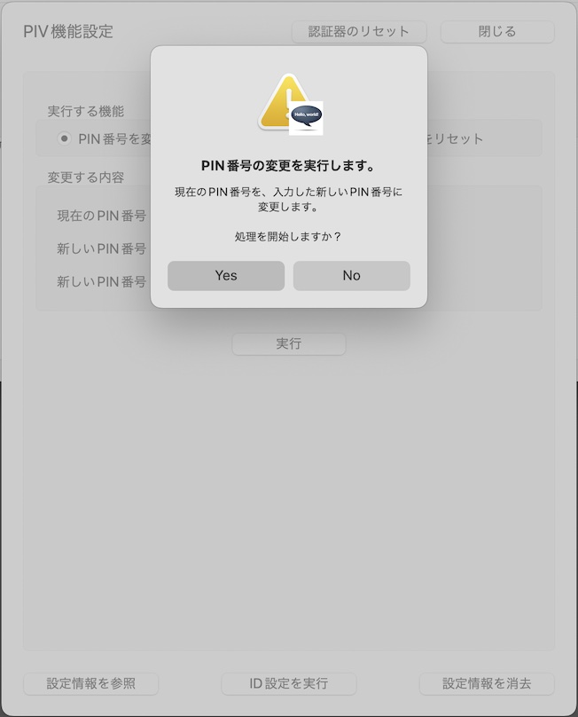

PIN番号変更処理が実行されます。 
程なく、下図のようなメッセージがポップアップ表示され、処理が完了します。

これでPIN番号の変更は完了です。

### PUK番号の変更

PIV機能において、PIN番号を３回連続で間違えて指定した場合、認証がブロックされ、PIN番号が使えなくなってしまいます。 
「PUK番号」は、再び新しいPIN番号でPIV機能が利用できるようにする（＝PIN番号をリセットする）時に使う認証用の番号です。

PIV機能で使用するPUK番号は、初期状態では「12345678」ですが、こちらを任意のPUK番号に変更することができます。

「PIN番号管理」タブのラジオボタン「PUK番号を変更」を選択します。 
すぐ下にある入力欄「現在のPUK番号」「新しいPUK番号」「新しいPUK番号（確認用）」に、それぞれ値を入力したら「実行」ボタンをクリックします。

下記のような確認ダイアログが表示されますので、Yesボタンをクリックします。

PUK番号変更処理が実行されます。 
程なく、下図のようなメッセージがポップアップ表示され、処理が完了します。

これでPUK番号の変更は完了です。

### PIN番号のリセット

PIV機能において、PIN番号を３回連続で間違えて指定した場合、認証がブロックされ、PIN番号が使えなくなってしまいます。 
「PIN番号のリセット」を実行すると、新しいPIN番号でPIV機能が再び利用できるようになります。

「PIN番号管理」タブのラジオボタン「PIN番号をリセット」を選択します。 
すぐ下にある入力欄「現在のPUK番号」「新しいPIN番号」「新しいPIN番号（確認用）」に、それぞれ値を入力したら「実行」ボタンをクリックします。

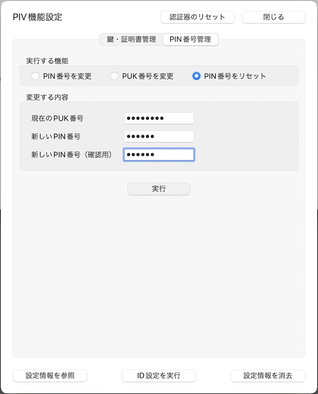

下記のような確認ダイアログが表示されますので、Yesボタンをクリックします。

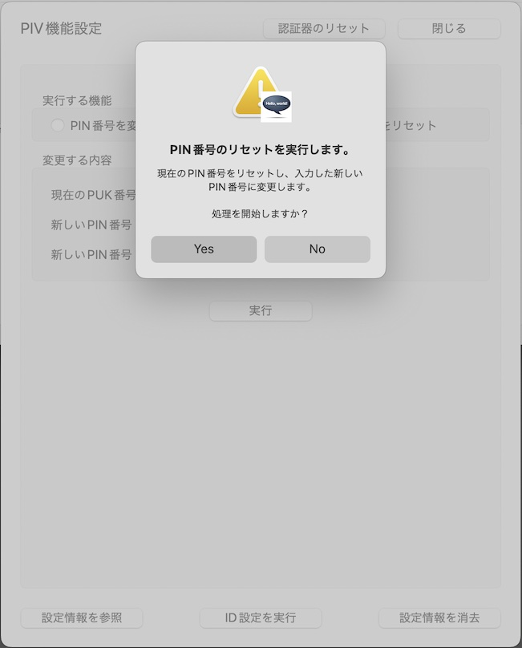

PIN番号リセット処理が実行されます。 
程なく、下図のようなメッセージがポップアップ表示され、処理が完了します。

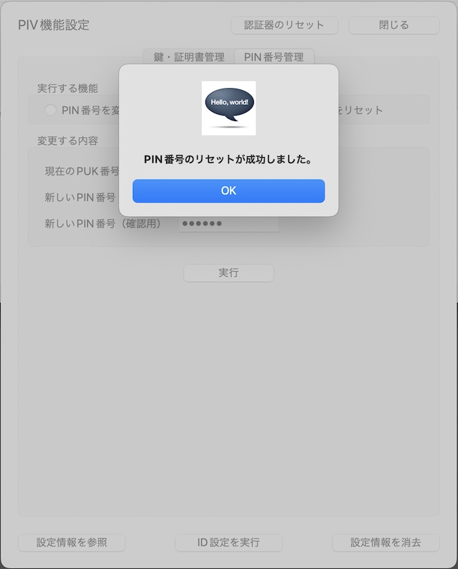

これでPIN番号のリセットは完了です。

## PIV機能設定情報の消去

万が一、PUK番号を３回連続で間違えて指定した場合は、認証がブロックされ、PIN番号管理機能が利用できなくなります。 
他方、PUK番号のリセット機能は存在しません。

したがって、[nRF52840版FIDO認証器](../../nRF5_SDK_v15.3.0)において、再びPUK番号が利用できるようにするためには、いったんPIV機能設定情報を全て消去する必要があります。[注1] 
この場合、PIV機能に関連する以下の設定情報が全て消去されてしまいますので、ご注意ください。

- ID情報（CHUID、CCC）
- 鍵・証明書（PIV認証用、電子署名用、管理機能用）
- 初期状態から変更されたPIN番号、PUK番号

PIV機能設定情報の消去を実行するためには、PIV機能設定画面の右下部「設定情報を消去」ボタンをクリックします。

下記のような確認ダイアログが表示されますので、Yesボタンをクリックします。

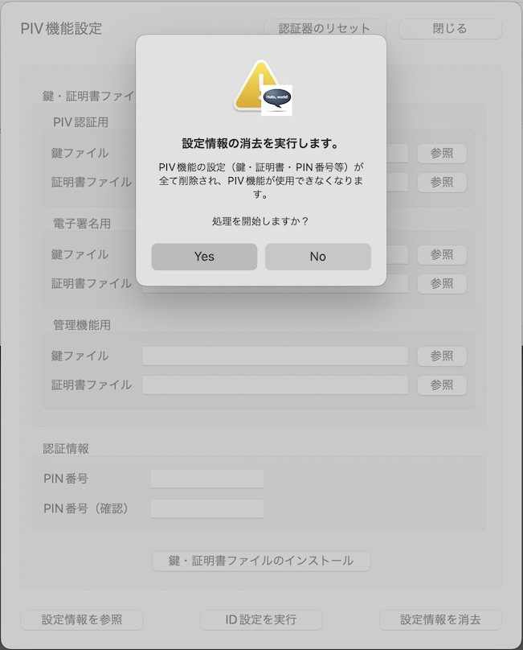

設定情報消去処理が実行されます。 
程なく、下図のようなメッセージがポップアップ表示され、処理が完了します。

これでPIV機能設定の消去は完了です。

[注1] PIV機能の設定情報を全て消去するためには、PIVの仕様上、PIN番号、PUK番号の両方について、認証がブロックされている必要があります。したがって、この条件が満たされない場合は、下図のような警告ダイアログが表示され、設定情報消去処理は実行されません。

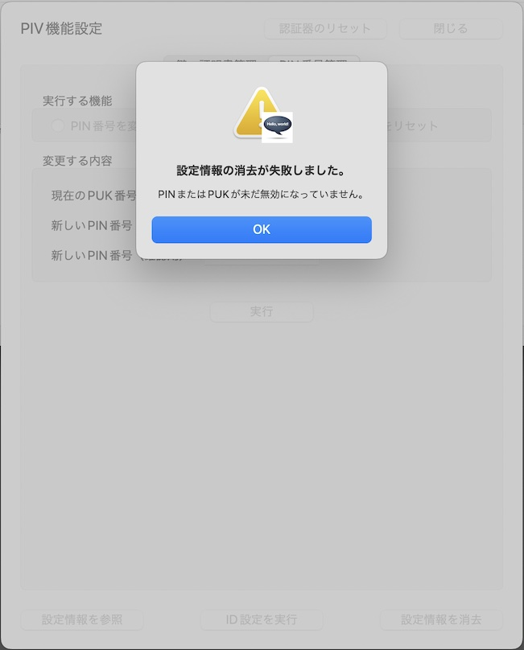
