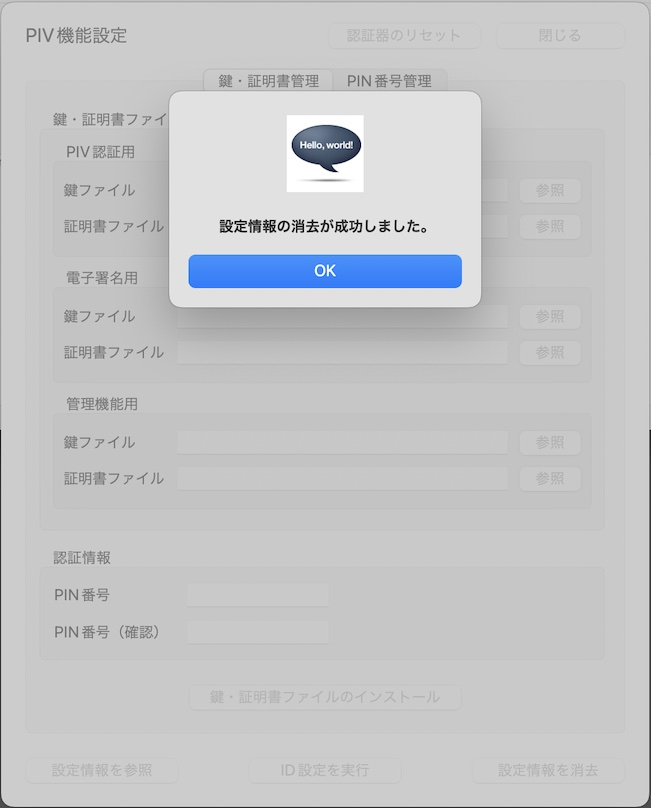

# PIV機能の各種設定手順

## 概要

[FIDO認証器管理ツール](README.md)を使用して、[MDBT50Q Dongle](../../FIDO2Device/MDBT50Q_Dongle/README.md)に対し、PIV機能の各種設定を行う手順を掲載します。

- PIN番号管理
  - PIN番号の変更
  - PUK番号の変更
  - PIN番号のリセット
- PIV機能設定情報の消去

## PIV機能設定画面の表示

PIV機能の設定は「PIV機能設定画面」上で行います。

まずは管理ツールを起動し、USBポートに[MDBT50Q Dongle](../../FIDO2Device/MDBT50Q_Dongle/README.md)を装着します。 

管理ツール画面下部のメッセージ欄に「USB HIDデバイスに接続されました。」と表示されることを確認したら、管理ツール画面の「PIV機能設定」ボタンをクリックします。

ホーム画面の上に、PIV機能設定画面がポップアップ表示されます。

以後の設定作業は、すべてこの「PIV機能設定画面」で実行します。

## PIN番号管理

PIV機能で使用するPIN番号は、初期状態のままでも使用できますが、セキュリティー目的で適宜変更することが可能です。 
PIV機能設定画面のタブ「PIN番号管理」で、PIN番号の変更ができます。

### PIN番号の変更

PIV機能で使用するPIN番号は、初期状態では「123456」ですが、こちらを任意のPIN番号に変更することができます。

「PIN番号管理」タブのラジオボタン「PIN番号を変更」を選択します。 
すぐ下にある入力欄「現在のPIN番号」「新しいPIN番号」「新しいPIN番号（確認用）」に、それぞれ値を入力したら「実行」ボタンをクリックします。

下記のような確認ダイアログが表示されますので、Yesボタンをクリックします。

PIN番号変更処理が実行されます。 
程なく、下図のようなメッセージがポップアップ表示され、処理が完了します。

これでPIN番号の変更は完了です。

### PUK番号の変更

PIV機能において、PIN番号を３回連続で間違えて指定した場合、認証がブロックされ、PIN番号が使えなくなってしまいます。 
「PUK番号」は、再び新しいPIN番号でPIV機能が利用できるようにする（＝PIN番号をリセットする）時に使う認証用の番号です。

PIV機能で使用するPUK番号は、初期状態では「12345678」ですが、こちらを任意のPUK番号に変更することができます。

「PIN番号管理」タブのラジオボタン「PUK番号を変更」を選択します。 
すぐ下にある入力欄「現在のPUK番号」「新しいPUK番号」「新しいPUK番号（確認用）」に、それぞれ値を入力したら「実行」ボタンをクリックします。

下記のような確認ダイアログが表示されますので、Yesボタンをクリックします。

PUK番号変更処理が実行されます。 
程なく、下図のようなメッセージがポップアップ表示され、処理が完了します。

これでPUK番号の変更は完了です。

### PIN番号のリセット

PIV機能において、PIN番号を３回連続で間違えて指定した場合、認証がブロックされ、PIN番号が使えなくなってしまいます。 
「PIN番号のリセット」を実行すると、新しいPIN番号でPIV機能が再び利用できるようになります。

「PIN番号管理」タブのラジオボタン「PIN番号をリセット」を選択します。 
すぐ下にある入力欄「現在のPUK番号」「新しいPIN番号」「新しいPIN番号（確認用）」に、それぞれ値を入力したら「実行」ボタンをクリックします。

下記のような確認ダイアログが表示されますので、Yesボタンをクリックします。

PIN番号リセット処理が実行されます。 
程なく、下図のようなメッセージがポップアップ表示され、処理が完了します。

これでPIN番号のリセットは完了です。

## PIV機能設定情報の消去

万が一、PUK番号を３回連続で間違えて指定した場合は、認証がブロックされ、PIN番号管理機能が利用できなくなります。 
他方、PUK番号のリセット機能は存在しません。

したがって、[MDBT50Q Dongle](../../FIDO2Device/MDBT50Q_Dongle/README.md)において、再びPUK番号が利用できるようにするためには、いったんPIV機能設定情報を全て消去する必要があります。[注1] 
この場合、PIV機能に関連する以下の設定情報が全て消去されてしまいますので、ご注意ください。

- ID情報（CHUID、CCC）
- 鍵・証明書（PIV認証用、電子署名用、管理機能用）
- 初期状態から変更されたPIN番号、PUK番号

PIV機能設定情報の消去を実行するためには、PIV機能設定画面の右下部「設定情報を消去」ボタンをクリックします。

下記のような確認ダイアログが表示されますので、Yesボタンをクリックします。

設定情報消去処理が実行されます。 
程なく、下図のようなメッセージがポップアップ表示され、処理が完了します。

これでPIV機能設定の消去は完了です。

[注1] PIV機能の設定情報を全て消去するためには、PIVの仕様上、PIN番号、PUK番号の両方について、認証がブロックされている必要があります。したがって、この条件が満たされない場合は、下図のような警告ダイアログが表示され、設定情報消去処理は実行されません。

