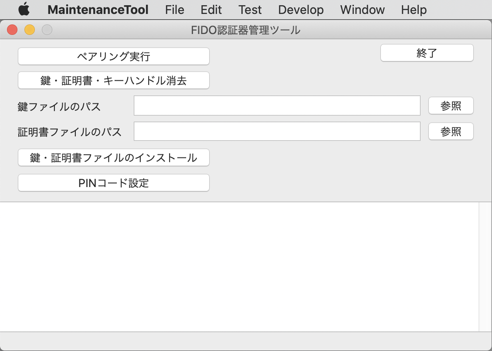

# macOS版 FIDO認証器管理ツール

## 概要
PC環境から、[FIDO認証器](../../nRF5_SDK_v15.3.0)の動作に必要な鍵・証明書の導入などを行うツールです。

### 機能
* ペアリング実行
* 鍵・証明書削除
* 鍵・証明書インストール
* PINコード設定
* CTAP2ヘルスチェック実行
* U2Fヘルスチェック実行
* コマンドテスト機能
* Flash ROM情報取得機能
* バージョン情報取得機能
* 自動認証パラメーター設定機能
* ログファイル格納ディレクトリー参照機能

### 画面イメージ

### 動作環境
macOS Sierra (Version 10.12.6) 〜

## 手順書

- <b>[インストール手順](INSTALLPRG.md)</b> 
FIDO認証器管理ツールをmacOS環境にインストールする手順を掲載しています。

- <b>[鍵・証明書の導入手順](INSTALLKEYCRT.md)</b> 
FIDO認証器に、鍵・証明書をインストールする手順を掲載しています。

- <b>[PINコードの設定手順](SETPIN.md)</b> 
FIDO認証器に、PINコード（暗証番号）を設定する手順を掲載しています。

- <b>[CTAP2ヘルスチェック実行手順](CTAP2HCHECK.md)</b> 
FIDO認証器のヘルスチェックを実行する手順を掲載しています。

- <b>[自動認証パラメーター設定手順](BLEAUTHPARAM.md)</b> 
[BLEデバイスを使用した自動認証機能](../../FIDO2Device/MDBT50Q_Dongle/DEMOFUNC_2.md)の各種パラメーターを設定する手順を掲載しています。

- <b>[管理ツールのログファイル](VIEWLOG.md)</b> 
FIDO認証器管理ツールから出力されるログファイルについて説明しています。

## 開発情報
* <b>[ファームウェア更新機能](DFUFUNC.md)</b> 
[USBブートローダー（暗号化対応版）](../../nRF5_SDK_v15.3.0/firmwares/secure_bootloader)を導入済の[MDBT50Q Dongle](../../FIDO2Device/MDBT50Q_Dongle/README.md)に対し、管理ツールから、ファームウェアを更新できる機能です。 
2020/01/16現在、機能の実現可能性について調査済ですが、指示画面が未実装です（後日追加対応予定）。 
