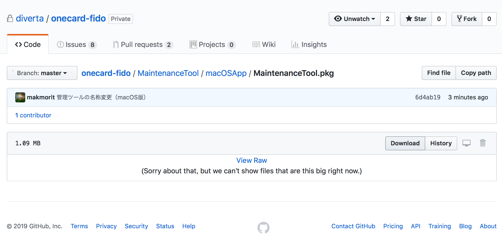
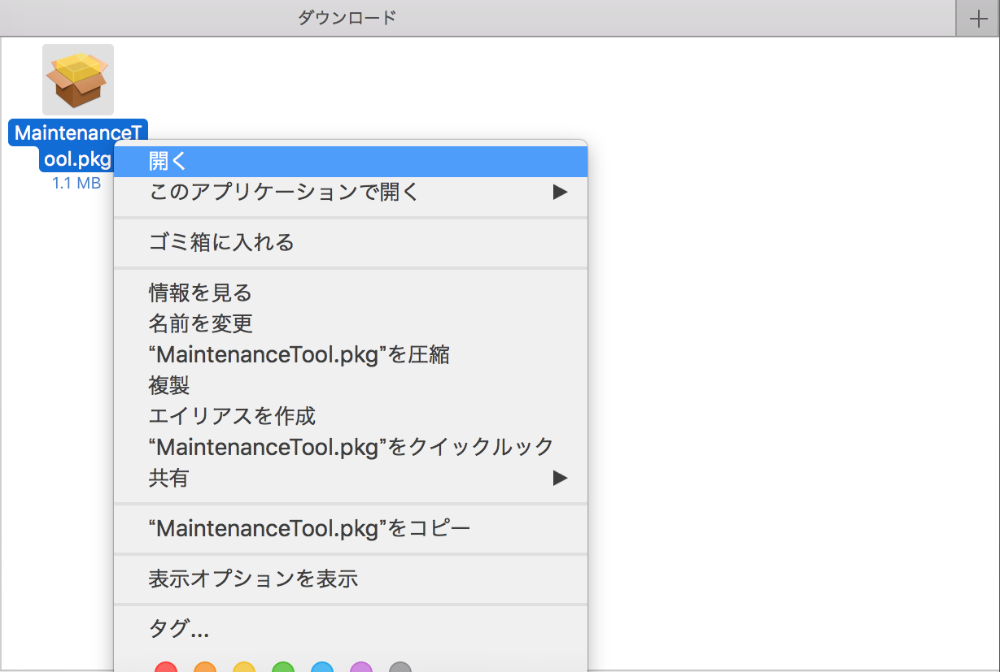
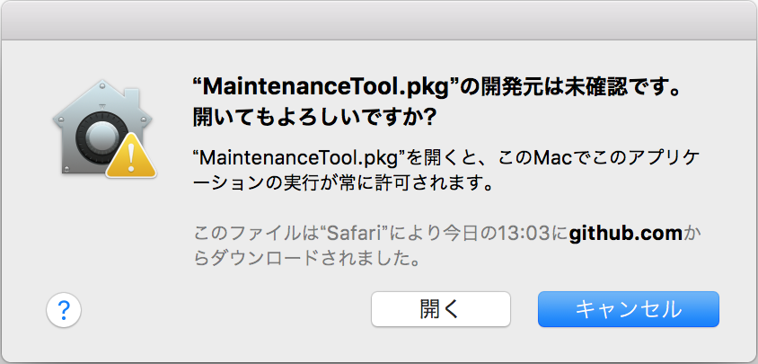
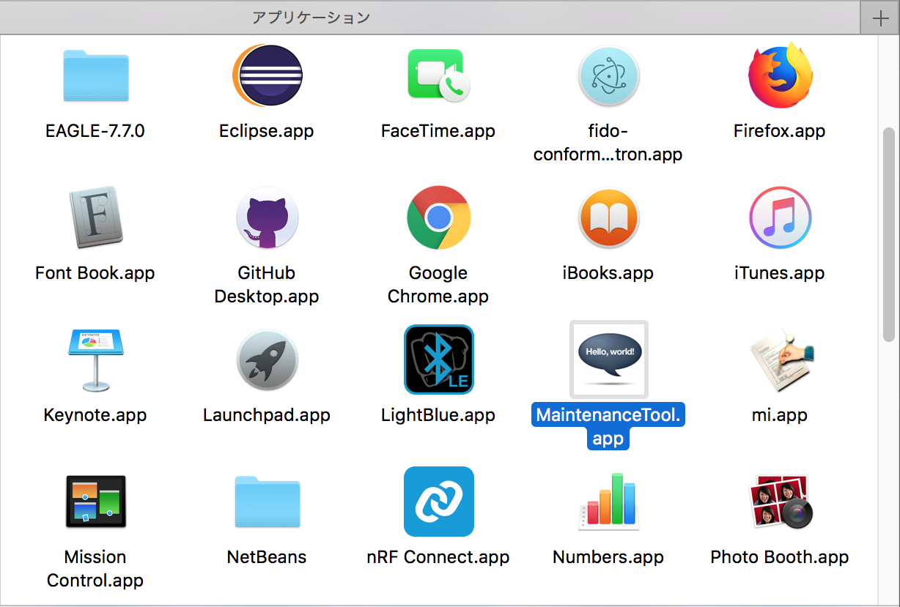
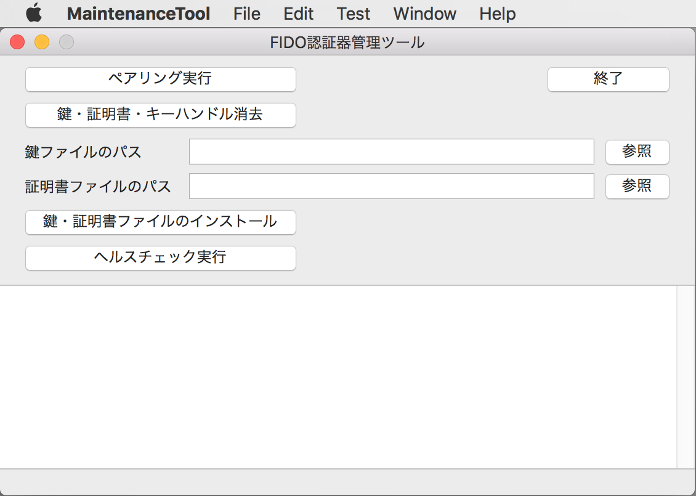

# macOS版 FIDO認証器管理ツール

## 概要
PC環境から、FIDO認証器の動作に必要な鍵・証明書の導入などを行うツールです。

### 機能
* ペアリング実行
* 鍵・証明書削除
* 鍵・証明書インストール
* ヘルスチェック実行
* コマンドテスト機能

### 画面イメージ

### 動作環境
macOS Sierra (Version 10.12.6) 〜

## インストール

[macOS版 FIDO認証器管理ツール](MaintenanceTool.pkg)を、GitHubからダウンロード／解凍します。 
該当ページの「Download」ボタンをクリックすると、[MaintenanceTool.pkg](MaintenanceTool.pkg)がダウンロードできます。

ダウンロードされたファイルを右クリックし「開く」を実行してください。 
（2019/04/01現在、アプリに署名がされていないので、アイコンをダブルクリックしても実行することができないための措置になります）

警告画面が表示されますが、続いて「開く」を実行します。

インストーラーが起動しますので、指示に従いインストールを進めます。

インストールが完了すると、アプリケーションフォルダーに、U2F管理ツールのアイコンができます。 
アイコンをダブルクリックして実行します。

U2F管理ツールの画面が起動すれば、インストールは完了です。

