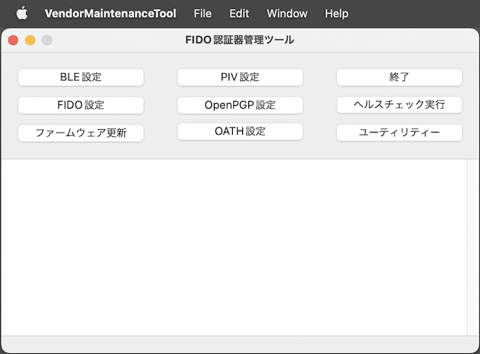

# macOS版 FIDO認証器管理ツール

## 概要
PC環境から、FIDO認証器の動作に必要な鍵・証明書の導入などを行うツールです。

### 機能
* ペアリング実行／解除
* FIDO鍵・証明書設定
* PINコード設定
* CTAP2ヘルスチェック実行
* U2Fヘルスチェック実行
* コマンドテスト機能
* Flash ROM情報取得機能
* バージョン情報取得機能
* 自動認証パラメーター設定機能
* PIV機能設定
* OpenPGP機能設定
* ファームウェア更新機能
* ログファイル格納ディレクトリー参照機能

### 画面イメージ

### 動作環境
macOS Sierra (Version 10.12.6) 〜

## 手順書

- <b>[インストール手順](INSTALLPRG.md)</b> 
FIDO認証器管理ツールをmacOS環境にインストールする手順を掲載しています。

- <b>[BLEペアリング手順](BLEPAIRING.md)</b> 
FIDO認証器管理ツールを使用し、PCとFIDO認証器をBLEペアリングする手順について掲載しています。

- <b>[鍵・証明書の導入手順](INSTALLKEYCRT.md)</b> 
FIDO認証器に、鍵・証明書をインストールする手順を掲載しています。

- <b>[PINコードの設定手順](SETPIN.md)</b> 
FIDO認証器に、PINコード（暗証番号）を設定する手順を掲載しています。

- <b>[CTAP2ヘルスチェック実行手順](CTAP2HCHECK.md)</b> 
FIDO認証器のヘルスチェックを実行する手順を掲載しています。

- <b>[自動認証パラメーター設定手順](BLEAUTHPARAM.md)</b> 
[BLE近接認証機能](../../FIDO2Device/MDBT50Q_Dongle/BLEDAUTH.md)の各種パラメーターを設定する手順を掲載しています。

- <b>[PIV機能設定手順](PIVSETTING.md)</b> 
[PIV機能](../../FIDO2Device/MDBT50Q_Dongle/PIVPINLOGIN.md)に必要な各種設定の手順を掲載しています。

- <b>[OpenPGP機能設定手順](PGPSETTING.md)</b> 
[OpenPGP機能](../../CCID/OpenPGP/README.md)に必要な各種設定の手順を掲載しています。

- <b>[ファームウェア更新手順（USB）](UPDATEFIRMWARE.md)</b> 
[MDBT50Q Dongle](../../FIDO2Device/MDBT50Q_Dongle/README.md)に対し、管理ツールから、ファームウェアを更新する手順を掲載しています。

- <b>[ファームウェア更新手順（BLE）](../../MaintenanceTool/macOSApp/UPDATEFW_BLE.md)</b> 
管理ツールから、Zephyrプラットフォームを使用したファームウェアを更新する手順を掲載しています。 
対象ファームウェアのバージョンは「0.4.0」以降となっています。

- <b>[管理ツールのログファイル](VIEWLOG.md)</b> 
FIDO認証器管理ツールから出力されるログファイルについて説明しています。

## [FIDO認証器開発ツール](../../MaintenanceTool/macOSApp/DEVTOOL.md)

ベンダー向けのツールです。

#### 機能
* FIDO鍵・証明書設定
* ログファイル格納ディレクトリー参照機能
