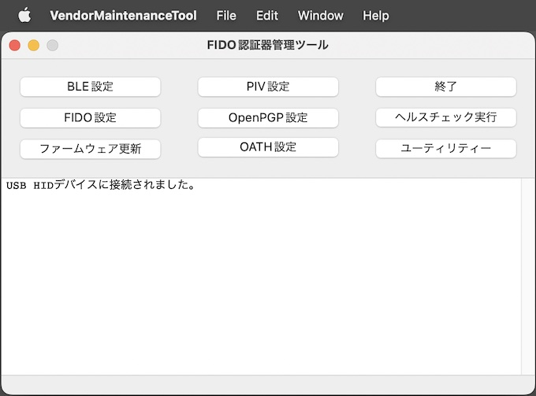
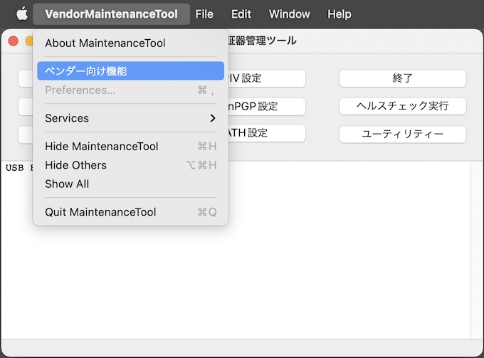
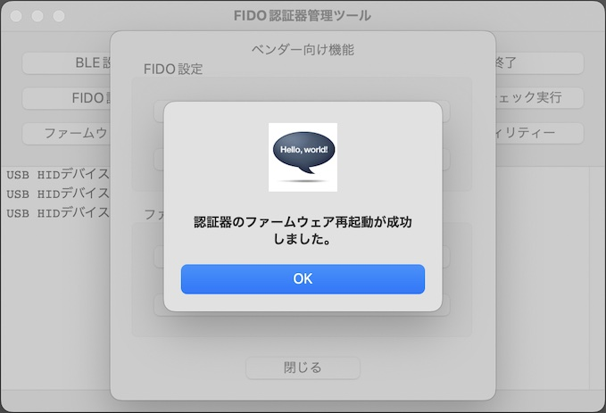

# ファームウェア再起動手順書

[FIDO認証器管理ツール（ベンダー向け）](../../MaintenanceTool/macOSApp/DEVTOOL.md)を使用して、FIDO2認証器のファームウェアを再起動する手順について記載しています。

## 認証器の準備

#### 使用機材

本ドキュメントでは「[MDBT50Q Dongle](../../FIDO2Device/MDBT50Q_Dongle/README.md)」を、FIDO2認証器として使用します。

#### 管理ツールを導入

[FIDO認証器管理ツール（ベンダー向け）](../../MaintenanceTool/macOSApp/DEVTOOL.md)を、PC環境（macOS）に導入します。 
以下の手順書をご参照願います。

* <b>[FIDO認証器管理ツール（ベンダー向け） インストール手順](../../MaintenanceTool/macOSApp/DEVTOOLINST.md) </b>

## ファームウェア再起動手順

管理ツールのベンダー向け機能を使用し、MDBT50Q Dongleのファームウェアを再起動させます。

#### ファームウェア再起動の実行

管理ツール（ベンダー向け）を起動し、USBポートにFIDO2認証器を装着します。

管理ツール画面下部のメッセージ欄に「USB HIDデバイスに接続されました。」と表示されることを確認したら、管理ツールのメニューから「ベンダー向け機能」を選択します。

ベンダー向け機能画面が表示されますので「認証機のファームウェア再起動」ボタンをクリックします。

下図のような確認ダイアログが表示されます。 
「Yes」ボタンをクリックし、ファームウェア再起動を実行させます。

ほどなく再起動処理が完了し、ポップアップが表示されます。

「OK」をクリックし、ポップアップを閉じます。

以上で、FIDO2認証器のファームウェア再起動は完了となります。
