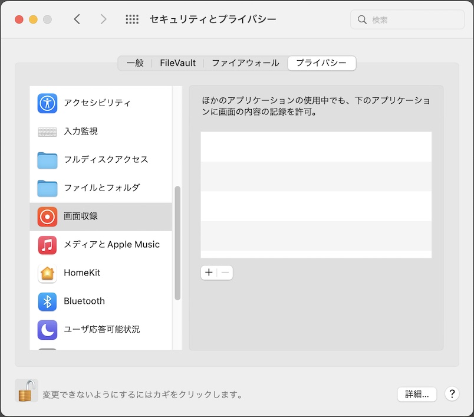

# 画面収録許可の設定手順書

最終更新日：2023/4/12

## 概要

[FIDO認証器管理ツール](../../MaintenanceTool/macOSApp/README.md)で、OATHの「QRコードスキャン＋ワンタイムパスワード参照」機能を利用するために必要となる「画面収録の許可」の設定手順について、以下に掲載いたします。

### 注意点

この「画面収録許可の設定」は、管理ツールを更新（バージョンアップ）するたびに再設定が必要となります。 
（後述「画面収録許可の再設定」ご参照）

## 画面収録許可の設定

macOSのシステム環境設定アプリを起動し「セキュリティとプライバシー」画面を表示させます。

タブ「プライバシー」を選択・表示させます。 
その後、画面左下部の鍵のアイコンをクリックし、設定変更ができるようにします。

表示されたポップアップ画面に、ログインユーザーのパスワードを入力後「ロックを解除」ボタンをクリックします。

左下部の鍵のアイコンが、鍵の外れた状態になっている事を確認します。

その後、左側の一覧から「画面収録」を選択します。 
右側の一覧（画面収録が許可されているアプリケーション一覧）のすぐ左下にある「＋」のボタンをクリックします。

画面収録を許可する管理ツール（`MaintenanceTool`）のアイコンを選択し「開く」をクリックします。

右側のアプリケーション一覧に、管理ツール（`MaintenanceTool`）がチェックされた状態で表示されている事を確認します。 
その後、画面左下部の鍵のアイコンをクリックし、変更できないように設定します。

左下部の鍵のアイコンが、鍵のかかった状態になっている事を確認します。

以上で、画面収録の許可設定は完了になります。

## 画面収録許可の再設定

前述の手順で画面収録の許可設定後、管理ツールのバージョンを更新した場合は、画面収録の許可設定をやり直していただく必要があります。

画面収録を許可するアプリケーション一覧に、管理ツール（`MaintenanceTool`）がチェックされた状態で表示されている場合は、こちらを一旦削除します。 
アプリケーション一覧から、管理ツール（`MaintenanceTool`）を選択し、一覧左下にある「ー」のアイコンをクリックします。

アプリケーション一覧に、管理ツール（`MaintenanceTool`）が表示されなくなった事を確認します。

その後、前述の手順で、画面収録が許可されているアプリケーション一覧に、管理ツールを再度追加するようにしてください。
