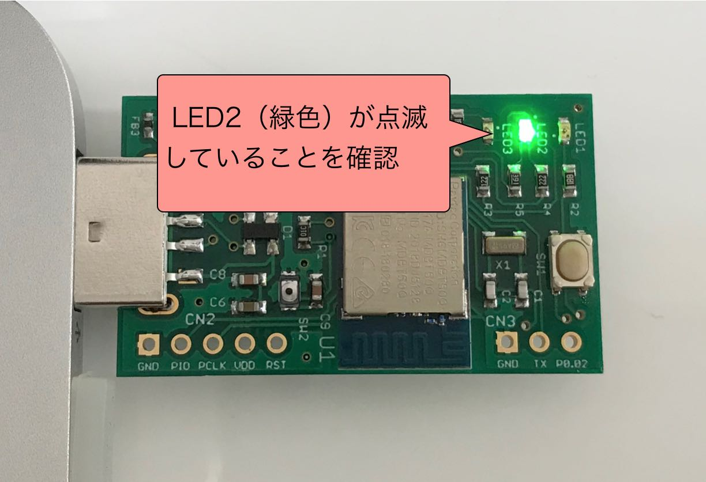
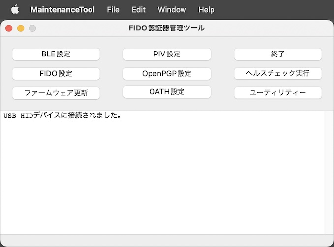
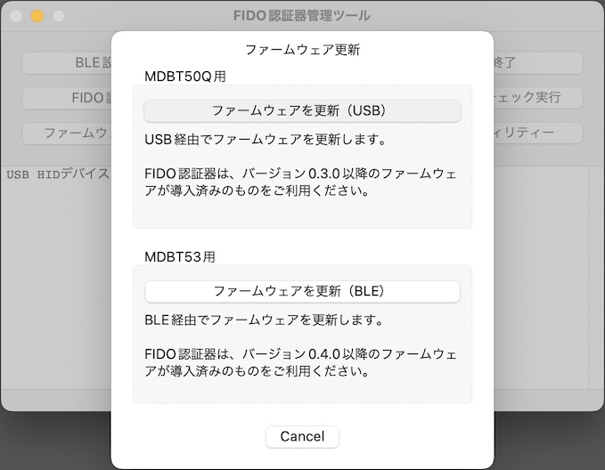
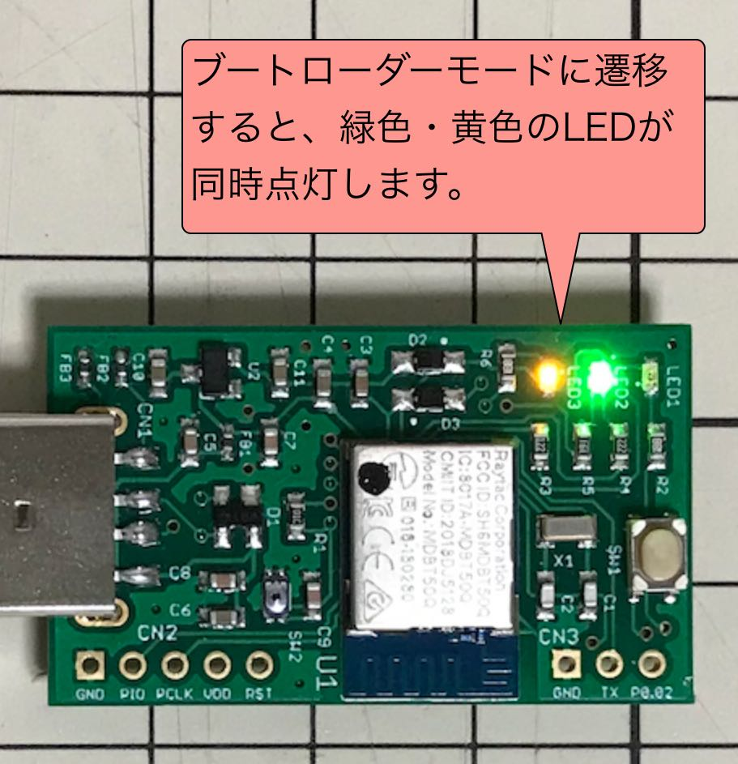

# ファームウェア更新手順（USB）

## 概要

[FIDO認証器管理ツール](../../MaintenanceTool/macOSApp/README.md)を使用し、[MDBT50Q Dongle](../../FIDO2Device/MDBT50Q_Dongle/README.md)のファームウェアを更新する手順を掲載します。

## 操作方法

まず最初に、MDBT50Q Dongleを、PCのUSBポートに装着します。 
この時に、MDBT50Q Dongleの緑色のLEDが点滅していることを確認します。

管理ツールを起動し、画面下部のメッセージ欄に「USB HIDデバイスに接続されました。」と表示されることを確認します。

管理ツール画面の「ファームウェア更新」ボタンをクリックします。

ファームウェア更新画面が表示されます。 
画面上部のボックス「MDBT50Q用」の中にあるボタン「ファームウェアを更新（USB）」をクリックします。

処理開始画面が表示されます。 
MDBT50Q Dongleに導入されているファームウェアのバージョンと、更新するバージョンが表示されます。

上図、処理開始画面の「OK」ボタンをクリックすると、MDBT50Q Dongleが自動的に、ブートローダーモードに遷移します。 
MDBT50Q Dongleの緑色・黄色のLEDが同時点灯していることを確認します。

ほどなく、現在の進捗を示すダイアログが表示されます。 
まずはファームウェア更新イメージが転送中であることを知らせています。

次に、MDBT50Q Dongle内で、転送されたファームウェア更新イメージが反映中であることを知らせています。

ファームウェア更新処理が正常終了すると、下図のようなポップアップが表示され、処理が成功したことを知らせます。

再び、MDBT50Q Dongleの緑色のLEDが点滅していることを確認します。

以上で、ファームウェア更新処理は完了となります。

## エラーとなるケース

#### 古いバージョンのファームウェアを導入しようとした場合

現在導入されているバージョンより古いファームウェアを導入しようとした場合は、ファームウェア更新処理が失敗します。 
処理失敗時は下図のようなメッセージが表示されます。

