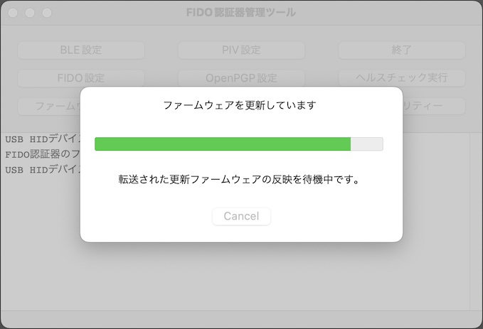

# ファームウェア更新手順

## 概要

[FIDO認証器管理ツール](README.md)を使用し、[MDBT50Q Dongle](../../FIDO2Device/MDBT50Q_Dongle/README.md)の[ファームウェア](../../nRF5_SDK_v15.3.0)を更新する手順を掲載します。

## 操作方法

まず最初に、MDBT50Q Dongleの背面にあるボタン電池ケースに、電池が入っていないことを必ず確認します。

次に、MDBT50Q DongleをPCのUSBポートに装着します。 
この時に、MDBT50Q Dongleの緑色のLEDが点滅していることを確認します。

管理ツールを起動し、ファイルメニューから「ファームウェアを更新」を選択します。

処理開始画面が表示されます。 
認証器の現在バージョンと、更新するバージョンが表示されます。

ここで、認証器のRESETボタン（SW2）を１回押します。

認証器がブートローダーモードに遷移します。 
MDBT50Q Dongleの赤色LEDが点滅していることを確認します。

その後、処理開始画面下部の「OK」をクリックすると、処理続行を確認するダイアログが表示されます。 
「Yes」をクリックすると、ファームウェア更新処理が開始されます。

現在の進捗を示すダイアログが表示されます。 
まずはファームウェア更新イメージが転送中であることを知らせています。

次に、認証器内で、転送されたファームウェア更新イメージが反映中であることを知らせています。

ファームウェア更新処理が正常終了すると、下図のようなポップアップが表示され、処理が成功したことを知らせます。

再び、MDBT50Q Dongleの緑色のLEDが点滅していることを確認します。

以上で、ファームウェア更新処理は完了となります。

## 開発情報（ご参考）

- <b>[ファームウェア更新機能](DFUFUNC.md)</b> 
プログラム実装に関する情報を掲載しています。
