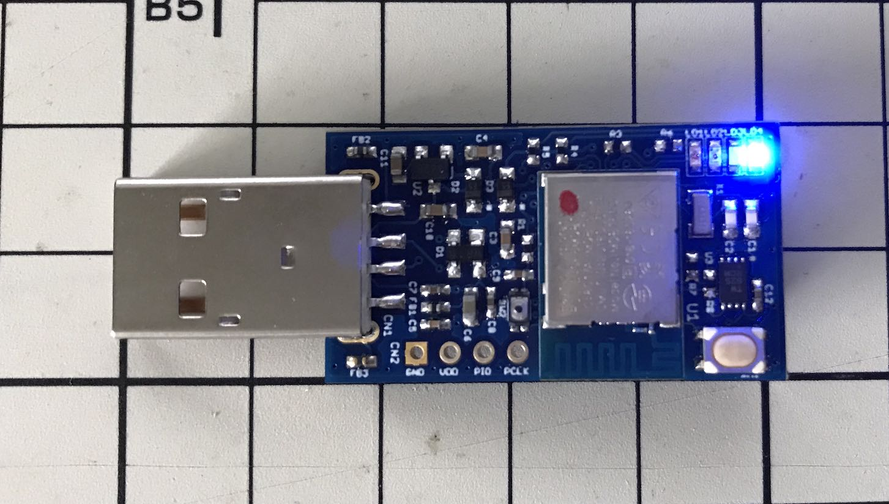
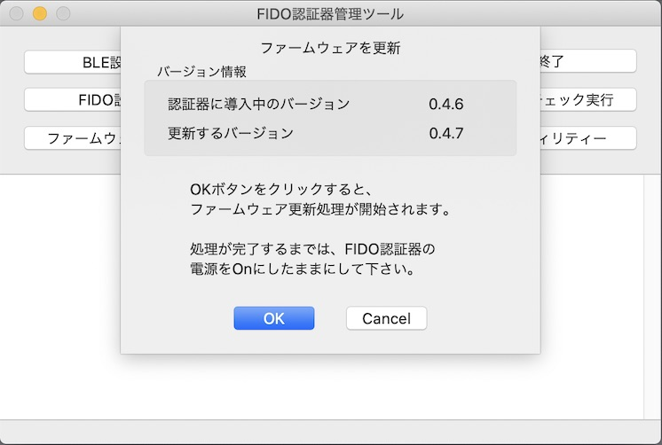

# ファームウェア更新手順（BLE）

## 概要

[FIDO認証器管理ツール](README.md)を使用し、[MDBT50Q Dongle](../../FIDO2Device/MDBT50Q_Dongle/README.md)のファームウェアを更新する手順を掲載します。

#### ご注意

バージョン`0.4.0`以降のファームウェアは、全てBLE経由でのファームウェア更新となります。[注1]

MDBT50Q Dongleをご使用の場合は、背面にあるボタン電池ケースに電池をセットし、BLEペリフェラル・モードで起動されていることをご確認ください。 
（MDBT50Q Dongleの青色LEDが点滅していることを確認します）

[注1] バージョン`0.4.0`以降のファームウェアは、[Zephyr](https://docs.zephyrproject.org/latest/index.html)という共通プラットフォームを使用して開発されています。[Zephyrでのファームウェア更新](https://docs.zephyrproject.org/latest/guides/device_mgmt/mcumgr.html)は、BLE経由、またはLinuxのコマンドライン（Serial／UDP）経由しか存在しないため、一般的と考えられるBLE経由のファームウェア更新を、本プロジェクトでは採用することとしました。

## 操作方法

[管理ツール（macOS版）](../../MaintenanceTool/macOSApp/README.md)を起動し、`Develop`メニューから「ファームウェア更新（BLE）」を選択します。

処理開始画面が表示されます。 
MDBT50Q Dongleに導入されているファームウェアのバージョンと、更新するバージョンが表示されます。

ほどなく、現在の進捗を示すダイアログが表示されます。 
まずはファームウェア更新イメージが転送中であることを知らせています。

次に、MDBT50Q Dongle内で、転送されたファームウェア更新イメージが反映中であることを知らせています。

ファームウェア更新処理が正常終了すると、下図のようなポップアップが表示され、処理が成功したことを知らせます。

以上で、ファームウェア更新処理は完了となります。
