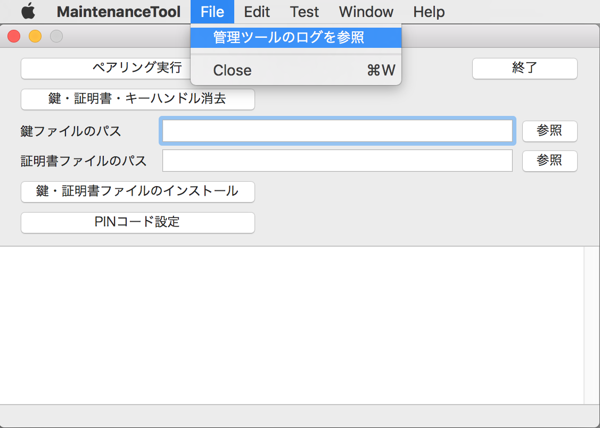
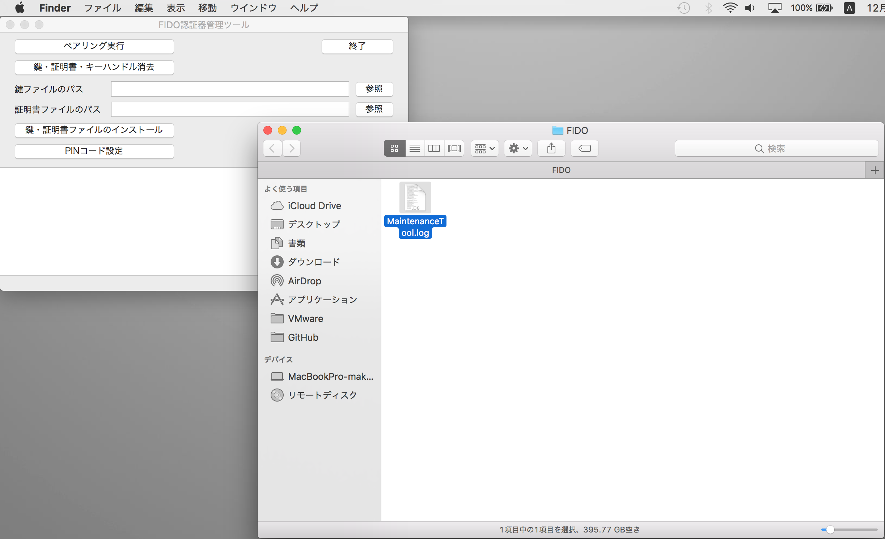

# 管理ツールのログファイル

## 概要
FIDO認証器管理ツールから出力されるログファイルについて説明します。

## ログファイルの場所

FIDO認証器管理ツールの実行中に出力されるログは、macOSのユーザーディレクトリー配下のログファイル（下記の場所）に保存されます。

`$HOME/Library/Logs/Diverta/FIDO/MaintenanceTool.log`

具体的には、例えば `/Users/user/Library/Logs/Diverta/FIDO/MaintenanceTool.log` といったパスになります。

### ログファイルの場所を開く

ログファイルの格納場所を、macOSのFinderで開くことができます。<br>
下図のメニュー「管理ツールのログを参照」を選択します。



ログファイル「MaintenanceTool.log」を格納するディレクトリーが、Finderで表示されます。



ログファイルは通常のテキストファイルですので、適宜、テキストエディターにより参照することが可能です。

また、コマンド`tail -f $HOME/Library/Logs/Diverta/FIDO/MaintenanceTool.log`を実行することにより、実行中に出力されるログをリアルタイム参照することも可能です。<br>
（macOSのターミナルアプリによるログ参照と等価の動きになります）

## ログファイルの内容

macOSアプリの一般的な形式で出力されます。<br>
ログの出力イメージは以下のようになります。
```
2019-11-19 13:06:34.978 [info] FIDO認証器管理ツールを起動しました: Version 0.1.20
2019-11-19 13:06:34.981 [info] USBデバイス検知を開始しました。
2019-11-19 13:06:34.999 [info] USB HIDデバイスに接続されました。
2019-11-19 13:06:39.194 [info] HID PINGテストを開始します。
2019-11-19 13:06:39.195 [debug] HID Sent INIT frame: data size=8 length=8
ff ff ff ff 86 00 08 71 cb 1c 3b 10 8e c9 24
2019-11-19 13:06:39.215 [debug] HID Recv INIT frame: data size=17 length=17
ff ff ff ff 86 00 11 71 cb 1c 3b 10 8e c9 24 01
00 33 01 02 05 00 02 07
2019-11-19 13:06:39.215 [debug] HID Sent INIT frame: data size=100 length=57
01 00 33 01 81 00 64 81 27 44 42 1a 66 d5 04 bd
6e 6f e7 66 7d 79 ee c2 91 55 01 76 98 23 64 ba
9e f3 c8 f3 83 bb b4 b4 77 a7 0f 61 12 2d cf 07
b9 49 91 74 07 78 57 77 06 89 fe 6a e4 f9 b7 28
2019-11-19 13:06:39.216 [debug] HID Sent CONT frame: seq=0 length=43
01 00 33 01 00 17 6e 26 60 b2 5c a8 77 e8 8c 82
9b e4 62 d9 03 1d 50 98 3f 02 85 57 93 22 2a 37
bc 51 2a 67 78 1a 93 f8 ae d3 99 f2 02 41 8c 88
2019-11-19 13:06:39.239 [debug] HID Recv INIT frame: data size=100 length=57
01 00 33 01 81 00 64 81 27 44 42 1a 66 d5 04 bd
6e 6f e7 66 7d 79 ee c2 91 55 01 76 98 23 64 ba
9e f3 c8 f3 83 bb b4 b4 77 a7 0f 61 12 2d cf 07
b9 49 91 74 07 78 57 77 06 89 fe 6a e4 f9 b7 28
2019-11-19 13:06:39.247 [debug] HID Recv CONT frame: seq=0 length=43
01 00 33 01 00 17 6e 26 60 b2 5c a8 77 e8 8c 82
9b e4 62 d9 03 1d 50 98 3f 02 85 57 93 22 2a 37
bc 51 2a 67 78 1a 93 f8 ae d3 99 f2 02 41 8c 88
2019-11-19 13:06:39.250 [info] HID PINGテストが成功しました。
2019-11-19 13:06:43.313 [info] FIDO認証器管理ツールを終了しました。
```
