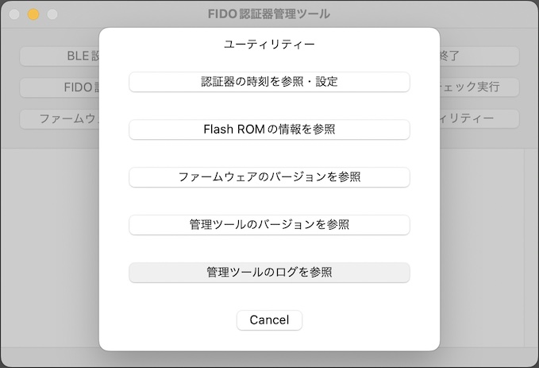
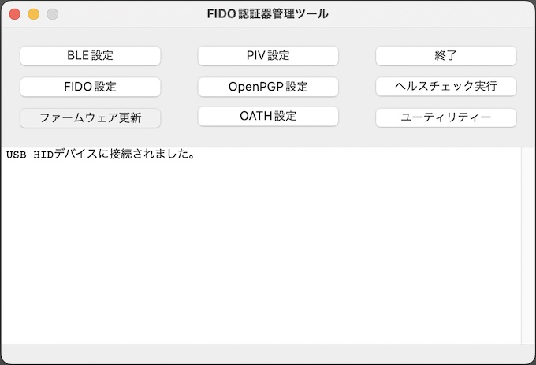

# ログ参照手順

## 概要
FIDO認証器管理ツールから出力されるログを参照する手順を掲載します。

#### 制約事項

macOS版のFIDO認証器管理ツールは、ログ出力に「`NSLog`」というインターフェースを使用しているため、過去ログが残りません。

すなわち現状は、プログラムを終了後に、管理ツールから出力されたログをファイル等から参照する仕組みがありません。 
何卒ご容赦願います。

## ログ参照の準備

FIDO認証器管理ツールの実行中に出力されるログは、macOSで標準装備されている「コンソール」というアプリで参照することができます。

### コンソールの起動

Launchpadを実行し「その他」というアイコンをクリックします。

左端下部にある「コンソール」というアイコンをクリックします。

コンソールが起動しますので、左端の「デバイス」からお使いのPCを選択し、ログを表示された状態にします。 
既定の状態では、下図のように、次々とログが流れていく動きになるかと存じます。

### コンソールの設定

コンソールに表示されるログは大量であり、このままでは見にくいため、管理ツールが出力するログをフィルターさせるためのキーワード「`MaintenanceTool`」を設定します。

コンソール右上のテキストボックスに、キーワード「`MaintenanceTool`」と入力し、[Enter]キーを押下します。

キーワード右側に「いずれか」というプルダウンが表示されるので、クリックしてメニューから「プロセス」を選択します。

キーワードとフィルター方法が設定されたのを確認後、画面右側の「保存」ボタンをクリックします。

検索条件の名前に「`MaintenanceTool`」を指定して「保存」ボタンをクリックします。

保存した検索条件「`MaintenanceTool`」が有効となり、ログがフィルターされます。

次回コンソール起動時は、この保存された検索条件（「`MaintenanceTool`」がグレー背景になっているボタン）をクリックすることで、ログフィルターが有効になります。

以上で、ログ参照の準備は完了です。

## 出力ログの参照

上記の設定が行われたコンソールを起動させたまま、macOS版のFIDO認証器管理ツールを起動させます。

下図のように、管理ツールから出力されたログだけが、コンソール画面上に表示されます。

文字数が多いログを表示させたい場合は、該当ログの行部分をダブルクリック（または、該当ログを選択したのち「情報」ボタンをクリック）します。

画面下部に、ログの全文が表示されます。

